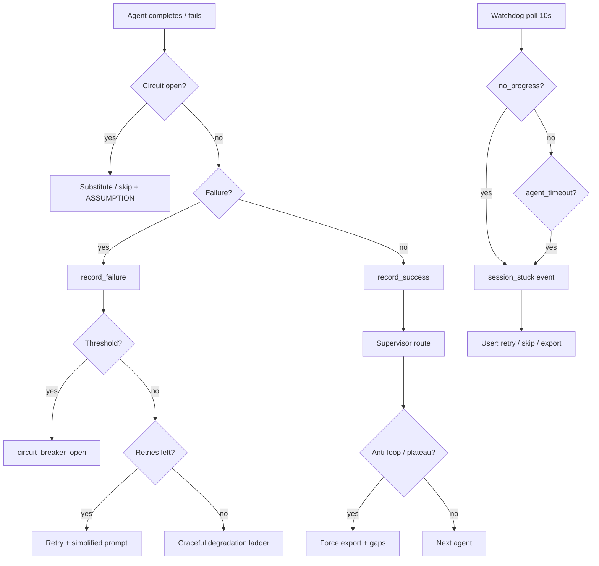

# Pink Spec Agent — полная спецификация

> Версия: **1.3** | Дата: **2026-07-03** | Статус: Source of Truth

## Оглавление

1. [Видение продукта](#1-видение-продукта)
2. [Уровни спецификации (L1–L4)](#2-уровни-спецификации)
3. [Мультиагентная система — роли](#3-мультиагентная-система)
4. [Context Manager — суммаризация](#4-context-manager)
5. [Embedding Saturation](#5-embedding-saturation)
6. [Папка tasks/ — микро-задачи](#6-папка-tasks)
7. [Стек и деплой](#7-стек-и-деплой)
8. [JSON-конфиг правил](#8-json-конфиг-правил)
9. [Оркестрация (Kafka + agent-worker)](#9-оркестрация-kafka--agent-worker)
10. [LLM-провайдеры (Ollama / YandexGPT)](#10-llm-провайдеры-ollama--yandexgpt)
11. [API и WebSocket](#11-api-и-websocket)
12. [UI спецификация (Mission Control)](#12-ui-спецификация)
13. [Выходные артефакты](#13-выходные-артефакты)
14. [Структура репозитория](#14-структура-репозитория)
15. [Fallback-стратегии](#15-fallback-стратегии)
16. [Failure modes и Recovery](#16-failure-modes-и-recovery)
17. [Алгоритмы отказоустойчивости мультиагента](#17-алгоритмы-отказоустойчивости-мультиагента)
18. [Безопасность и ограничения](#18-безопасность-и-ограничения)
19. [Проекты, output и админка](#19-проекты-output-и-админка)
20. [Статистика](#20-статистика)

---

## 1. Видение продукта

**Pink Spec Agent** — локальный мультиагентный инженерный ассистент.

**Принимает:**
- Идею проекта (свободный текст)
- JSON-конфиг с правилами (`schema_version: "1.0"`)

**Генерирует:**
- Product spec, architecture spec, API/data model, UI spec, roadmap, риски, trade-offs
- Папку `tasks/` с микро-задачами для поэтапной реализации
- Артефакты на диске в `output/{output_slug}/` — человекочитаемое имя проекта (slug), не UUID

**Идентификация:**
| Поле | Назначение |
|------|------------|
| `session_id` | UUID — API, WebSocket, URL `/workspace/:id` |
| `output_slug` | Имя папки на диске (`task-tracker`, `my-saas-app`) |
| `project_name` | Отображаемое имя (из `rules.project.name` или idea) |

**Ключевой принцип:** Supervisor контролирует глубину, агент документирует допущения, пользователь видит **каждый шаг** в Mission Control UI в реальном времени. Nothing Silent.

---

## 2. Уровни спецификации

| Level | ID | Время | Артефакты | Tasks | Review |
|-------|-----|-------|-----------|-------|--------|
| **Brief** | `L1` | 2–5 мин | `product_outline`, `architecture_sketch` | нет | 0 |
| **Standard** | `L2` | 10–15 мин | L1 + `product_spec`, `architecture_spec`, `roadmap` | 15–30 задач | 1x |
| **Full** | `L3` | 20–30 мин | все + OpenAPI + UI spec + risk register | 50–100 задач | 2–3x |
| **Exhaustive** | `L4` | без лимита* | L3 + ADR deep-dive, NFR matrix, test strategy, ops runbook | 100+, итеративно | до approve |

\* **L4 — «до талого»:** нет фиксированного бюджета. Safety hard cap: default 2 ч (configurable). Supervisor работает пока `completion_criteria` не выполнены все.

### L4 completion criteria

| Критерий | Условие |
|----------|---------|
| `artifacts_complete` | Все L4-артефакты существуют и non-empty |
| `reviewer_approved` | Reviewer pass + confidence ≥ 0.85 |
| `no_critical_gaps` | Нет open questions priority=critical |
| `tasks_coverage` | Coverage map ≥ 95% spec sections |
| `cross_artifact_consistent` | 0 critical contradictions |
| `saturation_done` | Saturation complete или fallback с ASSUMPTION |
| `rules_compliant` | Все critical/high agent_rules проверены |

### Минимальные требования L4 (`.env`)

| Параметр | Рекомендация | Почему |
|----------|--------------|--------|
| `LLM_MAX_TOKENS` | ≥ 8192 | JSON batches (25 tasks) и exhaustive specs обрезаются при 2048 |
| `OLLAMA_TIMEOUT_SEC` | ≥ 300 | Длинная генерация на локальной модели |
| `OLLAMA_LLM_MODEL` | 7B+ (напр. `qwen2.5:7b`) | `gemma3:4b` часто даёт `completed_partial` |

При `completed_partial` смотри `output/{output_slug}/gaps.md` (секция **Unmet L4 Criteria**) и событие `session_completed_partial` в Activity.

### Patch-редактирование артефактов (refinement)

Если файл уже есть в `output/{output_slug}/docs/`, повторный проход агента **не переписывает** документ целиком — LLM возвращает блоки `SEARCH/REPLACE`, которые применяются точечно. Событие `artifact_patched` в Activity показывает `+lines/-lines`. Настройка: `rules.artifacts.mode` = `auto` (default).

### Time budget по уровням

| Level | `max_duration_sec` | При превышении |
|-------|-------------------|----------------|
| L1 | 300 | Graceful degradation → partial export |
| L2 | 900 | Skip optional agents |
| L3 | 1800 | Сократить review |
| L4 | null | Safety cap 7200 (2 ч) |

**Anti-loop guard:** L1–L3 — один агент >5 вызовов без прогресса; L4 — >15 → fallback / escalate / force finalize с `gaps.md`.

### Зрелость спецификации (`spec_maturity`)

Отдельно от `spec_level` (L1–L4) задаёт **глубину и набор артефактов** внутри уровня.

| Значение | Default для | Эффект |
|----------|-------------|--------|
| `mvp` | L1, L2 | Краткий scope, `[DEFERRED]` для non-essential |
| `production` | L3, L4 | Полный ops/NFR/test strategy, production deliverables |
| `enterprise` | override | production + compliance, расширенный pipeline |

Поле: `rules.project.spec_maturity`. UI: `SpecMaturitySelector` на Home. Резолв: `app/agent/spec_maturity.py` → промпты агентов и `maturity_pipeline_defaults()`.

---

## 3. Мультиагентная система

**Реализация:** custom Supervisor loop (`supervisor.py` + `graph.py`), **не LangGraph runtime** (зависимости LangChain/LangGraph в `pyproject.toml` зарезервированы, но граф — явный `while` с `supervisor_node`).

Каждый агент — async-класс с system prompt, output schema и вызовом через `session_runner` + `log_bus.emit`.

### Роли агентов

| Агент | Роль | Выход |
|-------|------|-------|
| **Supervisor** | Маршрутизация, quality gates, time budget / completion criteria, retry, fallbacks | `next_agent`, `directives`, `status_report` |
| **Product Analyst** | Personas, use cases, user stories, scope | `product_spec.md` |
| **Architect** | C4, ADR, deployment, security boundaries | `architecture_spec.md` |
| **API Designer** | REST/WS контракты, schemas | `api_spec.openapi.yaml`, `data_model.md` |
| **UI Designer** | Screens, flows, components | `ui_spec.md` |
| **Task Decomposer** | Декомпозиция roadmap → микро-задачи | `tasks/**/*.md`, `TASK_INDEX.md` |
| **Researcher** | RAG retrieval, domain research | `context_brief`, retrieved chunks |
| **Reviewer** | Consistency, NFR, rules compliance | `review_report`, pass/fail |
| **Context Manager** | Summarization, state compression, handoff | `session_summary`, `agent_handoff` |
| **Intake** | Pre-flight: проверка достаточности idea до pipeline | batch `question_asked` или `intake_complete` |
| **Pipeline Planner** | Динамический pipeline (L4 / auto mode) | `pipeline[]`, reasoning |
| **Refinement Fixer** | Точечный patch артефактов по feedback Reviewer | `artifact_patched` |
| **Export** | Финализация manifest, gaps.md, metrics | `done`, `session_completed_partial` |

### Supervisor — поведение

**L1–L3:** time budget → graceful degradation при 85% лимита.

**L4:** completion criteria → refinement loop до approve (bounded by safety cap).

**Directives** (передаются каждому агенту):
- `spec_level`, оставшийся time budget
- `relevant_summary` — сжатый контекст, НЕ raw history
- `rules_snapshot` — critical/high rules только
- `directives` — что делать / чего избегать / ссылка на предыдущий output

**Retry limits:** L1–L3 — max 2/agent; L4 — unlimited (bounded criteria + anti-loop).

### Routing by spec_level

| Step | L1 | L2 | L3 | L4 |
|------|----|----|----|----|
| Researcher + saturation | optional | yes | full | full + extended |
| Product Analyst | outline | full | full + extras | full + iterative refine |
| Architect | sketch | C4 L2 | C4 + ADR | C4 + ADR deep-dive |
| API Designer | skip | skip | full | full + refine |
| UI Designer | skip | skip | full | full + refine |
| Task Decomposer | skip | 15–30 | 50–100 | 100+ until coverage |
| Reviewer | skip | 1x | 2–3x | until approve |

**Parallelism (L3/L4):** API Designer + UI Designer параллельно после Architect; merge через Context Manager.

---

## 4. Context Manager

Управляет context window — предотвращает раздувание при длинных сессиях.

### Уровни суммаризации

| Уровень | Триггер | Размер |
|---------|---------|--------|
| Turn summary | После каждого агента | 200–400 tokens |
| Phase summary | После группы агентов | 500–800 tokens |
| Session summary | При 70% token budget / перед export | Полная картина |

### Rolling context window

```python
class ContextState(TypedDict):
    raw_messages: list[Message]    # последние N turns
    turn_summaries: list[str]      # все turn summaries
    phase_summary: str
    session_summary: str
    token_budget_used: int
    saturation_report: dict | None
```

**Правило:** агент получает `phase_summary` + `turn_summaries[-3:]` + artifact excerpts — не полный raw log.

**Summarization output format:** Decisions / Assumptions / Open items / Artifacts touched.

---

## 5. Embedding Saturation

Активируется при `rag.enabled: true`. Researcher + Context Manager выполняют saturation loop перед фазой Planning.

### Алгоритм

```
seed_queries(idea)
  → retrieve(top_k)
  → score_novelty(chunks)
  → if novelty > threshold: expand_queries → retrieve
  → else: merge_deduplicate → saturation_summary → context_brief
```

### Параметры

| Параметр | Default | Описание |
|----------|---------|----------|
| `max_iterations` | 5 | Макс. циклов retrieve |
| `top_k` | 8 | Chunks за итерацию |
| `novelty_threshold` | 0.15 | Min cosine distance к уже collected |
| `min_chunks` | 10 | Мин. chunks перед выходом (L3+) |
| `query_expansion` | true | LLM генерирует follow-up queries |

**Novelty score:** для нового chunk — min distance к collected set; avg novelty < threshold → saturation complete.

**Выход:** `saturation_report` + `context_brief` для Supervisor.

**Без embeddings:** full-text scan, saturation skipped, `saturation.status: "skipped"` в manifest.

---

## 6. Папка tasks/

Генерируется Task Decomposer (L2+). Каждая задача = атомарный шаг 15–60 мин работы.

### Структура вывода

Имя папки: `output/{output_slug}/`, где `output_slug = slugify(rules.project.name)`; при пустом/`my-project` — из idea; при коллизии — суффикс `-2`, `-3`, …

```
output/task-tracker/
├── manifest.json
├── gaps.md                  # при partial export
├── docs/
│   ├── product_spec.md
│   ├── architecture_spec.md
│   ├── api_spec.openapi.yaml
│   ├── ui_spec.md
│   ├── data_model.md
│   ├── roadmap.md
│   └── risk_register.md
└── tasks/
    ├── TASK_INDEX.md
    ├── phase-01-foundation/
    │   ├── 001-init-repo.md
    │   └── 002-docker-compose.md
    └── phase-02-backend/
        └── 010-fastapi-scaffold.md
```

> **Миграция:** при старте backend папки `output/{uuid}` переименовываются в `output/{slug}` по `rules.project.name` / idea. `session_id` в manifest и API не меняется.

### Формат файла задачи (NNN-slug.md)

```markdown
---
id: "010"
phase: "02-backend"
title: "Scaffold FastAPI application"
priority: high
estimated_minutes: 45
depends_on: ["001", "002"]
spec_refs: ["architecture_spec.md#api-layer", "api_spec.openapi.yaml"]
---

## Goal
One sentence — что должно работать после выполнения.

## Context
2–3 предложения связи с общим проектом.

## Steps
1. ...
2. ...

## Acceptance Criteria
- [ ] ...
- [ ] ...

## Notes / Pitfalls
- ...

## Verification
Как проверить (command, endpoint, manual check).
```

### TASK_INDEX.md — обязательные секции

- Mermaid dependency graph (`task010 --> task011`)
- Таблица: ID | Phase | Title | Depends | Est. | Status
- Critical path highlight
- Mapping tasks → spec sections

**По уровням:** L1: нет tasks. L2: 3–5 phases, 15–30 tasks. L3: 5–8 phases, 50–100 tasks. L4: 5–8 phases + итеративное дополнение до coverage ≥ 95%.

---

## 7. Стек и деплой

| Слой | Технология |
|------|------------|
| API / WS gateway | FastAPI, `websockets`, SSE fallback |
| AI runtime | `agent-worker` (отдельный контейнер) |
| Messaging | Apache Kafka (`pink-spec.session.commands`, `pink-spec.session.events`) |
| Orchestration | Custom supervisor loop (`app/agent/graph.py`) |
| LLM | Ollama (`/api/chat`) или YandexGPT |
| Embeddings | Ollama / Yandex |
| Vector store | ChromaDB (local `./data/vectors`) |
| UI | React + TypeScript + Vite + shadcn/ui + Tailwind CSS |
| Persistence | SQLite (WAL, shared volume API + worker) |
| Monitoring | `psutil` + optional `pynvml` (worker) |
| DevOps | Docker Compose: `kafka`, `backend`, `agent-worker`, `frontend`, Ollama |

**Deployment:** `docker compose up`. API публикует команды в Kafka; `agent-worker` потребляет их и шлёт события обратно для WebSocket UI.

### Сервисы Compose

```yaml
services:
  kafka:        # KRaft single-node, :9092
  backend:      # REST + WS gateway, :8000
  agent-worker: # LLM + graph + RAG, :8001/health, GPU
  frontend:     # :3000
  ollama-proxy: # host Ollama → Docker
```

Модели Ollama: `docker exec -it <ollama> ollama pull <model>`.

---

## 8. JSON-конфиг правил

Полная схема с defaults:

```json
{
  "schema_version": "1.0",
  "spec_level": "L2",
  "llm_provider": "ollama",
  "l4": {
    "safety_cap_sec": 7200,
    "completion_confidence": 0.85,
    "tasks_coverage_pct": 95
  },
  "project": {
    "name": "my-service",
    "domain": "fintech",
    "idea_summary": null,
    "spec_maturity": "production"
  },
  "constraints": {
    "stack": {
      "backend": ["python", "fastapi"],
      "frontend": ["react", "typescript"],
      "forbidden": []
    },
    "deployment": "local",
    "budget": "low",
    "timeline_weeks": 8
  },
  "nfr": {
    "latency_p95_ms": 500,
    "availability": "99.5%",
    "security": ["oauth2", "audit_log"]
  },
  "output": {
    "language": "ru",
    "format": "markdown",
    "include_diagrams": true
  },
  "agent_rules": [
    {
      "id": "no_overengineering",
      "priority": "high",
      "rule": "Предпочитай простые решения; не добавляй микросервисы без явной необходимости"
    },
    {
      "id": "ask_before_assume",
      "priority": "medium",
      "rule": "Если критичный параметр отсутствует — пометь как ASSUMPTION"
    }
  ],
  "ollama": {
    "base_url": "http://localhost:11434",
    "llm_model": "llama3.2",
    "fallback_models": ["mistral", "qwen2.5:7b"],
    "embedding_model": "nomic-embed-text",
    "embedding_fallback": "keyword",
    "temperature": 0.2,
    "max_tokens": 4096,
    "keep_alive": "5m",
    "timeout_sec": 120,
    "retry_on_error": 3,
    "retry_backoff_sec": [2, 5, 15]
  },
  "rag": {
    "enabled": true,
    "sources": ["./docs", "./examples"],
    "top_k": 8,
    "saturation": {
      "max_iterations": 5,
      "novelty_threshold": 0.15,
      "min_chunks": 10,
      "query_expansion": true
    }
  },
  "context": {
    "summarization_enabled": true,
    "max_raw_turns": 6,
    "compress_at_token_pct": 70
  },
  "artifacts": {
    "mode": "auto",
    "max_patch_chars": 24000,
    "patch_fallback_generate": false
  },
  "hitl": {
    "enabled": true,
    "intake_before_start": true,
    "max_intake_questions": 8
  },
  "monitoring": {
    "enabled": true,
    "interval_sec": 3,
    "warn_cpu_pct": 90,
    "warn_ram_pct": 85,
    "warn_gpu_mem_pct": 90,
    "show_per_core": false
  },
  "resilience": {
    "agent_timeout_sec": 600,
    "stuck_detection_sec": 300,
    "hitl_timeout_sec": 3600,
    "max_review_cycles": 10,
    "circuit_breaker_failures": 3,
    "circuit_breaker_cooldown_sec": 60,
    "checkpoint_every_agent": true,
    "auto_resume_on_reconnect": true,
    "patch_unchanged_limit": 2,
    "review_plateau_window": 3
  }
}
```

**Приоритет правил:** `critical` > `high` > `medium` > `low`. Конфликты → `RuleConflictResolver` → `question_asked` → user pick → lock в manifest.

**`patch_unchanged_limit` / `review_plateau_window`:** защита от бесконечного L4 review без прогресса (см. §17). Worker heartbeat stale: **90s** (hardcoded в `is_worker_active`, планируется вынести в rules).

**`project.name`:** задаёт `output_slug` и отображаемое имя. На Home — отдельное поле; если пусто — автослаг из idea.

**`hitl.intake_before_start`:** до основного pipeline Intake Agent анализирует idea; при нехватке данных — batch-вопросы (`waiting_user`), pipeline стартует только после `POST .../answers/batch`.

---

## 9. Оркестрация (Kafka + agent-worker)

### Топология (split runtime)

```
Browser :3000
  → nginx (frontend) ──proxy──► backend :8000 (API + WS gateway)
                                    │
                    ┌───────────────┼───────────────┐
                    ▼               ▼               ▼
              SQLite WAL      Kafka commands   Kafka events consumer
              (shared vol)    (producer)       → log_bus → WebSocket
                    ▲               │
                    │               ▼
              agent-worker :8001 ──consume──► session_runner
                    │                         supervisor loop
                    └──► Ollama / YandexGPT (via ollama-proxy :11435)
```

| Процесс | Роль | Не делает |
|---------|------|-----------|
| `backend` | REST, WS, publish commands, consume events, persist logs | In-process `run_graph` |
| `agent-worker` | Consume commands, LLM, graph, RAG, publish events | Прямой WS к клиенту |
| `kafka` | Bus команд и событий | — |

**Топики:** `pink-spec.session.commands`, `pink-spec.session.events` (config: `KAFKA_*_TOPIC`).

**Ключ партиции:** `session_id` — порядок событий внутри сессии сохраняется.

### Pre-flight Intake (до pipeline)

```
POST /start → API status=queued → Kafka session.start
  → agent-worker: session_runner.start → IntakeAgent.analyze(idea, rules)
  → ready? → supervisor loop
  → questions? → status=waiting_user, events → Kafka → WS
  → POST /answers/batch → Kafka intake.answers_ready → worker resumes
```

### Команды (API → worker)

| type | Триггер |
|------|---------|
| `session.start` | `POST /sessions/{id}/start` |
| `session.restart` | `POST /sessions/{id}/restart` |
| `session.cancel` | `POST /control cancel`, WS cancel |
| `session.control` | pause/resume/replan/recover |
| `intake.answers_ready` | `POST /answers/batch` |
| `rag.ingest` | `POST /rag/ingest` |

Каждая команда — `SessionCommand` с уникальным `command_id` (UUID). Worker дедуплицирует по `command_id` через таблицу `processed_commands` (TTL 24h) — повторная доставка Kafka не запускает граф дважды (R19).

### События (worker → API → WebSocket)

Формат совместим с `log_bus`: `{type, ts, seq, session_id, payload}`.

- Worker: `log_bus.emit` → `KafkaEventPublisher` (кроме high-frequency `system_metrics`)
- API: `KafkaEventConsumer` → `log_bus.ingest_external` → WS + `session_logs`

Доп. событие: `worker.session_claimed` — worker взял сессию в работу.

### Worker heartbeat и orphan reconciliation

- Worker каждые ~15s пишет `sessions.worker_heartbeat_at` для активных сессий
- При старте API: `reconcile_orphaned_sessions()` — статусы `running|queued|stuck|…` без свежего heartbeat → `interrupted`
- UI: кнопка **«Перезапустить пайплайн»** (`POST /restart`) для `interrupted|stuck|completed_partial|failed|degraded`

### Global State

```python
class MultiAgentState(TypedDict):
    session_id: str
    idea: str
    rules: dict
    spec_level: str           # L1|L2|L3|L4
    time_budget_sec: int | None
    started_at: float
    current_agent: str
    agent_outputs: dict[str, str]
    artifacts: dict[str, str]
    tasks: list[dict]
    assumptions: list[str]
    open_questions: list[str]
    context: ContextState
    saturation_report: dict | None
    supervisor_directives: dict
    review_reports: list[dict]
    review_cycles: int
    agent_call_counts: dict[str, int]  # anti-loop guard
    patch_unchanged_counts: dict[str, int]
    status: str
    errors: list[str]
    checkpoints: list[str]
    recovery_trace: list[dict]
    _review_plateau: bool | None
```

### Graph flow

```
validate_input
  → supervisor
    ├─ researcher → context_manager → supervisor
    ├─ product_analyst → context_manager → supervisor
    ├─ architect → context_manager → supervisor
    ├─ [L3+] api_designer ┐
    │                      ├─ parallel merge → context_manager → supervisor
    ├─ [L3+] ui_designer  ┘
    ├─ [L2+] task_decomposer → supervisor
    ├─ reviewer → supervisor (fail) | export (pass)
    └─ wait_user → supervisor
```

---

## 10. LLM-провайдеры (Ollama / YandexGPT)

Провайдер выбирается в `rules.llm_provider`: `ollama` | `yandexgpt`. UI: `ProviderSelector` + `OllamaConfigPanel` (пресеты, missing models).

### Ollama (локально)

Все LLM и embeddings по умолчанию через Ollama. Hugging Face Inference API и `sentence-transformers` **не используются** в runtime (папка `models/` — опциональный импорт GGUF).

### Требования

- Ollama установлен на хосте или в отдельном контейнере (`ollama/ollama`)
- Модели заранее скачаны: `ollama pull llama3.2`, `ollama pull nomic-embed-text`
- Backend обращается к `ollama.base_url` (default `http://localhost:11434`; в Docker — `http://host.docker.internal:11434` или сервис `ollama:11434`)

### Provider abstraction

```python
# backend/app/llm/ollama_provider.py

class OllamaLLMProvider(Protocol):
    async def generate(self, messages: list[Message], **kwargs) -> str: ...
    async def stream(self, messages: list[Message], **kwargs) -> AsyncIterator[str]: ...

class OllamaEmbeddingProvider(Protocol):
    async def embed_documents(self, texts: list[str]) -> list[list[float]]: ...
    async def embed_query(self, text: str) -> list[float]: ...
```

**Транспорт:**
- Chat: `POST {base_url}/api/chat` (stream: `stream: true`) или OpenAI-compatible `POST {base_url}/v1/chat/completions`
- Embeddings: `POST {base_url}/api/embeddings` с полем `model` и `input`
- Health: `GET {base_url}/api/tags` — список доступных моделей

**Клиент:** `httpx.AsyncClient` или `ollama` Python SDK. Таймауты и `keep_alive` из конфига.

Конфиг из JSON (`rules.ollama`) переопределяет `.env`; `.env` — fallback для `base_url` и имён моделей.

### Рекомендуемые модели

| Назначение | Модель Ollama | Примечание |
|------------|---------------|------------|
| LLM (default) | `llama3.2` | 3B, быстрый на CPU/GPU |
| LLM (fallback) | `mistral`, `qwen2.5:7b` | по убыванию приоритета |
| Embeddings | `nomic-embed-text` | 768 dim, RAG |
| Embeddings (alt) | `mxbai-embed-large` | выше качество, больше RAM |

### Embeddings / RAG pipeline

```
ingest(sources) → chunk(RecursiveCharacterTextSplitter)
  → embed(OllamaEmbeddingProvider)
  → store(Chroma, collection="pink_spec_{session_id}")
  → saturation_loop → context_brief
```

При недоступности Ollama embeddings → `embedding_fallback: "keyword"` (BM25) → full-text scan.

### YandexGPT (cloud)

`rules.yandexgpt.model` + env `YANDEX_FOLDER_ID`, `YANDEX_API_KEY` или `YANDEX_PASSPORT_TOKEN`. Embeddings: `text-search-doc` / `text-search-query`.

### Цепочка fallback LLM

`FallbackLLMChain` (`app/llm/fallback_chain.py`): primary → `fallback_models[]` с exponential backoff `min(2**i, 30)s` между попытками; каждый переход → `fallback_triggered` в Activity.

---

## 11. API и WebSocket

### 11.1 REST Endpoints

| Method | Path | Описание |
|--------|------|----------|
| POST | `/api/v1/sessions` | Создать сессию |
| POST | `/api/v1/sessions/{id}/start` | Старт графа → Kafka `session.start` |
| POST | `/api/v1/sessions/{id}/restart` | Перезапуск для `interrupted|stuck|…` → Kafka `session.restart` |
| GET | `/api/v1/sessions/{id}` | Статус, артефакты, questions, `worker_heartbeat_at` |
| GET | `/api/v1/llm-providers` | Ollama/Yandex: models, presets, `installed_models` |
| GET | `/api/v1/spec-levels` | Metadata L1–L4 |
| GET | `/api/v1/sessions/{id}/supervisor` | Status report, agent, ETA |
| GET | `/api/v1/sessions/{id}/tasks` | Tasks tree |
| GET | `/api/v1/sessions/{id}/tasks/{task_id}` | Single task markdown |
| POST | `/api/v1/sessions/{id}/answers` | HITL ответ (один вопрос) |
| POST | `/api/v1/sessions/{id}/answers/batch` | Batch HITL — все ответы разом (intake) |
| GET | `/api/v1/sessions/{id}/control` | L4 refinement settings + overrides |
| POST | `/api/v1/sessions/{id}/control` | Live settings + pause/resume/cancel/force_export |
| GET | `/api/v1/projects` | Список проектов (админка) |
| GET | `/api/v1/projects/{session_id}` | Детали проекта |
| DELETE | `/api/v1/projects/{session_id}` | Удалить артефакты + soft-delete; **stats сохраняются** |
| POST | `/api/v1/projects/migrate-output` | Ручная миграция `output/{uuid}` → `{slug}` |
| GET | `/api/v1/stats/global` | Агрегаты за всё время |
| GET | `/api/v1/stats/sessions` | Список session_metrics |
| GET | `/api/v1/stats/sessions/{id}` | Полный metrics_json |
| POST | `/api/v1/stats/rebuild` | Backfill метрик |
| GET | `/api/v1/sessions/{id}/artifacts/{type}` | Скачать артефакт |
| GET | `/api/v1/sessions/{id}/health` | `{status, stuck_reason, recoverable}` |
| POST | `/api/v1/sessions/{id}/resume` | Resume from checkpoint |
| POST | `/api/v1/sessions/{id}/recover` | Manual recovery action |
| GET | `/api/v1/sessions/{id}/logs` | Log history `?from_seq=0&limit=500` |
| GET | `/api/v1/sessions/{id}/export` | ZIP bundle |
| POST | `/api/v1/rag/ingest` | Загрузка reference docs |
| GET | `/api/v1/system/metrics` | Snapshot метрик (polling fallback) |
| GET | `/api/v1/health` | Health + Ollama connectivity (`/api/tags`) |
| GET | `/api/v1/schema/rules` | JSON Schema для UI |

### 11.2 WebSocket `/ws/sessions/{id}`

**Envelope format:**

```json
{
  "type": "log_entry",
  "ts": "2026-06-30T12:34:56.789Z",
  "seq": 142,
  "session_id": "uuid",
  "payload": {}
}
```

`seq` — monotonic counter; UI запрашивает `/logs?from_seq=N` при gap detection.

#### Все WS event types (server → client)

| `type` | Level | Payload |
|--------|-------|---------|
| `log_entry` | info/debug/warn/error | `{level, agent_id, message}` |
| `supervisor_routing` | info | `{next_agent, reason, remaining_sec}` |
| `agent_started` | info | `{agent_id, agent_name, pass_number}` |
| `agent_completed` | info | `{agent_id, duration_ms, status}` |
| `token_delta` | debug | `{agent_id, delta}` |
| `saturation_progress` | info | `{iteration, chunks, novelty}` |
| `summary_updated` | info | `{level, preview}` |
| `fallback_triggered` | warn | `{layer, step, message}` |
| `assumption_logged` | warn | `{text, agent_id}` |
| `question_asked` | info | `{question_id, text, options, priority}` |
| `intake_started` | info | `{summary, questions[], questions_count}` |
| `intake_waiting` | info | `{questions_count, resumed?}` |
| `intake_complete` | info | `{ready, answers_count?, from_user?}` |
| `artifact_patched` | info | `{artifact_type, mode, lines_added, lines_removed}` |
| `stage_changed` | info | `{stage_id, label, percent, step_index, total_steps}` |
| `pipeline_planned` | info | `{steps[], reasoning}` |
| `session_completed_partial` | warn | `{failed_criteria[], criteria}` |
| `refinement_settings` | info | overrides snapshot |
| `completion_check` | info | `{criteria, all_met}` |
| `budget_warning` | warn | `{remaining_sec, mode}` |
| `artifact_preview` | info | `{artifact_type, chunk}` |
| `task_batch_generated` | info | `{phase, count}` |
| `checkpoint_saved` | info | `{checkpoint_id, agent_id}` |
| `session_stuck` | warn | `{reason, since_sec, suggested_actions}` |
| `agent_timeout` | error | `{agent_id, timeout_sec}` |
| `circuit_breaker_open` | warn | `{agent_id, retry_after_sec}` |
| `circuit_breaker_closed` | info | `{agent_id}` |
| `recovery_started` | info | `{action, target_agent}` |
| `system_metrics` | — | см. §11.3 |
| `system_warning` | warn | `{metric, value, threshold, hint}` |
| `error` | error | `{code, message, recoverable}` |
| `done` | info | `{duration_sec, artifacts_count}` |
| `worker.session_claimed` | info | `{worker}` |
| `session_snapshot` | — | `{status, agents, log_tail, metrics_snapshot}` |

#### Client → server events

| `type` | Описание |
|--------|----------|
| `answer` | HITL ответ `{question_id, answer}` |
| `cancel` | Остановить сессию |
| `pause` / `resume` | Пауза/возобновление (L3/L4) |
| `retry_node` | Retry текущего агента |
| `subscribe` | `{agents, levels}` — фильтр |
| `request_snapshot` | Запросить state |

#### Connection lifecycle

| Этап | Поведение |
|------|-----------|
| Connect | Авто после POST /start |
| Reconnect | Backoff 1s→2s→5s→10s, max 10 попыток |
| Resume | Server шлёт `session_snapshot` + последние 200 log entries |
| Disconnect | SSE fallback → polling `/sessions/{id}` каждые 2s |
| Heartbeat | ping/pong каждые 30s; warning если нет pong 60s |

### 11.3 System Metrics

**Backend (psutil + optional pynvml):**

| Метрика | Источник |
|---------|---------|
| `cpu_percent` | `psutil.cpu_percent()` |
| `ram_percent` / `ram_used_mb` / `ram_total_mb` | `psutil.virtual_memory()` |
| `swap_percent` | `psutil.swap_memory()` |
| `disk_percent` | `psutil.disk_usage(output_path)` |
| `process_rss_mb` | `psutil.Process().memory_info()` |
| `gpu.util_percent` / `gpu.mem_used_mb` / `gpu.temp_c` | `pynvml` (optional) |

Сбор каждые 3 сек (configurable). Broadcast через тот же WS как `system_metrics`. Не пишется в `session_logs`.

---

## 12. UI спецификация

### 12.0 Принцип: полная прозрачность (Nothing Silent)

Пользователь **всегда** знает что делает агент. Любое действие backend → UI ≤500ms.

**Запрещено:**
- Silent fallback (без `fallback_triggered` в ленте + toast)
- Silent skip агента (без ASSUMPTION)
- Silent degradation (без `budget_warning` / `degraded` badge)
- Silent retry (без log entry «Retry #N»)
- Ошибки только в server logs

#### Карта: событие → UI surface (100% coverage)

| WS `type` | UI surface | Дополнительно |
|-----------|-----------|---------------|
| `log_entry` | Activity Feed | — |
| `supervisor_routing` | Timeline + Feed + Supervisor card | «Why» tooltip |
| `agent_started` / `agent_completed` | Timeline step + Feed | Duration badge |
| `token_delta` | Feed (toggle) + Artifact preview | Collapsed by default |
| `saturation_progress` | Feed + Saturation widget | Progress bar |
| `summary_updated` | Feed + Context panel | Expandable preview |
| `fallback_triggered` | Feed + Fallbacks tab + toast warn | Chain history |
| `assumption_logged` | Feed + Assumptions panel | Persistent list |
| `intake_started` / `intake_complete` | Questions panel + banner `waiting_user` | Блокирующий intake |
| `artifact_patched` | Activity Feed | +lines/-lines |
| `stage_changed` | SessionProgressBar | ETA / percent |
| `question_asked` | HitlPanel (batch form) + Feed + sidebar badge | Blocking до batch submit |
| `completion_check` | L4 checklist | Real-time ✓/✗ |
| `budget_warning` | Feed + banner + toast | Remaining time |
| `system_metrics` | Metrics bar + chart | — |
| `system_warning` | Metrics pulse + Feed + toast | Threshold |
| `artifact_preview` | Artifacts live tab | Streaming |
| `task_batch_generated` | Feed + Tasks tree refresh | Count badge |
| `session_stuck` | Recovery Panel + Feed + toast | Actions |
| `agent_timeout` | Recovery Panel + Feed + toast error | Agent name |
| `circuit_breaker_open` | Session Health + Feed | Countdown |
| `recovery_started` | Feed + Recovery Panel | Action label |
| `checkpoint_saved` | Feed + Session Health | ID |
| `error` | Feed + Recovery Panel + toast | Recoverable flag |
| `done` | Full summary + redirect CTA | Duration |
| `session_snapshot` | Full state rehydrate | All panels sync |

### 12.1 Design System — shadcn/ui

**Stack:** React + TypeScript + Vite + shadcn/ui (new-york) + Tailwind CSS

**Тема (CSS variables):**

```css
--primary: 330 70% 60%;          /* pink accent */
--primary-foreground: 0 0% 100%;
--background: 240 10% 4%;        /* zinc-950, dark default */
--card: 240 6% 10%;
--muted: 240 4% 16%;
--border: 240 4% 16%;
--ring: 330 70% 60%;
```

**Зависимости:**

| Пакет | Назначение |
|-------|------------|
| `shadcn/ui` | Component library |
| `tailwindcss` + `@tailwindcss/typography` | Layout + prose |
| `lucide-react` | Иконки |
| `recharts` | Sparklines |
| `@monaco-editor/react` | JSON Rules Editor |
| `react-markdown` + `remark-gfm` | Artifacts preview |
| `sonner` | Toast notifications |

**shadcn компоненты:**

```bash
npx shadcn@latest init  # style: new-york, base: zinc
npx shadcn@latest add button card badge progress tabs dialog sheet scroll-area
npx shadcn@latest add separator tooltip select input textarea switch sonner
npx shadcn@latest add sidebar command accordion alert skeleton toggle dropdown-menu
npx shadcn@latest add resizable table
```

### 12.2 Mission Control — Agent Workspace

```
┌──────────────────────────────────────────────────────────────────────────────┐
│ Pink Spec │ Session: my-service │ L3 │ ● Running │ WS Connected │ 🔔 3       │
├───────────┬────────────────────────────────────────────┬────────────────────┤
│           │  Supervisor Card + ETA / L4 checklist       │  Session Health    │
│  Sidebar  ├─────────────────────┬──────────────────────┤  Checkpoint: 2m    │
│  Overview │  Agent Timeline     │  Activity Feed        │  Circuit: OK       │
│  Activity │  (states, duration) │  (ALL events)         │  Assumptions: 2    │
│  Context  │                     │  [filters] [export]   │  Fallbacks: 1      │
│  Artifacts├─────────────────────┴──────────────────────┤  Open Q: 1         │
│  Tasks    │  Tabs: Live Artifacts │ Tasks │ Saturation   │                    │
│  Fallbacks│  (streaming preview)                        │  [Recovery Panel]  │
│  Recovery ├────────────────────────────────────────────┴────────────────────┤
│  Settings │  System Metrics: CPU ████░ 68% │ RAM █████ 82% │ GPU 92%         │
└───────────┴────────────────────────────────────────────────────────────────┘
```

#### Sidebar sections

| Section | Содержание | Триггер обновления |
|---------|------------|-------------------|
| Overview | Idea, spec level, elapsed, progress % | realtime |
| Activity | Activity Feed (focus mode) | WS stream |
| Context | Phase/session summaries, saturation | `summary_updated` |
| Artifacts | Live preview md/yaml | `artifact_preview` |
| Tasks | Mini tree + count | `task_batch_generated` |
| Fallbacks | Chronological fallback chain | `fallback_triggered` |
| Assumptions | All ASSUMPTIONs + who/when | `assumption_logged` |
| Decisions | Locked user decisions | on answer |
| Recovery | Stuck reason, health, actions | `session_stuck` |

#### Activity Feed

- Structured rows: Lucide icon + timestamp + agent badge + level color + message
- Click row → `Sheet` Event Inspector: full JSON payload, copy
- Filters: agent, level, type, tags `[Recovery]` `[Fallback]`
- Unread badge на sidebar при critical/warn вне вкладки
- Export: `.jsonl` full session trace

#### Post-completion Summary

При `done` / `completed_partial`:
- Duration, agents run, retries, fallbacks, assumptions counts
- Links to all artifacts + `gaps.md`
- Timeline replay (read-only)

### 12.3 Экраны

| Экран | Route | Функции |
|-------|-------|---------|
| Home | `/` | Idea + **название проекта** + Spec Level L1–L4 |
| Rules Editor | `/rules` | Monaco JSON + live validation + presets |
| Agent Workspace | `/workspace/:id` | Mission Control |
| Artifacts Viewer | `/artifacts/:id` | Specs + Tasks + gaps.md |
| **Projects Admin** | `/projects` | Список проектов, delete, export, links |
| **Statistics** | `/statistics` | Global stats + session metrics |
| Settings | `/settings` | Ollama URL, models, monitoring, resilience |

### 12.4 Frontend component map

| Файл | Назначение |
|------|------------|
| `pages/Home.tsx` | Idea + project name + spec level |
| `pages/ProjectsAdmin.tsx` | Админка проектов (list/delete/export) |
| `pages/Statistics.tsx` | Global + per-session metrics |
| `pages/RulesEditor.tsx` | Monaco + validation |
| `pages/AgentWorkspace.tsx` | Mission Control layout |
| `pages/ArtifactsViewer.tsx` | Tabs viewer |
| `pages/Settings.tsx` | Ollama + monitoring config |
| `components/workspace/ActivityFeed.tsx` | Центральная лента |
| `components/workspace/AgentTimeline.tsx` | All agents states |
| `components/workspace/SupervisorCard.tsx` | ETA / L4 checklist |
| `components/workspace/AgentControlPanel.tsx` | Пауза/cancel/L4 recovery |
| `components/workspace/HitlPanel.tsx` | Batch intake questions |
| `components/workspace/RefinementPanel.tsx` | L4 live settings (legacy embed) |
| `components/workspace/RecoveryPanel.tsx` | Actions when stuck |
| `components/observability/EventInspectorSheet.tsx` | Full payload |
| `components/observability/NotificationCenter.tsx` | 🔔 dropdown |
| `components/observability/AssumptionsPanel.tsx` | Persistent list |
| `components/observability/FallbacksPanel.tsx` | Chain history |
| `components/observability/SessionHealthCard.tsx` | Checkpoint/circuit |
| `components/artifacts/LiveArtifactsPreview.tsx` | Streaming markdown |
| `components/artifacts/TasksExplorer.tsx` | Tree + preview |
| `components/metrics/SystemMetricsPanel.tsx` | CPU/RAM/GPU bars |
| `components/metrics/MetricSparkline.tsx` | Recharts mini chart |
| `components/layout/AppSidebar.tsx` | Nav + sections |
| `components/layout/Header.tsx` | Status bar |
| `hooks/useAgentWebSocket.ts` | WS lifecycle |
| `hooks/useActivityFeed.ts` | Ring buffer 5000, filters |
| `hooks/useSystemMetrics.ts` | Metrics ring buffer |
| `hooks/useNotifications.ts` | Unread warn/error |
| `stores/sessionStore.ts` | Global session state |

---

## 13. Выходные артефакты

### manifest.json

```json
{
  "session_id": "uuid",
  "output_slug": "task-tracker",
  "project_name": "Task Tracker",
  "spec_level": "L3",
  "generated_at": "2026-06-30T12:34:56Z",
  "duration_sec": 1742,
  "rules_hash": "sha256:...",
  "artifacts": {
    "product_spec": "product_spec.md",
    "architecture_spec": "architecture_spec.md",
    "api_spec": "api_spec.openapi.yaml",
    "ui_spec": "ui_spec.md",
    "data_model": "data_model.md",
    "roadmap": "roadmap.md",
    "risk_register": "risk_register.md"
  },
  "tasks": {
    "index": "tasks/TASK_INDEX.md",
    "count": 67,
    "phases": 6
  },
  "context": {
    "session_summary": "...",
    "saturation": {"status": "complete", "chunks": 24, "iterations": 4}
  },
  "assumptions": [],
  "decisions": [],
  "agent_trace": [
    {"agent": "supervisor", "action": "route", "target": "researcher", "ts": "..."}
  ],
  "recovery_trace": [],
  "gaps_file": null
}
```

### gaps.md (при partial export)

```markdown
# Gaps & Recovery Report

## Session
- status: completed_partial
- reason: safety_cap | stuck | user_force | budget_exceeded

## Failed / Skipped Steps
- [Architect] timeout after 600s → used simplified sketch

## Unresolved Questions
- ...

## Manual Follow-up
1. ...
```

---

## 14. Структура репозитория

```
pink-spec/
├── backend/
│   ├── app/
│   │   ├── main.py
│   │   ├── api/
│   │   │   ├── routes/
│   │   │   │   ├── sessions.py
│   │   │   │   ├── projects.py
│   │   │   │   ├── stats.py
│   │   │   │   ├── rag.py
│   │   │   │   ├── system.py
│   │   │   │   └── schema.py
│   │   │   └── websocket.py
│   │   ├── kafka/               # commands, events, schemas, producer
│   │   ├── worker.py            # agent-worker entrypoint
│   │   ├── agent/
│   │   │   ├── supervisor.py
│   │   │   ├── graph.py
│   │   │   ├── spec_maturity.py
│   │   │   ├── state.py
│   │   │   ├── agents/
│   │   │   │   ├── refinement_fixer.py
│   │   │   │   ├── ...
│   │   ├── llm/
│   │   │   ├── ollama_provider.py
│   │   │   ├── yandex_provider.py
│   │   │   └── fallback_chain.py
│   │   ├── services/
│   │   │   ├── session_runner.py
│   │   │   ├── session_launcher.py
│   │   │   ├── orphan_sessions.py
│   │   │   ├── kafka_commands.py
│   │   │   ├── command_idempotency.py
│   │   │   ├── artifact_quality.py
│   │   │   ├── ollama_presets.py
│   │   │   └── ...
│   │   └── db/
│   ├── tests/
│   ├── pyproject.toml
│   ├── Dockerfile
│   └── Dockerfile.worker
├── frontend/
│   ├── components.json
│   ├── tailwind.config.ts
│   ├── vite.config.ts
│   ├── src/
│   │   ├── components/
│   │   │   ├── ui/              # shadcn/ui
│   │   │   ├── layout/
│   │   │   ├── workspace/
│   │   │   ├── observability/
│   │   │   ├── metrics/
│   │   │   └── artifacts/
│   │   ├── pages/
│   │   ├── hooks/
│   │   ├── stores/
│   │   ├── lib/
│   │   ├── App.tsx
│   │   └── index.css
│   ├── package.json
│   └── Dockerfile
├── docs/
│   ├── SPEC_AGENT.md            ← этот файл
│   ├── examples/
│   │   ├── rules-web-app.json
│   │   ├── rules-ml-pipeline.json
│   │   └── rules-minimal.json
│   └── templates/
│       ├── task.md
│       └── TASK_INDEX.md
├── models/                      # документация по Ollama-моделям (README)
├── output/                      # gitignored; bind mount ./output в Docker
├── data/                        # SQLite + vectors, gitignored
├── docker-compose.yml
├── .env.example
└── README.md
```

---

## 15. Fallback-стратегии

### LLM fallbacks

| Step | Действие |
|------|----------|
| 1 | Primary model (`ollama.llm_model`) |
| 2 | `ollama.fallback_models[]` по порядку (другие теги Ollama) |
| 3 | Template-based degraded mode из `docs/templates/` |
| 4 | Fail session + partial export если артефакты уже есть |

### Embedding fallbacks

| Step | Действие |
|------|----------|
| 1 | Ollama embeddings (`ollama.embedding_model`) |
| 2 | Keyword/BM25 retrieval |
| 3 | Full-text scan uploaded docs |
| 4 | Saturation skipped → `saturation.status: "fallback_no_embeddings"` |

### Agent fallbacks

| Step | Действие |
|------|----------|
| 1 | Retry same agent (exponential backoff) |
| 2 | Simplified prompt — shorter output schema |
| 3 | Substitute agent (e.g. Architect делает minimal API sketch) |
| 4 | Skip + log ASSUMPTION |
| 5 | L4: user escalation через `question_asked` |

### Transport fallbacks

WebSocket → SSE (`/api/v1/sessions/{id}/stream`) → polling REST каждые 2s. UI auto-detect.

### Spec-level fallbacks (L1–L3 при budget exceeded)

1. Graceful degradation (сократить scope)
2. Downgrade artifact set (L3 → L2)
3. Force export partial + `gaps.md`

---

## 16. Failure modes и Recovery

### Session state machine

```
pending → queued → running ↔ paused
running → waiting_user (intake) → running
running → stuck          # watchdog: уведомление, граф НЕ убивается автоматически
running → interrupted    # worker/API restart, stale heartbeat
interrupted → queued     # POST /restart
running → degraded → completed_partial
running → completed
stuck → failed (unrecoverable)
stuck → completed_partial (force export)
* → archived (DELETE /projects/{id}, soft-delete)
```

### Каталог сценариев

#### A. LLM и генерация

| Сценарий | Detection | Recovery |
|----------|-----------|----------|
| LLM timeout | `agent_timeout_sec` (600s) | Cancel → fallback model → simplified prompt |
| Empty response | Output validator | Retry 2x → template fill |
| Invalid JSON | Pydantic validation | «fix JSON» prompt → 3x → skip + ASSUMPTION |
| Context overflow | Ollama 400 / token counter | Emergency summarization → retry compressed |
| Ollama unavailable | Connection refused / timeout | Retry backoff → fallback model → template mode |
| Model not found | Ollama 404 (`model not found`) | UI hint: `ollama pull <model>` → fallback model |
| Hallucination loop | Same n-gram > 5 times | Truncate → retry temperature=0 |

#### B. Multi-agent / Supervisor

| Сценарий | Detection | Recovery |
|----------|-----------|----------|
| Review loop | `review_cycles > max_review_cycles` | Force pass + `review_waiver` in manifest |
| Review plateau | `review_confidence_plateau()` / `review_issues_plateau()` | `_review_plateau` → export + gaps |
| Routing cycle A→B→A | Route history hash repeats 3x (planned P06) | Break → export partial or escalate |
| Anti-loop (same agent) | 5+ (L1–L3) / 15+ (L4) calls без score delta | Ladder degradation / gaps |
| Patch loop | `patch_unchanged_counts >= patch_unchanged_limit` | Skip artifact; move to next |
| Dead-end routing | `next_agent: null` 2x | Default → Reviewer → partial |
| Conflicting rules | RuleConflictResolver | `question_asked` → user pick |
| Open circuit | `CircuitBreaker.is_open()` | Substitute agent / skip + ASSUMPTION |

#### C. RAG / Embeddings

| Сценарий | Detection | Recovery |
|----------|-----------|----------|
| Saturation не сходится | `max_iterations` hit | Partial + ASSUMPTION |
| Chroma unavailable | Health check | Disable RAG; full-text fallback |
| Corrupt upload | Ingest validator | Skip file + warn |
| Empty corpus | `chunk_count == 0` | Skip enrichment; warn in manifest |

#### D. HITL и пользователь

| Сценарий | Detection | Recovery |
|----------|-----------|----------|
| Intake — нехватка контекста | `intake_started` + N questions | `waiting_user` → batch answers → pipeline |
| User не отвечает (intake) | `hitl_timeout_sec` | Proceed с partial answers или timeout warn |
| User cancel | WS message | Stop after current agent → partial export |
| Tab closed | WS disconnect | Session continues; checkpoint; resume on reconnect |
| Duplicate start | Idempotency key | Reject or attach to existing run |

#### E. Infrastructure

| Сценарий | Detection | Recovery |
|----------|-----------|----------|
| OOM / RAM > 95% | SystemMonitor `system_warning` | Pause → summarize → resume or smaller Ollama model |
| Disk full | IOError on export | Stop → export what fits → error |
| Backend crash | Process die | Orphan → `interrupted`; restart worker; `POST /restart` |
| Worker crash | Heartbeat stale | API reconcile → `interrupted` |
| Kafka unavailable | Producer/consumer fail | Retry on start (30×2s); API 503 on command publish |
| SQLite locked | DB timeout | Retry 3x → in-memory queue → flush later |
| nginx stale upstream | 502 on `/api` | Dynamic DNS `127.0.0.11` in frontend nginx.conf |

### Watchdog & Circuit Breaker

**Watchdog** (`session_watchdog.py`, poll 10s):

| Триггер | Условие | Действие |
|---------|---------|----------|
| `no_progress` | `last_progress_at > stuck_detection_sec` | `session_stuck` + status `stuck` (**без auto-cancel**) |
| `agent_timeout` | agent running > `agent_timeout_sec` | `agent_timeout` → `session_stuck` |
| Intake exempt | `current_agent == intake` | Stuck не детектируется (медленный Ollama — норма) |
| Supervisor/export exempt | routing nodes | Agent timeout не применяется |

**Circuit breaker** (per `agent_id`):

- `circuit_breaker_failures` подряд → open на `circuit_breaker_cooldown_sec`
- WS: `circuit_breaker_open` / `circuit_breaker_closed`
- Supervisor обходит агента с open circuit → substitute / skip + ASSUMPTION

**Разделение отмены** (`session_runner.py`):

| Метод | Эффект |
|-------|--------|
| `cancel_agent()` | Прервать текущий LLM-вызов; граф продолжается |
| `request_cancel()` | Graceful shutdown → export / partial |
| `clear_cancel()` | Сброс stale cancel после intake / HITL |

### Checkpoint & Resume

- После каждого агента (L3/L4): persist `MultiAgentState` → SQLite `session_checkpoints`
- Artifacts flushed to `output/{output_slug}/`
- On reconnect: `session_snapshot` + tail 200 log entries; `POST /resume` from checkpoint

### Recovery actions (via REST)

```
POST /sessions/{id}/recover
{
  "action": "retry_agent" | "skip_agent" | "force_export" | "restart_from"
        | "replan_pipeline" | "retry_tasks" | "retry_reviewer",
  "target_agent": "architect"
}

POST /sessions/{id}/restart
# interrupted | stuck | completed_partial | failed | degraded | waiting_user

POST /sessions/{id}/control
{
  "action": "pause" | "resume" | "cancel" | "force_export" | ...,
  "max_review_cycles": 15,
  "completion_confidence": 0.9
}
```

---

## 17. Алгоритмы отказоустойчивости мультиагента

Цель: **деградация с сохранением артефактов**, а не «молчаливый fail». Принцип UI: **Nothing Silent** — каждый fallback и recovery шаг виден в Activity.

### 17.1 Матрица: реализовано (v1.3)

| ID | Алгоритм | Модуль | Суть |
|----|----------|--------|------|
| R01 | **LLM fallback chain** | `fallback_chain.py` | Primary → fallback models, backoff, `fallback_triggered` |
| R02 | **Circuit breaker per agent** | `session_watchdog.py` | N failures → cooldown; supervisor bypass |
| R03 | **Watchdog no-progress** | `session_watchdog.py` | Stuck = hint, не kill (с v1.2.1) |
| R04 | **Intake slow-path exempt** | `session_watchdog.py` | LLM intake до 5–10 мин без false stuck |
| R05 | **Agent vs graph cancel** | `session_runner.py` | Retry agent ≠ cancel pipeline |
| R06 | **Anti-loop guard** | `supervisor.py` | 5 (L1–L3) / 15 (L4) calls без delta → export/escalate |
| R07 | **Review confidence plateau** | `supervisor.py` | 3 цикла с одинаковым confidence → waiver |
| R08 | **Review issues plateau** | `supervisor.py` | Повтор одних issues → `_review_plateau` → gaps |
| R09 | **Patch unchanged limit** | `supervisor.py` | N× `unchanged` patch → skip artifact |
| R10 | **Artifact quality gates** | `artifact_quality.py` | Key validation, duplicate detection |
| R11 | **Orphan reconciliation** | `orphan_sessions.py` | Stale heartbeat → `interrupted` |
| R12 | **Worker heartbeat** | `worker.py`, `session.py` | Claim + liveness для split runtime |
| R13 | **Kafka idempotent producer** | `kafka/producer.py` | `enable_idempotence=True`, `acks=all` |
| R14 | **Event bridge** | `log_bus.py`, `event_bridge.py` | Worker→Kafka→API→WS decoupling |
| R15 | **Checkpoint per agent** | `graph.py` | SQLite WAL, resume after disconnect |
| R16 | **Emergency summarization** | `context_manager.py` | При 70% token budget |
| R17 | **Template degraded mode** | `agents/base.py` | После исчерпания LLM chain |
| R18 | **Session restart** | `sessions.py` | `interrupted` → re-queue command |
| R19 | **Command idempotency** | `command_idempotency.py` | `processed_commands` в SQLite, TTL 24h; duplicate `command_id` → skip |

### 17.2 Ladder graceful degradation (supervisor)

Уровни применяются сверху вниз при нехватке времени, ошибках LLM или open circuit:

```
L0  Full pipeline (все агенты, полные промпты)
L1  Skip optional agents (Researcher на L1, UI на L2)
L2  Simplified prompt (короче schema, меньше sections)
L3  Substitute agent (Architect → minimal API sketch в одном doc)
L4  Template fill (`docs/templates/`) без LLM
L5  Partial export + gaps.md + ASSUMPTION markers
L6  Failed (0 artifacts) + gaps с manual_actions
```

Supervisor выбирает уровень по: `spec_level`, `time_budget`, `circuit_breaker`, `agent_call_counts`.

### 17.3 Планируемые алгоритмы (roadmap)

| ID | Алгоритм | Проблема | Дизайн |
|----|----------|----------|--------|
| P02 | **Dead Letter Queue** | Команда падает после max retries | Topic `pink-spec.session.commands.dlq` + alert в UI |
| P03 | **Session lease / split-brain** | Два worker на одну сессию | `UPDATE sessions SET worker_id=?, leased_until=?` CAS при claim |
| P04 | **Adaptive agent timeout** | Фикс. 600s не подходит всем агентам | P95 duration из `session_metrics` × 1.5 per agent_id |
| P05 | **Bulkhead concurrency** | OOM при parallel L3 designers | Semaphore: max 2 concurrent LLM; queue остальных |
| P06 | **Route cycle detection** | A→B→A routing loop | Rolling hash последних 5 `(agent, artifacts_hash)`; break → export |
| P07 | **Hedged LLM request** | Ollama tail latency | Если primary > 30s без token — parallel запрос на fallback model, first-wins |
| P08 | **Poison output quarantine** | Агент 3× отдаёт invalid JSON | Quarantine output; supervisor skip + critical ASSUMPTION |
| P09 | **Kafka event replay** | UI reconnect gap | API consumer: `seek` по offset для `session_id` key |
| P10 | **Saga compensation** | Cancel mid-pipeline | `recovery_trace` + optional `rollback_patches` для последнего artifact |
| P11 | **Token budget circuit** | Context overflow | Hard stop генерации at 85% window → force summarization |
| P12 | **Health-based model routing** | Медленная модель на intake | Если `ollama /api/ps` busy → switch to lighter model для intake only |
| P13 | **Supervisor second opinion** | Dead-end `next_agent: null` | Lightweight LLM call «куда дальше?» с 3 кандидатами |
| P14 | **Chaos hooks** | Тестирование resilience | `rules.resilience.chaos`: inject timeout/error per agent (dev only) |
| P15 | **Cross-session backpressure** | 10 parallel sessions | Global worker queue depth; reject new `start` with 429 |

### 17.4 Диаграмма принятия решений (supervisor + watchdog)



### 17.5 Конфигурация resilience (полный справочник)

| Ключ | Default | Алгоритм |
|------|---------|----------|
| `agent_timeout_sec` | 600 | R03 agent_timeout |
| `stuck_detection_sec` | 300 | R03 no_progress |
| `max_review_cycles` | 10 | R07/R08 + export |
| `circuit_breaker_failures` | 3 | R02 |
| `circuit_breaker_cooldown_sec` | 60 | R02 |
| `patch_unchanged_limit` | 2 | R09 |
| `review_plateau_window` | 3 | R07/R08 |
| `worker_heartbeat_stale_sec` | 90 (код) | R11 — `is_worker_active(max_age_sec)` |
| `checkpoint_every_agent` | true | R15 |
| `hitl_timeout_sec` | 3600 | HITL proceed partial |

### 17.6 Наблюдаемость resilience

Каждый алгоритм **обязан** эмитить событие:

| Событие | Когда |
|---------|-------|
| `fallback_triggered` | LLM / embedding / agent fallback |
| `session_stuck` | Watchdog |
| `agent_timeout` | Agent exceeded timeout |
| `circuit_breaker_open/closed` | CB state change |
| `recovery_started` | User/API recovery action |
| `assumption_logged` | Skip / substitute / waiver |
| `checkpoint_saved` | State persisted |

Метрики в `session_metrics`: `fallback_count`, `stuck_events`, `retry_count`, `circuit_opens` — для P04 adaptive timeout.

---

## 18. Безопасность и ограничения

- Ollama `base_url` — только server-side; при внешнем Ollama — без публичного exposure
- Проверка доступности моделей при старте сессии (`GET /api/tags`)
- Upload RAG: whitelist `.md`, `.txt`, `.pdf`; max 10MB
- Hard cap: L1–L3 — 35 min; L4 — `safety_cap_sec` (default 2ч, max 4ч)
- L3/L4: checkpoint после каждого агента (resume on disconnect)
- Sandbox: агент НЕ исполняет код — только документы
- Rate limit на `/start`: 5 req/min локально
- Idempotency key на `/start` для предотвращения дублей

---

## 19. Проекты, output и админка

### Модель данных (SQLite `sessions`)

| Колонка | Описание |
|---------|----------|
| `id` | `session_id` (UUID, PK) |
| `output_slug` | UNIQUE — имя папки в `output/` |
| `project_name` | Человекочитаемое имя |
| `deleted_at` | NULL = активен; иначе soft-delete (архив) |
| `status` | `pending` … `archived` |

`session_metrics` **не имеет FK** на `sessions` — метрики переживают удаление проекта.

### Резолв путей

```python
# backend/app/services/export.py
def session_output_dir(session_id: str) -> Path:
    slug = get_output_slug(session_id)  # cache + DB; fallback: session_id
    return OUTPUT_ROOT / slug
```

Сервис: `backend/app/services/output_paths.py` — `slugify_project_name`, `allocate_output_slug`, `resolve_project_name`.

### Создание сессии

1. `POST /sessions` → вычислить `project_name` + `output_slug`, INSERT в БД, `mkdir output/{slug}`
2. `POST /sessions/{id}/start` → graph (intake → pipeline)
3. API/WS по-прежнему используют `session_id`

### Удаление проекта (`DELETE /api/v1/projects/{session_id}`)

| Шаг | Действие |
|-----|----------|
| 1 | 409 если `running` / `waiting_user` |
| 2 | `shutil.rmtree(output/{output_slug})` |
| 3 | DELETE logs, checkpoints, open_questions |
| 4 | `UPDATE sessions SET deleted_at=now(), status='archived'` |
| 5 | **Не трогать** `session_metrics` |
| 6 | Очистить runtime: runner, watchdog, intake events |

UI: `/projects` — таблица с Open / Artifacts / ZIP / Delete (confirm).

### Миграция legacy

При startup: `migrate_output_folders()` — для сессий без `output_slug` переименовать `output/{uuid}` → `output/{slug}`. Ручной запуск: `POST /api/v1/projects/migrate-output`.

---

## 20. Статистика

Метрики собираются в `session_metrics` при завершении graph (`collect_and_persist_metrics`). Агрегаты — `global_stats` (singleton).

### Поля в `metrics_json` (денормализация)

- `project_name`, `output_slug`, `idea_preview` — отображение после soft-delete
- `scores`: `quality_score`, `efficiency_score`, `reliability_score`
- counts: artifacts, tasks, errors, fallbacks, agent_calls, …

### API

| Method | Path | Описание |
|--------|------|----------|
| GET | `/api/v1/stats/global` | totals, rates, trends, agent_leaderboard |
| GET | `/api/v1/stats/sessions` | paginated summaries (`project_name` в ответе) |
| GET | `/api/v1/stats/sessions/{id}` | full metrics_json |
| POST | `/api/v1/stats/rebuild` | backfill для сессий без metrics row |

UI: `/statistics` — карточки, графики, `RecentSessionsTable` с колонкой **Проект**.

**Важно:** удаление проекта через админку **не уменьшает** счётчики в global stats.
