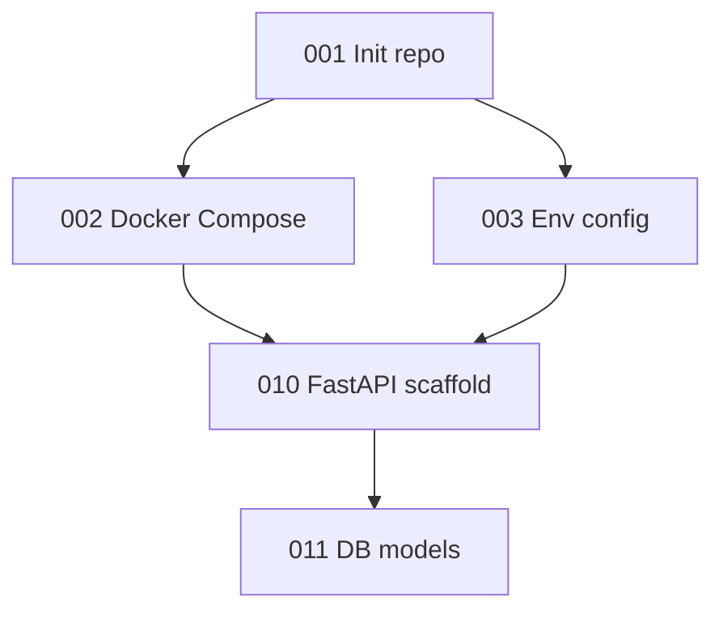

# Task Index — {project_name}

> Session: `{session_id}` | Spec Level: `{spec_level}` | Generated: `{generated_at}`

## Summary

| Metric | Value |
|--------|-------|
| Total tasks | {total} |
| Phases | {phases} |
| Estimated total | {total_hours} h |
| Coverage | {coverage_pct}% of spec sections |

## Phases

| Phase | Title | Tasks | Est. |
|-------|-------|-------|------|
| 01 | Foundation | 3 | 2h |
| 02 | Backend | 12 | 8h |
| 03 | Frontend | 10 | 6h |

## Dependency Graph

## Critical Path

`001 → 002 → 010 → 011 → ...`

## All Tasks

| ID | Phase | Title | Depends | Est. | Status | Spec ref |
|----|-------|-------|---------|------|--------|----------|
| 001 | 01-foundation | Init repo | — | 15m | todo | — |
| 002 | 01-foundation | Docker Compose | 001 | 30m | todo | architecture_spec.md#deployment |
| 010 | 02-backend | FastAPI scaffold | 002, 003 | 45m | todo | architecture_spec.md#api-layer |

## Spec Section Coverage

| Spec Section | Covered by Tasks |
|---|---|
| architecture_spec.md#api-layer | 010, 011 |
| ui_spec.md#home-screen | 020, 021 |
