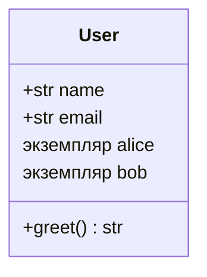

# Модуль 1: Введение в ООП. Классы и объекты.

## Метаданные

| Параметр | Значение |
|----------|----------|
| Предварительные знания | Базовый Python: типы данных, функции, модули; желательно [Модуль 3: asyncio](03-asyncio.md) для контекста сервисных классов |
| Следующий модуль | [02-oop-attributes-methods.md](02-oop-attributes-methods.md) — атрибуты и методы |
| Ориентировочное время | 2–3 часа |

## Цели обучения

1. **Объяснить** разницу между классом (шаблоном) и объектом (экземпляром) и показать, как Python хранит их в памяти.
2. **Создавать** классы с методом `__init__` и корректно использовать параметр `self` в методах экземпляра.
3. **Инстанцировать** объекты, вызывать методы и читать атрибуты экземпляра без обращения к наследованию.
4. **Реализовать** `__repr__` и `__str__` для отладочного и пользовательского представления объектов.
5. **Различать** роли `__new__` и `__init__` на концептуальном уровне (без углубления в метаклассы).

## Теория

### 1.1 Зачем нужно ООП

До сих пор вы писали **функции** и передавали данные явно:

```python
def greet_user(name: str) -> str:
    return f"Привет, {name}!"

print(greet_user("Анна"))
```

Когда сущностей становится много (пользователь, заказ, платёж, уведомление), связанные **данные** и **поведение** удобнее объединить в один объект.

**Объектно-ориентированное программирование (ООП)** — парадигма, в которой программа строится из **объектов**, взаимодействующих через методы и атрибуты.

Четыре ключевые идеи ООП (изучим по модулям курса):

| Принцип | Суть | Модуль курса |
|---------|------|--------------|
| Абстракция | Выделяем сущность и её интерфейс | Этот модуль |
| Инкапсуляция | Скрываем внутреннее состояние | [04-oop-encapsulation.md](04-oop-encapsulation.md) |
| Наследование | Расширяем существующий тип | [03-oop-inheritance.md](03-oop-inheritance.md) |
| Полиморфизм | Один интерфейс — разное поведение | [03-oop-inheritance.md](03-oop-inheritance.md) |

В этом модуле фокус — **класс** и **экземпляр**.

### 1.2 Класс и объект (экземпляр)

**Класс** — описание (чертёж, тип).  
**Объект (экземпляр, instance)** — конкретная сущность, созданная по этому чертежу.

```python
class User:
    """Шаблон пользователя."""

    def __init__(self, name: str, email: str) -> None:
        self.name = name
        self.email = email

    def greet(self) -> str:
        return f"Привет, я {self.name}"
```

```python
alice = User("Алиса", "alice@example.com")
bob = User("Боб", "bob@example.com")

print(alice.greet())  # Привет, я Алиса
print(bob.name)       # Боб
```

`alice` и `bob` — **разные объекты** одного класса `User`. У каждого свой набор атрибутов в памяти.



Проверка типа:

```python
print(type(alice))           # <class 'User'>
print(isinstance(alice, User))  # True
```

### 1.3 Параметр self

Методы экземпляра **всегда** принимают первым аргументом ссылку на сам объект. По соглашению его называют `self` (можно иначе, но так не делают).

```python
class Counter:
    def __init__(self, start: int = 0) -> None:
        self.value = start

    def increment(self) -> None:
        self.value += 1

    def read(self) -> int:
        return self.value
```

При вызове `c.increment()` Python превращает это в `Counter.increment(c)` — передаёт экземпляр неявно.

**Типичная ошибка:** забыть `self` в определении метода:

```python
# ОШИБКА — TypeError при вызове
class Broken:
    def broken_method(x):  # забыли self
        return x
```

### 1.4 Метод __init__ — инициализация

`__init__` вызывается **после** создания объекта. Его задача — задать начальное состояние (атрибуты экземпляра).

```python
class Book:
    def __init__(self, title: str, pages: int) -> None:
        self.title = title
        self.pages = pages
        self.is_read = False
```

Важно: `__init__` **не создаёт** объект — он **инициализирует** уже созданный. Созданием занимается `__new__` (см. ниже).

`__init__` не обязан ничего возвращать. `return` с значением (кроме `None`) вызовет `TypeError`.

### 1.5 __new__ vs __init__ (кратко)

| Метод | Когда вызывается | Задача |
|-------|------------------|--------|
| `__new__(cls, ...)` | До `__init__` | Создать и вернуть новый объект |
| `__init__(self, ...)` | Сразу после `__new__` | Настроить атрибуты экземпляра |

Для 99% классов достаточно определить только `__init__`. Переопределять `__new__` нужно редко (singleton, immutable типы, наследование от `tuple`/`str`).

```python
class Point:
    def __new__(cls, x: float, y: float):
        print("1. __new__ создаёт пустой объект")
        instance = super().__new__(cls)
        return instance

    def __init__(self, x: float, y: float) -> None:
        print("2. __init__ заполняет атрибуты")
        self.x = x
        self.y = y
```

### 1.6 Атрибуты экземпляра

Атрибуты, присвоенные через `self.имя = ...` в `__init__` или методах, принадлежат **конкретному экземпляру**:

```python
class Product:
    def __init__(self, name: str, price: float) -> None:
        self.name = name
        self.price = price

    def apply_discount(self, percent: float) -> None:
        self.price *= (1 - percent / 100)
```

Каждый `Product` хранит свои `name` и `price`. Подробнее о различии атрибутов экземпляра и класса — в [следующем модуле](02-oop-attributes-methods.md).

### 1.7 Методы экземпляра

Метод — функция, объявленная внутри класса и принимающая `self`. Он работает с данными **этого** объекта:

```python
class BankAccount:
    def __init__(self, owner: str, balance: float = 0.0) -> None:
        self.owner = owner
        self.balance = balance

    def deposit(self, amount: float) -> None:
        if amount <= 0:
            raise ValueError("Сумма должна быть положительной")
        self.balance += amount

    def describe(self) -> str:
        return f"Счёт {self.owner}: {self.balance:.2f} ₽"
```

Пока атрибуты публичные — это нормально для учебных примеров. Контроль доступа разберём в [модуле 4](04-oop-encapsulation.md).

### 1.8 Создание нескольких экземпляров

Класс — фабрика объектов. Каждый вызов `ClassName(...)` создаёт **новый** объект:

```python
class Task:
    def __init__(self, title: str, done: bool = False) -> None:
        self.title = title
        self.done = done

    def complete(self) -> None:
        self.done = True

t1 = Task("Изучить классы")
t2 = Task("Решить задания")

t1.complete()
print(t1.done)  # True
print(t2.done)  # False — другой объект
```

```mermaid
flowchart LR
    subgraph memory["Память"]
        T1["Task: title='Изучить классы', done=True"]
        T2["Task: title='Решить задания', done=False"]
    end
    Class["class Task"] -->|Task(...)| T1
    Class -->|Task(...)| T2
```

### 1.9 __repr__ и __str__

Без специальных методов `print(obj)` покажет нечитаемое `<__main__.User object at 0x...>`.

| Метод | Назначение | Аудитория |
|-------|------------|-----------|
| `__repr__` | Однозначное отладочное представление | Разработчик, REPL |
| `__str__` | Человекочитаемая строка | Пользователь, `print()` |

```python
class User:
    def __init__(self, name: str, email: str) -> None:
        self.name = name
        self.email = email

    def __repr__(self) -> str:
        return f"User(name={self.name!r}, email={self.email!r})"

    def __str__(self) -> str:
        return f"{self.name} <{self.email}>"
```

Правило: `__repr__` по возможности должен выглядеть как валидный Python-код для воссоздания объекта.

Если определён только `__repr__`, `str(obj)` тоже использует его.

### 1.10 Проверка: класс vs экземпляр

```python
class Vehicle:
    def __init__(self, model: str) -> None:
        self.model = model

print(Vehicle)                    # <class 'Vehicle'> — сам класс
v = Vehicle("Tesla Model 3")
print(v)                          # зависит от __str__/__repr__
print(v.__class__ is Vehicle)     # True
print(type(v) is Vehicle)         # True
```

Атрибуты можно читать и **присваивать** после создания:

```python
v.year = 2024  # динамически добавили атрибут
```

В продакшене лучше объявлять все поля в `__init__` — так проще читать и проверять типы.

### 1.11 Аннотации типов в классах

Python 3.11+ поддерживает аннотации в сигнатурах методов и `__init__`:

```python
class Order:
    def __init__(self, order_id: str, total: float) -> None:
        self.order_id = order_id
        self.total = total

    def add_item(self, price: float) -> None:
        self.total += price

    def summary(self) -> str:
        return f"Заказ {self.order_id}: {self.total:.2f} ₽"
```

Аннотации не проверяются интерпретатором автоматически — для статической проверки используйте `mypy`.

### 1.12 Класс как пространство имён

До создания экземпляра класс уже существует как объект в памяти:

```python
class Config:
    DEBUG = True
    TIMEOUT = 30

print(Config.DEBUG)   # True — атрибут класса (подробнее в модуле 2)
```

Методы тоже являются атрибутами класса; при обращении через экземпляр Python связывает их с `self`.

## Примеры кода

### Пример 1: Минимальный класс с __init__ и self

```python
"""
Базовый класс пользователя: демонстрация __init__, self и метода экземпляра.
"""


class User:
    def __init__(self, name: str, age: int) -> None:
        self.name = name
        self.age = age

    def birthday(self) -> None:
        self.age += 1

    def introduce(self) -> str:
        return f"Меня зовут {self.name}, мне {self.age} лет."


if __name__ == "__main__":
    u = User("Мария", 25)
    print(u.introduce())
    u.birthday()
    print(u.introduce())
```

### Пример 2: Несколько независимых экземпляров

```python
"""
Каждый экземпляр хранит своё состояние.
"""


class ShoppingCart:
    def __init__(self, owner: str) -> None:
        self.owner = owner
        self.items: list[str] = []

    def add(self, item: str) -> None:
        self.items.append(item)

    def item_count(self) -> int:
        return len(self.items)


if __name__ == "__main__":
    cart_a = ShoppingCart("Алиса")
    cart_b = ShoppingCart("Боб")

    cart_a.add("Книга")
    cart_a.add("Ручка")
    cart_b.add("Кофе")

    print(cart_a.owner, cart_a.item_count())  # Алиса 2
    print(cart_b.owner, cart_b.item_count())  # Боб 1
```

### Пример 3: __repr__ и __str__

```python
"""
Разные представления одного объекта.
"""


class Movie:
    def __init__(self, title: str, year: int, rating: float) -> None:
        self.title = title
        self.year = year
        self.rating = rating

    def __repr__(self) -> str:
        return (
            f"Movie(title={self.title!r}, year={self.year}, "
            f"rating={self.rating})"
        )

    def __str__(self) -> str:
        return f"«{self.title}» ({self.year}) — {self.rating}/10"


if __name__ == "__main__":
    m = Movie("Интерстеллар", 2014, 8.6)
    print(repr(m))  # Movie(title='Интерстеллар', year=2014, rating=8.6)
    print(str(m))   # «Интерстеллар» (2014) — 8.6/10
    print(m)        # str — как print(str(m))
```

### Пример 4: Валидация в __init__

```python
"""
Инварианты объекта задаём при создании.
"""


class Temperature:
    def __init__(self, celsius: float) -> None:
        if celsius < -273.15:
            raise ValueError("Температура ниже абсолютного нуля")
        self.celsius = celsius

    def to_fahrenheit(self) -> float:
        return self.celsius * 9 / 5 + 32

    def __repr__(self) -> str:
        return f"Temperature({self.celsius}°C)"


if __name__ == "__main__":
    t = Temperature(36.6)
    print(t, "→", t.to_fahrenheit())
    # Temperature(-300)  # ValueError
```

### Пример 5: Простой класс задачи (Task)

```python
"""
Модель задачи — основа для практических заданий модуля.
"""


class Task:
    def __init__(self, title: str, priority: int = 1) -> None:
        if not title.strip():
            raise ValueError("Заголовок не может быть пустым")
        if priority < 1:
            raise ValueError("Приоритет должен быть >= 1")
        self.title = title.strip()
        self.priority = priority
        self.completed = False

    def mark_done(self) -> None:
        self.completed = True

    def __repr__(self) -> str:
        status = "✓" if self.completed else "○"
        return f"Task({status} {self.title!r}, p={self.priority})"


if __name__ == "__main__":
    tasks = [Task("Прочитать модуль 1"), Task("Написать класс User", 2)]
    tasks[0].mark_done()
    for t in tasks:
        print(t)
```

## Trade-off: компромиссы

| Решение | Плюсы | Минусы | Когда выбирать |
|---------|-------|--------|----------------|
| Один класс на сущность | Ясная модель предметной области | Больше файлов/типов | Доменные объекты |
| Функции вместо классов | Проще для мелких скриптов | Состояние размазано по аргументам | Одноразовые утилиты |
| Публичные атрибуты в `__init__` | Минимум кода | Нет контроля изменений | Прототипы, DTO |
| Валидация в `__init__` | Объект всегда валиден | `__init__` усложняется | Любые инварианты |
| Только `__repr__` | Меньше дублирования | `print` менее «дружелюбен» | Внутренние объекты |
| `__repr__` + `__str__` | Удобно и в REPL, и для UI | Два метода поддерживать | Пользовательские сущности |
| Динамические атрибуты (`obj.x = 1`) | Гибкость | Сложно отследить поля | Избегать в продакшене |

## Практические задания

### Задание 1 (базовое): Класс Student

**Условие:** Создайте класс `Student` с полями `name: str` и `group: str`. Метод `info() -> str` возвращает строку вида `"Иван (группа ИВТ-101)"`. Реализуйте `__repr__`.

**Критерии приёмки:**
- Корректный `__init__` с `self`
- Минимум два независимых экземпляра с разными данными
- `repr(student)` содержит имя и группу

**Подсказка:** Используйте f-строки и `!r` для строк в `__repr__`.

### Задание 2 (среднее): Класс Timer

**Условие:** Класс `Timer` хранит `seconds: int` (≥ 0). Методы: `tick()` (+1 секунда), `reset()` (обнулить), `format() -> str` — строка `MM:SS` (например, `05:07`).

**Критерии приёмки:**
- Отрицательное начальное значение в `__init__` → `ValueError`
- `format()` всегда два символа для минут и секунд
- Несколько таймеров не влияют друг на друга

**Подсказка:** `minutes, secs = divmod(self.seconds, 60)`.

### Задание 3 (продвинутое): Класс LibraryBook

**Условие:** Класс `LibraryBook(title, author, year)` с методами `checkout(reader: str)` и `return_book()`. Атрибут `borrower: str | None` — кто взял книгу. Нельзя взять уже выданную книгу; нельзя вернуть книгу, которая на полке.

**Критерии приёмки:**
- `checkout` при занятой книге → `RuntimeError` с понятным сообщением
- `return_book` при `borrower is None` → `RuntimeError`
- `__str__` показывает статус: на полке / у читателя

**Подсказка:** Храните `self.borrower: str | None = None` в `__init__`.

## Эталонные решения

<details>
<summary>Задание 1 — Student</summary>

```python
class Student:
    def __init__(self, name: str, group: str) -> None:
        self.name = name
        self.group = group

    def info(self) -> str:
        return f"{self.name} (группа {self.group})"

    def __repr__(self) -> str:
        return f"Student(name={self.name!r}, group={self.group!r})"


if __name__ == "__main__":
    s1 = Student("Иван", "ИВТ-101")
    s2 = Student("Ольга", "ПИ-202")
    print(s1.info())
    print(repr(s2))
```

</details>

<details>
<summary>Задание 2 — Timer</summary>

```python
class Timer:
    def __init__(self, seconds: int = 0) -> None:
        if seconds < 0:
            raise ValueError("seconds must be >= 0")
        self.seconds = seconds

    def tick(self) -> None:
        self.seconds += 1

    def reset(self) -> None:
        self.seconds = 0

    def format(self) -> str:
        minutes, secs = divmod(self.seconds, 60)
        return f"{minutes:02d}:{secs:02d}"

    def __repr__(self) -> str:
        return f"Timer({self.format()})"


if __name__ == "__main__":
    t = Timer(307)
    print(t.format())  # 05:07
    t.tick()
    print(t.format())  # 05:08
```

</details>

<details>
<summary>Задание 3 — LibraryBook</summary>

```python
class LibraryBook:
    def __init__(self, title: str, author: str, year: int) -> None:
        self.title = title
        self.author = author
        self.year = year
        self.borrower: str | None = None

    def checkout(self, reader: str) -> None:
        if self.borrower is not None:
            raise RuntimeError(f"Книга уже у читателя {self.borrower}")
        self.borrower = reader

    def return_book(self) -> None:
        if self.borrower is None:
            raise RuntimeError("Книга уже на полке")
        self.borrower = None

    def __str__(self) -> str:
        base = f"«{self.title}» — {self.author} ({self.year})"
        if self.borrower:
            return f"{base} [у {self.borrower}]"
        return f"{base} [на полке]"


if __name__ == "__main__":
    book = LibraryBook("Мастер и Маргарита", "Булгаков", 1967)
    print(book)
    book.checkout("Анна")
    print(book)
    book.return_book()
    print(book)
```

</details>

## Вопросы для самопроверки

1. **Чем класс отличается от объекта (экземпляра)?**  
   *Ответ:* Класс — описание/тип; объект — конкретный экземпляр с собственным состоянием в памяти.

2. **Зачем нужен параметр `self`?**  
   *Ответ:* Чтобы метод знал, с каким экземпляром работать; Python передаёт его неявно при вызове через точку.

3. **Чем `__init__` отличается от `__new__`?**  
   *Ответ:* `__new__` создаёт объект, `__init__` инициализирует уже созданный экземпляр.

4. **Что произойдёт, если в `__init__` написать `return 42`?**  
   *Ответ:* `TypeError`: `__init__` не должен возвращать значение, отличное от `None`.

5. **Когда вызывается `__str__`, а когда `__repr__`?**  
   *Ответ:* `print(obj)` и `str(obj)` — `__str__`; `repr(obj)` и интерактивный REPL — `__repr__`.

6. **Влияет ли изменение одного экземпляра на другой того же класса?**  
   *Ответ:* Нет, если речь об атрибутах экземпляра (`self.x`); каждый объект хранит свои значения.

7. **Можно ли добавить атрибут объекту после создания?**  
   *Ответ:* Да (`obj.new_attr = value`), но в учебных и промышленных проектах лучше объявлять поля в `__init__`.

## Методические указания

### Тайминг (2–3 часа)

| Блок | Время |
|------|-------|
| Теория: класс, объект, self, __init__ | 40 мин |
| __repr__ / __str__, примеры в REPL | 25 мин |
| Разбор примеров кода | 30 мин |
| Практика: задания 1–3 | 50 мин |
| Самопроверка и обсуждение | 15 мин |

### Типичные ошибки студентов

1. **Забытый `self`** в определении метода — `TypeError: missing 1 required positional argument`.
2. **Путаница класса и экземпляра** — вызов `User.greet()` без аргумента вместо `user.greet()`.
3. **Мутабельный дефолт в `__init__`** — `def __init__(self, items=[])` — одна lista на все экземпляры (разберём в модуле уязвимостей).
4. **Пустой `__init__`** без присвоения атрибутов — объект «пустой», поля появляются хаотично позже.
5. **Нет `__repr__`** — отладка в REPL и логах затруднена.

### Демонстрация в аудитории

1. В REPL создайте класс `Cat`, два экземпляра, измените `name` только у одного.
2. Покажите `id(alice)`, `id(bob)` — разные адреса в памяти.
3. Через `inspect.getmembers` покажите, что методы — атрибуты класса.

### Связь с последующими модулями

- [Модуль 2](02-oop-attributes-methods.md) — атрибуты класса vs экземпляра, `@classmethod`, `@staticmethod`.
- [Модуль 3](03-oop-inheritance.md) — наследование (пока **не используйте** `class Child(Parent)` в заданиях этого модуля).
- [Модуль 4](04-oop-encapsulation.md) — соглашения `_protected`, `__mangling`.

### FAQ

**Нужно ли писать `-> None` у `__init__`?**  
Рекомендуется для читаемости и mypy; на выполнение не влияет.

**Класс без методов — это нормально?**  
Для контейнеров данных позже изучим `@dataclass`; пока достаточно понимать механику `__init__`.

## Дополнительные материалы

- [Официальная документация: классы](https://docs.python.org/3/tutorial/classes.html)
- [Python Classes — Real Python](https://realpython.com/python3-object-oriented-programming/)
- [Документация: `__repr__` и `__str__`](https://docs.python.org/3/reference/datamodel.html#object.__repr__)
- [PEP 636 — Structural Pattern Matching](https://peps.python.org/pep-0636/) — сопоставление с классами (опционально)
- [Следующий модуль: атрибуты и методы](02-oop-attributes-methods.md)
- [Модуль 3 курса: asyncio](03-asyncio.md) — контекст сервисных классов
