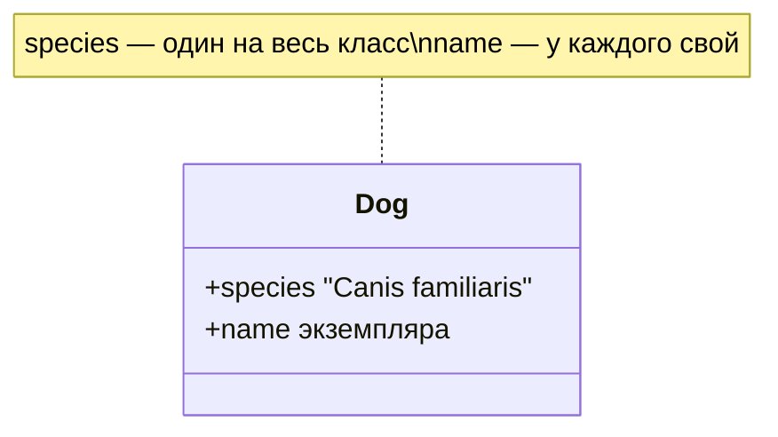
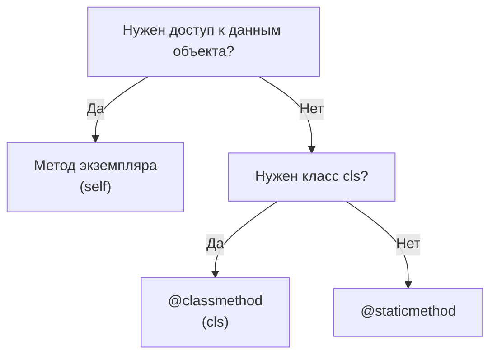

# Модуль 2: Введение в ООП. Атрибуты и методы.

## Метаданные

| Параметр | Значение |
|----------|----------|
| Предварительные знания | [01-oop-classes-objects.md](01-oop-classes-objects.md) — классы, `__init__`, `self`, экземпляры |
| Следующий модуль | [03-oop-inheritance.md](03-oop-inheritance.md) — принцип наследование |
| Ориентировочное время | 2–3 часа |

## Цели обучения

1. **Различать** атрибуты экземпляра и атрибуты класса и предсказывать результат присваивания через `self` и через имя класса.
2. **Объяснить** механизм «затенения» (shadowing) атрибута класса атрибутом экземпляра.
3. **Применять** методы экземпляра, `@classmethod` и `@staticmethod` в уместных сценариях.
4. **Реализовать** альтернативные конструкторы через `@classmethod` (фабричные методы).
5. **Выбирать** тип метода по контексту: нужен ли доступ к `self`, к `cls` или ни к тому, ни к другому.

## Теория

### 2.1 Два уровня атрибутов

В Python у класса есть **два уровня** хранения данных:

| Вид | Где объявляется | Принадлежит | Разделяется между экземплярами |
|-----|-----------------|-------------|--------------------------------|
| **Атрибут экземпляра** | `self.x = ...` в `__init__` или методах | Конкретному объекту | Нет |
| **Атрибут класса** | Тело класса: `class Foo: count = 0` | Самому классу | Да (общий для всех) |

```python
class Dog:
    species = "Canis familiaris"  # атрибут класса

    def __init__(self, name: str) -> None:
        self.name = name            # атрибут экземпляра
```

```python
a = Dog("Шарик")
b = Dog("Бобик")

print(a.name, b.name)       # разные имена
print(a.species, b.species) # один и тот же вид
print(Dog.species)          # доступ через класс
```



### 2.2 Порядок поиска атрибутов

При обращении `obj.attr` Python ищет:

1. Атрибуты **экземпляра** (`obj.__dict__`)
2. Атрибуты **класса** (`Dog.__dict__`)
3. Базовые классы (наследование — в [модуле 3](03-oop-inheritance.md))
4. `__getattr__` (магические методы — позже в курсе)

```python
class Counter:
    total_created = 0

    def __init__(self) -> None:
        Counter.total_created += 1
        self.value = 0
```

Каждый новый `Counter()` увеличивает **общий** счётчик `total_created`, а `value` у каждого свой.

### 2.3 Затенение атрибута класса (shadowing)

**Критически важная ловушка:** присваивание через `self.attr = ...` **создаёт** атрибут экземпляра, даже если в классе уже есть `attr`:

```python
class Trap:
    shared = []

    def __init__(self) -> None:
        self.shared = []  # НОВЫЙ атрибут экземпляра, классовый не тронут!

t1 = Trap()
t2 = Trap()
t1.shared.append(1)
print(t2.shared)  # [] — у t2 свой список
print(Trap.shared)  # [] — классовый не менялся через t1
```

Сравните с **мутацией** общего объекта без присваивания:

```python
class SharedList:
    items: list[int] = []  # один список на класс — ОПАСНО как дефолт!

    def add(self, x: int) -> None:
        self.items.append(x)  # мутируем общий список


s1 = SharedList()
s2 = SharedList()
s1.add(1)
print(s2.items)  # [1] — сюрприз!
```

**Правило:** изменяемые значения по умолчанию объявляйте в `__init__`, не в теле класса.

### 2.4 Чтение vs запись

- **Чтение** `self.shared` без локального атрибута — берётся значение **класса**.
- **Запись** `self.shared = x` — всегда создаёт/перезаписывает атрибут **экземпляра**.

```python
class Demo:
    tag = "class-level"

    def __init__(self) -> None:
        print(self.tag)      # class-level — читаем из класса
        self.tag = "instance"  # создали атрибут экземпляра

d = Demo()
print(Demo.tag)  # class-level — класс не изменился
print(d.tag)     # instance
```

### 2.5 Методы экземпляра (instance methods)

Метод экземпляра — обычная функция с первым параметром `self`. Имеет доступ к атрибутам и другим методам **конкретного** объекта:

```python
class Rectangle:
    def __init__(self, width: float, height: float) -> None:
        self.width = width
        self.height = height

    def area(self) -> float:
        return self.width * self.height

    def scale(self, factor: float) -> None:
        self.width *= factor
        self.height *= factor
```

Вызов `rect.area()` эквивалентен `Rectangle.area(rect)`.

### 2.6 Методы класса (@classmethod)

Декоратор `@classmethod` передаёт первым аргументом **класс** (`cls`), а не экземпляр.

Типичные применения:

- **Альтернативные конструкторы** (парсинг строки, JSON, БД)
- Работа с атрибутами класса
- Фабрики в иерархии наследования (полиморфное создание — в модуле 3)

```python
class User:
    def __init__(self, name: str, email: str) -> None:
        self.name = name
        self.email = email

    @classmethod
    def from_email(cls, raw: str) -> "User":
        name, _, domain = raw.partition("@")
        return cls(name.title(), raw)

    @classmethod
    def guest(cls) -> "User":
        return cls("Гость", "guest@localhost")
```

`cls` — обычно тот класс, через который вызвали метод (`User.from_email` → `cls is User`). При наследовании `cls` будет дочерним классом.

### 2.7 Статические методы (@staticmethod)

`@staticmethod` **не получает** ни `self`, ни `cls`. Это функция, логически сгруппированная с классом:

```python
class MathUtil:
    @staticmethod
    def is_even(n: int) -> bool:
        return n % 2 == 0

    @staticmethod
    def clamp(value: float, low: float, high: float) -> float:
        return max(low, min(high, value))
```

Вызов: `MathUtil.is_even(4)` или `MathUtil.clamp(1.5, 0, 1)`.

Используйте, когда функция связана с доменом класса, но не нуждается в доступе к состоянию объекта или класса.

### 2.8 Сравнение трёх видов методов



| Тип | Первый аргумент | Типичное применение |
|-----|-----------------|---------------------|
| Instance | `self` | Работа с полями объекта |
| Class | `cls` | Фабрики, счётчики класса |
| Static | — | Валидация, утилиты рядом с типом |

```python
class Stats:
    count = 0

    def __init__(self, value: int) -> None:
        self.value = value
        Stats.count += 1

    def double(self) -> int:
        return self.value * 2

    @classmethod
    def from_string(cls, s: str) -> "Stats":
        return cls(int(s))

    @staticmethod
    def is_valid(n: int) -> bool:
        return n >= 0
```

### 2.9 @classmethod как фабрика

Паттерн **альтернативный конструктор** — именованный способ создать объект из другого представления данных:

```python
from datetime import date


class Report:
    def __init__(self, title: str, created: date) -> None:
        self.title = title
        self.created = created

    @classmethod
    def from_iso(cls, title: str, iso: str) -> "Report":
        year, month, day = map(int, iso.split("-"))
        return cls(title, date(year, month, day))

    def __repr__(self) -> str:
        return f"Report({self.title!r}, {self.created})"
```

`Report("Q1", date(2026, 3, 31))` и `Report.from_iso("Q2", "2026-06-30")` — два равноправных пути к экземпляру.

### 2.10 Счётчик экземпляров через атрибут класса

```python
class Connection:
    active_count = 0

    def __init__(self, host: str) -> None:
        self.host = host
        Connection.active_count += 1

    def close(self) -> None:
        Connection.active_count -= 1

    @classmethod
    def how_many(cls) -> int:
        return cls.active_count
```

Здесь `active_count` — **намеренно общий** ресурс. Изменяйте его через имя класса (`Connection.active_count`), а не через `self`, чтобы не создавать shadowing.

### 2.11 Когда staticmethod вместо функции модуля

| Критерий | Функция в модуле | `@staticmethod` |
|----------|------------------|-----------------|
| Связь с классом | Слабая | Явная |
| Наследование | Не переопределяется | Можно переопределить в подклассе |
| Обнаруживаемость | Импорт из модуля | `ClassName.method` в IDE |

```python
class PasswordValidator:
    @staticmethod
    def is_strong(password: str) -> bool:
        return len(password) >= 8 and any(c.isdigit() for c in password)
```

### 2.12 Дескриптор методов (как Python связывает self)

При доступе `obj.method` Python возвращает **связанный метод** (bound method), подставляющий `obj` как `self`:

```python
class Greeter:
    def hello(self) -> str:
        return "hi"

g = Greeter()
bound = g.hello
print(bound())       # hi
print(Greeter.hello) # функция, требует self вручную
```

Это объясняет, почему `self` не передаётся явно при вызове через точку.

### 2.13 Константы класса

Атрибуты класса часто используют как **константы** (по соглашению — UPPER_CASE):

```python
class HttpStatus:
    OK = 200
    NOT_FOUND = 404
    SERVER_ERROR = 500

    def __init__(self, code: int, message: str) -> None:
        self.code = code
        self.message = message

    @classmethod
    def ok(cls, message: str = "OK") -> "HttpStatus":
        return cls(cls.OK, message)
```

Неизменяемые константы в классе безопасны; изменяемые — только с пониманием общего состояния.

## Примеры кода

### Пример 1: Атрибут класса vs экземпляра

```python
"""
Демонстрация разделения и затенения атрибутов.
"""


class Employee:
    company = "ООО Ромашка"
    headcount = 0

    def __init__(self, name: str) -> None:
        self.name = name
        Employee.headcount += 1

    def info(self) -> str:
        return f"{self.name} @ {self.company}"


if __name__ == "__main__":
    e1 = Employee("Анна")
    e2 = Employee("Борис")
    print(Employee.headcount)  # 2
    e1.company = "Филиал"      # shadowing — только у e1
    print(e1.info())           # Анна @ Филиал
    print(e2.info())           # Борис @ ООО Ромашка
    print(Employee.company)    # ООО Ромашка
```

### Пример 2: Опасность изменяемого атрибута класса

```python
"""
Антипаттерн: общий список на классе.
"""


class BadTags:
    tags: list[str] = []

    def add(self, tag: str) -> None:
        self.tags.append(tag)


class GoodTags:
    def __init__(self) -> None:
        self.tags: list[str] = []

    def add(self, tag: str) -> None:
        self.tags.append(tag)


if __name__ == "__main__":
    b1, b2 = BadTags(), BadTags()
    b1.add("python")
    print(b2.tags)  # ['python'] — утечка состояния!

    g1, g2 = GoodTags(), GoodTags()
    g1.add("python")
    print(g2.tags)  # []
```

### Пример 3: Три вида методов в одном классе

```python
"""
Stats: instance, classmethod, staticmethod.
"""


class Stats:
    created = 0

    def __init__(self, value: int) -> None:
        if not Stats.is_valid(value):
            raise ValueError("value must be >= 0")
        self.value = value
        Stats.created += 1

    def squared(self) -> int:
        return self.value ** 2

    @classmethod
    def from_binary(cls, bits: str) -> "Stats":
        return cls(int(bits, 2))

    @classmethod
    def instances_created(cls) -> int:
        return cls.created

    @staticmethod
    def is_valid(n: int) -> bool:
        return n >= 0


if __name__ == "__main__":
    s1 = Stats(4)
    s2 = Stats.from_binary("1010")
    print(s1.squared(), s2.value, Stats.instances_created())
```

### Пример 4: Фабрика from_dict

```python
"""
Альтернативный конструктор из словаря.
"""


class Product:
    def __init__(self, sku: str, name: str, price: float) -> None:
        self.sku = sku
        self.name = name
        self.price = price

    @classmethod
    def from_dict(cls, data: dict) -> "Product":
        return cls(
            sku=data["sku"],
            name=data["name"],
            price=float(data["price"]),
        )

    def __repr__(self) -> str:
        return f"Product({self.sku!r}, {self.price})"


if __name__ == "__main__":
    raw = {"sku": "A-1", "name": "Кружка", "price": "299.99"}
    p = Product.from_dict(raw)
    print(p)
```

### Пример 5: classmethod и наследование (превью)

```python
"""
При наследовании cls указывает на вызывающий класс.
Полная тема — в модуле 3.
"""


class Animal:
    def __init__(self, name: str) -> None:
        self.name = name

    @classmethod
    def unnamed(cls) -> "Animal":
        return cls("без имени")


class Dog(Animal):
    pass


if __name__ == "__main__":
    d = Dog.unnamed()
    print(type(d), d.name)  # <class 'Dog'> без имени
```

### Пример 6: Статическая валидация

```python
"""
Утилиты валидации как staticmethod.
"""


class Email:
    def __init__(self, address: str) -> None:
        if not Email.is_valid(address):
            raise ValueError(f"Некорректный email: {address}")
        self.address = address.lower()

    @staticmethod
    def is_valid(address: str) -> bool:
        return "@" in address and "." in address.split("@")[-1]

    def __repr__(self) -> str:
        return f"Email({self.address!r})"


if __name__ == "__main__":
  print(Email.is_valid("user@example.com"))
  e = Email("User@Example.COM")
  print(e)
```

## Trade-off: компромиссы

| Решение | Плюсы | Минусы | Когда выбирать |
|---------|-------|--------|----------------|
| Атрибут экземпляра | Изолированное состояние | Больше памяти на объект | Уникальные данные |
| Атрибут класса | Общие константы/счётчики | Риск утечки состояния | Константы, метрики |
| `self.x =` при существующем class attr | Локальное переопределение | Путаница при чтении | Редко, осознанно |
| `@classmethod` фабрика | Читаемое создание из разных форматов | Дополнительный API | Парсинг, БД, JSON |
| `@staticmethod` | Нет лишних аргументов | Не видит cls/self | Чистые утилиты |
| Функция в модуле | Проще тестировать изолированно | Слабая связь с типом | Общие хелперы |
| Изменение class attr через `self` | — | Создаёт shadowing | **Избегать** |

## Практические задания

### Задание 1 (базовое): Класс Circle с атрибутом класса

**Условие:** Класс `Circle` с атрибутом класса `pi = 3.14159265`. Экземпляр хранит `radius`. Метод `area() -> float` использует `Circle.pi`. Счётчик `instances` класса увеличивается при каждом создании.

**Критерии приёмки:**
- `Circle.instances` корректно считает созданные объекты
- `area()` использует атрибут класса `pi`
- Два круга с разным `radius` — разные площади

**Подсказка:** В `__init__` пишите `Circle.instances += 1`.

### Задание 2 (среднее): Класс Temperature с фабриками

**Условие:** Класс `Temperature` хранит `celsius: float`. Обычный `__init__`. Добавьте `@classmethod from_fahrenheit(cls, f: float)` и `@staticmethod is_valid_celsius(c: float) -> bool` (не ниже -273.15).

**Критерии приёмки:**
- `from_fahrenheit(32)` → `0.0` °C (с допуском 1e-6)
- `__init__` вызывает валидацию через staticmethod
- Метод `to_fahrenheit() -> float` у экземпляра

**Подсказка:** `C = (F - 32) * 5 / 9`.

### Задание 3 (продвинутое): Класс Registry

**Условие:** Класс `Registry` регистрирует объекты по строковому ключу. Атрибут класса `_storage: dict[str, object]`. Метод экземпляра `register(key: str)` регистрирует **сам объект**. `@classmethod lookup(key) -> object | None`. `@staticmethod validate_key(key: str) -> bool` — ключ непустой, без пробелов.

**Критерии приёмки:**
- Повторная регистрация того же ключа → `ValueError`
- `lookup` находит зарегистрированный объект
- Невалидный ключ в `register` → `ValueError`

**Подсказка:** В `register` используйте `Registry.validate_key(key)` и `Registry._storage`.

## Эталонные решения

<details>
<summary>Задание 1 — Circle</summary>

```python
class Circle:
    pi = 3.14159265
    instances = 0

    def __init__(self, radius: float) -> None:
        if radius <= 0:
            raise ValueError("radius must be positive")
        self.radius = radius
        Circle.instances += 1

    def area(self) -> float:
        return Circle.pi * self.radius ** 2

    def __repr__(self) -> str:
        return f"Circle(r={self.radius})"


if __name__ == "__main__":
    c1 = Circle(2)
    c2 = Circle(3)
    print(c1.area(), c2.area(), Circle.instances)
```

</details>

<details>
<summary>Задание 2 — Temperature</summary>

```python
class Temperature:
    def __init__(self, celsius: float) -> None:
        if not Temperature.is_valid_celsius(celsius):
            raise ValueError("invalid celsius")
        self.celsius = celsius

    @staticmethod
    def is_valid_celsius(c: float) -> bool:
        return c >= -273.15

    @classmethod
    def from_fahrenheit(cls, f: float) -> "Temperature":
        celsius = (f - 32) * 5 / 9
        return cls(celsius)

    def to_fahrenheit(self) -> float:
        return self.celsius * 9 / 5 + 32


if __name__ == "__main__":
    t = Temperature.from_fahrenheit(32)
    assert abs(t.celsius) < 1e-6
    print(t.to_fahrenheit())
```

</details>

<details>
<summary>Задание 3 — Registry</summary>

```python
class Registry:
    _storage: dict[str, object] = {}

    @staticmethod
    def validate_key(key: str) -> bool:
        return bool(key) and " " not in key

    def register(self, key: str) -> None:
        if not Registry.validate_key(key):
            raise ValueError("invalid key")
        if key in Registry._storage:
            raise ValueError(f"key {key!r} already registered")
        Registry._storage[key] = self

    @classmethod
    def lookup(cls, key: str) -> object | None:
        return cls._storage.get(key)


if __name__ == "__main__":
    r = Registry()
    r.register("svc-1")
    assert Registry.lookup("svc-1") is r
```

</details>

## Вопросы для самопроверки

1. **Чем атрибут экземпляра отличается от атрибута класса?**  
   *Ответ:* Атрибут экземпляра уникален для объекта; атрибут класса общий для всех экземпляров (хранится в классе).

2. **Что произойдёт при `self.count = 1`, если в классе уже есть `count = 0`?**  
   *Ответ:* Создастся атрибут экземпляра `count`, затеняющий классовый; `Class.count` останется 0.

3. **Когда использовать `@classmethod` вместо `__init__`?**  
   *Ответ:* Когда нужен альтернативный способ построения объекта (из строки, dict, другой единицы измерения).

4. **Чем `@staticmethod` отличается от обычной функции?**  
   *Ответ:* Логически привязан к классу, может быть унаследован; не получает `self`/`cls`.

5. **Почему `tags: list = []` в теле класса опасно?**  
   *Ответ:* Один список на все экземпляры; мутация через один объект видна другим.

6. **Что такое bound method?**  
   *Ответ:* Объект, связывающий функцию-метод с конкретным экземпляром; `self` подставляется автоматически.

7. **Зачем в фабрике писать `return cls(...)` вместо `return ClassName(...)`?**  
   *Ответ:* Чтобы при наследовании создавался экземпляр вызывающего подкласса.

## Методические указания

### Тайминг (2–3 часа)

| Блок | Время |
|------|-------|
| Атрибуты класса vs экземпляра, shadowing | 45 мин |
| Три вида методов | 40 мин |
| Примеры и REPL-эксперименты | 30 мин |
| Практика | 50 мин |
| Самопроверка | 15 мин |

### Типичные ошибки

1. **Мутабельный атрибут класса** как общее хранилище без понимания последствий.
2. **Путаница `@staticmethod` и `@classmethod`** в фабриках — фабрика почти всегда `classmethod`.
3. **Изменение счётчика через `self.count += 1`** при объявленном `count` в классе — создаёт shadowing.
4. **Вызов `classmethod` без декоратора** — `self` получит класс как экземпляр (случайно работает в старом коде).
5. **Забытый `cls` первым параметром** у classmethod.

### Демонстрация

1. В REPL покажите `Trap` с `self.shared = []` vs `self.shared.append`.
2. `id(SharedList.items)` для двух экземпляров — один адрес.
3. `Dog.unnamed()` после определения наследника — preview модуля 3.

### Связь с другими модулями

- [Модуль 1](01-oop-classes-objects.md) — основа: `__init__`, `self`.
- [Модуль 3](03-oop-inheritance.md) — `cls` в фабриках при наследовании.
- [Модуль 4](04-oop-encapsulation.md) — `_storage` как защищённый атрибут класса.

### FAQ

**Можно ли обойтись без staticmethod?**  
Да, вынесите функцию в модуль; staticmethod — вопрос организации API.

**Нужен ли classmethod для констант?**  
Нет; константы — атрибуты класса, доступ `ClassName.CONST`.

## Дополнительные материалы

- [Документация: классы и объекты](https://docs.python.org/3/tutorial/classes.html#class-and-instance-variables)
- [Документация: `@classmethod`](https://docs.python.org/3/library/functions.html#classmethod)
- [Документация: `@staticmethod`](https://docs.python.org/3/library/functions.html#staticmethod)
- [Real Python: Instance, Class, and Static Methods](https://realpython.com/instance-class-and-static-methods-demystified/)
- [Предыдущий модуль: классы и объекты](01-oop-classes-objects.md)
- [Следующий модуль: наследование](03-oop-inheritance.md)
