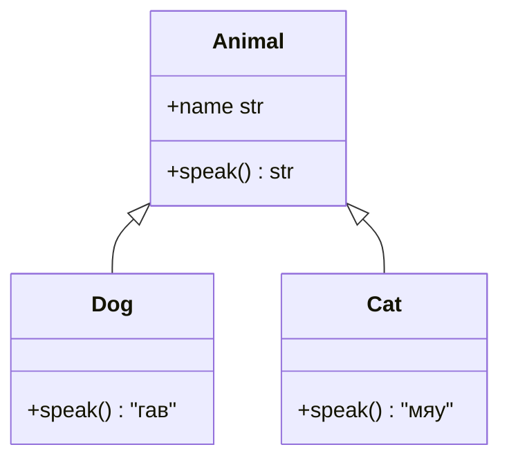
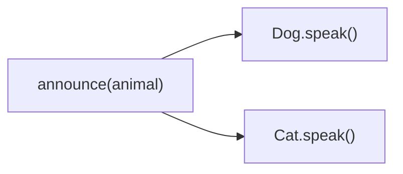

# Модуль 3: Введение в ООП. Принцип наследование

## Метаданные

| Параметр | Значение |
|----------|----------|
| Предварительные знания | [02-oop-attributes-methods.md](02-oop-attributes-methods.md) — атрибуты экземпляра/класса, методы |
| Следующий модуль | [04-oop-encapsulation.md](04-oop-encapsulation.md) — принцип инкапсуляция |
| Ориентировочное время | 2–3 часа |

## Цели обучения

1. **Реализовать** иерархию классов с синтаксисом `class Child(Parent)` и переопределением методов.
2. **Применять** `super()` для вызова методов родителя в `__init__` и других методах.
3. **Объяснить** отношение «is-a» (является подтипом) и когда наследование уместно.
4. **Использовать** полиморфизм: единый интерфейс, разное поведение в подклассах.
5. **Описать** MRO на базовом уровне и знать, где изучается C3-линеаризация (модуль 13 курса).

## Теория

### 3.1 Что такое наследование

**Наследование** позволяет объявить новый класс на основе существующего, **переиспользуя** и **расширяя** его поведение.

```python
class Animal:
    def __init__(self, name: str) -> None:
        self.name = name

    def speak(self) -> str:
        return "..."

class Dog(Animal):
    def speak(self) -> str:
        return "гав"
```

`Dog` **наследует** атрибуты и методы `Animal` и может добавлять свои или **переопределять** (override) унаследованные.

Отношение: **Dog is-a Animal** — собака является животным.



### 3.2 Базовый и производный класс

| Термин | Синонимы | Пример |
|--------|----------|--------|
| Базовый (родительский) | superclass, parent | `Animal` |
| Производный (дочерний) | subclass, child | `Dog` |

```python
class Vehicle:
    def __init__(self, brand: str) -> None:
        self.brand = brand

    def describe(self) -> str:
        return f"Транспорт {self.brand}"


class Car(Vehicle):
    def __init__(self, brand: str, doors: int) -> None:
        super().__init__(brand)
        self.doors = doors

    def describe(self) -> str:
        return f"Авто {self.brand}, дверей: {self.doors}"
```

### 3.3 super() — вызов родителя

`super()` возвращает прокси-объект для вызова метода **следующего** класса в цепочке наследования (MRO).

В простой иерархии «один родитель»:

```python
class Employee:
    def __init__(self, name: str, salary: float) -> None:
        self.name = name
        self.salary = salary


class Manager(Employee):
    def __init__(self, name: str, salary: float, bonus: float) -> None:
        super().__init__(name, salary)
        self.bonus = bonus
```

**Типичная ошибка:** забыть `super().__init__(...)` — дочерний класс не инициализирует поля родителя.

```python
class Broken(Employee):
    def __init__(self, name: str, salary: float, dept: str) -> None:
        self.dept = dept  # name и salary не заданы!
```

### 3.4 Переопределение методов (override)

Дочерний класс может заменить реализацию метода родителя:

```python
class Shape:
    def area(self) -> float:
        raise NotImplementedError("Подкласс должен реализовать area")


class Rectangle(Shape):
    def __init__(self, width: float, height: float) -> None:
        self.width = width
        self.height = height

    def area(self) -> float:
        return self.width * self.height
```

Родительский метод доступен через `super()`:

```python
class Manager(Employee):
  def total_compensation(self) -> float:
      return super().salary + self.bonus  # если salary — property/атрибут
```

В примере с `Employee` лучше:

```python
class Manager(Employee):
    def __init__(self, name: str, salary: float, bonus: float) -> None:
        super().__init__(name, salary)
        self.bonus = bonus

    def total_pay(self) -> float:
        base = self.salary  # унаследованный атрибут
        return base + self.bonus
```

### 3.5 Полиморфизм

**Полиморфизм** — способность обрабатывать объекты разных классов через **единый интерфейс**.

```python
def announce(animal: Animal) -> None:
    print(f"{animal.name} говорит: {animal.speak()}")

announce(Dog("Шарик"))   # гав
announce(Cat("Мурка"))   # мяу
```

Функция `announce` не знает конкретный подкласс — ей достаточно методов `name` и `speak`.

В Python действует **утиная типизация**: важны методы объекта, а не явная иерархия. Наследование делает контракт **явным** для читателя и инструментов.



### 3.6 isinstance и issubclass

```python
dog = Dog("Рекс")
print(isinstance(dog, Dog))      # True
print(isinstance(dog, Animal))   # True — наследник считается Animal
print(issubclass(Dog, Animal))   # True
```

Используйте для ветвления логики и тестов, но не злоупотребляйте вместо полиморфизма.

### 3.7 MRO — порядок разрешения методов (базово)

**MRO (Method Resolution Order)** — порядок, в котором Python ищет метод при вызове `obj.method()`.

Для простого наследования:

```python
class A:
    def hello(self) -> str:
        return "A"

class B(A):
    def hello(self) -> str:
        return "B"

print(B.__mro__)
# (<class 'B'>, <class 'A'>, <class 'object'>)
```

Поиск: `B` → `A` → `object`.

`super().hello()` в `B` вызовет `A.hello` — **следующий** класс в MRO, не обязательно «биологический» родитель в голове разработчика.

### 3.8 Зачем знать MRO уже сейчас

Даже в простых иерархиях `super()` опирается на MRO. При **множественном наследовании** (два родителя) порядок критичен — без понимания MRO легко пропустить инициализацию ветки.

**Глубокое изучение** (алгоритм C3, проблема «ромба», кооперативный `super`) — в **модуле 13** курса: [13-inheritance-mro.md](13-inheritance-mro.md).

Сейчас достаточно:

```python
class Child(Parent):
    def __init__(self, ...):
        super().__init__(...)  # всегда в кооперативных иерархиях
```

И проверки:

```python
print(Child.mro())
# или
help(Child)
```

### 3.9 Цепочка super() в __init__

```python
class A:
    def __init__(self) -> None:
        print("A init")

class B(A):
    def __init__(self) -> None:
        super().__init__()
        print("B init")

class C(B):
    def __init__(self) -> None:
        super().__init__()
        print("C init")

C()
# A init
# B init
# C init
```

`super()` в `C` → `B.__init__` → `super()` в `B` → `A.__init__`.

### 3.10 Расширение vs замена поведения

| Стратегия | Паттерн | Пример |
|-----------|---------|--------|
| **Расширение** | Вызвать `super()`, добавить логику | `Manager.total_pay` |
| **Замена** | Полностью новая реализация | `Dog.speak` |
| **Запрет** | `raise NotImplementedError` | Базовый `Shape.area` |

### 3.11 Наследование атрибутов и методов

Дочерний класс **наследует** атрибуты класса родителя и методы. Атрибуты экземпляра появляются после `super().__init__`:

```python
class Base:
    version = 1

    def __init__(self, tag: str) -> None:
        self.tag = tag


class Derived(Base):
    version = 2  # переопределение атрибута класса

    def info(self) -> str:
        return f"v{self.version} {self.tag}"
```

`Derived.version` затеняет `Base.version` для `Derived` и его экземпляров (если нет shadowing на уровне экземпляра).

### 3.12 Когда наследование уместно

Наследование оправдано при чётком **is-a**:

- `Manager` **is-a** `Employee`
- `Dog` **is-a** `Animal`

**Не** используйте наследование для переиспользования кода без отношения подтипа («мне нужны методы из другого класса») — лучше **композиция** (has-a), которую разберём в продвинутых модулях.

```python
# Плохо: OrderService is-a PaymentGateway — бессмыслица
# Хорошо: OrderService has-a PaymentGateway (композиция)
```

### 3.13 classmethod и наследование

Фабрика с `cls(...)` создаёт экземпляр **вызывающего** класса:

```python
class Animal:
    @classmethod
    def create_default(cls) -> "Animal":
        return cls("unknown")


class Dog(Animal):
    pass


d = Dog.create_default()
print(type(d))  # <class 'Dog'>
```

### 3.14 Ограничения и предостережения

1. **Глубокие иерархии** — сложно поддерживать; предпочитайте мелкие уровни.
2. **Хрупкий базовый класс** — изменение родителя ломает всех потомков.
3. **Множественное наследование** — только с пониманием MRO (модуль 13, миксины — модуль 14).
4. **Наследование ради одного метода** — часто проще делегирование или протокол (модуль 07).

## Примеры кода

### Пример 1: Простая иерархия Animal

```python
"""
Базовый класс и два подкласса с полиморфным speak().
"""


class Animal:
    def __init__(self, name: str) -> None:
        self.name = name

    def speak(self) -> str:
        return "..."

    def __repr__(self) -> str:
        return f"{self.__class__.__name__}({self.name!r})"


class Dog(Animal):
    def speak(self) -> str:
        return "гав"


class Cat(Animal):
    def speak(self) -> str:
        return "мяу"


def announce(animal: Animal) -> None:
    print(f"{animal} → {animal.speak()}")


if __name__ == "__main__":
    for pet in [Dog("Шарик"), Cat("Мурка"), Animal("???")]:
        announce(pet)
```

### Пример 2: super() в __init__

```python
"""
Иерархия сотрудников с корректным super().__init__.
"""


class Employee:
    def __init__(self, name: str, base_salary: float) -> None:
        self.name = name
        self.base_salary = base_salary

    def total_pay(self) -> float:
        return self.base_salary

    def __repr__(self) -> str:
        return f"{self.__class__.__name__}({self.name!r})"


class Manager(Employee):
    def __init__(self, name: str, base_salary: float, bonus: float) -> None:
        super().__init__(name, base_salary)
        self.bonus = bonus

    def total_pay(self) -> float:
        return super().total_pay() + self.bonus


class Contractor(Employee):
    def __init__(self, name: str, hourly: float, hours: int) -> None:
        super().__init__(name, 0)
        self.hourly = hourly
        self.hours = hours

    def total_pay(self) -> float:
        return self.hourly * self.hours


if __name__ == "__main__":
    staff: list[Employee] = [
        Employee("Анна", 80_000),
        Manager("Борис", 100_000, 20_000),
        Contractor("Саша", 1500, 160),
    ]
    for emp in staff:
        print(emp, "→", emp.total_pay())
```

### Пример 3: Просмотр MRO

```python
"""
Базовое знакомство с __mro__.
"""


class A:
    def ping(self) -> str:
        return "A"


class B(A):
    def ping(self) -> str:
        return "B"


class C(B):
    def ping(self) -> str:
        parent = super().ping()
        return f"C→{parent}"


if __name__ == "__main__":
    print(C.__mro__)
    print(C().ping())  # C→B
```

### Пример 4: Расширение метода родителя

```python
"""
Логирование через super() в переопределённом методе.
"""


class LoggerMixin:
    def log(self, msg: str) -> None:
        print(f"[LOG] {msg}")


class Service(LoggerMixin):
    def run(self) -> None:
        self.log("start")
        self._execute()
        self.log("done")

    def _execute(self) -> None:
        print("working...")


if __name__ == "__main__":
    Service().run()
```

> Полноценные миксины — в [14-mixins.md](14-mixins.md). Здесь — иллюстрация `super()` и переиспользования.

### Пример 5: NotImplementedError в базовом классе

```python
"""
Базовый класс задаёт контракт без ABC.
"""


class Notifier:
    def send(self, message: str) -> None:
        raise NotImplementedError(
            f"{self.__class__.__name__} must implement send()"
        )


class EmailNotifier(Notifier):
    def send(self, message: str) -> None:
        print(f"EMAIL: {message}")


class SmsNotifier(Notifier):
    def send(self, message: str) -> None:
        print(f"SMS: {message}")


def broadcast(notifier: Notifier, text: str) -> None:
    notifier.send(text)


if __name__ == "__main__":
    broadcast(EmailNotifier(), "Привет")
    broadcast(SmsNotifier(), "Код: 1234")
```

### Пример 6: isinstance в тестах

```python
"""
Проверка типов при полиморфной обработке.
"""
import math


class Shape:
    def area(self) -> float:
        raise NotImplementedError


class Circle(Shape):
    def __init__(self, radius: float) -> None:
        self.radius = radius

    def area(self) -> float:
        return math.pi * self.radius ** 2


class Square(Shape):
    def __init__(self, side: float) -> None:
        self.side = side

    def area(self) -> float:
        return self.side ** 2


def total_area(shapes: list[Shape]) -> float:
    return sum(s.area() for s in shapes)


if __name__ == "__main__":
    shapes: list[Shape] = [Circle(2), Square(3)]
    assert all(isinstance(s, Shape) for s in shapes)
    print(total_area(shapes))
```

## Trade-off: компромиссы

| Решение | Плюсы | Минусы | Когда выбирать |
|---------|-------|--------|----------------|
| Один уровень наследования | Просто читать и поддерживать | Ограниченное переиспользование | Большинство доменных моделей |
| Глубокая иерархия | Много общего кода вверху | Хрупкость, сложный MRO | Избегать без нужды |
| `super()` везде | Кооперативные цепочки | Нужно понимать MRO | Любой `__init__` в иерархии |
| Прямой `Parent.method(self)` | Явный вызов | Ломает MRO при множественном наследовании | Только простые случаи |
| `NotImplementedError` в базе | Простой контракт | Ошибка только в runtime | Учебные примеры, прототипы |
| `abc.ABC` | Ошибка при создании базы | Больше boilerplate | Плагины, порты (позже) |
| Утиная типизация без наследования | Гибкость | Нет явного контракта | Внутренние утилиты |
| Композиция вместо наследования | Слабая связность | Больше делегирования | Сервисы, has-a |

## Практические задания

### Задание 1 (базовое): Иерархия Transport

**Условие:** Базовый класс `Transport(brand: str)` с методом `describe() -> str`. Подклассы `Car(brand, doors)` и `Bicycle(brand, electric: bool)`. Все `__init__` через `super()`.

**Критерии приёмки:**
- `Car("Toyota", 4).describe()` содержит brand и doors
- `isinstance(Car("X", 2), Transport)` → `True`
- Родительский `brand` инициализируется через `super()`

**Подсказка:** Скопируйте структуру из примера 2 (Employee).

### Задание 2 (среднее): Полиморфный total_pay

**Условие:** Расширьте иерархию `Employee` / `Manager` / `Contractor` из теории. Функция `payroll(staff: list[Employee]) -> float` возвращает сумму `total_pay()` без `isinstance` по подклассам.

**Критерии приёмки:**
- Один цикл, полиморфный вызов `total_pay()`
- `Manager` и `Contractor` корректно считают зарплату
- `__repr__` у всех классов информативен

**Подсказка:** Список из 3+ объектов разных типов.

### Задание 3 (продвинутое): Фигуры и MRO

**Условие:** `class Shape` с `area()` → `NotImplementedError`. `Rectangle`, `Square(Side)` где `Square` наследует `Rectangle` с равными сторонами. Метод `describe()` в `Shape` возвращает `f"{class}: area={self.area()}"`, переопределите в `Square` через `super()`.

**Критерии приёмки:**
- `print(Square(5).describe())` показывает площадь 25
- `Square.__mro__` содержит `Rectangle` и `Shape`
- `Square(0)` → `ValueError`

**Подсказка:** `Square` может вызывать `super().__init__(side, side)`.

## Эталонные решения

<details>
<summary>Задание 1 — Transport</summary>

```python
class Transport:
    def __init__(self, brand: str) -> None:
        self.brand = brand

    def describe(self) -> str:
        return f"Транспорт {self.brand}"


class Car(Transport):
    def __init__(self, brand: str, doors: int) -> None:
        super().__init__(brand)
        self.doors = doors

    def describe(self) -> str:
        return f"Авто {self.brand}, дверей: {self.doors}"


class Bicycle(Transport):
    def __init__(self, brand: str, electric: bool) -> None:
        super().__init__(brand)
        self.electric = electric

    def describe(self) -> str:
        kind = "электро" if self.electric else "обычный"
        return f"Велосипед {self.brand} ({kind})"


if __name__ == "__main__":
    print(Car("Toyota", 4).describe())
    print(isinstance(Car("X", 2), Transport))
```

</details>

<details>
<summary>Задание 2 — payroll</summary>

```python
class Employee:
    def __init__(self, name: str, base_salary: float) -> None:
        self.name = name
        self.base_salary = base_salary

    def total_pay(self) -> float:
        return self.base_salary

    def __repr__(self) -> str:
        return f"{self.__class__.__name__}({self.name!r})"


class Manager(Employee):
    def __init__(self, name: str, base_salary: float, bonus: float) -> None:
        super().__init__(name, base_salary)
        self.bonus = bonus

    def total_pay(self) -> float:
        return super().total_pay() + self.bonus


class Contractor(Employee):
    def __init__(self, name: str, hourly: float, hours: int) -> None:
        super().__init__(name, 0)
        self.hourly = hourly
        self.hours = hours

    def total_pay(self) -> float:
        return self.hourly * self.hours


def payroll(staff: list[Employee]) -> float:
    return sum(emp.total_pay() for emp in staff)


if __name__ == "__main__":
    staff = [
        Employee("Анна", 80_000),
        Manager("Борис", 100_000, 20_000),
        Contractor("Саша", 1500, 160),
    ]
    print(payroll(staff))
```

</details>

<details>
<summary>Задание 3 — Square и MRO</summary>

```python
class Shape:
    def area(self) -> float:
        raise NotImplementedError

    def describe(self) -> str:
        return f"{self.__class__.__name__}: area={self.area():.2f}"


class Rectangle(Shape):
    def __init__(self, width: float, height: float) -> None:
        if width <= 0 or height <= 0:
            raise ValueError("sides must be positive")
        self.width = width
        self.height = height

    def area(self) -> float:
        return self.width * self.height


class Square(Rectangle):
    def __init__(self, side: float) -> None:
        super().__init__(side, side)

    def describe(self) -> str:
        base = super().describe()
        return f"Square[{self.width}] {base}"


if __name__ == "__main__":
    print(Square(5).describe())
    print(Square.__mro__)
```

</details>

## Вопросы для самопроверки

1. **Что означает синтаксис `class Dog(Animal)`?**  
   *Ответ:* `Dog` наследует атрибуты и методы класса `Animal`.

2. **Зачем вызывать `super().__init__()` в дочернем классе?**  
   *Ответ:* Чтобы инициализировать состояние родителя; иначе поля базового класса не будут заданы.

3. **Что такое полиморфизм?**  
   *Ответ:* Разные классы реализуют один интерфейс (метод), вызывающий код работает с базовым типом.

4. **Что показывает `ClassName.__mro__`?**  
   *Ответ:* Порядок поиска методов при наследовании (Method Resolution Order).

5. **Почему `super()` предпочтительнее `Parent.method(self)`?**  
   *Ответ:* `super()` учитывает MRO и корректно работает при множественном наследовании.

6. **Когда наследование неуместно?**  
   *Ответ:* Когда нет отношения is-a; когда нужно только переиспользовать код (лучше композиция).

7. **Где в курсе изучается глубокий MRO?**  
   *Ответ:* В модуле 13 [13-inheritance-mro.md](13-inheritance-mro.md) — C3, ромб, кооперативный super.

## Методические указания

### Тайминг (2–3 часа)

| Блок | Время |
|------|-------|
| Наследование, override, super | 45 мин |
| Полиморфизм, isinstance | 30 мин |
| MRO — базовый обзор | 25 мин |
| Практика | 55 мин |
| Самопроверка | 15 мин |

### Типичные ошибки

1. **Забытый `super().__init__`** — половина полей `None` или отсутствует.
2. **Вызов `Parent.__init__(self)`** вместо `super()` — ломается при изменении MRO.
3. **Наследование ради одного чужого метода** — God subclass.
4. **Проверки `type(x) is Dog`** вместо полиморфизма — лишние ветвления.
5. **Множественное наследование «на глаз»** — до модуля 13 не рекомендуется.

### Демонстрация

1. Нарисуйте иерархию Employee на доске, пройдите цепочку `super().__init__`.
2. В REPL: `Dog.__mro__`, `help(Dog)`.
3. Покажите поломку без `super()` — `Manager` без имени.

### Связь с курсом

- [Модуль 2](02-oop-attributes-methods.md) — `cls` в фабриках при наследовании.
- [Модуль 4](04-oop-encapsulation.md) — защита `_balance` в иерархии счетов.
- [Модуль 13](13-inheritance-mro.md) — углублённый MRO.

### FAQ

**Нужен ли ABC уже сейчас?**  
Для учебных контрактов достаточно `NotImplementedError`; ABC — в продвинутых модулях.

**Можно ли наследовать от встроенных типов (`list`)?**  
Да, но осторожно; часто лучше композиция или `collections.UserList`.

## Дополнительные материалы

- [Документация: наследование](https://docs.python.org/3/tutorial/classes.html#inheritance)
- [Документация: `super()`](https://docs.python.org/3/library/functions.html#super)
- [Python MRO visualization (David Beazley)](https://www.dabeaz.com/Python/MIND.pdf) — для любознательных
- [Real Python: Inheritance and Composition](https://realpython.com/inheritance-composition-python/)
- [Модуль 13: MRO и super](13-inheritance-mro.md)
- [Предыдущий модуль: атрибуты и методы](02-oop-attributes-methods.md)
- [Следующий модуль: инкапсуляция](04-oop-encapsulation.md)
