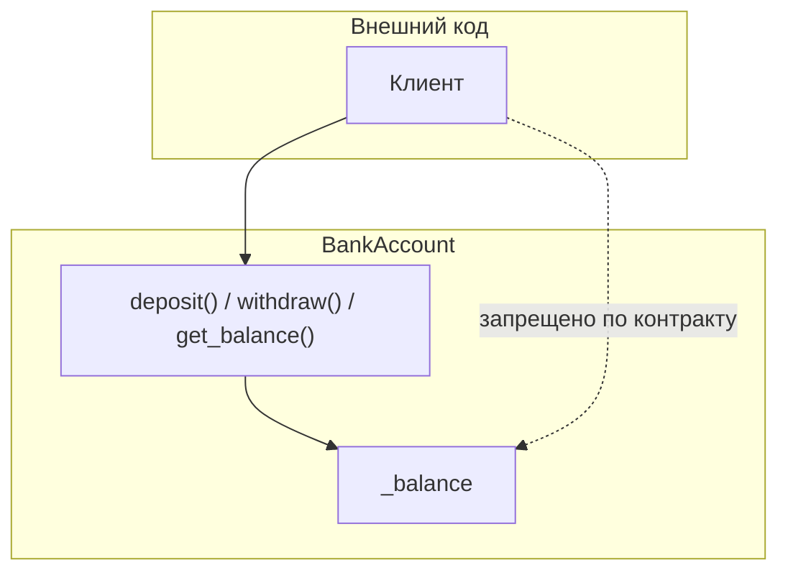
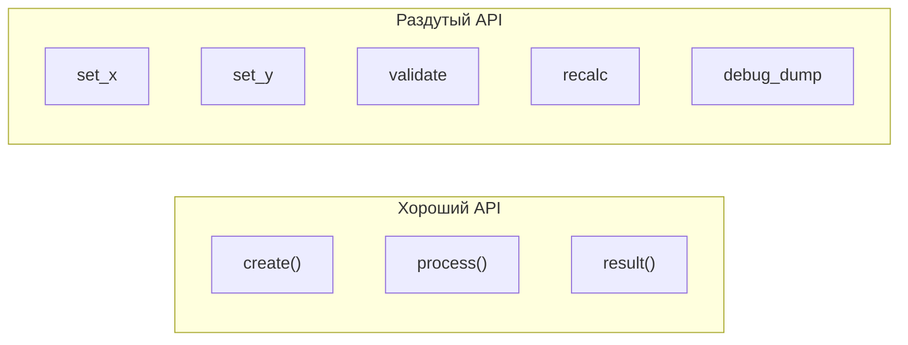

# Модуль 4: Введение в ООП. Принцип инкапсуляция

## Метаданные

| Параметр | Значение |
|----------|----------|
| Предварительные знания | [03-oop-inheritance.md](03-oop-inheritance.md) — наследование, `super()`, полиморфизм |
| Следующий модуль | [05-object-vulnerabilities.md](05-object-vulnerabilities.md) — уязвимости объектов (или продолжение блока ООП по карте курса) |
| Ориентировочное время | 2–3 часа |

## Цели обучения

1. **Объяснить** инкапсуляцию как сокрытие внутреннего состояния и предоставление контролируемого публичного API.
2. **Применять** соглашения `_protected` и `__name` (name mangling) и понимать их ограничения в Python.
3. **Проектировать** классы с явным разделением публичного интерфейса и внутренней реализации.
4. **Реализовать** валидацию изменений состояния через методы вместо прямой записи в атрибуты.
5. **Осознавать**, что инкапсуляция в Python — договорённость, а не жёсткое enforcement как в Java; `@property` изучается в [модуле 06](06-mutations-typevar.md).

## Теория

### 4.1 Что такое инкапсуляция

**Инкапсуляция** — принцип ООП, при котором:

- **Внутреннее состояние** объекта скрыто от внешнего кода.
- **Взаимодействие** происходит через **публичный API** (методы, свойства).
- **Инварианты** объекта (правила целостности) поддерживаются внутри класса.

```python
class BankAccount:
    def __init__(self, owner: str, balance: float = 0.0) -> None:
        self.owner = owner          # публичное поле — имя владельца
        self._balance = balance     # «внутреннее» — не трогать снаружи

    def deposit(self, amount: float) -> None:
        if amount <= 0:
            raise ValueError("Сумма должна быть положительной")
        self._balance += amount

    def get_balance(self) -> float:
        return self._balance
```

Снаружи нельзя написать `account._balance = 1_000_000` **по договорённости** — только через `deposit` / `withdraw`.



### 4.2 Python не имеет настоящего private

В Java/C# модификатор `private` **запрещает** доступ на уровне компилятора. В Python **всё доступно** — инкапсуляция держится на:

1. **Соглашениях** (naming conventions)
2. **Дисциплине** команды
3. **Инструментах** (`@property`, линтеры, code review)

Это **осознанный trade-off** языка: «мы взрослые разработчики».

### 4.3 Уровни видимости по соглашению

| Уровень | Синтаксис | Смысл | Пример |
|---------|-----------|-------|--------|
| Публичный | `name` | Часть API, можно использовать снаружи | `owner`, `deposit()` |
| Protected | `_name` | Внутренний; «не используй снаружи» | `_balance`, `_validate()` |
| Private (mangling) | `__name` | Имя преобразуется в `_ClassName__name` | `__token` |

**Protected** (`одно подчёркивание`) — **конвенция**, не проверяется интерпретатором:

```python
acc = BankAccount("Иван", 100)
print(acc._balance)  # технически можно — но нельзя в продакшен-коде
```

Линтеры (ruff, pylint) могут предупреждать о доступе к `_attr` извне класса.

### 4.4 Name mangling (__двойное подчёркивание)

Атрибуты вида `__attr` **переименовываются** при сохранении в `__dict__`:

```python
class SecretHolder:
    def __init__(self, token: str) -> None:
        self.__token = token  # станет _SecretHolder__token

    def reveal(self) -> str:
        return self.__token
```

```python
h = SecretHolder("abc123")
# h.__token       # AttributeError
h._SecretHolder__token  # 'abc123' — доступ возможен!
```

**Name mangling** защищает от **случайного** затенения в подклассах, а не от злоумышленника:

```python
class Base:
    def __init__(self):
        self.__x = 1

class Derived(Base):
    def __init__(self):
        super().__init__()
        self.__x = 2  # _Derived__x, не конфликтует с _Base__x
```

Используйте `__` редко — когда важно избежать коллизий имён в иерархии наследования ([модуль 3](03-oop-inheritance.md)).

### 4.5 Публичный API класса

При проектировании класса задайте вопросы:

1. **Что** должен уметь клиент класса?
2. **Какие** поля нельзя менять напрямую?
3. **Какие** инварианты всегда истинны?

Пример инварианта: баланс счёта ≥ 0.

```python
class BankAccount:
    def __init__(self, owner: str, balance: float = 0.0) -> None:
        self.owner = owner
        if balance < 0:
            raise ValueError("Начальный баланс не может быть отрицательным")
        self._balance = balance

    def withdraw(self, amount: float) -> None:
        if amount <= 0:
            raise ValueError("Сумма должна быть положительной")
        if amount > self._balance:
            raise ValueError("Недостаточно средств")
        self._balance -= amount

    def get_balance(self) -> float:
        return self._balance
```

Публичный API: `owner`, `deposit`, `withdraw`, `get_balance`.  
Внутреннее: `_balance`.

### 4.6 Методы вместо прямой записи

**Антипаттерн:**

```python
user.age = -5  # инвариант нарушен, класс не узнал
```

**Правильно:**

```python
class User:
    def __init__(self, name: str, age: int) -> None:
        self.name = name
        self._set_age(age)

    def _set_age(self, age: int) -> None:
        if age < 0 or age > 150:
            raise ValueError("Некорректный возраст")
        self._age = age

    def birthday(self) -> None:
        self._set_age(self._age + 1)

    def get_age(self) -> int:
        return self._age
```

Валидация **централизована** в `_set_age`.

### 4.7 Внутренние (private-by-convention) методы

Методы с `_` — детали реализации:

```python
class Order:
    def __init__(self, items: list[tuple[str, float]]) -> None:
        self._items = list(items)
        self._total = self._calculate_total()

    def _calculate_total(self) -> float:
        return sum(price for _, price in self._items)

    def add_item(self, name: str, price: float) -> None:
        if price < 0:
            raise ValueError("Цена не может быть отрицательной")
        self._items.append((name, price))
        self._total = self._calculate_total()

    def total(self) -> float:
        return self._total
```

Клиент вызывает `add_item` и `total`, не `_calculate_total`.

### 4.8 Инкапсуляция и наследование

Подклассы **часто** обращаются к `_protected` полям родителя:

```python
class Account:
    def __init__(self, balance: float) -> None:
        self._balance = balance

    def _apply_delta(self, delta: float) -> None:
        new_balance = self._balance + delta
        if new_balance < 0:
            raise ValueError("insufficient funds")
        self._balance = new_balance


class SavingsAccount(Account):
    def add_interest(self, rate: float) -> None:
        interest = self._balance * rate
        self._apply_delta(interest)
```

`_protected` — «для класса и наследников». `__private` в базе недоступен в подклассе по короткому имени.

### 4.9 @property — краткий обзор (углубление в модуле 06)

`@property` позволяет обращаться к методу как к **полю**, сохраняя контроль:

```python
class Temperature:
    def __init__(self, celsius: float) -> None:
        self._celsius = celsius

    @property
    def celsius(self) -> float:
        return self._celsius

    @celsius.setter
    def celsius(self, value: float) -> None:
        if value < -273.15:
            raise ValueError("Ниже абсолютного нуля")
        self._celsius = value
```

```python
t = Temperature(20)
t.celsius = 25      # вызывает setter
print(t.celsius)    # вызывает getter
```

**В этом модуле** достаточно знать, что property — идиоматичный способ инкапсуляции в Python. Подробности: валидация, read-only property, вычисляемые поля — в **[модуле 06](06-mutations-typevar.md)** и далее по курсу.

### 4.10 Инкапсуляция ≠ безопасность

Скрытие `_balance` **не защищает** от:

- Доступа `obj._balance` злоумышленником
- **Pickle**-десериализации с подменой полей
- **Многопоточных** гонок при общем изменяемом состоянии

Тема уязвимостей объектов — [05-object-vulnerabilities.md](05-object-vulnerabilities.md).  
Связь с потоками — [13-threads-async-coroutines.md](13-threads-async-coroutines.md); GIL подробнее — [16-gil.md](16-gil.md).

### 4.11 Инкапсуляция на уровне модуля

Одиночное подчёркивание у **имён модулей** (`_internal.py`) и **функций** (`def _helper()`) — тот же смысл: «внутренний API, не импортируй».

```python
from mypackage.service import PublicService  # OK
# from mypackage._db import connect  # не для клиентов
```

`__all__` в модуле явно объявляет публичный экспорт.

### 4.12 Принцип минимального интерфейса

Чем **меньше** публичных методов и полей — тем проще поддерживать класс:



Спрятанное можно менять без поломки клиентов.

### 4.13 Dataclass и инкапсуляция

`@dataclass` по умолчанию создаёт **публичные** поля — удобно для DTO, но не для сущностей с инвариантами:

```python
from dataclasses import dataclass

@dataclass
class PointDTO:
    x: float
    y: float
```

Для богатых доменных моделей — обычный класс с `_` и методами (или dataclass + `__post_init__` с валидацией).

### 4.14 Чек-лист проектирования

1. Все поля с инвариантами — `_` + методы или property (позже).
2. Публичные методы документированы; `_` методы — для внутреннего использования.
3. `__` только при риске коллизий имён в наследниках.
4. Не экспонировать изменяемые внутренние коллекции напрямую:

```python
# Плохо
return self._items  # клиент может .clear()

# Лучше
return tuple(self._items)  # или copy.copy
```

## Примеры кода

### Пример 1: Банковский счёт с _balance

```python
"""
Инкапсуляция через protected-атрибут и публичные методы.
"""


class BankAccount:
    def __init__(self, owner: str, initial: float = 0.0) -> None:
        self.owner = owner
        if initial < 0:
            raise ValueError("Начальный баланс не может быть отрицательным")
        self._balance = float(initial)

    def deposit(self, amount: float) -> None:
        if amount <= 0:
            raise ValueError("deposit must be positive")
        self._balance += amount

    def withdraw(self, amount: float) -> None:
        if amount <= 0:
            raise ValueError("withdraw must be positive")
        if amount > self._balance:
            raise ValueError("insufficient funds")
        self._balance -= amount

    def get_balance(self) -> float:
        return self._balance

    def __repr__(self) -> str:
        return f"BankAccount({self.owner!r}, balance={self._balance})"


if __name__ == "__main__":
    acc = BankAccount("Иван", 100)
    acc.deposit(50)
    acc.withdraw(30)
    print(acc, "→", acc.get_balance())
```

### Пример 2: Name mangling

```python
"""
__token — не настоящая криптозащита, а защита от случайного доступа.
"""


class SecretHolder:
    def __init__(self, token: str) -> None:
        self.__token = token

    def reveal(self) -> str:
        return self.__token

    def __repr__(self) -> str:
        return "SecretHolder(***)"


if __name__ == "__main__":
    h = SecretHolder("abc123")
    print(h.reveal())
    # print(h.__token)  # AttributeError
    print(h._SecretHolder__token)  # доступ возможен — не безопасность!
```

### Пример 3: Внутренние методы валидации

```python
"""
_validate_email — деталь реализации, не часть публичного API.
"""


class UserProfile:
    def __init__(self, username: str, email: str) -> None:
        self.username = username
        self._email = self._validate_email(email)

    def _validate_email(self, email: str) -> str:
        email = email.strip().lower()
        if "@" not in email:
            raise ValueError("invalid email")
        return email

    def change_email(self, new_email: str) -> None:
        self._email = self._validate_email(new_email)

    def get_email(self) -> str:
        return self._email


if __name__ == "__main__":
    u = UserProfile("ivan", "Ivan@Example.COM")
    print(u.get_email())
    u.change_email("ivan@mail.ru")
    print(u.get_email())
```

### Пример 4: Инкапсуляция коллекции

```python
"""
Не отдаём внутренний list напрямую.
"""


class ShoppingCart:
    def __init__(self) -> None:
        self._items: list[str] = []

    def add(self, item: str) -> None:
        if not item.strip():
            raise ValueError("empty item")
        self._items.append(item.strip())

    def items(self) -> tuple[str, ...]:
        return tuple(self._items)

    def count(self) -> int:
        return len(self._items)


if __name__ == "__main__":
    cart = ShoppingCart()
    cart.add("Книга")
    cart.add("Ручка")
    snapshot = cart.items()
    # snapshot — tuple, нельзя изменить корзину через него
    print(snapshot, cart.count())
```

### Пример 5: Наследование и _protected

```python
"""
SavingsAccount использует _apply_delta родителя.
"""


class Account:
    def __init__(self, owner: str, balance: float = 0.0) -> None:
        self.owner = owner
        self._balance = balance

    def _apply_delta(self, delta: float) -> None:
        if self._balance + delta < 0:
            raise ValueError("insufficient funds")
        self._balance += delta

    def get_balance(self) -> float:
        return self._balance


class SavingsAccount(Account):
    def add_interest(self, rate: float) -> None:
        if rate < 0:
            raise ValueError("rate must be >= 0")
        self._apply_delta(self._balance * rate)


if __name__ == "__main__":
    acc = SavingsAccount("Ольга", 1000)
    acc.add_interest(0.05)
    print(acc.get_balance())  # 1050.0
```

### Пример 6: Минимальный property (preview модуля 06)

```python
"""
Read-only property без setter — баланс только для чтения снаружи.
Подробнее — в модуле 06.
"""


class Wallet:
    def __init__(self, amount: float = 0.0) -> None:
        self._amount = amount

    @property
    def amount(self) -> float:
        """Только чтение."""
        return self._amount

    def add(self, value: float) -> None:
        if value <= 0:
            raise ValueError("value must be positive")
        self._amount += value


if __name__ == "__main__":
    w = Wallet(100)
    print(w.amount)
    w.add(50)
    print(w.amount)
    # w.amount = 200  # AttributeError: no setter
```

### Пример 7: __ для избежания коллизий в иерархии

```python
"""
Два __x в базе и наследнике — разные имена после mangling.
"""


class Engine:
    def __init__(self) -> None:
        self.__state = "idle"  # _Engine__state

    def _get_state(self) -> str:
        return self.__state


class TurboEngine(Engine):
    def __init__(self) -> None:
        super().__init__()
        self.__state = "boost"  # _TurboEngine__state

    def describe(self) -> str:
        return f"base={self._get_state()}, turbo={self.__state}"


if __name__ == "__main__":
    t = TurboEngine()
    print(t.describe())
```

## Trade-off: компромиссы

| Решение | Плюсы | Минусы | Когда выбирать |
|---------|-------|--------|----------------|
| Публичные атрибуты | Минимум кода | Нет инвариантов | DTO, скрипты, dataclass |
| `_protected` + методы | Ясный контракт, валидация | Больше boilerplate | Доменные сущности |
| `__mangling` | Защита от коллизий в наследниках | Нечитаемые имена, ложное чувство безопасности | Редко, при коллизиях |
| `get_balance()` | Явный доступ | Многословно vs property | Учебный этап, простые API |
| `@property` | Синтаксис поля + контроль | Сложнее для новичков | Идиоматичный Python (модуль 06) |
| Возврат `tuple` копии | Защита внутренней коллекции | Копирование O(n) | Внешний read-only доступ |
| Строгая инкапсуляция | Стабильный API | Сложнее тестировать «внутренности» | Публичные библиотеки |
| Всё публичное | Быстрый прототип | Технический долг | Throwaway code |

## Практические задания

### Задание 1 (базовое): Класс Counter

**Условие:** Класс `Counter` с `_value: int` (неотрицательный). Публичные методы: `increment()`, `decrement()` (не ниже 0), `get_value() -> int`. Прямое присвоение `_value` снаружи не должно быть частью API.

**Критерии приёмки:**
- `decrement()` при `_value == 0` → `ValueError`
- `increment()` увеличивает на 1
- `__repr__` показывает значение

**Подсказка:** Вся запись в `_value` только внутри методов класса.

### Задание 2 (среднее): Класс PasswordVault

**Условие:** `PasswordVault` хранит пароль в `__secret` (mangling). Методы `set_password(pwd: str)` (минимум 8 символов), `check(pwd: str) -> bool`. Публичного доступа к паролю нет.

**Критерии приёмки:**
- Короткий пароль в `set_password` → `ValueError`
- `check` возвращает `True` только при совпадении
- Нет метода `get_password`

**Подсказка:** Сравнивайте внутри `check`, не возвращайте секрет.

### Задание 3 (продвинутое): Класс Inventory

**Условие:** `Inventory` хранит `_stock: dict[str, int]`. Методы: `add(sku, qty)`, `remove(sku, qty)`, `quantity(sku) -> int`, `skus() -> tuple[str, ...]`. `remove` при нехватке товара → `ValueError`. `skus()` не даёт менять внутренний dict.

**Критерии приёмки:**
- Отрицательное `qty` в `add`/`remove` → `ValueError`
- `skus()` возвращает неизменяемый снимок ключей
- `_stock` не доступен как публичный атрибут по контракту

**Подсказка:** `return tuple(self._stock.keys())`.

## Эталонные решения

<details>
<summary>Задание 1 — Counter</summary>

```python
class Counter:
    def __init__(self, start: int = 0) -> None:
        if start < 0:
            raise ValueError("start must be >= 0")
        self._value = start

    def increment(self) -> None:
        self._value += 1

    def decrement(self) -> None:
        if self._value == 0:
            raise ValueError("counter already at zero")
        self._value -= 1

    def get_value(self) -> int:
        return self._value

    def __repr__(self) -> str:
        return f"Counter({self._value})"


if __name__ == "__main__":
    c = Counter(1)
    c.increment()
    c.decrement()
    print(c)
```

</details>

<details>
<summary>Задание 2 — PasswordVault</summary>

```python
class PasswordVault:
    def __init__(self) -> None:
        self.__secret: str | None = None

    def set_password(self, pwd: str) -> None:
        if len(pwd) < 8:
            raise ValueError("password must be at least 8 characters")
        self.__secret = pwd

    def check(self, pwd: str) -> bool:
        if self.__secret is None:
            return False
        return self.__secret == pwd


if __name__ == "__main__":
    vault = PasswordVault()
    vault.set_password("longsecret")
    print(vault.check("longsecret"), vault.check("wrong"))
```

</details>

<details>
<summary>Задание 3 — Inventory</summary>

```python
class Inventory:
    def __init__(self) -> None:
        self._stock: dict[str, int] = {}

    def add(self, sku: str, qty: int) -> None:
        if qty < 0:
            raise ValueError("qty must be >= 0")
        self._stock[sku] = self._stock.get(sku, 0) + qty

    def remove(self, sku: str, qty: int) -> None:
        if qty < 0:
            raise ValueError("qty must be >= 0")
        current = self._stock.get(sku, 0)
        if qty > current:
            raise ValueError(f"insufficient stock for {sku!r}")
        new_qty = current - qty
        if new_qty == 0:
            del self._stock[sku]
        else:
            self._stock[sku] = new_qty

    def quantity(self, sku: str) -> int:
        return self._stock.get(sku, 0)

    def skus(self) -> tuple[str, ...]:
        return tuple(self._stock.keys())


if __name__ == "__main__":
    inv = Inventory()
    inv.add("A-1", 10)
    inv.remove("A-1", 3)
    print(inv.quantity("A-1"), inv.skus())
```

</details>

## Вопросы для самопроверки

1. **Что такое инкапсуляция?**  
   *Ответ:* Сокрытие внутреннего состояния и предоставление контролируемого API для работы с объектом.

2. **Чем `_protected` отличается от `__private` в Python?**  
   *Ответ:* `_` — конвенция «внутренний»; `__` запускает name mangling в `_ClassName__attr`.

3. **Почему `__private` не обеспечивает безопасность?**  
   *Ответ:* Доступ возможен через `_ClassName__private`; Python не блокирует чтение на уровне языка.

4. **Зачем не возвращать внутренний `list` напрямую?**  
   *Ответ:* Клиент может изменить список и нарушить инварианты объекта без вызова методов класса.

5. **Когда уместен `__mangling`?**  
   *Ответ:* Когда в иерархии наследования нужно избежать затенения одноимённых «приватных» атрибутов.

6. **Чем `@property` лучше пары get/set методов?**  
   *Ответ:* Идиоматичный синтаксис доступа как к полю при сохранении валидации (подробнее в модуле 06).

7. **Инкапсуляция делает класс потокобезопасным?**  
   *Ответ:* Нет; для общего изменяемого состояния нужны примитивы синхронизации (модуль 01).

## Методические указания

### Тайминг (2–3 часа)

| Блок | Время |
|------|-------|
| Концепция инкапсуляции, уровни видимости | 40 мин |
| Name mangling, примеры | 30 мин |
| Публичный API, защита коллекций | 25 мин |
| Практика | 55 мин |
| Самопроверка, preview property | 20 мин |

### Типичные ошибки

1. **Вера в «настоящий private»** — студенты думают, что `__` шифрует данные.
2. **Публичная мутабельная коллекция** — `self.items = []` и `return self.items`.
3. **Валидация только в `__init__`** — поля меняют через публичные атрибуты в обход.
4. **Избыточный `__mangling`** везде — код становится нечитаемым.
5. **Смешение `_` и отсутствия методов** — `_balance` публично читают и пишут в тестах «для удобства».

### Демонстрация

1. `SecretHolder` и доступ к `_SecretHolder__token`.
2. Сломайте инвариант: `acc._balance = -100` после `BankAccount`.
3. Покажите preview `@property` read-only.

### Связь с курсом

- [Модуль 1](01-oop-classes-objects.md) — базовые классы.
- [Модуль 3](03-oop-inheritance.md) — `_protected` в иерархии.
- [Модуль 06](06-mutations-typevar.md) — `@property`, setters, дескрипторы.
- [Модуль 05](05-object-vulnerabilities.md) — pickle, `__eq__`, мутабельные дефолты.

### FAQ

**Нужно ли писать get/set для каждого поля?**  
Нет; публичные неизменяемые поля (`owner`) допустимы; инкапсулируйте то, что имеет инварианты.

**Ruff ругается на доступ к `_attr`?**  
Это нормально; соблюдайте контракт в своём коде, не в тестах чужих `_` без нужды.

## Дополнительные материалы

- [Документация: private variables](https://docs.python.org/3/tutorial/classes.html#private-variables)
- [PEP 8 — Naming Conventions](https://peps.python.org/pep-0008/#designing-for-the-user)
- [Real Python: Encapsulation in Python](https://realpython.com/python-properties/)
- [Документация: `@property`](https://docs.python.org/3/library/functions.html#property) — углубление в модуле 06
- [Модуль 05: уязвимости объектов](05-object-vulnerabilities.md)
- [Модуль 06: property и типизация](06-mutations-typevar.md)
- [Предыдущий модуль: наследование](03-oop-inheritance.md)
