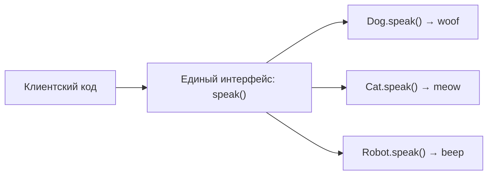

# Модуль 5: Введение в ООП. Принцип полиморфизм

> Единый интерфейс — разное поведение: утиная типизация, наследование, абстрактные базовые классы и проектирование контрактов в Python 3.11+.

## Метаданные

| Параметр | Значение |
|----------|----------|
| Номер модуля | 05 |
| Название | Введение в ООП. Принцип полиморфизм |
| Предварительные знания | [04-oop-encapsulation.md](04-oop-encapsulation.md) — классы, `__init__`, инкапсуляция, соглашения `_protected` / `__private` |
| Следующий модуль | [06-oop-getters-setters.md](06-oop-getters-setters.md) — сеттеры и геттеры, `@property` |
| Ориентировочное время | 4–5 часов |
| Версия Python | 3.11+ |
| Сложность | Базовая → средняя |

## Цели обучения

После прохождения модуля студент сможет:

1. **Объяснить** полиморфизм как принцип ООП: один интерфейс, множество реализаций.
2. **Применять** утиную типизацию (*duck typing*): вызывать методы по контракту поведения, а не по иерархии типов.
3. **Реализовать** полиморфизм через наследование и переопределение методов с корректным `super()`.
4. **Проектировать** абстрактные базовые классы (`abc.ABC`, `@abstractmethod`) для явных контрактов.
5. **Выбирать** между утиной типизацией, ABC и (в перспективе) `Protocol` — и **обосновать** выбор.
6. **Писать** полиморфный код, совместимый с тестовыми дублёрами (*test doubles*) и dependency injection.

## Теория

### 5.1. Что такое полиморфизм

**Полиморфизм** (от греч. «много форм») — способность единого интерфейса работать с объектами разных типов, каждый из которых реализует поведение по-своему.

В Python полиморфизм проявляется на нескольких уровнях:

| Уровень | Механизм | Пример |
|---------|----------|--------|
| Встроенный | Dunder-методы | `len(x)` вызывает `x.__len__()` |
| Утиная типизация | Наличие метода | `obj.write(data)` без общего базового класса |
| Наследование | Переопределение | `Dog.speak()` vs `Cat.speak()` |
| ABC | Явный контракт | `@abstractmethod def save()` |



Полиморфизм не требует общего предка — достаточно, чтобы объект «умел» нужное действие. Это фундаментальное отличие Python от языков со строгой номинальной типизацией (Java, C#).

### 5.2. Связь с инкапсуляцией

В [модуле 04](04-oop-encapsulation.md) вы скрывали внутреннее состояние и предоставляли публичный API. Полиморфизм расширяет эту идею: **публичный API может быть одинаковым у разных классов**, а реализация — разной.

```python
class FileLogger:
    def log(self, message: str) -> None:
        with open("app.log", "a", encoding="utf-8") as f:
            f.write(message + "\n")


class ConsoleLogger:
    def log(self, message: str) -> None:
        print(message)


def process(loggers: list, event: str) -> None:
    for logger in loggers:
        logger.log(f"[EVENT] {event}")  # полиморфный вызов
```

Функция `process` не знает конкретный тип логгера — ей важен метод `log`. Это **полиморфизм без наследования**.

### 5.3. Утиная типизация

> *If it walks like a duck and quacks like a duck, it's a duck.*

**Утиная типизация** — объект считается подходящим, если он реализует нужное поведение, независимо от объявленной иерархии классов.

```python
class EmailSender:
    def send(self, to: str, body: str) -> None:
        print(f"Email to {to}: {body}")


class SmsSender:
    def send(self, to: str, body: str) -> None:
        print(f"SMS to {to}: {body[:160]}")


class Notifier:
    def __init__(self, sender) -> None:
        self._sender = sender  # любой объект с методом send()

    def notify(self, recipient: str, text: str) -> None:
        self._sender.send(recipient, text)
```

**Плюсы утиной типизации:**

- Минимум связности (*coupling*) между модулями.
- Легко подставить mock/stub в тестах.
- Не нужно наследовать «ради галочки».

**Минусы:**

- Ошибки обнаруживаются только в runtime (`AttributeError`).
- IDE и статические анализаторы слабее подсказывают контракт.
- Документация контракта ложится на разработчика.

### 5.4. Полиморфизм через наследование

Классический подход: базовый класс задаёт интерфейс, подклассы переопределяют методы.

```python
class Animal:
    def speak(self) -> str:
        raise NotImplementedError("subclass must implement speak()")

    def describe(self) -> str:
        return f"I am {self.__class__.__name__} and I say: {self.speak()}"


class Dog(Animal):
    def speak(self) -> str:
        return "woof"


class Cat(Animal):
    def speak(self) -> str:
        return "meow"
```

Метод `describe` — **шаблонный метод** (*template method*): общий алгоритм в базовом классе, детали — в подклассах. Это полиморфизм «по наследованию».

```python
def announce(animal: Animal) -> None:
    print(animal.speak())


announce(Dog())  # woof
announce(Cat())  # meow
```

**Важно:** аннотация `animal: Animal` — подсказка для читателя и mypy; в runtime Python примет любой объект с методом `speak()`.

### 5.5. `NotImplementedError` vs абстрактные методы

`raise NotImplementedError` в базовом методе — **соглашение**, не защита:

```python
repo = Animal()       # объект создаётся!
repo.speak()          # NotImplementedError только при вызове
```

Для **жёсткого контракта** используйте модуль `abc` (см. §5.7).

### 5.6. Переопределение и `super()`

При переопределении метода часто нужно **расширить**, а не полностью заменить поведение базового класса:

```python
class Employee:
    def __init__(self, name: str, base_salary: float) -> None:
        self.name = name
        self.base_salary = base_salary

    def total_pay(self) -> float:
        return self.base_salary


class Manager(Employee):
    def __init__(self, name: str, base_salary: float, bonus: float) -> None:
        super().__init__(name, base_salary)
        self.bonus = bonus

    def total_pay(self) -> float:
        return super().total_pay() + self.bonus
```

`super().total_pay()` — полиморфный вызов «следующего» класса в MRO. Подробнее о MRO — в модуле 13; здесь достаточно помнить: **всегда вызывайте `super().__init__()` в дочерних классах**.

Полиморфная коллекция:

```python
staff: list[Employee] = [
    Employee("Анна", 80_000),
    Manager("Борис", 100_000, 20_000),
]

for emp in staff:
    print(emp.name, emp.total_pay())  # разное поведение total_pay()
```

### 5.7. Абстрактные базовые классы (ABC)

Модуль `abc` фиксирует контракт **на этапе создания класса**:

```python
from abc import ABC, abstractmethod


class Repository(ABC):
    @abstractmethod
    def get(self, id: int) -> dict | None:
        """Вернуть сущность по id или None."""

    @abstractmethod
    def save(self, entity: dict) -> None:
        """Сохранить сущность."""
```

**Правила ABC:**

1. Нельзя создать экземпляр класса с нереализованными `@abstractmethod`.
2. Подкласс **обязан** реализовать все абстрактные методы.
3. `isinstance(obj, Repository)` работает для зарегистрированных реализаций.

```python
class MemoryRepository(Repository):
    def __init__(self) -> None:
        self._store: dict[int, dict] = {}

    def get(self, id: int) -> dict | None:
        return self._store.get(id)

    def save(self, entity: dict) -> None:
        self._store[entity["id"]] = entity


# repo = Repository()  # TypeError: Can't instantiate abstract class
repo = MemoryRepository()
repo.save({"id": 1, "name": "Мария"})
```


### 5.9. `isinstance`, `issubclass` и полиморфизм

```python
def handle(repo: Repository) -> None:
    if isinstance(repo, MemoryRepository):
        print("in-memory backend")
    repo.save({"id": 42, "name": "test"})


issubclass(MemoryRepository, Repository)  # True
```

| Функция | Назначение | Когда использовать |
|---------|------------|-------------------|
| `isinstance(obj, cls)` | Проверка типа экземпляра | Ветвление по реализации (редко) |
| `issubclass(cls, base)` | Проверка иерархии | Метапрограммирование, фреймворки |

**Антипаттерн:** цепочки `if isinstance(...)` вместо полиморфного вызова — признак нарушения Open/Closed Principle. Предпочитайте вызов метода на объекте.

## Примеры кода

### Пример 1. Иерархия фигур с полиморфным `area()`

```python
"""
Полиморфизм через наследование: общая функция total_area.
"""
import math
from abc import ABC, abstractmethod


class Shape(ABC):
    @abstractmethod
    def area(self) -> float:
        ...

    def describe(self) -> str:
        return f"{self.__class__.__name__}: area={self.area():.2f}"


class Circle(Shape):
    def __init__(self, radius: float) -> None:
        if radius <= 0:
            raise ValueError("radius must be positive")
        self.radius = radius

    def area(self) -> float:
        return math.pi * self.radius ** 2


class Rectangle(Shape):
    def __init__(self, width: float, height: float) -> None:
        if width <= 0 or height <= 0:
            raise ValueError("sides must be positive")
        self.width = width
        self.height = height

    def area(self) -> float:
        return self.width * self.height


def total_area(shapes: list[Shape]) -> float:
    return sum(s.area() for s in shapes)


if __name__ == "__main__":
    shapes: list[Shape] = [Circle(3), Rectangle(4, 5)]
    for s in shapes:
        print(s.describe())
    print("Total:", total_area(shapes))
```

### Пример 2. ABC репозитория и сервисный слой

```python
"""
Порты и адаптеры: UserService зависит от абстракции Repository.
"""
from abc import ABC, abstractmethod


class UserRepository(ABC):
    @abstractmethod
    def get_by_id(self, user_id: int) -> dict | None:
        ...

    @abstractmethod
    def save(self, user: dict) -> None:
        ...


class InMemoryUserRepository(UserRepository):
    def __init__(self) -> None:
        self._store: dict[int, dict] = {}

    def get_by_id(self, user_id: int) -> dict | None:
        return self._store.get(user_id)

    def save(self, user: dict) -> None:
        self._store[user["id"]] = user


class UserService:
    def __init__(self, repo: UserRepository) -> None:
        self._repo = repo

    def register(self, user_id: int, name: str) -> dict:
        if self._repo.get_by_id(user_id) is not None:
            raise ValueError(f"user {user_id} already exists")
        user = {"id": user_id, "name": name}
        self._repo.save(user)
        return user

    def get(self, user_id: int) -> dict | None:
        return self._repo.get_by_id(user_id)


if __name__ == "__main__":
    service = UserService(InMemoryUserRepository())
    print(service.register(1, "Мария"))
    print(service.get(1))
```

## Trade-off: компромиссы

| Решение | Плюсы | Минусы | Когда выбирать |
|---------|-------|--------|----------------|
| Утиная типизация | Гибкость, мало boilerplate | Ошибки в runtime, слабая IDE-подсказка | Прототипы, малые модули, тестовые дубли |
| Наследование + override | Явная иерархия, переиспользование кода | Жёсткая связь, хрупкие деревья | Чёткое отношение is-a |
| ABC | Контракт при создании класса, `isinstance` | Накладные расходы, номинальная привязка | Порты, плагины, публичные API библиотек |
| `NotImplementedError` | Простота | Экземпляр базового класса создаётся | Внутренние базовые классы, быстрые скетчи |
| `isinstance`-ветвление | Явный контроль особых случаев | Нарушает OCP, раздувает функции | Только на границах системы (сериализация) |
| `Protocol` (typing) | Структурная типизация + mypy | Нет runtime-проверки без `@runtime_checkable` | Современные typed-проекты |

## Практические задания

### Задание 1 (базовое). Полиморфные животные

**Условие:** Создайте классы `Dog`, `Cat`, `Cow` **без** общего базового класса, каждый с методом `speak() -> str`. Напишите функцию `chorus(animals)` которая печатает результат `speak()` для каждого объекта.

**Критерии:** Работает с разными типами в одном списке; не используется `isinstance`.

**Подсказка:** Утиная типизация — достаточно общего метода.

### Задание 2 (среднее). ABC `Exporter` и реализации

**Условие:** ABC `Serializer` с `@abstractmethod dumps(data: dict) -> str` и `loads(s: str) -> dict`. Реализуйте `JsonSerializer` и `YamlSerializer` (для YAML можно использовать `yaml` из PyYAML или упрощённый формат `key=value` построчно). Функция `persist(serializer, data)` возвращает строку.

**Критерии:** Нельзя создать `Serializer()`; round-trip `loads(dumps(x)) == x` для JSON.

**Подсказка:** `import json`, `from abc import ABC, abstractmethod`.

### Задание 3 (продвинутое). OrderService с полиморфным платежом

**Условие:** ABC `PaymentGateway` с `charge(amount) -> str`. Реализации `SuccessGateway` и `DeclinedGateway` (второй бросает `PaymentError`). `OrderService(gateway)` с методом `checkout(order_id, amount, email)` — при успехе возвращает transaction id; при ошибке — пробрасывает исключение без побочных эффектов. Добавьте `AuditLogger` (утиная типизация) с методом `record(event: str)`; `OrderService` принимает опциональный logger и пишет события.

**Критерии:** Композиция; тест с `FakeGateway` проверяет список вызовов; при `DeclinedGateway` audit не содержит "success".

**Подсказка:** Свяжите с примером 7; исключение — свой класс `PaymentError(Exception)`.

## Эталонные решения

<details>
<summary>Задание 1 — chorus</summary>

```python
class Dog:
    def speak(self) -> str:
        return "woof"


class Cat:
    def speak(self) -> str:
        return "meow"


class Cow:
    def speak(self) -> str:
        return "moo"


def chorus(animals) -> None:
    for animal in animals:
        print(animal.speak())


if __name__ == "__main__":
    chorus([Dog(), Cat(), Cow()])
```

</details>

<details>
<summary>Задание 2 — Serializer</summary>

```python
import json
from abc import ABC, abstractmethod


class Serializer(ABC):
    @abstractmethod
    def dumps(self, data: dict) -> str:
        ...

    @abstractmethod
    def loads(self, s: str) -> dict:
        ...


class JsonSerializer(Serializer):
    def dumps(self, data: dict) -> str:
        return json.dumps(data, ensure_ascii=False)

    def loads(self, s: str) -> dict:
        return json.loads(s)


class SimpleKvSerializer(Serializer):
    def dumps(self, data: dict) -> str:
        return "\n".join(f"{k}={v}" for k, v in data.items())

    def loads(self, s: str) -> dict:
        result = {}
        for line in s.strip().splitlines():
            if not line:
                continue
            k, v = line.split("=", 1)
            result[k] = v
        return result


def persist(serializer: Serializer, data: dict) -> str:
    return serializer.dumps(data)


if __name__ == "__main__":
    js = JsonSerializer()
    original = {"id": 1, "name": "test"}
    assert js.loads(persist(js, original)) == original
    print("OK")
```

</details>

<details>
<summary>Задание 3 — OrderService</summary>

```python
from abc import ABC, abstractmethod


class PaymentError(Exception):
    pass


class PaymentGateway(ABC):
    @abstractmethod
    def charge(self, amount: float) -> str:
        ...


class SuccessGateway(PaymentGateway):
    def charge(self, amount: float) -> str:
        return f"tx-{amount:.2f}"


class DeclinedGateway(PaymentGateway):
    def charge(self, amount: float) -> str:
        raise PaymentError("declined")


class FakeGateway(PaymentGateway):
    def __init__(self) -> None:
        self.amounts: list[float] = []

    def charge(self, amount: float) -> str:
        self.amounts.append(amount)
        return f"fake-{amount}"


class AuditLogger:
    def __init__(self) -> None:
        self.events: list[str] = []

    def record(self, event: str) -> None:
        self.events.append(event)


class OrderService:
    def __init__(self, gateway: PaymentGateway, logger: AuditLogger | None = None) -> None:
        self._gateway = gateway
        self._logger = logger

    def checkout(self, order_id: str, amount: float, email: str) -> str:
        if self._logger:
            self._logger.record(f"checkout started {order_id}")
        try:
            tx = self._gateway.charge(amount)
        except PaymentError:
            if self._logger:
                self._logger.record(f"checkout failed {order_id}")
            raise
        if self._logger:
            self._logger.record(f"checkout success {order_id} {tx}")
        return tx


if __name__ == "__main__":
    audit = AuditLogger()
    svc = OrderService(SuccessGateway(), audit)
    print(svc.checkout("O1", 10.0, "a@b.c"))
    assert any("success" in e for e in audit.events)

    audit2 = AuditLogger()
    bad = OrderService(DeclinedGateway(), audit2)
    try:
        bad.checkout("O2", 1.0, "a@b.c")
    except PaymentError:
        pass
    assert not any("success" in e for e in audit2.events)
```

</details>

## Вопросы для самопроверки

1. **Что такое полиморфизм своими словами?**  
   *Ответ:* Один интерфейс (метод, функция, операция) — разные реализации в зависимости от типа объекта.

2. **Чем утиная типизация отличается от наследования?**  
   *Ответ:* Утиная типизация смотрит на наличие методов; наследование — на объявленную иерархию классов.

3. **Почему `Repository()` с `@abstractmethod` падает с TypeError?**  
   *Ответ:* ABC нельзя инстанцировать, пока не реализованы все абстрактные методы.

4. **Когда `NotImplementedError` недостаточно?**  
   *Ответ:* Когда нужно запретить создание экземпляра базового класса и зафиксировать контракт для всех подклассов.

5. **Зачем полиморфизм в тестах?**  
   *Ответ:* Подмена реальных зависимостей (БД, API) на fake/mock с тем же интерфейсом.

6. **Почему длинные цепочки `isinstance` — плохой знак?**  
   *Ответ:* Логика размазана по условиям вместо делегирования объекту; сложно расширять без изменения функции.

7. **Как связаны инкапсуляция (модуль 04) и полиморфизм?**  
   *Ответ:* Инкапсуляция скрывает детали; полиморфизм унифицирует публичный API разных реализаций.

## Методические указания

### Тайминг

| Блок | Время |
|------|-------|
| Понятие полиморфизма, утиная типизация | 40 мин |
| Наследование и переопределение | 35 мин |
| ABC, abstractmethod | 45 мин |
| Примеры 1–4 (live coding) | 40 мин |
| Практика (задания 1–3) | 80 мин |
| Самопроверка, обсуждение trade-offs | 20 мин |

### Типичные ошибки

1. Создание глубокой иерархии «ради полиморфизма» — достаточно утиной типизации или ABC.
2. Забытая реализация `@abstractmethod` — `TypeError` при первом `MyRepo()`.
3. Проверка `type(x) == Dog` вместо полиморфного вызова или `isinstance` при необходимости.
4. Смешение полиморфизма с композицией: наследование от `SmtpClient` вместо has-a.
5. ABC для каждого мелкого класса — избыточный boilerplate.

### FAQ

**Нужно ли наследовать ABC, если класс и так реализует методы?**  
Для внутреннего кода — нет. Для публичного API библиотеки или порта в hexagonal architecture — да.

**Protocol или ABC?**  
ABC — runtime + номинальный стиль; Protocol — статическая проверка без обязательного наследования. Подробнее в модуле 07-protocols.

**Полиморфизм и производительность?**  
Виртуальные вызовы в Python дороже прямых, но на практике узкое место редко здесь; измеряйте профайлером.

### Порядок подачи

1. Утиная типизация (интуитивно, без иерархий).
2. Наследование как способ разделить общий и особенный код.
3. ABC как «контракт с зубами».
4. Связь с тестированием и DI.

## Дополнительные материалы

- [Документация `abc`](https://docs.python.org/3/library/abc.html)
- [PEP 3119 — Abstract Base Classes](https://peps.python.org/pep-3119/)
- [Python Data Model — специальные методы](https://docs.python.org/3/reference/datamodel.html)
- [Модуль 04: инкапсуляция](04-oop-encapsulation.md)
- [Модуль 06: @property](06-oop-getters-setters.md)
- *Fluent Python*, 2nd ed. — глава о интерфейсах и протоколах
