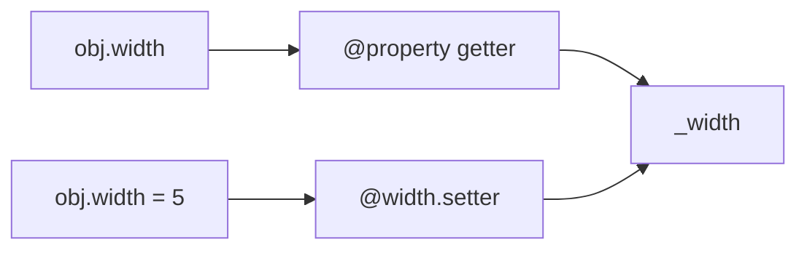

# Модуль 6: Введение в ООП. Сеттеры и геттеры в классах

> Контролируемый доступ к атрибутам: `@property`, getter/setter/deleter, вычисляемые поля и идиоматичная инкапсуляция в Python 3.11+.

## Метаданные

| Параметр | Значение |
|----------|----------|
| Номер модуля | 06 |
| Название | Введение в ООП. Сеттеры и геттеры в классах |
| Предварительные знания | [05-oop-polymorphism.md](05-oop-polymorphism.md); [04-oop-encapsulation.md](04-oop-encapsulation.md) — инкапсуляция, `_protected` |
| Следующий модуль | [07-oop-decorators.md](07-oop-decorators.md) — декораторы, `@classmethod`, `@staticmethod` |
| Ориентировочное время | 4–5 часов |
| Версия Python | 3.11+ |
| Сложность | Базовая → средняя |

## Цели обучения

После прохождения модуля студент сможет:

1. **Объяснить** разницу между публичным атрибутом, «ручными» getter/setter и `@property`.
2. **Реализовать** read-only, read-write и вычисляемые свойства через декоратор `@property`.
3. **Добавлять** валидацию в setter без изменения внешнего API класса.
4. **Использовать** deleter (`@name.deleter`) для контролируемого удаления атрибута.
5. **Применять** `property()` как функцию для сложных случаев (дескрипторы, наследование).
6. **Избегать** типичных ошибок: рекурсия в setter, несогласованность `_attr` и `attr`, лишние getter там, где достаточно публичного поля.

## Теория

### 6.1. Зачем нужны геттеры и сеттеры

В языках вроде Java поля часто **приватные**, а доступ — через методы:

```java
// Java (для сравнения)
public class Account {
    private double balance;

    public double getBalance() { return balance; }
    public void setBalance(double v) {
        if (v < 0) throw new IllegalArgumentException();
        balance = v;
    }
}
```

В Python **нет** настоящего `private`. Инкапсуляция строится на:

- соглашении `_balance` (внутренний атрибут);
- публичном API через методы или **property**.

Цели контролируемого доступа:

| Цель | Пример |
|------|--------|
| Валидация | Стороны прямоугольника > 0 |
| Инварианты | Баланс не отрицательный |
| Вычисляемое значение | `area` из `width` и `height` |
| Совместимость API | Поле стало вычисляемым — внешний код не меняется |
| Read-only | `balance` только для чтения снаружи |

### 6.2. Наивный подход: методы `get_*` / `set_*`

```python
class Temperature:
    def __init__(self, celsius: float) -> None:
        self.set_celsius(celsius)

    def get_celsius(self) -> float:
        return self._celsius

    def set_celsius(self, value: float) -> None:
        if value < -273.15:
            raise ValueError("below absolute zero")
        self._celsius = value
```

Работает, но **не идиоматично** для Python: вызов `t.get_celsius()` шумнее, чем `t.celsius`. К тому же нельзя пройтись по атрибутам единообразно.

### 6.3. `@property` — геттер

Декоратор `@property` превращает метод в **дескриптор**, доступный как атрибут:

```python
class Circle:
    def __init__(self, radius: float) -> None:
        self.radius = radius  # вызовет setter ниже

    @property
    def radius(self) -> float:
        return self._radius

    @radius.setter
    def radius(self, value: float) -> None:
        if value <= 0:
            raise ValueError("radius must be positive")
        self._radius = value

    @property
    def area(self) -> float:
        import math
        return math.pi * self._radius ** 2
```

Снаружи: `c.radius`, `c.area` — как поля. Внутри: валидация и вычисления.



### 6.4. Setter: `@имя.setter`

Имя setter-декоратора **должно совпадать** с именем property:

```python
@property
def width(self) -> float:
    return self._width

@width.setter
def width(self, value: float) -> None:
    if value <= 0:
        raise ValueError("width must be positive")
    self._width = value
```

**Ошибка новичка:** присвоение `self.width = value` внутри setter `width` вызывает **рекурсию**. Используйте `self._width`.

### 6.5. Read-only property

Property **без** setter — только чтение:

```python
class BankAccount:
    def __init__(self, owner: str, initial: float = 0.0) -> None:
        self.owner = owner
        self._balance = float(initial)

    @property
    def balance(self) -> float:
        return self._balance

    def deposit(self, amount: float) -> None:
        if amount <= 0:
            raise ValueError("amount must be positive")
        self._balance += amount
```

Попытка `acc.balance = 100` → `AttributeError: can't set attribute`.

Изменение баланса — только через методы `deposit` / `withdraw` (инвариант сохраняется).

### 6.6. Deleter: `@имя.deleter`

Редко, но полезно для ресурсов и кэшей:

```python
class CachedProfile:
    def __init__(self, user_id: int) -> None:
        self.user_id = user_id
        self._cache: dict | None = None

    @property
    def data(self) -> dict:
        if self._cache is None:
            self._cache = {"id": self.user_id, "name": "loaded"}
        return self._cache

    @data.deleter
    def data(self) -> None:
        self._cache = None  # инвалидация кэша


profile = CachedProfile(1)
_ = profile.data
del profile.data  # вызывает deleter
```

### 6.7. Вычисляемые и кэшируемые свойства

**Вычисляемое** — каждый раз заново:

```python
@property
def perimeter(self) -> float:
    return 2 * (self.width + self.height)
```

**Кэшируемое** — `functools.cached_property` (Python 3.8+):

```python
from functools import cached_property

class DataLoader:
    def __init__(self, path: str) -> None:
        self.path = path

    @cached_property
    def content(self) -> str:
        from pathlib import Path
        return Path(self.path).read_text(encoding="utf-8")
```

Первый доступ читает файл; последующие — из кэша экземпляра. Отличие от `@property`: значение **записывается** в `__dict__` экземпляра.


### 6.10. Когда НЕ нужен property

| Ситуация | Рекомендация |
|----------|--------------|
| DTO, dataclass без инвариантов | Публичные поля |
| Операция с побочным эффектом | Метод `calculate_tax()`, не `tax` |
| Тяжёлое вычисление без кэша | Метод или `cached_property` |
| Простой скрипт | Не усложняйте |

**Правило:** property для **логических атрибутов** — значение, которое *есть* у объекта, возможно вычисляемое из других полей.


## Примеры кода

### Пример 1. Банковский счёт (read-only balance)

```python
"""
Баланс доступен только для чтения; изменения через методы.
"""


class BankAccount:
    def __init__(self, owner: str, initial: float = 0.0) -> None:
        self.owner = owner
        self._balance = float(initial)

    @property
    def balance(self) -> float:
        return self._balance

    def deposit(self, amount: float) -> None:
        if amount <= 0:
            raise ValueError("deposit must be positive")
        self._balance += amount

    def withdraw(self, amount: float) -> None:
        if amount <= 0:
            raise ValueError("withdraw must be positive")
        if amount > self._balance:
            raise ValueError("insufficient funds")
        self._balance -= amount

    def __repr__(self) -> str:
        return f"BankAccount({self.owner!r}, balance={self._balance})"


if __name__ == "__main__":
    acc = BankAccount("Иван", 100)
    acc.deposit(50)
    acc.withdraw(30)
    print(acc, acc.balance)
```

### Пример 2. Rectangle с валидацией сторон

```python
"""
Стороны через property с setter; area и perimeter — вычисляемые.
"""


class Rectangle:
    def __init__(self, width: float, height: float) -> None:
        self.width = width
        self.height = height

    @property
    def width(self) -> float:
        return self._width

    @width.setter
    def width(self, value: float) -> None:
        if value <= 0:
            raise ValueError("width must be positive")
        self._width = value

    @property
    def height(self) -> float:
        return self._height

    @height.setter
    def height(self, value: float) -> None:
        if value <= 0:
            raise ValueError("height must be positive")
        self._height = value

    @property
    def area(self) -> float:
        return self.width * self.height

    @property
    def perimeter(self) -> float:
        return 2 * (self.width + self.height)

    def scale(self, factor: float) -> None:
        if factor <= 0:
            raise ValueError("factor must be positive")
        self.width *= factor
        self.height *= factor

    def __repr__(self) -> str:
        return f"Rectangle({self.width}x{self.height})"


if __name__ == "__main__":
    r = Rectangle(3, 4)
    print(r, "area=", r.area)
    r.scale(2)
    print(r)
```

### Пример 3. Температура Celsius / Fahrenheit

```python
"""
Два представления одного состояния через взаимосвязанные property.
"""


class Temperature:
    def __init__(self, celsius: float) -> None:
        self.celsius = celsius

    @property
    def celsius(self) -> float:
        return self._celsius

    @celsius.setter
    def celsius(self, value: float) -> None:
        if value < -273.15:
            raise ValueError("below absolute zero")
        self._celsius = value

    @property
    def fahrenheit(self) -> float:
        return self._celsius * 9 / 5 + 32

    @fahrenheit.setter
    def fahrenheit(self, value: float) -> None:
        self.celsius = (value - 32) * 5 / 9


if __name__ == "__main__":
    t = Temperature(0)
    print(t.celsius, t.fahrenheit)
    t.fahrenheit = 100
    print(t.celsius)
```

## Trade-off: компромиссы

| Решение | Плюсы | Минусы | Когда выбирать |
|---------|-------|--------|----------------|
| Публичные атрибуты | Простота | Нет инвариантов | DTO, скрипты |
| `get_*` / `set_*` | Явность | Неидиоматично в Python | Портирование Java-кода |
| `@property` | Чистый синтаксис, валидация | Больше кода | Доменные модели |
| Read-only property | Защита состояния | Нужны методы для изменений | balance, id |
| `cached_property` | Ленивость, кэш | Состояние в `__dict__` | Дорогие вычисления |
| `property()` factory | DRY для похожих полей | Сложнее отладка | Генерация полей |

## Практические задания

### Задание 1 (базовое). Класс `Person`

**Условие:** `Person(first_name, last_name)`. Property `full_name` (read-only) возвращает `"Имя Фамилия"`. Property `age` с setter: только целые 0–150.

**Критерии:** `full_name` нельзя присвоить; невалидный `age` → `ValueError`.

**Подсказка:** Храните `_age`, `_first_name`, `_last_name`.

### Задание 2 (среднее). `Temperature` с Kelvin

**Условие:** Расширьте пример 3: добавьте property `kelvin` с getter и setter. Минимум 0 K.

**Критерии:** Установка `t.kelvin = 273.15` даёт `celsius == 0`; отрицательный kelvin — исключение.

**Подсказка:** `kelvin = celsius + 273.15`.

### Задание 3 (продвинутое). `Product` с ценой и скидкой

**Условие:** `Product(name, price, discount_percent=0)`. Property `price` и `discount_percent` с валидацией (price > 0, discount 0–100). Read-only `final_price` с учётом скидки. Метод `apply_coupon(extra_percent)` увеличивает скидку, но итог не ниже 50% от цены (floor).

**Критерии:** `final_price` только getter; инварианты при всех операциях.

**Подсказка:** `final_price = price * (1 - discount/100)` с проверкой floor.

## Эталонные решения

<details>
<summary>Задание 1 — Person</summary>

```python
class Person:
    def __init__(self, first_name: str, last_name: str, age: int) -> None:
        self._first_name = first_name
        self._last_name = last_name
        self.age = age

    @property
    def full_name(self) -> str:
        return f"{self._first_name} {self._last_name}"

    @property
    def age(self) -> int:
        return self._age

    @age.setter
    def age(self, value: int) -> None:
        if not isinstance(value, int) or not 0 <= value <= 150:
            raise ValueError("age must be int 0..150")
        self._age = value


if __name__ == "__main__":
    p = Person("Иван", "Петров", 30)
    print(p.full_name)
    p.age = 31
```

</details>

<details>
<summary>Задание 2 — Temperature + Kelvin</summary>

```python
class Temperature:
    def __init__(self, celsius: float = 0.0) -> None:
        self.celsius = celsius

    @property
    def celsius(self) -> float:
        return self._celsius

    @celsius.setter
    def celsius(self, value: float) -> None:
        if value < -273.15:
            raise ValueError("below absolute zero")
        self._celsius = value

    @property
    def kelvin(self) -> float:
        return self._celsius + 273.15

    @kelvin.setter
    def kelvin(self, value: float) -> None:
        if value < 0:
            raise ValueError("kelvin cannot be negative")
        self.celsius = value - 273.15

    @property
    def fahrenheit(self) -> float:
        return self._celsius * 9 / 5 + 32

    @fahrenheit.setter
    def fahrenheit(self, value: float) -> None:
        self.celsius = (value - 32) * 5 / 9


if __name__ == "__main__":
    t = Temperature()
    t.kelvin = 273.15
    assert t.celsius == 0.0
```

</details>

<details>
<summary>Задание 3 — Product</summary>

```python
class Product:
    def __init__(self, name: str, price: float, discount_percent: float = 0.0) -> None:
        self.name = name
        self.price = price
        self.discount_percent = discount_percent

    @property
    def price(self) -> float:
        return self._price

    @price.setter
    def price(self, value: float) -> None:
        if value <= 0:
            raise ValueError("price must be positive")
        self._price = value

    @property
    def discount_percent(self) -> float:
        return self._discount

    @discount_percent.setter
    def discount_percent(self, value: float) -> None:
        if not 0 <= value <= 100:
            raise ValueError("discount 0..100")
        self._discount = value

    @property
    def final_price(self) -> float:
        raw = self._price * (1 - self._discount / 100)
        floor = self._price * 0.5
        return max(raw, floor)

    def apply_coupon(self, extra_percent: float) -> None:
        if extra_percent < 0:
            raise ValueError("coupon cannot be negative")
        self.discount_percent = min(100.0, self.discount_percent + extra_percent)


if __name__ == "__main__":
    p = Product("Book", 1000, 10)
    print(p.final_price)
    p.apply_coupon(50)
    print(p.final_price)  # не ниже 500
```

</details>

## Вопросы для самопроверки

1. **Чем `@property` лучше пары `get_x`/`set_x` в Python?**  
   *Ответ:* Идиоматичный синтаксис `obj.x`, совместимость с кодом, ожидающим атрибут.

2. **Почему в setter нельзя писать `self.width = value`?**  
   *Ответ:* Бесконечная рекурсия — снова вызывается setter.

3. **Как сделать свойство только для чтения?**  
   *Ответ:* Определить `@property` без `@name.setter`.

4. **Для чего `@name.deleter`?**  
   *Ответ:* Логика при `del obj.name` — сброс кэша, освобождение ресурса.

5. **Когда использовать `cached_property` вместо `@property`?**  
   *Ответ:* Когда вычисление дорогое и результат не меняется до инвалидации.

6. **Можно ли заменить все методы на property?**  
   *Ответ:* Нет; операции с побочными эффектами и тяжёлые действия — методы.

7. **Связь с модулем 04?**  
   *Ответ:* `_attr` хранит состояние, property — публичный контролируемый доступ.

## Методические указания

### Тайминг

| Блок | Время |
|------|-------|
| Мотивация, get/set в Java vs Python | 25 мин |
| `@property`, setter, read-only | 50 мин |
| Вычисляемые и cached property | 35 мин |
| Deleter, `property()` | 25 мин |
| Практика | 90 мин |
| Самопроверка | 15 мин |

### Типичные ошибки

1. Рекурсия в setter (`self.x =` вместо `self._x =`).
2. Отсутствие `_` у внутреннего атрибута — путаница с property.
3. Property для тяжёлого I/O без кэша — случайное многократное чтение.
4. Setter без валидации при публичном `__init__`, обходящем setter (`self._x =` напрямую в `__init__` допустим, но лучше `self.x =` для единой валидации).
5. `@height.setter` с неправильным именем (`@width.setter` для height).

### FAQ

**Property и dataclass?**  
`@dataclass` генерирует `__init__` для полей; для инвариантов — `__post_init__` или обычный класс с property.

**Дескрипторы?**  
`property` — встроенный дескриптор; кастомные — в продвинутых темах.

**Связь с модулем 07?**  
`@property` — декоратор; подробнее о декораторах в [07-oop-decorators.md](07-oop-decorators.md).

## Дополнительные материалы

- [Документация `property`](https://docs.python.org/3/library/functions.html#property)
- [Дескрипторы](https://docs.python.org/3/howto/descriptor.html)
- [`functools.cached_property`](https://docs.python.org/3/library/functools.html#functools.cached_property)
- [Модуль 04: инкапсуляция](04-oop-encapsulation.md)
- [Модуль 05: полиморфизм](05-oop-polymorphism.md)
- [Модуль 07: декораторы](07-oop-decorators.md)
