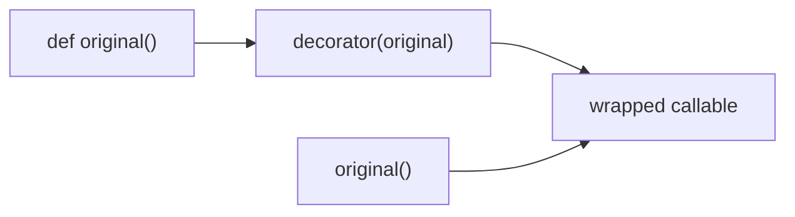

# Модуль 7: Введение в ООП. Декораторы

> Функции как объекты первого класса, декораторы функций и методов, `@classmethod`, `@staticmethod`, `@property` в контексте классов и `functools.wraps`.

## Метаданные

| Параметр | Значение |
|----------|----------|
| Номер модуля | 07 |
| Название | Введение в ООП. Декораторы |
| Предварительные знания | [06-oop-getters-setters.md](06-oop-getters-setters.md); [04-oop-encapsulation.md](04-oop-encapsulation.md) |
| Следующий модуль | [08-oop-magic-methods.md](08-oop-magic-methods.md) — магические методы |
| Ориентировочное время | 5–6 часов |
| Версия Python | 3.11+ |
| Сложность | Средняя |

## Цели обучения

После прохождения модуля студент сможет:

1. **Объяснить** декоратор как синтаксический сахар для высшего порядка функций (HOF).
2. **Писать** простые и параметризованные декораторы с сохранением метаданных через `functools.wraps`.
3. **Различать** `@classmethod`, `@staticmethod` и обычные методы экземпляра.
4. **Понимать** `@property` как декоратор дескриптора в контексте класса.
5. **Комбинировать** несколько декораторов и **предсказывать** порядок их применения.
6. **Применять** декораторы для cross-cutting concerns: логирование, тайминг, повторные попытки, валидация.

## Теория

### 7.1. Функции — объекты первого класса

В Python функции можно:

- присваивать переменным;
- передавать как аргументы;
- возвращать из других функций;
- хранить в структурах данных.

```python
def greet(name: str) -> str:
    return f"Hello, {name}"


say = greet
print(say("Алиса"))  # Hello, Алиса


def apply(func, value):
    return func(value)


print(apply(greet, "Борис"))
```

Это основа **функциональных декораторов** и callback-паттерна.

### 7.2. Что такое декоратор

**Декоратор** — callable, который принимает функцию и возвращает новую функцию (или callable) с дополнительным поведением.

Синтаксис:

```python
@decorator
def foo():
    ...
```

эквивалентен:

```python
def foo():
    ...
foo = decorator(foo)
```



### 7.3. Простейший декоратор

```python
def log_calls(func):
    def wrapper(*args, **kwargs):
        print(f"calling {func.__name__}")
        result = func(*args, **kwargs)
        print(f"finished {func.__name__}")
        return result
    return wrapper


@log_calls
def add(a: int, b: int) -> int:
    return a + b


add(2, 3)
# calling add
# finished add
```

`wrapper` принимает произвольные аргументы и пробрасывает их в `func`.

### 7.4. `functools.wraps` — сохранение метаданных

Без `wraps` обёртка «теряет» имя и docstring оригинала:

```python
import functools


def log_calls(func):
    @functools.wraps(func)
    def wrapper(*args, **kwargs):
        print(f"→ {func.__name__}")
        return func(*args, **kwargs)
    return wrapper
```

`@functools.wraps(func)` копирует `__name__`, `__doc__`, `__module__`, `__annotations__` и др. **Всегда** используйте `wraps` в пользовательских декораторах.

### 7.5. Параметризованные декораторы

Декоратор с аргументами — это **фабрика декораторов**:

```python
import functools
import time


def retry(times: int, delay: float = 0.0):
    def decorator(func):
        @functools.wraps(func)
        def wrapper(*args, **kwargs):
            last_exc = None
            for attempt in range(times):
                try:
                    return func(*args, **kwargs)
                except Exception as exc:
                    last_exc = exc
                    if delay:
                        time.sleep(delay)
            raise last_exc
        return wrapper
    return decorator


@retry(times=3, delay=0.1)
def unstable_request() -> str:
    ...
```

Три уровня вложенности: `retry` → `decorator` → `wrapper`.


### 7.7. Несколько декораторов

```python
@decorator_a
@decorator_b
def f():
    ...
```

Эквивалентно `f = decorator_a(decorator_b(f))` — **снизу вверх**: сначала `b`, потом `a`.

```python
def bold(func):
    @functools.wraps(func)
    def wrapper(*args, **kwargs):
        return f"<b>{func(*args, **kwargs)}</b>"
    return wrapper


def italic(func):
    @functools.wraps(func)
    def wrapper(*args, **kwargs):
        return f"<i>{func(*args, **kwargs)}</i>"
    return wrapper


@bold
@italic
def title() -> str:
    return "Hello"


# title() → '<b><i>Hello</i></b>'
```


### 7.9. Методы экземпляра, класса и статические

В контексте ООП Python предоставляет встроенные «декораторы методов»:

| Декоратор | Первый аргумент | Назначение |
|-----------|-----------------|------------|
| (нет) | `self` | Работа с экземпляром |
| `@classmethod` | `cls` | Фабрики, альтернативные конструкторы |
| `@staticmethod` | — | Утилита в пространстве имён класса |

```python
class User:
    _registry: list["User"] = []

    def __init__(self, name: str) -> None:
        self.name = name
        User._registry.append(self)

    def greet(self) -> str:
        return f"Hi, {self.name}"

    @classmethod
    def from_email(cls, email: str) -> "User":
        name = email.split("@")[0]
        return cls(name)

    @staticmethod
    def is_valid_email(email: str) -> bool:
        return "@" in email and "." in email.split("@")[-1]
```

### 7.10. `@classmethod` — фабрики и полиморфизм

`cls` — сам класс (или подкласс при вызове на наследнике):

```python
class Date:
    def __init__(self, year: int, month: int, day: int) -> None:
        self.year, self.month, self.day = year, month, day

    @classmethod
    def from_iso(cls, iso: str) -> "Date":
        y, m, d = map(int, iso.split("-"))
        return cls(y, m, d)

    def __repr__(self) -> str:
        return f"{self.year:04d}-{self.month:02d}-{self.day:02d}"


class Timestamp(Date):
    @classmethod
    def from_iso(cls, iso: str) -> "Timestamp":
        date_part = iso.split("T")[0]
        return super().from_iso(date_part)
```

`Timestamp.from_iso("2026-07-03T12:00")` создаёт `Timestamp`, не `Date`.

### 7.11. `@staticmethod` — когда использовать

Используйте, если функция **логически связана** с классом, но не нуждается ни в `self`, ни в `cls`:

```python
class MathUtils:
    @staticmethod
    def clamp(value: float, low: float, high: float) -> float:
        return max(low, min(high, value))
```

Альтернатива — обычная функция в модуле. Static method оправдан для группировки в классе (API, namespace).

**Не путать:** `@staticmethod` не получает класс автоматически — нельзя вызвать другой classmethod без явной передачи класса.

### 7.12. `@property` как декоратор класса

В [модуле 06](06-oop-getters-setters.md) вы использовали `@property` для геттеров. Технически это **дескриптор**, создаваемый декоратором `property`:

```python
class Circle:
    def __init__(self, r: float) -> None:
        self.radius = r

    @property
    def radius(self) -> float:
        return self._r

    @radius.setter
    def radius(self, value: float) -> None:
        self._r = value

    @property
    def diameter(self) -> float:
        return self._r * 2
```

Цепочка `@radius.setter` — второй декоратор, привязывающий setter к property-объекту `radius`.


## Примеры кода

### Пример 1. Таймер выполнения

```python
"""
Декоратор timer: измеряет wall-clock время вызова.
"""
import functools
import time


def timer(func):
    @functools.wraps(func)
    def wrapper(*args, **kwargs):
        start = time.perf_counter()
        try:
            return func(*args, **kwargs)
        finally:
            elapsed = time.perf_counter() - start
            print(f"{func.__name__} took {elapsed:.4f}s")
    return wrapper


@timer
def slow_sum(n: int) -> int:
    return sum(range(n))


if __name__ == "__main__":
    print(slow_sum(1_000_000))
```

### Пример 2. `classmethod` — альтернативные конструкторы

```python
"""
Report: обычный __init__ и from_iso classmethod.
"""
from datetime import date


class Report:
    def __init__(self, title: str, created: date) -> None:
        self.title = title
        self.created = created

    @classmethod
    def from_iso(cls, title: str, iso: str) -> "Report":
        y, m, d = map(int, iso.split("-"))
        return cls(title, date(y, m, d))

    @classmethod
    def today(cls, title: str) -> "Report":
        return cls(title, date.today())

    def __repr__(self) -> str:
        return f"Report({self.title!r}, {self.created})"


if __name__ == "__main__":
    print(Report("Q1", date(2026, 3, 31)))
    print(Report.from_iso("Q2", "2026-06-30"))
    print(Report.today("Daily"))
```

### Пример 3. `staticmethod` — утилиты в классе

```python
"""
Валидаторы как staticmethod — группировка без состояния.
"""


class PasswordPolicy:
    MIN_LEN = 8

    @staticmethod
    def is_length_ok(password: str) -> bool:
        return len(password) >= PasswordPolicy.MIN_LEN

    @staticmethod
    def has_digit(password: str) -> bool:
        return any(c.isdigit() for c in password)

    @classmethod
    def validate(cls, password: str) -> list[str]:
        errors = []
        if not cls.is_length_ok(password):
            errors.append(f"min length {cls.MIN_LEN}")
        if not cls.has_digit(password):
            errors.append("need digit")
        return errors


if __name__ == "__main__":
    print(PasswordPolicy.validate("short"))
    print(PasswordPolicy.validate("longenough1"))
```

## Trade-off: компромиссы

| Решение | Плюсы | Минусы | Когда выбирать |
|---------|-------|--------|----------------|
| Декоратор функции | DRY для cross-cutting | Скрытая логика, stack trace | Лог, тайминг, retry |
| Параметризованный декоратор | Гибкость | 3 уровня вложенности | Конфигурируемый retry |
| `@classmethod` | Фабрики, полиморфный `cls` | Не доступ к полям экземпляра | Альтернативные конструкторы |
| `@staticmethod` | Namespace, без self | Не наследует полиморфизм cls | Утилиты рядом с классом |
| Функция в модуле вместо static | Проще тестировать | Размытый API класса | Утилиты без привязки к типу |
| `@property` | Чистый доступ к полю | Дескрипторная магия | Инварианты, вычисления |
| `lru_cache` на методе | Быстрый кэш | Утечки при cache на self | Чистые функции, classmethod |

## Практические задания

### Задание 1 (базовое). Декоратор `uppercase_result`

**Условие:** Декоратор преобразует строковый результат функции в верхний регистр (если результат — `str`). Используйте `functools.wraps`.

**Критерии:** `uppercase_result.__name__` совпадает с оригиналом; не-строки не ломаются.

**Подсказка:** `isinstance(result, str)`.

### Задание 2 (среднее). Класс `Money` с classmethod и staticmethod

**Условие:** `Money(amount, currency)`. `from_rubles(amount)` — classmethod. `is_same_currency(a, b)` — staticmethod. Property `formatted` — `"100.00 RUB"`.

**Критерии:** Фабрика возвращает `Money`; staticmethod не требует экземпляра.

**Подсказка:** `f"{self.amount:.2f} {self.currency}"`.

### Задание 3 (продвинутое). Декоратор `rate_limit(calls, period)`

**Условие:** Параметризованный декоратор ограничивает число вызовов функции за `period` секунд; при превышении — `RuntimeError`. Примените к методу класса `ApiClient.request`.

**Критерии:** `wraps`; работает с `self`; тест на 3 вызова при `calls=2`.

**Подсказка:** `time.monotonic()`, список времён в closure.

## Эталонные решения

<details>
<summary>Задание 1 — uppercase_result</summary>

```python
import functools


def uppercase_result(func):
    @functools.wraps(func)
    def wrapper(*args, **kwargs):
        result = func(*args, **kwargs)
        if isinstance(result, str):
            return result.upper()
        return result
    return wrapper


@uppercase_result
def greet(name: str) -> str:
    return f"hello, {name}"


@uppercase_result
def add(a: int, b: int) -> int:
    return a + b


if __name__ == "__main__":
    assert greet("ali") == "HELLO, ALI"
    assert add(1, 2) == 3
    assert greet.__name__ == "greet"
```

</details>

<details>
<summary>Задание 2 — Money</summary>

```python
class Money:
    def __init__(self, amount: float, currency: str) -> None:
        self.amount = amount
        self.currency = currency.upper()

    @classmethod
    def from_rubles(cls, amount: float) -> "Money":
        return cls(amount, "RUB")

    @staticmethod
    def is_same_currency(a: "Money", b: "Money") -> bool:
        return a.currency == b.currency

    @property
    def formatted(self) -> str:
        return f"{self.amount:.2f} {self.currency}"

    def __repr__(self) -> str:
        return f"Money({self.amount}, {self.currency!r})"


if __name__ == "__main__":
    m = Money.from_rubles(100)
    print(m.formatted)
    print(Money.is_same_currency(m, Money(50, "rub")))
```

</details>

<details>
<summary>Задание 3 — rate_limit</summary>

```python
import functools
import time


def rate_limit(calls: int, period: float):
    def decorator(func):
        timestamps: list[float] = []

        @functools.wraps(func)
        def wrapper(*args, **kwargs):
            now = time.monotonic()
            while timestamps and now - timestamps[0] > period:
                timestamps.pop(0)
            if len(timestamps) >= calls:
                raise RuntimeError("rate limit exceeded")
            timestamps.append(now)
            return func(*args, **kwargs)
        return wrapper
    return decorator


class ApiClient:
    @rate_limit(calls=2, period=1.0)
    def request(self, path: str) -> str:
        return f"200 {path}"


if __name__ == "__main__":
    c = ApiClient()
    print(c.request("/a"))
    print(c.request("/b"))
    try:
        c.request("/c")
    except RuntimeError as e:
        print("expected:", e)
```

</details>

## Вопросы для самопроверки

1. **Чему эквивалентен `@deco` над `def f`?**  
   *Ответ:* `f = deco(f)` после определения функции.

2. **Зачем `functools.wraps`?**  
   *Ответ:* Сохранить `__name__`, `__doc__`, аннотации оригинальной функции.

3. **Разница `@classmethod` и `@staticmethod`?**  
   *Ответ:* Classmethod получает `cls`; staticmethod не получает ни `self`, ни `cls`.

4. **Порядок `@a` `@b` над функцией?**  
   *Ответ:* `a(b(f))` — сначала применяется `b`.

5. **Можно ли декорировать `@property`?**  
   *Ответ:* Да, но редко нужно; чаще декорируют методы до оборачивания в property.

6. **Когда staticmethod лучше вынести в модуль?**  
   *Ответ:* Когда функция не связана с классом semantically и не нужен namespace.

7. **Связь property с декораторами?**  
   *Ответ:* `@property` — встроенный декоратор, создающий дескриптор; `@x.setter` — второй уровень.

## Методические указания

### Тайминг

| Блок | Время |
|------|-------|
| Функции как объекты, HOF | 30 мин |
| Простые и параметризованные декораторы | 55 мин |
| `functools.wraps`, `lru_cache` | 25 мин |
| classmethod, staticmethod | 45 мин |
| property как декоратор (повтор) | 20 мин |
| Практика | 90 мин |

### Типичные ошибки

1. Забытый `return` в wrapper — функция возвращает `None`.
2. Параметризованный декоратор без второго вызова: `@retry` вместо `@retry(3)`.
3. `staticmethod` для фабики — нужен `classmethod`.
4. Декоратор метода, не учитывающий `self` в сигнатуре wrapper.
5. Рекурсия при декорировании property setter неправильным именем.

### FAQ

**Декоратор vs наследование?**  
Декоратор — композиция поведения на уровне функции; наследование — на уровне класса.

**Декораторы и async?**  
Нужен `async def wrapper` и `await func()` — тема async-курса.

**Где читать про class decorators?**  
`@dataclass`, метаклассы — продвинутые модули.

## Дополнительные материалы

- [PEP 318 — Decorators for Functions and Methods](https://peps.python.org/pep-0318/)
- [functools — wraps, lru_cache](https://docs.python.org/3/library/functools.html)
- [Дескрипторы и property](https://docs.python.org/3/howto/descriptor.html)
- [Модуль 06: @property](06-oop-getters-setters.md)
- [Модуль 08: магические методы](08-oop-magic-methods.md)
- *Python Cookbook*, 3rd ed. — глава о декораторах
