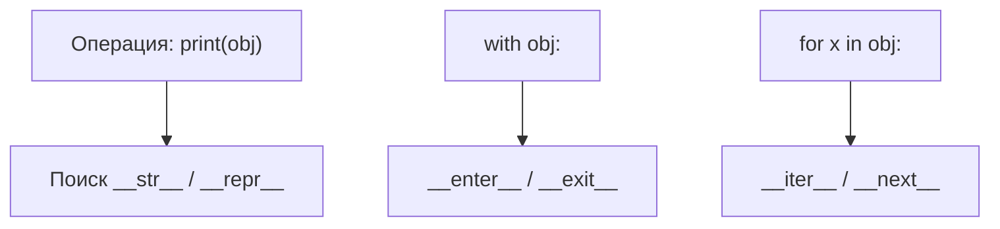

# Модуль 8: Введение в ООП. Магические методы

> Протоколы объектной модели Python: `__init__`, `__repr__`, `__str__`, `__eq__`, `__hash__`, контекстные менеджеры и итераторы в Python 3.11+.

## Метаданные

| Параметр | Значение |
|----------|----------|
| Номер модуля | 08 |
| Название | Введение в ООП. Магические методы |
| Предварительные знания | [07-oop-decorators.md](07-oop-decorators.md); [04-oop-encapsulation.md](04-oop-encapsulation.md); [05-oop-polymorphism.md](05-oop-polymorphism.md) |
| Следующий модуль | Продвинутое ООП курса: наследование, MRO, миксины (модули 13–16 архива) |
| Ориентировочное время | 5–6 часов |
| Версия Python | 3.11+ |
| Сложность | Средняя → продвинутая |

## Цели обучения

После прохождения модуля студент сможет:

1. **Объяснить** роль dunder-методов как реализации протоколов Python.
2. **Корректно реализовать** `__init__`, `__repr__`, `__str__`, `__eq__` и `__hash__`.
3. **Создавать** контекстные менеджеры через класс и `contextlib`.
4. **Реализовать** итератор и итерируемый объект; **различать** их роли.
5. **Избегать** типичных ошибок: мутабельные объекты в `set`, нарушение контракта `__eq__`/`__hash__`.
6. **Комбинировать** магические методы с `@dataclass` и `__post_init__`.

## Теория

### 8.1. Что такое магические методы

**Магические (dunder) методы** — методы с именами `__имя__`, вызываемые интерпретатором при операциях с объектом. Они не предназначены для прямого вызова пользователем (хотя технически это возможно).

```python
class Vector:
    def __init__(self, x: float, y: float) -> None:
        self.x = x
        self.y = y

    def __add__(self, other: "Vector") -> "Vector":
        return Vector(self.x + other.x, self.y + other.y)


v1 = Vector(1, 2)
v2 = Vector(3, 4)
v3 = v1 + v2  # вызывает v1.__add__(v2)
```

Dunder-методы — механизм **duck typing** на уровне интерпретатора: если объект поддерживает протокол, он «ведёт себя как» встроенный тип. Связь с [полиморфизмом](05-oop-polymorphism.md): `len(x)` работает с любым `x`, у кого есть `__len__`.



### 8.2. `__init__` и `__new__`

**`__init__(self, ...)`** — инициализация уже созданного экземпляра. Не создаёт объект, а настраивает его.

**`__new__(cls, ...)`** — создание экземпляра (вызывается **до** `__init__`). Используется редко: синглтоны, immutable типы, подклассы `tuple`/`str`.

```python
class Temperature:
    def __init__(self, celsius: float) -> None:
        if celsius < -273.15:
            raise ValueError("below absolute zero")
        self.celsius = celsius


class Singleton:
    _instance = None

    def __new__(cls, *args, **kwargs):
        if cls._instance is None:
            cls._instance = super().__new__(cls)
        return cls._instance
```

**Рекомендации для `__init__`:**

- Не возвращайте значение (кроме `None` неявно).
- Валидируйте входные данные (или делегируйте property/setter из [модуля 06](06-oop-getters-setters.md)).
- При наследовании используйте `super().__init__(...)`.

### 8.3. `__repr__` и `__str__`

| Метод | Аудитория | Цель | Пример вызова |
|-------|-----------|------|---------------|
| `__repr__` | Разработчик | Однозначное, отлаживаемое представление | `repr(obj)`, REPL |
| `__str__` | Пользователь | Читаемый вывод | `str(obj)`, `print(obj)` |

**Контракт `__repr__`:** желательно `eval(repr(obj)) == obj` (не всегда достижимо).

```python
class User:
    def __init__(self, user_id: int, name: str) -> None:
        self.user_id = user_id
        self.name = name

    def __repr__(self) -> str:
        return f"User(user_id={self.user_id!r}, name={self.name!r})"

    def __str__(self) -> str:
        return f"{self.name} (#{self.user_id})"
```

Если `__str__` не определён, используется `__repr__`.

**f-строки и `!r`:** `!r` вызывает `repr()` для аргумента — полезно в `__repr__` класса.

### 8.4. `__eq__`, `__ne__` и `__hash__`

**`__eq__(self, other)`** — равенство по значению. Должен возвращать `NotImplemented` для несовместимых типов (не `False`!).

```python
class Money:
    def __init__(self, amount: float, currency: str) -> None:
        self.amount = amount
        self.currency = currency

    def __eq__(self, other: object) -> bool:
        if not isinstance(other, Money):
            return NotImplemented
        return self.amount == other.amount and self.currency == other.currency
```

**`__hash__(self)`** — хеш для `dict`/`set`. Контракт:

- Если `a == b`, то `hash(a) == hash(b)`.
- Если объект мутабелен и участвует в `__eq__`, **не переопределяйте `__hash__`** (Python 3 делает его `None` при кастомном `__eq__`).

```python
from dataclasses import dataclass


@dataclass(frozen=True)
class Point:
    x: int
    y: int
# frozen=True → auto __hash__

{Point(1, 2), Point(1, 2)}  # один элемент
```

**Мутабельный объект:**

```python
class MutableBag:
    def __init__(self, items: list) -> None:
        self.items = list(items)

    def __eq__(self, other: object) -> bool:
        if not isinstance(other, MutableBag):
            return NotImplemented
        return self.items == other.items

    # __hash__ не определён → нельзя класть в set
```

### 8.6. Контекстные менеджеры

Протокол контекстного менеджера:

- `__enter__(self)` — вход в `with`, возвращаемое значение → `as variable`
- `__exit__(self, exc_type, exc_val, exc_tb)` — выход; подавление исключения если вернуть `True`

```python
class DatabaseTransaction:
    def __init__(self, connection) -> None:
        self._conn = connection
        self._active = False

    def __enter__(self) -> "DatabaseTransaction":
        self._conn.execute("BEGIN")
        self._active = True
        return self

    def __exit__(self, exc_type, exc_val, exc_tb) -> bool:
        if exc_type is None:
            self._conn.execute("COMMIT")
        else:
            self._conn.execute("ROLLBACK")
        self._active = False
        return False  # не подавлять исключение


with DatabaseTransaction(conn) as tx:
    conn.execute("INSERT ...")
```

**`contextlib.contextmanager`** — генераторный стиль:

```python
from contextlib import contextmanager


@contextmanager
def timer(label: str):
    import time
    start = time.perf_counter()
    try:
        yield
    finally:
        elapsed = time.perf_counter() - start
        print(f"{label}: {elapsed:.3f}s")


with timer("load"):
    ...
```

**`contextlib.ExitStack`** — динамическое управление несколькими контекстами.

### 8.7. Итераторы и итерируемые объекты

**Протокол итерируемого (Iterable):** `__iter__()` возвращает итератор.

**Протокол итератора (Iterator):** `__iter__()` + `__next__()`; при исчерпании — `StopIteration`.

```python
class Countdown:
    def __init__(self, start: int) -> None:
        self.current = start

    def __iter__(self) -> "Countdown":
        return self

    def __next__(self) -> int:
        if self.current <= 0:
            raise StopIteration
        value = self.current
        self.current -= 1
        return value


for n in Countdown(3):
    print(n)  # 3, 2, 1
```

**Разделение Iterable и Iterator:**

```python
class Range:
    """Итерируемый — каждый __iter__ создаёт новый итератор."""

    def __init__(self, n: int) -> None:
        self.n = n

    def __iter__(self):
        return _RangeIterator(self.n)


class _RangeIterator:
    def __init__(self, n: int) -> None:
        self.n = n
        self.i = 0

    def __iter__(self):
        return self

    def __next__(self):
        if self.i >= self.n:
            raise StopIteration
        self.i += 1
        return self.i - 1
```

**Генераторы** — синтаксический сахар:

```python
def countdown(start: int):
    current = start
    while current > 0:
        yield current
        current -= 1
```

`yield` автоматически создаёт объект с `__iter__` и `__next__`.


## Примеры кода

### Пример 1. Полноценный класс Order

```python
"""
Order: dataclass + кастомные __repr__ и __str__.
"""
from dataclasses import dataclass, field
from datetime import datetime
from uuid import UUID, uuid4


@dataclass
class Order:
    customer_id: int
    items: list[str] = field(default_factory=list)
    id: UUID = field(default_factory=uuid4)
    created_at: datetime = field(default_factory=datetime.now)

    def __repr__(self) -> str:
        return (
            f"Order(id={self.id!s}, customer_id={self.customer_id}, "
            f"items={self.items!r}, created_at={self.created_at!r})"
        )

    def __str__(self) -> str:
        return f"Order {self.id} for customer {self.customer_id} ({len(self.items)} items)"


if __name__ == "__main__":
    o = Order(42, ["book", "pen"])
    print(str(o))
    print(repr(o))
```

### Пример 2. Равенство и хешируемость

```python
"""
Version как frozen value object для set/dict keys.
"""
from dataclasses import dataclass


@dataclass(frozen=True, order=True)
class Version:
    major: int
    minor: int

    def __str__(self) -> str:
        return f"{self.major}.{self.minor}"


if __name__ == "__main__":
    versions = {Version(3, 11), Version(3, 12), Version(3, 11)}
    print(sorted(versions))
```

### Пример 3. `contextmanager` — таймер

```python
"""
Генераторный контекстный менеджер.
"""
from contextlib import contextmanager
import time


@contextmanager
def timer(label: str):
    start = time.perf_counter()
    try:
        yield
    finally:
        print(f"{label}: {time.perf_counter() - start:.4f}s")


if __name__ == "__main__":
    with timer("work"):
        sum(range(100_000))
```

## Trade-off: компромиссы

| Решение | Плюсы | Минусы | Когда выбирать |
|---------|-------|--------|----------------|
| Ручные dunder | Полный контроль | Boilerplate | Кастомная семантика |
| `@dataclass` | Авто `__init__`, `__repr__`, `__eq__` | Меньше гибкости | DTO, record types |
| `contextmanager` | Компактность | Сложная логика в generator | Простые `with` |
| Класс CM | Явный `__enter__`/`__exit__` | Больше кода | Ресурсы, транзакции |
| Генератор (`yield`) | Простой итератор | Состояние в closure | Ленивые последовательности |
| Класс Iterator | Переиспользование, тесты | Больше классов | Сложная итерация |
| `frozen` dataclass | Авто `__hash__` | Неизменяемость | Ключи set/dict |

## Практические задания

### Задание 1 (базовое). Класс `Book`

Реализуйте `Book(title, author, year)` с:

- `__repr__` — однозначное представление
- `__str__` — «Title by Author (Year)»
- `__eq__` — по `(title, author, year)`
- Книги можно класть в `set` (реализуйте `__hash__` или используйте frozen dataclass)

**Критерии:** `len({b1, b2}) == 1` для равных книг; `str(b)` читаем.

**Подсказка:** `@dataclass(frozen=True)`.

### Задание 2 (среднее). `TempFile` context manager

Класс `TempFile(path)`:

- `__enter__` создаёт пустой файл по `path`
- `__exit__` удаляет файл (даже при исключении)
- Поддержка `with TempFile("/tmp/x.txt") as f:` для записи

Напишите тест: исключение внутри `with` всё равно удаляет файл.

**Критерии:** `__exit__` возвращает `False`; файл не остаётся на диске.

**Подсказка:** `path.unlink(missing_ok=True)` (Python 3.8+).

### Задание 3 (продвинутое). `PagedQuery` iterator

Реализуйте итерируемый `PagedQuery(fetch_page, page_size)` где `fetch_page(page: int) -> list[T]` — callback.

Итератор лениво запрашивает страницы 0, 1, 2, ... пока не вернётся пустой список.

```python
def fake_fetch(page: int) -> list[int]:
    data = list(range(25))
    start = page * 10
    return data[start : start + 10]

for item in PagedQuery(fake_fetch, page_size=10):
    print(item)  # 0..24
```

**Критерии:** Один проход `for`; не загружает все страницы заранее.

**Подсказка:** `__iter__` с генератором или `yield from`.

## Эталонные решения

<details>
<summary>Задание 1 — Book</summary>

```python
from dataclasses import dataclass


@dataclass(frozen=True)
class Book:
    title: str
    author: str
    year: int

    def __str__(self) -> str:
        return f"{self.title} by {self.author} ({self.year})"


if __name__ == "__main__":
    b1 = Book("1984", "Orwell", 1949)
    b2 = Book("1984", "Orwell", 1949)
    assert repr(b1) == "Book(title='1984', author='Orwell', year=1949)"
    assert str(b1) == "1984 by Orwell (1949)"
    assert b1 == b2
    assert len({b1, b2}) == 1
```

</details>

<details>
<summary>Задание 2 — TempFile</summary>

```python
from pathlib import Path


class TempFile:
    def __init__(self, path: str | Path) -> None:
        self.path = Path(path)

    def __enter__(self):
        self.path.write_text("", encoding="utf-8")
        return self.path.open("w", encoding="utf-8")

    def __exit__(self, exc_type, exc_val, exc_tb) -> bool:
        try:
            pass
        finally:
            self.path.unlink(missing_ok=True)
        return False


if __name__ == "__main__":
    p = Path("/tmp/test_umk_temp.txt")
    try:
        with TempFile(p) as f:
            f.write("hello")
            raise RuntimeError("boom")
    except RuntimeError:
        pass
    assert not p.exists()
```

</details>

<details>
<summary>Задание 3 — PagedQuery</summary>

```python
from collections.abc import Callable, Iterator, Iterable
from typing import TypeVar

T = TypeVar("T")


class PagedQuery(Iterable[T]):
    def __init__(
        self,
        fetch_page: Callable[[int], list[T]],
        page_size: int = 10,
    ) -> None:
        self._fetch_page = fetch_page
        self._page_size = page_size

    def __iter__(self) -> Iterator[T]:
        page = 0
        while True:
            batch = self._fetch_page(page)
            if not batch:
                break
            yield from batch
            page += 1


def fake_fetch(page: int) -> list[int]:
    data = list(range(25))
    start = page * 10
    return data[start : start + 10]


if __name__ == "__main__":
    assert list(PagedQuery(fake_fetch)) == list(range(25))
```

</details>

## Вопросы для самопроверки

1. **Чем `__repr__` отличается от `__str__`?**  
   *Ответ:* `__repr__` — для разработчиков (отладка); `__str__` — для пользователей (читаемость).

2. **Почему `__eq__` должен возвращать `NotImplemented`, а не `False`?**  
   *Ответ:* Чтобы Python попробовал reflected operation у другого операнда.

3. **Можно ли положить мутабельный список с кастомным `__eq__` в `set`? Почему?**  
   *Ответ:* Нет, если `__eq__` переопределён — `__hash__` становится `None`.

4. **Что вернёт `__exit__`, если нужно подавить исключение?**  
   *Ответ:* `True` — исключение подавляется; `False` или `None` — пробрасывается.

5. **В чём разница между итерируемым объектом и итератором?**  
   *Ответ:* Iterable предоставляет `__iter__`; Iterator — ещё и `__next__`, часто одноразовый проход.

6. **Когда предпочтительнее генератор вместо класса с `__next__`?**  
   *Ответ:* Простые ленивые последовательности без сложного состояния.

7. **Для чего нужен `__post_init__` в dataclass?**  
   *Ответ:* Валидация и дополнительная инициализация после автогенерированного `__init__`.

8. **Что вызывает Python при выполнении `with obj:`?**  
   *Ответ:* `obj.__enter__()` при входе, `obj.__exit__(...)` при выходе.

<details>
<summary>Ответы (краткая шпаргалка)</summary>

См. ответы выше в нумерованном списке.

</details>

## Методические указания

### Порядок подачи

1. `__repr__` / `__str__` — быстрый win, видно в REPL.
2. `__eq__` / `__hash__` — контракты и ловушки с `set`.
3. Context managers — связь с `try/finally` и ресурсами.
4. Итераторы — связь с `for`, генераторами.

### Тайминг

| Блок | Время |
|------|-------|
| Введение, `__init__` | 30 мин |
| `__repr__`, `__str__` | 35 мин |
| `__eq__`, `__hash__` | 45 мин |
| Context managers | 50 мин |
| Итераторы, генераторы | 50 мин |
| Практика | 90 мин |

### Типичные ошибки

1. `__eq__` возвращает `False` для чужого типа вместо `NotImplemented`.
2. Изменяемый объект в `set` после кастомного `__hash__`.
3. Итератор без сброса — второй `for` ничего не выдаёт.
4. `__exit__` без `finally` — ресурс не освобождается при исключении.
5. Пустой `__repr__`: `return super().__repr__()` без полезной информации.

### FAQ

**Нужно ли реализовывать все dunder?**  
Только те, что соответствуют протоколу, который вы хотите поддержать.

**Dataclass vs ручные dunder?**  
Dataclass для данных; ручные — для нестандартной семантики.

**Async context managers?**  
`__aenter__` / `__aexit__` — в модулях asyncio курса.

## Дополнительные материалы

- [Python Data Model](https://docs.python.org/3/reference/datamodel.html) — полный список dunder
- [collections.abc](https://docs.python.org/3/library/collections.abc.html) — формальные протоколы
- [contextlib](https://docs.python.org/3/library/contextlib.html)
- [PEP 343 — The "with" Statement](https://peps.python.org/pep-0343/)
- [Модуль 07: декораторы](07-oop-decorators.md)
- [Модуль 05: полиморфизм](05-oop-polymorphism.md)
- *Fluent Python*, 2nd ed. — главы о протоколах и data model
