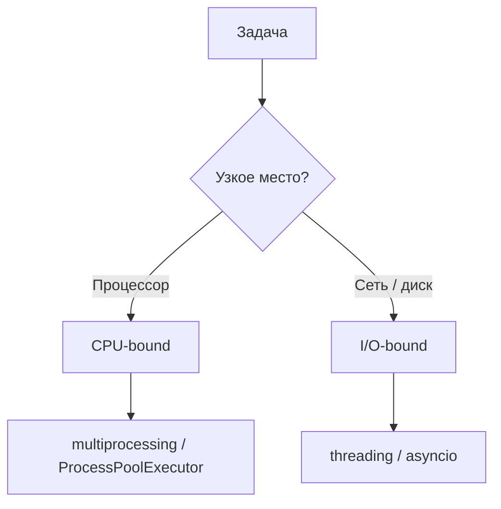

# Модуль 12: Конкурентное программирование. Процессы

## Метаданные

| Параметр | Значение |
|----------|----------|
| Курс | Продвинутый Python |
| Модуль | 12 |
| Предварительные знания | [Модуль 11: Обработка исключений](11-exceptions.md), базовое понимание потоков ОС; GIL подробно — [Модуль 16](16-gil.md) |
| Предыдущий модуль | [11-exceptions.md](11-exceptions.md) |
| Следующий модуль | [Модуль 16: GIL](16-gil.md) (углублённо) или следующий блок курса по плану |
| Ориентировочное время | 5–6 часов |
| Версия Python | 3.11+ |
| Ключевые темы | `multiprocessing`, `Process`, `ProcessPoolExecutor`, CPU-bound, `spawn`/`fork`, IPC, `if __name__ == "__main__"` |

---

## Цели обучения

После изучения модуля вы сможете:

1. **Классифицировать** задачи как CPU-bound и обосновать выбор **процессов** вместо потоков для параллельных вычислений.
2. **Запускать** worker-процессы через `multiprocessing.Process` и пулы `Pool` / `ProcessPoolExecutor`.
3. **Передавать** данные между процессами (`Queue`, `Pipe`, pickle-сериализация) с учётом ограничений.
4. **Писать** переносимый код с `if __name__ == "__main__":` для режима `spawn`.
5. **Измерять** ускорение через `time.perf_counter()` и интерпретировать overhead процессов.
6. **Обрабатывать** исключения из воркеров через `Future.result()` ([Модуль 11](11-exceptions.md)).

---

## Теория

### 12.1 Зачем процессы: CPU-bound параллелизм

**CPU-bound** задача ограничена скоростью процессора: хеширование, сжатие, численные циклы на чистом Python, проверка простоты, парсинг больших объёмов без I/O.

**Потоки** (`threading`) в CPython для таких задач **обычно не дают** линейного ускорения на нескольких ядрах — подробности про GIL разбираются в [Модуле 16](16-gil.md). На практике запомните:

- **I/O-bound** (сеть, диск) → потоки или asyncio;
- **CPU-bound** на чистом Python → **процессы** или нативные расширения (NumPy, Rust/C).



### 12.2 Процесс vs поток в Python

| | Поток (`threading`) | Процесс (`multiprocessing`) |
|---|---------------------|------------------------------|
| Память | Общая | Изолированная |
| Старт | Дешёвый | Дороже (fork/spawn) |
| Параллелизм CPU | Ограничен GIL | Отдельный интерпретатор на ядро |
| Обмен данными | Общие объекты (+ Lock) | Pickle, Queue, shared memory |
| Отладка | Сложнее гонки | Сложнее lifecycle |

Процессы — **тяжелее**, но дают **настоящий** параллелизм вычислений на многоядерном CPU.

### 12.3 Модуль multiprocessing

Стандартная библиотека для создания процессов ОС из Python:

```python
import multiprocessing as mp


def worker(name: str) -> None:
    print(f"Hello from {name}, pid={mp.current_process().pid}")


if __name__ == "__main__":
    p = mp.Process(target=worker, args=("worker-1",))
    p.start()
    p.join()
```

**Ключевые объекты:**

- `Process` — один дочерний процесс;
- `Pool` — пул воркеров с `map`/`apply`;
- `Queue`, `Pipe` — очереди сообщений;
- `Manager` — прокси к shared объектам в отдельном сервер-процессе;
- `shared_memory` (3.8+) — разделяемые байтовые буферы.

### 12.4 `if __name__ == "__main__":` — обязательный guard

На **Windows** и **macOS** (по умолчанию) используется **`spawn`**: дочерний процесс **импортирует** модуль заново. Без guard код создания процессов выполнится рекурсивно в каждом child → бесконечное порождение или зависание.

```python
# main.py
import multiprocessing as mp

def task():
    ...

if __name__ == "__main__":
    mp.Process(target=task).start()
```

На Linux при `fork` guard менее критичен, но **всегда пишите его** для переносимости.

### 12.5 start methods: fork, spawn, forkserver

| Метод | Платформа | Суть |
|-------|-----------|------|
| `fork` | Unix (Linux) | Копия родительского процесса — быстрый старт |
| `spawn` | Windows, macOS default | Чистый интерпретатор, import main |
| `forkserver` | Unix опция | Сервер-процесс для fork |

```python
import multiprocessing as mp

if __name__ == "__main__":
    mp.set_start_method("spawn", force=True)  # только в main, один раз
```

**После `spawn`** дочерний процесс не наследует случайное состояние родителя — только pickle-сериализуемые аргументы `target`.

### 12.6 Pickle и сериализуемость

Аргументы `Process(target=fn, args=(x,))` и результаты `Pool.map` должны быть **pickle-сериализуемы**:

- ✅ `int`, `str`, `dict`, `list`, функции на **верхнем уровне** модуля;
- ❌ `lambda`, nested function, открытые файлы, socket, lock из другого процесса.

```python
# Плохо — lambda не pickle на spawn
pool.map(lambda x: x * 2, items)

# Хорошо — top-level function
def double(x):
    return x * 2
pool.map(double, items)
```

### 12.7 ProcessPoolExecutor — рекомендуемый high-level API

Модуль `concurrent.futures` предоставляет единый интерфейс для пулов:

```python
from concurrent.futures import ProcessPoolExecutor


def cpu_work(n: int) -> int:
    return sum(i * i for i in range(n))


if __name__ == "__main__":
    with ProcessPoolExecutor(max_workers=4) as pool:
        results = list(pool.map(cpu_work, [1_000_000] * 8))
    print(sum(results))
```

| Метод | Назначение |
|-------|------------|
| `submit(fn, *args)` | Одна задача → `Future` |
| `map(fn, iterable)` | Параллельный map, порядок результатов сохраняется |
| `shutdown(wait=True)` | Завершение пула (в `with` автоматически) |

`Future.result()` блокирует и **пробрасывает исключение** из воркера ([Модуль 11](11-exceptions.md)).

### 12.8 Pool (multiprocessing) — legacy API

```python
from multiprocessing import Pool


def f(x):
    return x * x


if __name__ == "__main__":
    with Pool(4) as pool:
        print(pool.map(f, range(10)))
```

`ProcessPoolExecutor` предпочтительнее: единый стиль с `ThreadPoolExecutor`, лучше интеграция с `as_completed`, `wait`.

### 12.9 Выбор числа воркеров

Эмпирическое правило для **CPU-bound**:

```python
import os
workers = os.cpu_count() or 1
```

- `max_workers = cpu_count()` — часто оптимум для чистых вычислений;
- больше процессов, чем ядер — **oversubscription**, контекстные переключения ОС;
- меньше — если каждый воркер и так нагружает память (большие модели).

Для задач с **тяжёлым стартом** (загрузка модели в каждом воркере) используйте `initializer` в Pool или долгоживущий пул.

### 12.10 IPC: Queue и Pipe

**Queue** — потокобезопасная и **процесс-безопасная** очередь (под капотом pipe + семафоры):

```python
from multiprocessing import Process, Queue


def producer(q: Queue) -> None:
    for i in range(5):
        q.put(i)

def consumer(q: Queue) -> None:
    while True:
        item = q.get()
        if item is None:
            break
        print(item)


if __name__ == "__main__":
    q: Queue = Queue()
    p = Process(target=producer, args=(q,))
    c = Process(target=consumer, args=(q,))
    p.start(); c.start()
    p.join()
    q.put(None)
    c.join()
```

**Pipe** — двусторонний канал между двумя процессами. Для сложных топологий — `Queue` или message broker (Redis, Kafka).

### 12.11 Разделение задачи: chunking и map

Для `map` по миллиону мелких элементов overhead IPC доминирует. **Батчинг:**

```python
def process_chunk(numbers: list[int]) -> int:
    return sum(n * n for n in numbers)


def chunkify(data: list, size: int):
    for i in range(0, len(data), size):
        yield data[i : i + size]


if __name__ == "__main__":
    data = list(range(10_000_000))
    chunks = list(chunkify(data, 100_000))
    with ProcessPoolExecutor() as pool:
        total = sum(pool.map(process_chunk, chunks))
```

Один вызов функции на крупный блок — меньше сериализаций.

### 12.12 Исключения и таймауты в воркерах

```python
from concurrent.futures import ProcessPoolExecutor, TimeoutError


def may_fail(x):
    if x == 0:
        raise ValueError("zero")
    return 10 // x


if __name__ == "__main__":
    with ProcessPoolExecutor(2) as pool:
        fut = pool.submit(may_fail, 0)
        try:
            fut.result(timeout=5)
        except ValueError as e:
            print("worker error:", e)
```

Исключение возникает в **другом процессе**, но `result()` поднимает его в родителе с traceback (ограниченно).

### 12.13 Пайплайн: I/O в потоках + CPU в процессах

Типичная архитектура batch-обработки:

1. `ThreadPoolExecutor` — загрузка файлов / HTTP;
2. `ProcessPoolExecutor` — тяжёлая обработка байтов;
3. Сбор результатов в главном процессе.

Не смешивайте CPU-bound код в потоках I/O-пула — блокируете весь пул.

### 12.14 Ограничения и альтернативы

| Ограничение | Обход |
|-------------|-------|
| Pickle overhead | Крупные chunks, shared_memory, memory-mapped files |
| Дорогой fork на huge parent | `spawn` / минимизировать импорты в main |
| Нужен GPU | Отдельные воркеры с CUDA, не «просто больше процессов» |
| Низкая латентность IPC | Один процесс + asyncio или нативный код |

**NumPy / Cython / Rust extension** — часто быстрее, чем 8 процессов на чистом Python; процессы — когда код уже есть и embarrassingly parallel.

### 12.15 Singleton и глобальное состояние

Каждый процесс — **своя** копия памяти. Singleton из [Модуля 9](09-singletons.md) в parent **не виден** child как «тот же» объект. Кэш в памяти не общий — используйте внешний store.

### 12.16 Профилирование перед параллелизацией

1. Убедитесь, что задача **действительно** CPU-bound (`cProfile`, `py-spy`).
2. Измерьте **последовательный** baseline.
3. Добавьте процессы и сравните speedup.
4. Если speedup << числа ядер — overhead, GIL не при чём в процессах; ищите сериализацию или диск.

---

## Примеры кода

### Пример 1: Базовый Process

```python
import multiprocessing as mp
import time


def countdown(n: int) -> None:
    for i in range(n, 0, -1):
        time.sleep(0.1)
        print(f"[{mp.current_process().name}] {i}")


if __name__ == "__main__":
    p = mp.Process(target=countdown, args=(5,), name="Worker")
    p.start()
    p.join()
    print("done")
```

### Пример 2: CPU-bound — ProcessPoolExecutor

```python
import time
from concurrent.futures import ProcessPoolExecutor


def is_prime(n: int) -> bool:
    if n < 2:
        return False
    d = 2
    while d * d <= n:
        if n % d == 0:
            return False
        d += 1
    return True


def count_primes(limit: int) -> int:
    return sum(1 for x in range(2, limit) if is_prime(x))


if __name__ == "__main__":
    LIMIT = 50_000

    t0 = time.perf_counter()
    single = count_primes(LIMIT)
    t1 = time.perf_counter() - t0

    chunk = LIMIT // 4
    ranges = [
        (max(2, i * chunk), (i + 1) * chunk if i < 3 else LIMIT)
        for i in range(4)
    ]

    def count_range(bounds: tuple[int, int]) -> int:
        lo, hi = bounds
        return sum(1 for x in range(lo, hi) if is_prime(x))

    t0 = time.perf_counter()
    with ProcessPoolExecutor(max_workers=4) as pool:
        parts = list(pool.map(count_range, ranges))
    total = sum(parts)
    t2 = time.perf_counter() - t0

    assert single == total
    print(f"sequential: {t1:.2f}s, parallel: {t2:.2f}s, speedup: {t1/t2:.1f}x")
```

### Пример 3: submit и as_completed

```python
import time
from concurrent.futures import ProcessPoolExecutor, as_completed


def slow_square(x: int) -> int:
    time.sleep(0.05)
    return x * x


if __name__ == "__main__":
    nums = list(range(12))
    with ProcessPoolExecutor(max_workers=4) as pool:
        futures = {pool.submit(slow_square, n): n for n in nums}
        for fut in as_completed(futures):
            n = futures[fut]
            print(f"{n}^2 = {fut.result()}")
```

### Пример 4: Queue producer-consumer

```python
from multiprocessing import Process, Queue


def producer(q: Queue, count: int) -> None:
    for i in range(count):
        q.put(f"item-{i}")


def consumer(q: Queue) -> None:
    while True:
        item = q.get()
        if item is None:
            break
        print("got", item)


if __name__ == "__main__":
    q: Queue = Queue()
    prod = Process(target=producer, args=(q, 5))
    cons = Process(target=consumer, args=(q,))
    cons.start()
    prod.start()
    prod.join()
    q.put(None)
    cons.join()
```

### Пример 5: Pool с initializer

```python
from multiprocessing import Pool

_CONFIG = {}


def _init_worker(config: dict) -> None:
    global _CONFIG
    _CONFIG = config


def process_item(item: int) -> int:
    multiplier = _CONFIG.get("mult", 1)
    return item * multiplier


if __name__ == "__main__":
    with Pool(4, initializer=_init_worker, initargs=({"mult": 10},)) as pool:
        print(pool.map(process_item, [1, 2, 3]))
```

### Пример 6: Chunked map для больших данных

```python
from concurrent.futures import ProcessPoolExecutor


def sum_squares(nums: list[int]) -> int:
    return sum(n * n for n in nums)


def chunks(lst: list, n: int):
    for i in range(0, len(lst), n):
        yield lst[i : i + n]


if __name__ == "__main__":
    data = list(range(2_000_000))
    parts = list(chunks(data, 250_000))
    with ProcessPoolExecutor() as pool:
        total = sum(pool.map(sum_squares, parts))
    assert total == sum(n * n for n in data)
```

### Пример 7: Обработка ошибок воркера

```python
from concurrent.futures import ProcessPoolExecutor


def divide(a: int, b: int) -> float:
    return a / b


if __name__ == "__main__":
    with ProcessPoolExecutor(2) as pool:
        futures = [pool.submit(divide, 10, b) for b in [2, 0, 5]]
        for i, fut in enumerate(futures):
            try:
                print(f"task {i}: {fut.result()}")
            except ZeroDivisionError as exc:
                print(f"task {i}: failed — {exc}")
```

---

## Trade-off: компромиссы

| Решение | Плюсы | Минусы | Когда выбирать |
|---------|-------|--------|----------------|
| Последовательный код | Простота | Медленно на CPU | Малые n, прототип |
| `threading` | Общая память | Не параллелит CPU в CPython | I/O-bound |
| `Process` | Полный контроль | Ручной lifecycle | Долгоживущие воркеры |
| `ProcessPoolExecutor` | Удобный API, Future | Overhead на мелких задачах | Batch CPU jobs |
| `Pool` | Знакомый map | Менее гибкий чем futures | Legacy код |
| `Manager` shared dict | Общее состояние | Медленно, сложно | Редкие обновления |
| `shared_memory` | Быстрые байты | Низкоуровнево | NumPy arrays, big buffers |
| Нативное расширение | Скорость | Сборка, деплой | Hot loop один процесс |
| Внешний воркер (Celery) | Масштаб, retry | Инфраструктура | Продакшен очереди |

---

## Практические задания

### Задание 1 (базовое): Классификация и выбор инструмента

**Условие:** для каждой задачи укажите CPU-bound или I/O-bound и рекомендуемый инструмент (`threading`, `ProcessPoolExecutor`, `ThreadPoolExecutor`, asyncio, последовательно):

1. Ресайз 10 000 JPEG чистым Python (без Pillow C-extensions в учебной постановке).
2. 100 HTTP GET через `requests`.
3. Подсчёт слов в 50 файлах на диске (чтение + split).
4. Матричное умножение через NumPy.
5. Валидация 1 млн JSON-строк уже в памяти.

**Критерии:** краткое обоснование (1–2 предложения) на каждый пункт.

---

### Задание 2 (среднее): benchmark_pools.py

**Условие:** скрипт сравнивает sequential, `ThreadPoolExecutor` и `ProcessPoolExecutor` для `slow_is_prime(n)` на списке из 80 чисел ~50_000. `max_workers=4`, `if __name__ == "__main__"`, вывод времени и speedup.

**Критерии:**

- ProcessPool быстрее ThreadPool на CPU-bound (машина 4+ ядер).
- Одинаковый вход для всех режимов.
- Корректный guard для spawn.

---

### Задание 3 (продвинутое): Параллельный отчёт

**Условие:** `generate_report(paths: list[str]) -> dict`:

- `ThreadPoolExecutor` читает файлы (`read_text` или имитация `sleep` + строка);
- `ProcessPoolExecutor` считает для каждого файла: число строк, сумму длин строк (CPU на тексте);
- возвращает `{"files": n, "total_chars": m, "lines": k}`.

Добавьте обработку: если воркер не может прочитать файл — лог и пропуск (не падать целиком).

**Критерии:**

- Разделение I/O и CPU этапов.
- Результат совпадает с последовательной эталонной функцией.
- Исключения из read обрабатываются ([Модуль 11](11-exceptions.md)).

---

## Эталонные решения

<details>
<summary>Задание 1 — классификация</summary>

1. **CPU-bound** — `ProcessPoolExecutor` (в продакшене — Pillow/процессы).
2. **I/O-bound** — `ThreadPoolExecutor` или asyncio + `aiohttp`.
3. **Смешанная** — часто ThreadPool на файлы; CPU часть мала; при тяжёлом parse — гибрид.
4. **CPU в C / вне GIL** — один процесс NumPy может быть быстрее 8 процессов Python; процессы — если много независимых матриц.
5. **CPU-bound** в памяти — `ProcessPoolExecutor` с chunking.

</details>

<details>
<summary>Задание 2 — benchmark_pools.py</summary>

```python
import time
from concurrent.futures import ProcessPoolExecutor, ThreadPoolExecutor


def slow_is_prime(n: int) -> bool:
    if n < 2:
        return False
    d = 2
    while d * d <= n:
        if n % d == 0:
            return False
        d += 1
    return True


def run_seq(nums: list[int]) -> float:
    t0 = time.perf_counter()
    list(map(slow_is_prime, nums))
    return time.perf_counter() - t0


def run_threads(nums: list[int], workers: int = 4) -> float:
    t0 = time.perf_counter()
    with ThreadPoolExecutor(max_workers=workers) as ex:
        list(ex.map(slow_is_prime, nums))
    return time.perf_counter() - t0


def run_processes(nums: list[int], workers: int = 4) -> float:
    t0 = time.perf_counter()
    with ProcessPoolExecutor(max_workers=workers) as ex:
        list(ex.map(slow_is_prime, nums))
    return time.perf_counter() - t0


if __name__ == "__main__":
    nums = [50_000 + i * 2 + 1 for i in range(80)]
    t_seq = run_seq(nums)
    t_thr = run_threads(nums)
    t_proc = run_processes(nums)
    print(f"Sequential: {t_seq:.2f}s")
    print(f"Threads:    {t_thr:.2f}s (speedup {t_seq/t_thr:.2f}x)")
    print(f"Processes:  {t_proc:.2f}s (speedup {t_seq/t_proc:.2f}x)")
```

</details>

<details>
<summary>Задание 3 — generate_report</summary>

```python
import logging
import time
from concurrent.futures import ProcessPoolExecutor, ThreadPoolExecutor
from pathlib import Path

logger = logging.getLogger(__name__)


def _read_one(path: str) -> str | None:
    try:
        time.sleep(0.01)
        return Path(path).read_text(encoding="utf-8")
    except OSError as exc:
        logger.warning("skip %s: %s", path, exc)
        return None


def _analyze(text: str) -> tuple[int, int]:
    lines = text.splitlines()
    return len(lines), sum(len(line) for line in lines)


def generate_report(paths: list[str]) -> dict:
    with ThreadPoolExecutor(max_workers=8) as io_pool:
        texts = [t for t in io_pool.map(_read_one, paths) if t is not None]

    with ProcessPoolExecutor(max_workers=4) as cpu_pool:
        stats = list(cpu_pool.map(_analyze, texts))

    total_lines = sum(s[0] for s in stats)
    total_chars = sum(s[1] for s in stats)
    return {"files": len(texts), "total_chars": total_chars, "lines": total_lines}


def reference(paths: list[str]) -> dict:
    texts = []
    for p in paths:
        try:
            texts.append(Path(p).read_text(encoding="utf-8"))
        except OSError:
            continue
    stats = [_analyze(t) for t in texts]
    return {
        "files": len(texts),
        "total_chars": sum(s[1] for s in stats),
        "lines": sum(s[0] for s in stats),
    }


if __name__ == "__main__":
    import tempfile
    files = []
    for i in range(5):
        f = tempfile.NamedTemporaryFile("w", delete=False, suffix=".txt")
        f.write("a\n" * (i + 1))
        f.close()
        files.append(f.name)
    assert generate_report(files) == reference(files)
```

</details>

---

## Вопросы для самопроверки

1. Почему для CPU-bound чистого Python выбирают процессы, а не потоки?
2. Зачем `if __name__ == "__main__":` при `multiprocessing` на Windows?
3. Что такое `spawn` и чем отличается от `fork`?
4. Почему `lambda` плохо работает с `Pool.map` на spawn?
5. Как получить исключение из воркера в родительском процессе?
6. Почему слишком мелкие задачи в ProcessPool замедляют работу?
7. Разделяют ли дочерние процессы глобальный Singleton из родителя?
8. Когда `max_workers` больше `cpu_count()` оправдан?
9. Чем `ProcessPoolExecutor.map` отличается от `submit` + `as_completed`?
10. Где подробно разбирается GIL в этом курсе?

---

## Методические указания

### Для преподавателя

- Сначала benchmark: sequential vs threads vs processes на одной функции — «aha moment».
- Покажите зависание без `if __name__` на Windows (или объясните видео).
- Не углубляйтесь в GIL здесь — отошлите к [Модулю 16](16-gil.md).
- Обсудите pickle: почему нельзя передать открытый socket.
- Свяжите с Kafka/NATS: процессы in-process vs distributed workers.

### Для студента

- Всегда измеряйте baseline до параллелизации.
- Начинайте с `ProcessPoolExecutor`, не с сырого `Process`.
- Читайте документацию по `max_tasks_per_child` (перезапуск воркеров при утечках).
- Помните: multiprocessing ≠ распределённая система.

### Типичные ошибки

1. Ожидание ускорения CPU-кода через `ThreadPoolExecutor`.
2. Отсутствие `main` guard — рекурсивный spawn.
3. Передача несериализуемых объектов в воркер.
4. Миллион мелких `submit` без batching.
5. Игнорирование `future.exception()` / failed futures.

---

## Дополнительные материалы

### Документация

- [multiprocessing — Process-based parallelism](https://docs.python.org/3/library/multiprocessing.html)
- [concurrent.futures — ProcessPoolExecutor](https://docs.python.org/3/library/concurrent.futures.html#processpoolexecutor)
- [Programming guidelines](https://docs.python.org/3/library/multiprocessing.html#programming-guidelines)

### Статьи

- Real Python — *Multiprocessing in Python*
- Real Python — *ThreadPoolExecutor vs ProcessPoolExecutor*

### Связь с модулями курса

| Модуль | Связь |
|--------|-------|
| [16 GIL](16-gil.md) | Почему потоки не параллелят CPU |
| [11 Исключения](11-exceptions.md) | Future.result(), обёртка ошибок |
| [09 Синглтоны](09-singletons.md) | Не общий между процессами |
| [03 asyncio](03-asyncio.md) | Альтернатива для I/O |
| [02 async](02-async.md) | Кооперативная многозадачность |
