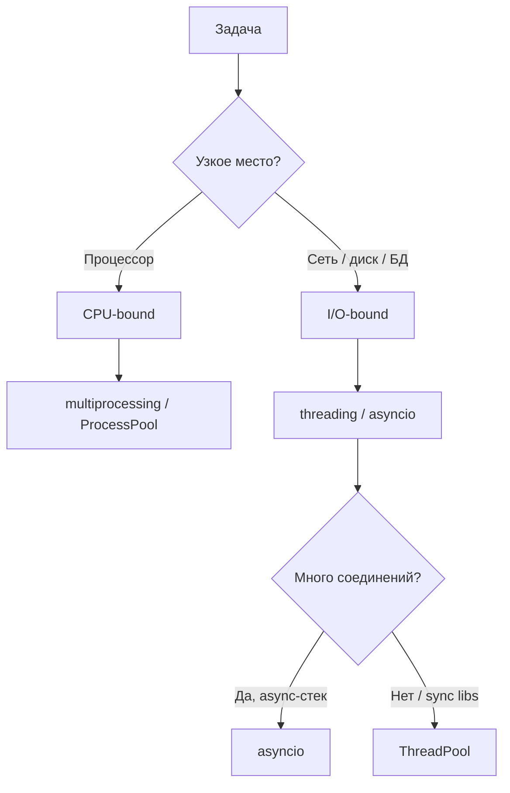
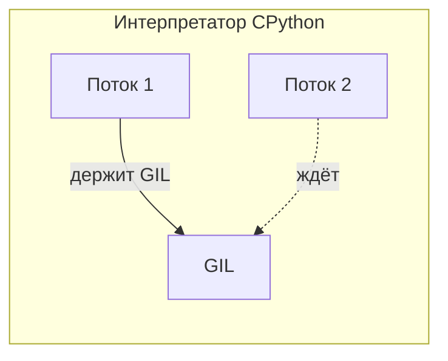
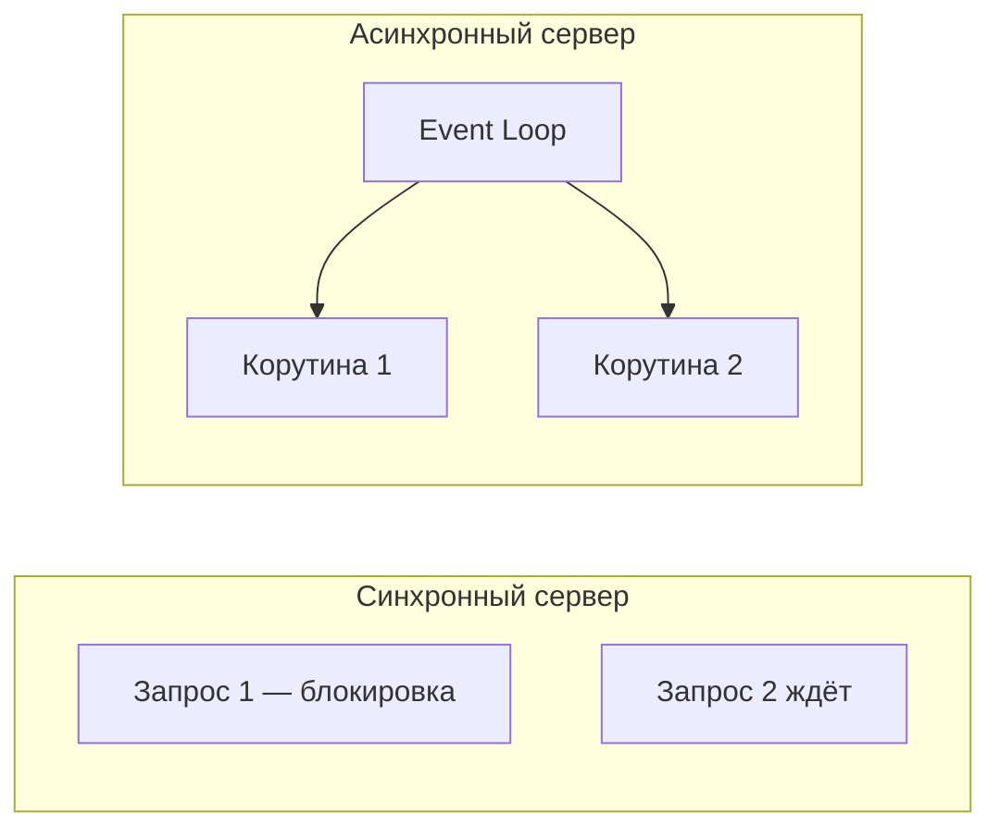
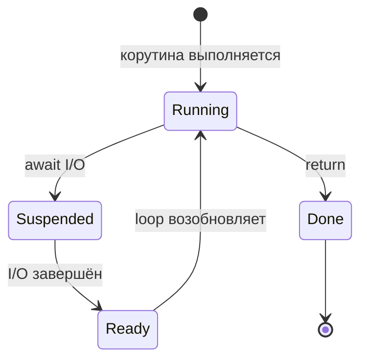
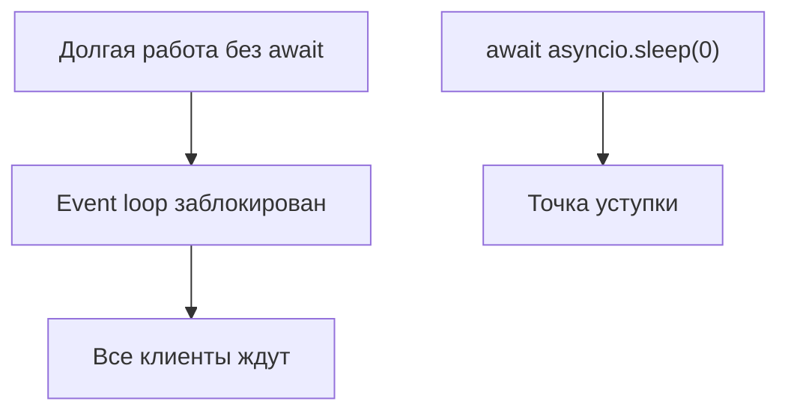
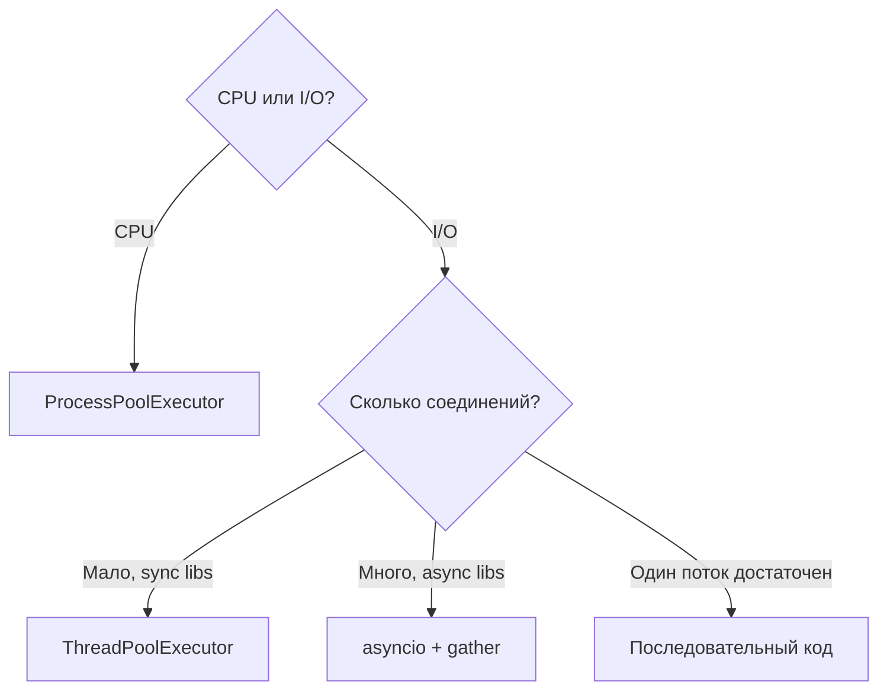

# Модуль 13: Потоки. Асинхрон. Корутины.

## Метаданные

| Параметр | Значение |
|----------|----------|
| Курс | Продвинутый Python |
| Модуль | 13 |
| Предварительные знания | Базовый Python: функции, исключения, модули; понимание блокирующего I/O; желательно модули 01–12 курса (ООП, типизация) |
| Следующий модуль | [14-filesystem-os-sys.md](14-filesystem-os-sys.md) — работа с файловой системой (`os`, `sys`) |
| Ориентировочное время | 8–10 часов (теория ~3 ч, примеры ~2 ч, практика ~4 ч) |
| Версия Python | 3.11+ |
| Ключевые темы | GIL (обзор), `threading`, `concurrent.futures`, `async`/`await`, корутины, `asyncio.run`, `Task`, `gather` |

---

## Цели обучения

После изучения модуля вы сможете:

1. **Объяснить** влияние GIL на многопоточность в CPython и **классифицировать** задачи как CPU-bound или I/O-bound.
2. **Реализовать** параллельную обработку через `threading`, `ThreadPoolExecutor` и **выбрать** между потоками и процессами.
3. **Описать** модель event loop и отличие кооперативной многозадачности от вытесняющей (`threading`).
4. **Писать** корутины с `async def` / `await`, избегая типичных ошибок (забытый `await`, блокирующий I/O в loop).
5. **Запускать** async-приложения через `asyncio.run()`, планировать задачи через `create_task` и собирать результаты через `gather`.
6. **Ограничивать** concurrency (`Semaphore`), обрабатывать таймауты и отмену задач.
7. **Выбирать** между потоками, процессами и asyncio для конкретного сценария с обоснованием trade-off.

---

## Теория

### 13.1 Зачем изучать конкурентность целиком

В реальных приложениях узкое место редко лежит «в одной строке кода». Чаще — в **ожидании** (сеть, диск, БД) или в **вычислениях** (чистый Python на CPU). Python предлагает три основных инструмента:

| Инструмент | Модель | Сильная сторона |
|------------|--------|-----------------|
| `threading` / `ThreadPoolExecutor` | Вытесняющая многозадачность ОС | Блокирующий I/O, legacy-библиотеки |
| `multiprocessing` / `ProcessPoolExecutor` | Отдельные процессы, свой GIL | CPU-bound на чистом Python |
| `asyncio` / корутины | Кооперативная многозадачность в одном потоке | Массовый I/O без тысяч потоков |

Этот модуль объединяет три ранее раздельные темы курса в **единое введение**: сначала потоки и GIL, затем концепции async, затем практический API `asyncio`.



### 13.2 GIL — краткий обзор

**GIL (Global Interpreter Lock)** — глобальная блокировка в CPython: в любой момент **только один поток** выполняет байткод Python.



**Зачем GIL?** CPython использует reference counting. Без GIL два потока могли бы одновременно изменять счётчик ссылок — утечки памяти или преждевременное удаление объектов.

**Когда GIL отпускается:**

- после порога байткода (адаптивный в 3.11+);
- при блокирующем I/O (`read`, `write`, `sleep`, сетевые вызовы);
- при ожидании в `Lock`, `queue.Queue`.

**Важно:** GIL — особенность **CPython**. В этом курсе под «Python» подразумевается CPython 3.11+.

| Тип нагрузки | Примеры | Лучший подход |
|--------------|---------|---------------|
| **CPU-bound** | Хеширование в цикле, парсинг без C-расширений | `ProcessPoolExecutor`, NumPy/C-расширения |
| **I/O-bound** | HTTP, файлы, БД | `threading`, `ThreadPoolExecutor`, **asyncio** |

**Правило большого пальца:** уберите сеть и диск — если код всё ещё медленный, это CPU-bound.

### 13.3 Модуль threading

`threading` создаёт потоки внутри **одного процесса**. Память общая — удобно для I/O, опасно для гонок при записи без синхронизации.

Основные примитивы:

- `threading.Thread(target=func, args=(...))` — запуск функции в потоке;
- `threading.Lock()` — взаимное исключение;
- `queue.Queue` — потокобезопасная очередь (предпочтительнее списка + Lock).

```python
import threading
import time

def worker(n: int) -> None:
    time.sleep(0.5)  # GIL отпускается на время sleep
    print(f"done {n}")

threads = [threading.Thread(target=worker, args=(i,)) for i in range(4)]
for t in threads:
    t.start()
for t in threads:
    t.join()
```

Потоки **легковесны** по сравнению с процессами, но GIL ограничивает параллельные **вычисления** на CPU.

### 13.4 concurrent.futures — высокоуровневый API

Модуль `concurrent.futures` — рекомендуемый способ пула потоков/процессов:

| Класс | Backend | Когда использовать |
|-------|---------|-------------------|
| `ThreadPoolExecutor` | `threading` | I/O-bound, блокирующие вызовы |
| `ProcessPoolExecutor` | `multiprocessing` | CPU-bound, embarrassingly parallel |

Ключевые методы:

- `executor.submit(fn, *args)` → `Future`;
- `executor.map(fn, iterable)` — параллельный `map`;
- `concurrent.futures.as_completed(futures)` — итерация по завершившимся;
- `Future.result(timeout=...)` — блокирует до готовности.

На Windows и macOS при `multiprocessing` защищайте точку входа:

```python
if __name__ == "__main__":
    ...
```

### 13.5 Зачем нужна асинхронность

Для I/O-bound задач потоки работают, но каждый поток — ресурс ОС (~1 МБ стека, переключение контекста). При 10 000 WebSocket-соединений потоковая модель становится тяжёлой.

**Асинхронность** — стиль, при котором одна **нить управления** (обычно один поток) обслуживает много задач, **явно отдавая управление** в точках ожидания I/O.

Async **не ускоряет CPU-bound** и **не обходит GIL** для параллельных вычислений. Он оптимизирует **ожидание**.



### 13.6 Event Loop (цикл событий)

**Event loop** — диспетчер, который:

1. Держит очередь готовых корутин и callback'ов.
2. При `await` на I/O регистрирует интерес у ОС (epoll, kqueue, IOCP).
3. Когда I/O готов — возобновляет корутину.



### 13.7 Корутины: async def и await

Функция `async def` при вызове **не выполняется сразу** — возвращает **coroutine object**:

```python
async def fetch():
    return 42

coro = fetch()  # корутина, ещё не запущена
```

Выполнение корутины:

- `await fetch()` внутри другой `async def`;
- `asyncio.run(main())` или `asyncio.create_task(coro)` на верхнем уровне.

`await expr` означает:

1. Приостановить текущую корутину, если `expr` — awaitable.
2. Передать управление event loop.
3. Возобновиться с результатом.

**Частая ошибка:** вызов `async def` без `await` → `RuntimeWarning: coroutine was never awaited`.

### 13.8 Синхронный vs асинхронный код

| Аспект | Синхронный | Асинхронный |
|--------|------------|-------------|
| Блокировка | Каждый вызов блокирует поток | Ожидание не блокирует loop (при правильном await) |
| Масштаб I/O | Поток на соединение | Тысячи корутин на поток |
| Библиотеки | Любые | Нужны async-версии (`aiohttp`, `asyncpg`) |
| CPU-bound | Обычный код / процессы | Тот же — процессы |
| Отладка | Привычный стек | Сложнее; `asyncio.run(debug=True)` |

Синхронный I/O внутри `async def` **блокирует весь event loop** — антипаттерн. Решения: `asyncio.to_thread()` или `ThreadPoolExecutor`.

### 13.9 Кооперативность vs вытеснение

Потоки **вытесняют** друг друга (ОС решает). Корутины **кооперируют**: уступают управление только в `await`. Долгий CPU-цикл без `await` **замораживает** все корутины в loop.



### 13.10 asyncio.run() — точка входа

`asyncio.run(coro)` (Python 3.7+) — рекомендуемый способ запуска async-кода:

1. Создаёт новый event loop.
2. Выполняет переданную корутину.
3. Закрывает loop и освобождает ресурсы.

```python
import asyncio

async def main():
    ...

if __name__ == "__main__":
    asyncio.run(main())
```

**В новом коде:**

- верхний уровень → `asyncio.run()`;
- внутри running loop → `asyncio.get_running_loop()` (выбросит `RuntimeError`, если loop не запущен).

Не вызывайте `asyncio.run()` внутри уже running loop (например, в FastAPI handler).

### 13.11 Task vs корутина

| Объект | Создание | Особенности |
|--------|----------|-------------|
| Coroutine | `async def` + вызов | Не планируется, пока не await/create_task |
| Task | `asyncio.create_task(coro)` | Планируется немедленно; можно отменить |

`create_task` запускает корутину в фоне, не блокируя текущую до `await task`.

### 13.12 asyncio.gather()

`await asyncio.gather(coro1, coro2, ...)` — ждёт **все** awaitables:

- `return_exceptions=False` (по умолчанию) — первое исключение пробрасывается.
- `return_exceptions=True` — исключения в списке результатов.

Для независимого I/O `gather` — идиоматичный выбор.

### 13.13 Таймауты и отмена

Python 3.11+ — контекстный менеджер `asyncio.timeout(seconds)`:

```python
async with asyncio.timeout(5):
    await slow_operation()
```

Отмена кооперативная:

1. `task.cancel()` помечает Task.
2. В точке `await` возникает `asyncio.CancelledError`.
3. Корутина должна пробросить `CancelledError` (не глотать без `raise`).

### 13.14 Semaphore и asyncio.to_thread()

`asyncio.Semaphore(n)` — не более `n` одновременных владельцев:

```python
sem = asyncio.Semaphore(10)
async with sem:
    await fetch(url)
```

`asyncio.to_thread(blocking_func, *args)` — вызов блокирующей функции в потоке без блокировки loop.

### 13.15 Async generators и async with

**Async generator:** `async def` + `yield`, потребление через `async for`.

**Async context manager:** `async with` через `__aenter__` / `__aexit__` (например, `aiohttp.ClientSession`).

### 13.16 Единая карта выбора инструмента



---

## Примеры кода

### Пример 1: CPU-bound — потоки не ускоряют

```python
"""Два потока на CPU-bound задаче не быстрее одного."""
import time
from threading import Thread


def count_hashes(n: int) -> int:
    total = 0
    for i in range(n):
        total += hash((i, i * 2, i * 3))
    return total


def run_threaded(n: int, workers: int) -> float:
    start = time.perf_counter()
    threads = [Thread(target=count_hashes, args=(n,)) for _ in range(workers)]
    for t in threads:
        t.start()
    for t in threads:
        t.join()
    return time.perf_counter() - start


if __name__ == "__main__":
    N = 500_000
    WORKERS = 4
    start = time.perf_counter()
    for _ in range(WORKERS):
        count_hashes(N)
    t_seq = time.perf_counter() - start
    t_thr = run_threaded(N, WORKERS)
    print(f"Последовательно: {t_seq:.2f} с")
    print(f"Потоки ({WORKERS}): {t_thr:.2f} с")
```

### Пример 2: I/O-bound — ThreadPoolExecutor

```python
"""Имитация I/O: time.sleep отпускает GIL."""
import time
from concurrent.futures import ThreadPoolExecutor, as_completed


def fetch_simulated(url_id: int, delay: float = 0.3) -> dict:
    time.sleep(delay)
    return {"id": url_id, "status": 200}


def fetch_all_threaded(ids: list[int], workers: int = 8) -> list[dict]:
    results: list[dict] = []
    with ThreadPoolExecutor(max_workers=workers) as pool:
        futures = {pool.submit(fetch_simulated, i): i for i in ids}
        for fut in as_completed(futures):
            results.append(fut.result())
    return results


if __name__ == "__main__":
    IDS = list(range(12))
    t0 = time.perf_counter()
    fetch_all_threaded(IDS)
    print(f"ThreadPool: {time.perf_counter() - t0:.2f} с")
```

### Пример 3: Первая корутина и asyncio.run

```python
import asyncio


async def greet(name: str, delay: float) -> str:
    await asyncio.sleep(delay)
    return f"Привет, {name}!"


async def main() -> None:
    msg = await greet("Анна", 0.5)
    print(msg)


if __name__ == "__main__":
    asyncio.run(main())
```

### Пример 4: gather — параллельное ожидание

```python
import asyncio
import time

N = 10
DELAY = 0.1


async def async_fetch_one() -> None:
    await asyncio.sleep(DELAY)


async def async_fetch_all() -> None:
    await asyncio.gather(*(async_fetch_one() for _ in range(N)))


if __name__ == "__main__":
    t0 = time.perf_counter()
    asyncio.run(async_fetch_all())
    print(f"Async gather: {time.perf_counter() - t0:.2f}s (~{DELAY}s ожидаемо)")
```

### Пример 5: create_task и фоновая работа

```python
import asyncio


async def background(name: str, n: int) -> None:
    for i in range(n):
        print(f"{name}: step {i}")
        await asyncio.sleep(0.2)


async def main() -> None:
    task = asyncio.create_task(background("worker", 3))
    print("main: задача в фоне")
    await asyncio.sleep(0.35)
    await task
    print("main: готово")


if __name__ == "__main__":
    asyncio.run(main())
```

### Пример 6: Semaphore — лимит concurrency

```python
import asyncio
import random


async def fetch(url: str, sem: asyncio.Semaphore) -> tuple[str, float]:
    async with sem:
        delay = random.uniform(0.1, 0.4)
        await asyncio.sleep(delay)
        return url, delay


async def main() -> None:
    urls = [f"/api/item/{i}" for i in range(12)]
    sem = asyncio.Semaphore(4)
    results = await asyncio.gather(*(fetch(u, sem) for u in urls))
    for url, d in results:
        print(f"{url} — {d:.2f}s")


if __name__ == "__main__":
    asyncio.run(main())
```

### Пример 7: Блокирующий вызов — to_thread

```python
import asyncio
import time


def blocking_io() -> str:
    time.sleep(1)
    return "file content"


async def main() -> None:
    async def heartbeat():
        for i in range(5):
            print(f"heartbeat {i}")
            await asyncio.sleep(0.2)

    hb = asyncio.create_task(heartbeat())
    data = await asyncio.to_thread(blocking_io)
    print("data:", data)
    await hb


if __name__ == "__main__":
    asyncio.run(main())
```

### Пример 8: Потокобезопасный счётчик с Lock

```python
import threading

counter = 0
lock = threading.Lock()


def increment_safe(times: int) -> None:
    global counter
    for _ in range(times):
        with lock:
            counter += 1


if __name__ == "__main__":
    N = 100_000
    THREADS = 8
    threads = [threading.Thread(target=increment_safe, args=(N,)) for _ in range(THREADS)]
    for t in threads:
        t.start()
    for t in threads:
        t.join()
    print(f"С Lock: {counter} (ожидали {N * THREADS})")
```

---

## Trade-off: компромиссы

| Решение | Плюсы | Минусы | Когда выбирать |
|---------|-------|--------|----------------|
| Последовательный код | Простота, нет гонок | Медленно при независимых задачах | Мало задач, прототип |
| `threading` | Низкие накладные расходы, общая память | GIL на CPU-bound; нужна синхронизация | Блокирующий I/O, legacy SDK |
| `ProcessPoolExecutor` | Настоящий параллелизм CPU | Дорогой старт, сериализация | CPU-bound пакетная обработка |
| `ThreadPoolExecutor` | Удобный API для I/O | Ограничения GIL на CPU | Пул блокирующих вызовов |
| Async / корутины | Масштаб I/O, низкие накладные расходы | Async-стек, кооперативность | Web-серверы, боты, стриминг |
| `asyncio.gather` | Параллельное ожидание | Связанная судьба задач | Независимые I/O-запросы |
| `Semaphore` | Контроль нагрузки | Может скрыть перегрузку API | Rate limit к бэкенду |
| `asyncio.to_thread` | Sync библиотеки в async | Потоки + GIL | Редкий blocking I/O |
| Процессы + async | CPU + I/O разделены | Архитектурная сложность | Gateway + тяжёлые вычисления |

---

## Практические задания

### Задание 1 (базовое): Классификация и echo

**Часть A.** Для каждой задачи определите CPU-bound или I/O-bound и назовите инструмент:

1. Скачать 50 URL через `urllib.request`.
2. Посчитать MD5 для 10 000 файлов (чистый Python).
3. Обработать 1000 JSON-ответов API (байты уже получены).
4. Парсинг логов с диска в один отчёт.

**Часть B.** Напишите `async def echo(phrase, delay)`, в `main` вызовите три фразы **последовательно** и через `gather`, замерьте время.

**Критерии приёмки:**
- Все 4 задачи классифицированы с обоснованием.
- `asyncio.run(main())`; gather быстрее последовательного режима.

**Подсказка:** Отделите «ожидание» от «вычисления в интерпретаторе».

---

### Задание 2 (среднее): Бенчмарк pools + async gather

**Условие:** Скрипт `benchmark_concurrency.py`:

1. Функция `slow_is_prime(n)` — CPU-bound.
2. Список из 80 чисел-кандидатов.
3. Режимы: sequential, `ThreadPoolExecutor(4)`, `ProcessPoolExecutor(4)`.
4. Async-часть: `async def fake_io(i)` с `asyncio.sleep(0.1)` для 20 элементов — sequential await vs `gather`.
5. Печать времени и speedup.

**Критерии приёмки:**
- `if __name__ == "__main__":` присутствует.
- ProcessPool быстрее ThreadPool на CPU-bound (4+ ядра).
- Async gather быстрее последовательного await на I/O-части.

---

### Задание 3 (продвинутое): Гибридный загрузчик

**Условие:** Мини-пайплайн:

- **Этап 1 (async I/O):** `async def load_item(i)` — `asyncio.sleep(0.05)`, возвращает `{"id": i, "payload": list(range(100))}`; загрузить id 0..19 через `gather` с `Semaphore(8)`.
- **Этап 2 (CPU):** `ProcessPoolExecutor` обрабатывает `process_item(data)` → `sum(x*x for x in payload)`.
- Вывести общую сумму, время этапов; сверить с эталоном.

**Критерии приёмки:**
- Разделение I/O и CPU явное.
- Корректная сериализация dict между пулами.
- Итоговая сумма совпадает с последовательным расчётом.

**Подсказка:** Сначала `gather` всех `load_item`, затем `process_pool.map`.

---

## Эталонные решения

<details>
<summary>Задание 1 — классификация и echo</summary>

**Классификация:**

1. I/O-bound — `ThreadPoolExecutor` или asyncio + `aiohttp`.
2. CPU-bound — `ProcessPoolExecutor`; в продакшене — `hashlib` (C) + процессы.
3. CPU-bound на малых JSON — часто последовательно; при тысячах — процессы.
4. I/O-bound к диску — последовательно или `ThreadPool`; один writer при записи.

```python
import asyncio
import time


async def echo(phrase: str, delay: float) -> str:
    await asyncio.sleep(delay)
    return phrase.upper()


async def main() -> None:
    data = [("hello", 0.3), ("async", 0.3), ("world", 0.3)]
    t0 = time.perf_counter()
    for p, d in data:
        print(await echo(p, d))
    print(f"seq: {time.perf_counter() - t0:.2f}s")

    t0 = time.perf_counter()
    results = await asyncio.gather(*(echo(p, d) for p, d in data))
    print(results)
    print(f"par: {time.perf_counter() - t0:.2f}s")


if __name__ == "__main__":
    asyncio.run(main())
```

</details>

<details>
<summary>Задание 2 — benchmark_concurrency.py</summary>

```python
import asyncio
import time
from concurrent.futures import ProcessPoolExecutor, ThreadPoolExecutor


def slow_is_prime(n: int) -> bool:
    if n < 2:
        return False
    d = 2
    while d * d <= n:
        if n % d == 0:
            return False
        d += 1
    return True


def run_cpu_seq(nums: list[int]) -> float:
    t0 = time.perf_counter()
    list(map(slow_is_prime, nums))
    return time.perf_counter() - t0


def run_cpu_threads(nums: list[int]) -> float:
    t0 = time.perf_counter()
    with ThreadPoolExecutor(max_workers=4) as ex:
        list(ex.map(slow_is_prime, nums))
    return time.perf_counter() - t0


def run_cpu_processes(nums: list[int]) -> float:
    t0 = time.perf_counter()
    with ProcessPoolExecutor(max_workers=4) as ex:
        list(ex.map(slow_is_prime, nums))
    return time.perf_counter() - t0


async def fake_io(i: int) -> int:
    await asyncio.sleep(0.1)
    return i


async def run_io_seq() -> float:
    t0 = time.perf_counter()
    for i in range(20):
        await fake_io(i)
    return time.perf_counter() - t0


async def run_io_gather() -> float:
    t0 = time.perf_counter()
    await asyncio.gather(*(fake_io(i) for i in range(20)))
    return time.perf_counter() - t0


if __name__ == "__main__":
    nums = [50_000 + i * 2 + 1 for i in range(80)]
    t_seq = run_cpu_seq(nums)
    t_thr = run_cpu_threads(nums)
    t_proc = run_cpu_processes(nums)
    print(f"CPU sequential: {t_seq:.2f}s")
    print(f"CPU threads:    {t_thr:.2f}s")
    print(f"CPU processes:  {t_proc:.2f}s (speedup {t_seq/t_proc:.1f}x)")

    t_io_seq = asyncio.run(run_io_seq())
    t_io_par = asyncio.run(run_io_gather())
    print(f"I/O sequential: {t_io_seq:.2f}s")
    print(f"I/O gather:     {t_io_par:.2f}s")
```

</details>

<details>
<summary>Задание 3 — гибридный загрузчик</summary>

```python
import asyncio
import time
from concurrent.futures import ProcessPoolExecutor


async def load_item(i: int) -> dict:
    await asyncio.sleep(0.05)
    return {"id": i, "payload": list(range(100))}


def process_item(data: dict) -> int:
    return sum(x * x for x in data["payload"])


async def load_all(ids: list[int], concurrency: int) -> list[dict]:
    sem = asyncio.Semaphore(concurrency)

    async def bounded(i: int) -> dict:
        async with sem:
            return await load_item(i)

    return await asyncio.gather(*(bounded(i) for i in ids))


if __name__ == "__main__":
    ids = list(range(20))
    t0 = time.perf_counter()
    loaded = asyncio.run(load_all(ids, 8))
    t_io = time.perf_counter() - t0

    t1 = time.perf_counter()
    with ProcessPoolExecutor(max_workers=4) as cpu_pool:
        results = list(cpu_pool.map(process_item, loaded))
    t_cpu = time.perf_counter() - t1

    total = sum(results)
    ref = sum(process_item(asyncio.run(load_item(i))) for i in ids)
    assert total == ref
    print(f"I/O: {t_io:.2f}s, CPU: {t_cpu:.2f}s, sum: {total}")
```

</details>

---

## Вопросы для самопроверки

1. **Что такое GIL и почему в CPython только один поток выполняет байткод?**  
   *Ответ:* GIL защищает reference counting и внутренние структуры CPython от гонок при доступе из нескольких потоков.

2. **Почему 8 потоков не ускоряют в 8 раз чистый Python-цикл на CPU?**  
   *Ответ:* Потоки конкурируют за один GIL; параллельно байткод выполняет только один поток.

3. **Что возвращает вызов `async def` функции без await?**  
   *Ответ:* Объект корутины; он не выполняется до await или передачи в loop.

4. **Чем event loop отличается от планировщика потоков ОС?**  
   *Ответ:* Loop кооперативный — переключение только в await; ОС вытесняет потоки принудительно.

5. **Почему `time.sleep` внутри корутины опасен?**  
   *Ответ:* Блокирует поток с event loop; все корутины замирают.

6. **Когда предпочесть ProcessPoolExecutor вместо ThreadPoolExecutor?**  
   *Ответ:* Когда задачи CPU-bound и их можно распараллелить.

7. **Чем `asyncio.run()` лучше ручного создания loop?**  
   *Ответ:* Стандартизирует lifecycle loop; меньше утечек ресурсов.

8. **Зачем Semaphore в async-клиенте?**  
   *Ответ:* Ограничить число одновременных операций, не перегружая сервер и локальные ресурсы.

9. **Может ли threading ускорить загрузку 100 URL?**  
   *Ответ:* Да, это I/O-bound; альтернатива — asyncio.

10. **Связь async с GIL?**  
    *Ответ:* Корутины в одном потоке не конкурируют за GIL; CPU-bound всё равно нужны процессы.

---

## Методические указания

### Тайминг занятия

| Блок | Время | Активность |
|------|-------|------------|
| GIL, CPU vs I/O | 50 мин | Лекция + диаграмма |
| threading, concurrent.futures | 60 мин | Примеры 1–2, 8 |
| Мотивация async, event loop | 45 мин | Сравнение с потоками |
| async/await, корутины | 50 мин | Примеры 3–4 |
| asyncio.run, Task, gather | 60 мин | Примеры 5–6 |
| Semaphore, to_thread, отмена | 40 мин | Пример 7 |
| Практика | 90–120 мин | Задания 2–3 |
| Самопроверка | 20 мин | Вопросы, связь с модулем 15 |

### Типичные ошибки

1. **Ожидание ускорения CPU-кода через потоки** — покажите пример 1.
2. **Забытый `await`** — `RuntimeWarning: coroutine was never awaited`.
3. **`time.sleep` в async** — блокирует loop; используйте `asyncio.sleep` или `to_thread`.
4. **Забытый `if __name__ == "__main__":`** при ProcessPool на Windows.
5. **`asyncio.run()` внутри running loop** — в FastAPI/Jupyter другой паттерн.
6. **Гонки без Lock** — пример 8.
7. **Ожидание ускорения CPU через async** — async только для I/O.

### FAQ

**GIL уберут из Python?**  
PEP 703 предлагает optional free-threading в 3.13+; в стандартной сборке GIL пока остаётся.

**async лучше потоков?**  
Для массового I/O часто да; для блокирующих legacy-библиотек — потоки проще.

**Нужно ли изучать генераторы перед async generators?**  
Да, `yield` и `async for` логически связаны.

**Jupyter и asyncio?**  
Уже running loop — используйте `await main()` в ячейке или `nest_asyncio` (осторожно в продакшене).

---

## Дополнительные материалы

### Документация

- [What is the Python GIL? — Real Python](https://realpython.com/python-gil/)
- [Async IO in Python — Real Python](https://realpython.com/async-io-python/)
- [Документация `concurrent.futures`](https://docs.python.org/3/library/concurrent.futures.html)
- [Документация `asyncio`](https://docs.python.org/3/library/asyncio.html)
- [PEP 492 — Coroutines with async and await](https://peps.python.org/pep-0492/)
- [PEP 703 — Optional GIL](https://peps.python.org/pep-0703/)

### Связь с другими модулями

- **Модуль 14:** файловый I/O и CLI — синхронный контекст для скриптов.
- **Модуль 15:** лабораторная работа — интеграция ООП, файлов, исключений и опционально async.
- **Архив курса:** `_archive/01-gil.md`, `_archive/02-async.md`, `_archive/03-asyncio.md` — исходные развёрнутые версии тем.
