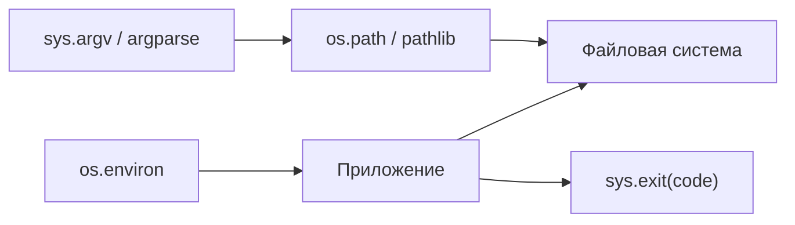
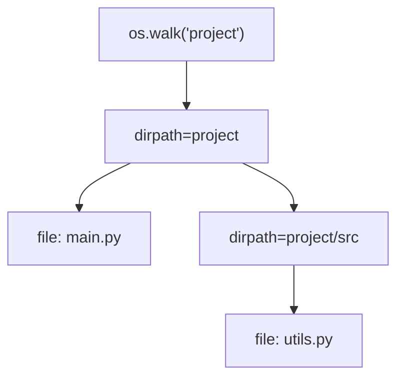

# Модуль 14: Работа с файловой системой в Python (os, sys)

## Метаданные

| Параметр | Значение |
|----------|----------|
| Курс | Продвинутый Python |
| Модуль | 14 |
| Предварительные знания | Базовый Python: файлы, исключения, функции; модуль 13 — понимание I/O-bound задач |
| Следующий модуль | [15-lab-3.md](15-lab-3.md) — лабораторная работа №3 (интеграция ООП, файлов, исключений) |
| Ориентировочное время | 5–6 часов |
| Версия Python | 3.11+ |
| Ключевые темы | `os.environ`, `os.path`, `os.walk`, `sys.argv`, `sys.exit`, `sys.platform`, кратко `pathlib` |

---

## Цели обучения

После изучения модуля вы сможете:

1. **Читать и устанавливать** переменные окружения через `os.environ` с безопасными значениями по умолчанию.
2. **Строить и проверять** пути с `os.path.join`, `exists`, `isdir`, `isfile`, `abspath`.
3. **Обходить** дерево каталогов с `os.walk` и фильтровать файлы по расширению.
4. **Разбирать** аргументы командной строки через `sys.argv` и завершать скрипт с кодом через `sys.exit`.
5. **Определять** платформу через `sys.platform` и писать переносимый код.
6. **Сравнивать** `os.path` с `pathlib.Path` и **выбирать** API под задачу.
7. **Собирать** переносимые CLI-утилиты, комбинируя `os`, `sys` и (опционально) `pathlib`.

---

## Теория

### 14.1 Зачем системные модули

Python — «клей» между компонентами: скрипты деплоя, ETL, devtools, автоматизация CI. Стандартная библиотека даёт **кроссплатформенный** доступ к ОС без сторонних зависимостей.

Типичный стек утилиты:

1. `sys.argv` или `argparse` — разбор CLI
2. `os.path` / `pathlib` — пути к файлам
3. `os.environ` — конфигурация из окружения
4. `os.walk` — обход дерева
5. `sys.exit` — код возврата для shell



Этот модуль фокусируется на **`os`** и **`sys`**. Модули `subprocess`, `logging`, `argparse` подробно разбираются в расширенных материалах (`_archive/10-system-libraries.md`).

### 14.2 Модуль os — интерфейс к ОС

Модуль `os` предоставляет тонкую обёртку над системными вызовами. Для файловой системы чаще всего используют:

- `os.environ` — переменные окружения;
- `os.path` — операции с путями (legacy, но повсеместно);
- `os.walk` — рекурсивный обход;
- `os.makedirs`, `os.listdir`, `os.getcwd`, `os.chdir`.

### 14.3 Переменные окружения: os.environ

Окружение процесса — набор пар «ключ=значение», наследуемых от родительского shell или контейнера.

```python
import os

# Чтение с default
db_url = os.environ.get("DATABASE_URL", "sqlite:///local.db")
debug = os.environ.get("APP_DEBUG", "0").lower() in {"1", "true", "yes"}

# Установка (видна дочерним процессам текущего процесса)
os.environ["MY_APP_MODE"] = "debug"
```

**Практика 12-factor:** секреты и конфигурация окружения — **только из env** или secret manager, не из кода.

| Паттерн | Пример | Замечание |
|---------|--------|-----------|
| Строка с default | `os.environ.get("HOST", "127.0.0.1")` | Всегда строка |
| Число | `int(os.environ.get("PORT", "8000"))` | Явное приведение типа |
| Флаг | `os.environ.get("VERBOSE", "") == "1"` | Нет встроенного bool |
| Обязательное значение | `os.environ["API_KEY"]` | `KeyError`, если нет |

```python
from dataclasses import dataclass


@dataclass(frozen=True)
class AppConfig:
    host: str
    port: int
    debug: bool


def load_config() -> AppConfig:
    host = os.environ.get("APP_HOST", "127.0.0.1")
    port = int(os.environ.get("APP_PORT", "8000"))
    debug = os.environ.get("APP_DEBUG", "0").lower() in {"1", "true", "yes"}
    return AppConfig(host=host, port=port, debug=debug)
```

### 14.4 os.path — работа с путями (legacy API)

`os.path` оперирует **строками**. На Windows и Unix разделители разные — `os.path.join` нормализует:

```python
import os

# Сборка пути
path = os.path.join("data", "logs", "app.log")  # data/logs/app.log на Linux

# Проверки
exists = os.path.exists(path)
is_file = os.path.isfile(path)
is_dir = os.path.isdir(path)

# Компоненты пути
dirname = os.path.dirname(path)      # data/logs
basename = os.path.basename(path)    # app.log
name, ext = os.path.splitext(path)   # ('.../app', '.log')

# Абсолютный путь
abs_path = os.path.abspath("relative/dir")

# Нормализация . и ..
norm = os.path.normpath("../data/./logs")
```

**Когда встречается:** legacy-код, некоторые фреймворки, обёртки над C-библиотеками. Для **нового** кода часто предпочтителен `pathlib`, но `os.path` обязателен к чтению.

| Функция | Назначение |
|---------|------------|
| `os.path.join(*parts)` | Склеить компоненты с правильным разделителем |
| `os.path.exists(path)` | Существует ли путь (файл или каталог) |
| `os.path.isfile` / `isdir` | Уточнение типа |
| `os.path.abspath` | Абсолютный путь от текущей CWD |
| `os.path.relpath(path, start)` | Относительный путь |
| `os.path.split` | `(dir, file)` |
| `os.path.getsize(path)` | Размер файла в байтах |

### 14.5 Создание каталогов и список содержимого

```python
import os

# Создать вложенные каталоги (не падать, если уже есть)
os.makedirs("output/reports/2026", exist_ok=True)

# Текущий рабочий каталог
cwd = os.getcwd()
print(cwd)

# Список одного уровня
entries = os.listdir(".")
for name in entries:
    full = os.path.join(".", name)
    kind = "dir" if os.path.isdir(full) else "file"
    print(kind, name)
```

**Осторожно:** `os.chdir(path)` меняет CWD **всего процесса** — в библиотеках лучше работать с абсолютными путями, не полагаясь на глобальный CWD.

### 14.6 os.walk — обход дерева каталогов

`os.walk(top)` генерирует кортежи `(dirpath, dirnames, filenames)` для каждого каталога в дереве:

```python
import os

for dirpath, dirnames, filenames in os.walk("project"):
    # dirpath — текущий каталог
    # dirnames — подкаталоги (можно модифицировать — пропустить ветки)
    # filenames — файлы в dirpath
    for name in filenames:
        if name.endswith(".py"):
            full_path = os.path.join(dirpath, name)
            print(full_path)
```

**Сложность:** O(число файлов и каталогов). Для простого glob по шаблону удобнее `pathlib.Path.rglob`, но `os.walk` даёт контроль над обходом (пропуск `node_modules`, `.git`):

```python
SKIP = {".git", ".venv", "venv", "__pycache__", "node_modules"}

for dirpath, dirnames, filenames in os.walk("."):
    dirnames[:] = [d for d in dirnames if d not in SKIP]
    for name in filenames:
        if name.endswith(".py"):
            print(os.path.join(dirpath, name))
```



### 14.7 Модуль sys — интерпретатор Python

`sys` даёт доступ к параметрам интерпретатора и «системным» потокам, а не к файловой системе напрямую.

#### sys.argv — аргументы командной строки

```python
import sys

# sys.argv[0] — имя скрипта (или '-c', '-m')
# sys.argv[1:] — аргументы пользователя
if len(sys.argv) < 2:
    print("Использование: script.py <каталог>", file=sys.stderr)
    sys.exit(2)

target_dir = sys.argv[1]
print(f"Сканируем: {target_dir}")
```

Пример запуска:

```bash
python scan.py ./src --verbose
# sys.argv == ['scan.py', './src', '--verbose']
```

Для реальных CLI с `--help` используйте `argparse`; `sys.argv` — низкоуровневый доступ и основа для понимания, как парсеры работают «под капотом».

#### sys.exit — завершение с кодом

```python
import sys

def main() -> None:
    try:
        run()
    except FileNotFoundError as e:
        print(f"Ошибка: {e}", file=sys.stderr)
        sys.exit(1)
    sys.exit(0)

# Идиоматичнее для функции main, возвращающей int:
def main() -> int:
    ...
    return 0

if __name__ == "__main__":
    raise SystemExit(main())
```

| Код | Смысл (Unix convention) |
|-----|-------------------------|
| 0 | Успех |
| 1 | Общая ошибка |
| 2 | Неверное использование (usage) |
| 127 | Команда не найдена (часто в обёртках) |

Shell проверяет код: `echo $?` (Linux), `echo %ERRORLEVEL%` (Windows).

#### sys.platform — определение ОС

```python
import sys

platform = sys.platform  # 'linux', 'darwin', 'win32', 'cygwin', ...

if sys.platform == "win32":
    # Windows-специфика (например, кодировка консоли)
    ...
elif sys.platform == "darwin":
    ...
else:
    # Linux и прочие Unix-подобные
    ...
```

Для тонкой настройки иногда используют `os.name` (`'posix'`, `'nt'`) или модуль `platform`, но `sys.platform` достаточен для ветвления в скриптах.

#### Потоки ввода-вывода

```python
sys.stdout.write("message\n")
sys.stderr.write("error\n")
```

`print()` пишет в `sys.stdout` и добавляет `end` по умолчанию. Ошибки направляйте в `stderr` — shell может перенаправлять потоки раздельно.

#### Прочие полезные атрибуты

```python
encoding = sys.getdefaultencoding()   # обычно utf-8
version = sys.version_info            # (3, 11, 0, ...)
# sys.setrecursionlimit(5000)         # осторожно!
```

### 14.8 pathlib — краткое сравнение (современная альтернатива)

`pathlib.Path` (Python 3.4+, рекомендован с 3.6+) — объектный API для тех же задач:

```python
from pathlib import Path

root = Path("project")
config = root / "config" / "settings.toml"

if config.is_file():
    text = config.read_text(encoding="utf-8")

out_dir = Path("output") / "reports"
out_dir.mkdir(parents=True, exist_ok=True)

for py_file in root.rglob("*.py"):
    if "venv" not in py_file.parts:
        print(py_file)
```

| Аспект | `os.path` + строки | `pathlib.Path` |
|--------|-------------------|----------------|
| Синтаксис | `os.path.join(a, b)` | `a / b` |
| Тип | `str` | `Path` |
| Чтение файла | `open(path)` | `path.read_text()` |
| Обход | `os.walk` | `iterdir`, `rglob` |
| Где встречается | Legacy, C-обёртки | Новый код, утилиты |

**Рекомендация курса:** читайте и пишите уверенно оба API. В лабораторной работе №3 (`15-lab-3.md`) допускается `pathlib` для удобства, но задания модуля 14 тренируют именно `os`/`sys`.

### 14.9 Кроссплатформенность и подводные камни

- **Разделители:** `os.path.join` и `Path` нормализуют; не склеивайте пути вручную через `'/'` без нужды.
- **Кодировка:** на Windows явно `encoding="utf-8"` при чтении/записи текстовых файлов.
- **Симлинки:** `os.path.exists` следует по ссылкам; `Path.is_symlink()` для проверки типа.
- **Относительные пути:** зависят от CWD — для скриптов надёжнее `abspath` или `Path(__file__).resolve().parent`.
- **Права доступа:** `PermissionError` при обходе системных каталогов — обрабатывайте в `try/except`.

### 14.10 Паттерн переносимого скрипта

```text
1. Разбор sys.argv (или argparse)
2. load_config() из os.environ
3. Проверка путей через os.path
4. os.walk / обработка файлов
5. Логирование в stderr при ошибках
6. sys.exit(exit_code)
```

```python
#!/usr/bin/env python3
"""count_py.py — подсчёт .py файлов в каталоге."""
import os
import sys


def count_python_files(root: str) -> int:
    if not os.path.isdir(root):
        raise NotADirectoryError(root)
    total = 0
    for dirpath, _, filenames in os.walk(root):
        for name in filenames:
            if name.endswith(".py"):
                total += 1
    return total


def main(argv: list[str]) -> int:
    if len(argv) != 2:
        print(f"Использование: {argv[0]} <каталог>", file=sys.stderr)
        return 2
    root = argv[1]
    try:
        n = count_python_files(root)
    except (NotADirectoryError, PermissionError) as e:
        print(f"Ошибка: {e}", file=sys.stderr)
        return 1
    print(f"Найдено .py файлов: {n}")
    return 0


if __name__ == "__main__":
    sys.exit(main(sys.argv))
```

---

## Примеры кода

### Пример 1: Конфигурация из окружения

```python
import os
import sys


def require_env(name: str) -> str:
    value = os.environ.get(name)
    if not value:
        print(f"Переменная {name} не задана", file=sys.stderr)
        sys.exit(2)
    return value


def main() -> int:
    api_key = require_env("API_KEY")
    base_url = os.environ.get("API_BASE_URL", "https://api.example.com")
    print(f"Подключение к {base_url} (ключ: {len(api_key)} символов)")
    return 0


if __name__ == "__main__":
    sys.exit(main())
```

### Пример 2: os.path — анализ пути

```python
import os

def analyze_path(path: str) -> None:
    print("join:", os.path.join("data", "out", "report.csv"))
    print("exists:", os.path.exists(path))
    print("isfile:", os.path.isfile(path))
    print("isdir:", os.path.isdir(path))
    print("abspath:", os.path.abspath(path))
    print("dirname:", os.path.dirname(path))
    print("basename:", os.path.basename(path))
    print("splitext:", os.path.splitext(path))


if __name__ == "__main__":
    analyze_path(__file__)
```

### Пример 3: os.walk с фильтрацией

```python
import os

SKIP_DIRS = {".git", ".venv", "__pycache__", "node_modules"}


def find_files(root: str, suffix: str) -> list[str]:
    result: list[str] = []
    for dirpath, dirnames, filenames in os.walk(root):
        dirnames[:] = [d for d in dirnames if d not in SKIP_DIRS]
        for name in filenames:
            if name.endswith(suffix):
                result.append(os.path.join(dirpath, name))
    return sorted(result)


if __name__ == "__main__":
    for path in find_files(".", ".md")[:10]:
        size = os.path.getsize(path)
        print(f"{size:>8}  {path}")
```

### Пример 4: sys.argv и коды возврата

```python
import os
import sys


def main() -> int:
    if len(sys.argv) < 2:
        print(f"Использование: {sys.argv[0]} <файл>", file=sys.stderr)
        return 2

    path = sys.argv[1]
    if not os.path.isfile(path):
        print(f"Не файл: {path}", file=sys.stderr)
        return 1

    size = os.path.getsize(path)
    print(f"{path}: {size} байт")
    return 0


if __name__ == "__main__":
    sys.exit(main())
```

### Пример 5: sys.platform — ветвление

```python
import os
import sys


def default_config_dir() -> str:
    if sys.platform == "win32":
        base = os.environ.get("APPDATA", os.path.expanduser("~"))
        return os.path.join(base, "MyApp")
    if sys.platform == "darwin":
        return os.path.expanduser("~/Library/Application Support/MyApp")
    # Linux и прочие
    xdg = os.environ.get("XDG_CONFIG_HOME", os.path.expanduser("~/.config"))
    return os.path.join(xdg, "myapp")


if __name__ == "__main__":
    config_dir = default_config_dir()
    os.makedirs(config_dir, exist_ok=True)
    print("Config dir:", os.path.abspath(config_dir))
```

### Пример 6: Суммарный размер дерева

```python
import os
import sys


def tree_size(root: str) -> int:
    total = 0
    for dirpath, _, filenames in os.walk(root):
        for name in filenames:
            fp = os.path.join(dirpath, name)
            try:
                total += os.path.getsize(fp)
            except OSError:
                pass
    return total


def main() -> int:
    root = sys.argv[1] if len(sys.argv) > 1 else "."
    if not os.path.isdir(root):
        print("Не каталог", file=sys.stderr)
        return 1
    print(f"Размер {os.path.abspath(root)}: {tree_size(root)} байт")
    return 0


if __name__ == "__main__":
    sys.exit(main())
```

### Пример 7: pathlib рядом с os (миграция)

```python
import os
from pathlib import Path


def legacy_join(base: str, *parts: str) -> str:
    return os.path.join(base, *parts)


def modern_join(base: str, *parts: str) -> Path:
    p = Path(base)
    for part in parts:
        p = p / part
    return p


if __name__ == "__main__":
    assert legacy_join("data", "logs", "a.log") == str(modern_join("data", "logs", "a.log"))
    print("Эквивалентны для POSIX-подобных путей")
```

### Пример 8: Мини-инвентаризация с argv

```python
import os
import sys


def inventory(directory: str, pattern_suffix: str) -> tuple[int, int]:
    """Возвращает (число файлов, суммарный размер)."""
    count = 0
    total = 0
    for dirpath, _, filenames in os.walk(directory):
        for name in filenames:
            if pattern_suffix and not name.endswith(pattern_suffix):
                continue
            fp = os.path.join(dirpath, name)
            count += 1
            total += os.path.getsize(fp)
    return count, total


def main() -> int:
    # python inventory.py ./src .py
    if len(sys.argv) < 2:
        print(f"Usage: {sys.argv[0]} <dir> [suffix]", file=sys.stderr)
        return 2
    directory = sys.argv[1]
    suffix = sys.argv[2] if len(sys.argv) > 2 else ""
    if not os.path.isdir(directory):
        return 1
    n, size = inventory(directory, suffix)
    print(f"Файлов: {n}, байт: {size}")
    return 0


if __name__ == "__main__":
    sys.exit(main())
```

---

## Trade-off: компромиссы

| Решение | Плюсы | Минусы | Когда выбирать |
|---------|-------|--------|----------------|
| `os.path` + строки | Универсально, legacy-совместимо | Verbose, легко ошибиться | Чтение старого кода, C API |
| `pathlib.Path` | Читаемость, `/` operator | Незначительный overhead | Новый код, файловые утилиты |
| `os.walk` | Полный контроль обхода | Callback-стиль | Пропуск веток, кастомная логика |
| `Path.rglob` | Лаконичный glob | Меньше контроля над dirnames | Простой поиск по шаблону |
| `sys.argv` | Нет зависимостей, прозрачность | Нет `--help`, валидации | Учебные скрипты, 1–2 аргумента |
| `argparse` | Автогенерация help, типы | Многословнее | Реальные CLI |
| `os.environ` | 12-factor, контейнеры | Всё строки | Деплой, секреты |
| Файл config.yaml | Сложная конфигурация | Ещё один артефакт | Много параметров |
| `sys.exit(code)` | Shell-интеграция | Нужна дисциплина кодов | Все CLI-скрипты |
| Исключения без exit code | Проще в REPL | Неконтролируемый код 1 | Прототипы, не production CLI |

---

## Практические задания

### Задание 1 (базовое): env-show и path-check

**Условие:** Скрипт `env_path_demo.py`:

1. Читает `ROOT_DIR` из `os.environ` (default `.`).
2. Печатает `sys.platform` и `sys.version_info[:2]`.
3. Если передан аргумент CLI — использует его вместо `ROOT_DIR`.
4. Проверяет `os.path.isdir`; если нет — сообщение в stderr, `sys.exit(1)`.
5. Печатает абсолютный путь и число **непосредственных** подкаталогов (`os.listdir` + `isdir`).

**Пример:**

```bash
ROOT_DIR=/tmp python env_path_demo.py
python env_path_demo.py ./topics
```

**Критерии приёмки:**
- Корректные коды возврата 0/1.
- Использованы `os.environ`, `os.path`, `sys.argv`, `sys.platform`, `sys.exit`.

---

### Задание 2 (среднее): Обход дерева и отчёт

**Условие:** `tree_report.py`:

1. Позиционный аргумент — корневой каталог (`sys.argv[1]`).
2. Опциональный второй аргумент — расширение (например `.py`); если нет — все файлы.
3. `os.walk` с пропуском `.git`, `venv`, `__pycache__`.
4. Вывод: число файлов, суммарный размер, топ-5 самых больших путей.
5. При ошибке доступа к каталогу — stderr + exit 1.

**Критерии приёмки:**
- Только stdlib (`os`, `sys`).
- Топ-5 отсортирован по убыванию размера.

**Подсказка:** `os.path.getsize` в try/except `OSError`.

---

### Задание 3 (продвинутое): Переносимый sync-manifest

**Условие:** `sync_manifest.py`:

1. Аргументы: `source_dir`, `manifest_path` (файл со списком относительных путей, по одному на строку).
2. Переменная `MANIFEST_PREFIX` (default `data/`) — префикс для путей в manifest.
3. Для каждой строки manifest проверить `os.path.isfile(os.path.join(source_dir, rel))`.
4. Вывести на stdout: `OK rel` или `MISSING rel` (stderr для MISSING).
5. Код возврата: 0 если все OK, 1 если есть MISSING, 2 при неверном usage.
6. На `win32` печатать предупреждение, если пути содержат `\` (рекомендация POSIX-слешей).

**Критерии приёмки:**
- `os.environ.get`, `os.path.join`, `sys.platform`, `sys.exit`.
- Чтение manifest через `open` (кодировка utf-8).

---

## Эталонные решения

<details>
<summary>Задание 1 — env_path_demo.py</summary>

```python
import os
import sys


def main() -> int:
    root = os.environ.get("ROOT_DIR", ".")
    if len(sys.argv) > 1:
        root = sys.argv[1]

    print("platform:", sys.platform)
    print("python:", sys.version_info[:2])

    if not os.path.isdir(root):
        print(f"Не каталог: {root}", file=sys.stderr)
        return 1

    abs_root = os.path.abspath(root)
    subdirs = [
        name for name in os.listdir(root)
        if os.path.isdir(os.path.join(root, name))
    ]
    print("abs:", abs_root)
    print("subdirs:", len(subdirs))
    return 0


if __name__ == "__main__":
    sys.exit(main())
```

</details>

<details>
<summary>Задание 2 — tree_report.py</summary>

```python
import os
import sys


SKIP = {".git", "venv", ".venv", "__pycache__"}


def collect(root: str, ext: str) -> list[tuple[int, str]]:
    files: list[tuple[int, str]] = []
    for dirpath, dirnames, filenames in os.walk(root):
        dirnames[:] = [d for d in dirnames if d not in SKIP]
        for name in filenames:
            if ext and not name.endswith(ext):
                continue
            fp = os.path.join(dirpath, name)
            try:
                files.append((os.path.getsize(fp), fp))
            except OSError:
                pass
    return files


def main() -> int:
    if len(sys.argv) < 2:
        print(f"Usage: {sys.argv[0]} <dir> [ext]", file=sys.stderr)
        return 2
    root = sys.argv[1]
    ext = sys.argv[2] if len(sys.argv) > 2 else ""
    if not os.path.isdir(root):
        print("Не каталог", file=sys.stderr)
        return 1

    files = collect(root, ext)
    total = sum(s for s, _ in files)
    print(f"Файлов: {len(files)}, байт: {total}")
    for size, path in sorted(files, reverse=True)[:5]:
        print(f"  {size:>12}  {path}")
    return 0


if __name__ == "__main__":
    sys.exit(main())
```

</details>

<details>
<summary>Задание 3 — sync_manifest.py</summary>

```python
import os
import sys


def main() -> int:
    if len(sys.argv) != 3:
        print(f"Usage: {sys.argv[0]} <source_dir> <manifest>", file=sys.stderr)
        return 2

    source_dir, manifest_path = sys.argv[1], sys.argv[2]
    prefix = os.environ.get("MANIFEST_PREFIX", "data/")

    if not os.path.isdir(source_dir):
        print("source_dir не каталог", file=sys.stderr)
        return 1

    if sys.platform == "win32":
        print("Предупреждение: используйте / в путях manifest", file=sys.stderr)

    missing = 0
    with open(manifest_path, encoding="utf-8") as f:
        for line in f:
            rel = line.strip()
            if not rel:
                continue
            if "\\" in rel and sys.platform == "win32":
                rel = rel.replace("\\", "/")
            full = os.path.join(source_dir, prefix, rel) if prefix else os.path.join(source_dir, rel)
            if os.path.isfile(full):
                print("OK", rel)
            else:
                print("MISSING", rel, file=sys.stderr)
                missing += 1

    return 1 if missing else 0


if __name__ == "__main__":
    sys.exit(main())
```

</details>

---

## Вопросы для самопроверки

1. Чем `os.environ.get("KEY", default)` лучше прямого `os.environ["KEY"]`?
2. Почему не склеивать пути через `base + "/" + name`?
3. Что возвращает `os.walk` на каждой итерации?
4. Как пропустить каталог `.git` при обходе, не меняя `os.walk` целиком?
5. Что хранится в `sys.argv[0]`?
6. Какой код возврата означает успех для shell?
7. Какие значения `sys.platform` вы ожидаете на Linux и Windows?
8. Зачем печатать ошибки в `sys.stderr`, а не в stdout?
9. Где хранить секреты: в коде, argparse или `os.environ`?
10. Когда `pathlib` предпочтительнее `os.path`?

---

## Методические указания

### Тайминг

| Блок | Время |
|------|-------|
| os.environ, конфигурация | 40 мин |
| os.path, makedirs, listdir | 50 мин |
| os.walk, фильтрация | 45 мин |
| sys.argv, sys.exit, platform | 40 мин |
| pathlib — сравнение | 25 мин |
| Практика задания 2–3 | 90 мин |

### Типичные ошибки

- Забыть `encoding="utf-8"` при чтении manifest на Windows.
- Путать `os.path.exists` (файл или каталог) с `isfile` / `isdir`.
- Не проверять `len(sys.argv)` — `IndexError`.
- Менять `os.chdir` в библиотечном коде — ломает вызывающий код.
- Логировать каждый файл в walk по миллиону записей — I/O bottleneck.

### Для преподавателя

- Live demo: `echo $?` после `sys.exit(1)`.
- Показать один и тот же путь через `os.path` и `Path`.
- Связать с модулем 15: лабораторная использует те же приёмы в ООП-обёртке.

### FAQ

**argparse обязателен?**  
Для модуля 14 — нет; фокус на `sys.argv`. В продакшене — `argparse` или `typer`.

**os.walk vs scandir?**  
`os.scandir` быстрее для одного уровня; `walk` удобнее для полного дерева.

---

## Дополнительные материалы

- [os — Miscellaneous operating system interfaces](https://docs.python.org/3/library/os.html)
- [sys — System-specific parameters](https://docs.python.org/3/library/sys.html)
- [pathlib — Object-oriented filesystem paths](https://docs.python.org/3/library/pathlib.html)
- [The Twelve-Factor App: Config](https://12factor.net/config)
- Расширенная версия: `_archive/10-system-libraries.md` (`subprocess`, `logging`, `argparse`)
- Следующий шаг: [15-lab-3.md](15-lab-3.md)
