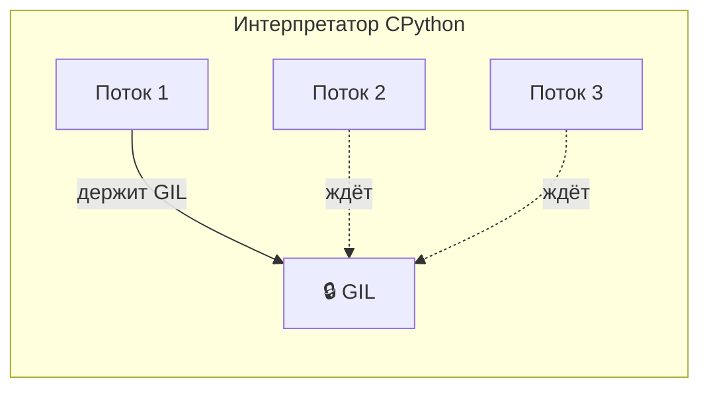
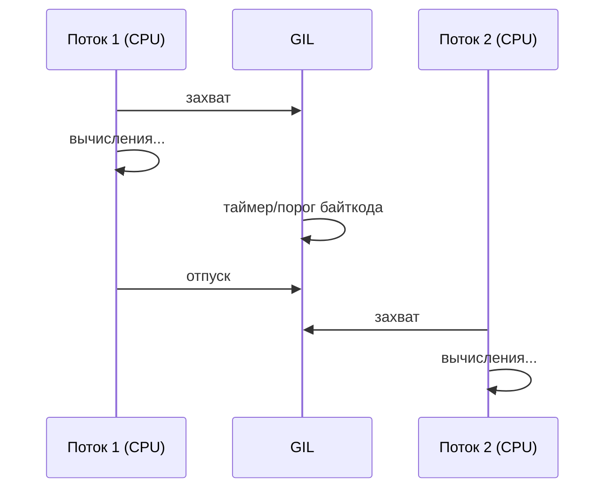
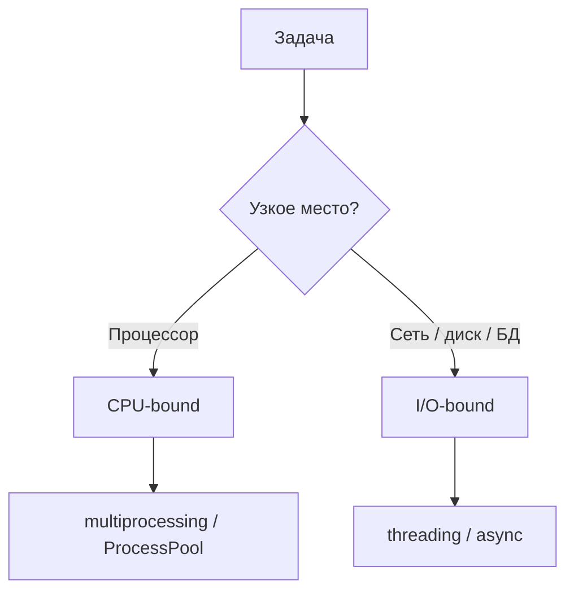
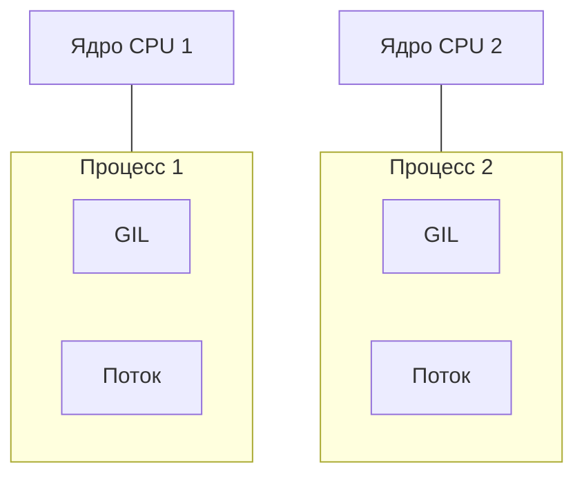

# Модуль 16: GIL и параллелизм в Python

## Метаданные

| Параметр | Значение |
|----------|----------|
| Предварительные знания | Базовый Python: функции, циклы, списки, исключения; понимание процессов и потоков на уровне ОС; знакомство с модулем `time` |
| Следующий модуль | [Модуль 2: Асинхронное программирование](02-async.md) — для I/O-bound задач без потоков |
| Ориентировочное время | 3–4 часа (теория ~1.5 ч, примеры ~1 ч, практика ~1.5 ч) |

## Цели обучения

1. **Объяснить** механизм GIL своими словами и описать, почему он существует в CPython, с примерами из повседневной разработки.
2. **Классифицировать** задачи как CPU-bound или I/O-bound и **выбрать** подходящую модель параллелизма (последовательный код, `threading`, `multiprocessing`, `concurrent.futures`) с обоснованием.
3. **Реализовать** параллельную обработку данных с помощью `ThreadPoolExecutor` и `ProcessPoolExecutor`, измерив ускорение через `time.perf_counter()`.
4. **Сравнить** поведение потоков и процессов на CPU-bound и I/O-bound нагрузке и **интерпретировать** результаты бенчмарка.
5. **Предсказать** узкие места в многопоточном Python-коде до запуска и **предложить** альтернативу (процессы, async — см. [Модуль 2](02-async.md)).

## Теория

### 1.1 Что такое GIL

**GIL (Global Interpreter Lock)** — глобальная блокировка в интерпретаторе CPython, которая гарантирует: в любой момент времени **только один поток** выполняет байткод Python.



**Зачем GIL появился?** CPython использует подсчёт ссылок (reference counting) для управления памятью. Без GIL два потока могли бы одновременно изменять счётчик ссылок одного объекта — это привело бы к утечкам памяти или преждевременному удалению объектов. GIL — простой и надёжный способ сделать управление памятью потокобезопасным.

**Важно:** GIL — особенность **CPython** (стандартная реализация). В Jython, IronPython и частично в PyPy ситуация иная. В этом курсе под «Python» мы подразумеваем CPython 3.11+.

### 1.2 Как GIL переключается между потоками

CPython периодически **отпускает** GIL:

- после выполнения определённого числа инструкций байткода (порог зависит от версии, в 3.11+ — адаптивный);
- при блокирующих I/O-операциях (`read`, `write`, `sleep`, сетевые вызовы);
- при явном вызове `time.sleep()`;
- при ожидании в `threading.Lock`, `queue.Queue` и т.п.



Для **CPU-bound** задач (чистые вычисления в Python) потоки **не дают** линейного ускорения: они по очереди держат GIL. Для **I/O-bound** задач (ожидание сети, диска, БД) потоки полезны: пока один ждёт I/O, GIL отпускается, другой работает.

### 1.3 CPU-bound vs I/O-bound

| Тип нагрузки | Характеристика | Примеры | Лучший подход в Python |
|--------------|----------------|---------|------------------------|
| **CPU-bound** | Процессор занят вычислениями, мало ожидания | Хеширование, сжатие, ML-инференс на чистом Python, обход больших структур | `multiprocessing`, `ProcessPoolExecutor`, C-расширения (NumPy), внешние воркеры |
| **I/O-bound** | Большая часть времени — ожидание внешних ресурсов | HTTP-запросы, чтение файлов, запросы к БД | `threading`, `ThreadPoolExecutor`, **async** ([Модуль 2](02-async.md), [Модуль 3](03-asyncio.md)) |



**Правило большого пальца:** если убрать сеть и диск, а код всё ещё «тормозит» — это CPU-bound. Если без сети/диска он мгновенный — I/O-bound.

### 1.4 Модуль threading: потоки в одном процессе

`threading` создаёт потоки внутри **одного** процесса. Память общая — удобно для I/O, опасно для гонок данных при записи в общие структуры без синхронизации.

Основные примитивы:

- `threading.Thread(target=func, args=(...))` — запуск функции в потоке;
- `threading.Lock()` — взаимное исключение;
- `queue.Queue` — потокобезопасная очередь (предпочтительнее списка + Lock).

Потоки **легковесны** (создание дешевле, чем процесс), но GIL ограничивает параллельные вычисления на CPU.

### 1.5 Модуль multiprocessing: отдельные процессы

`multiprocessing` запускает **отдельные процессы ОС**, каждый со своим интерпретатором и **своим GIL**. Настоящий параллелизм на многоядерных CPU.

Компромиссы:

- **Старт дороже** — fork/spawn, сериализация аргументов;
- **Память не общая** — нужны `Queue`, `Pipe`, `Manager` или shared memory;
- На **Windows** и macOS по умолчанию `spawn` — импорт модуля в дочернем процессе; код защищают `if __name__ == "__main__":`.



### 1.6 concurrent.futures: высокоуровневый API

Модуль `concurrent.futures` — рекомендуемый способ пула потоков/процессов:

| Класс | Backend | Когда использовать |
|-------|---------|-------------------|
| `ThreadPoolExecutor` | `threading` | I/O-bound, много мелких блокирующих вызовов |
| `ProcessPoolExecutor` | `multiprocessing` | CPU-bound, эмбаррассingly parallel задачи |

Ключевые методы:

- `executor.submit(fn, *args)` → `Future` — отложенный результат;
- `executor.map(fn, iterable)` — как `map`, но параллельно;
- `concurrent.futures.as_completed(futures)` — итерация по завершившимся;
- `concurrent.futures.wait(futures, timeout=...)`.

`Future.result()` блокирует до готовности; `Future.exception()` возвращает исключение из воркера.

### 1.7 Связь с async (упреждающий обзор)

Для **I/O-bound** с большим числом одновременных соединений потоки становятся тяжёлыми (стек ~1 МБ на поток, переключение контекста ОС). **Асинхронность** ([Модуль 2](02-async.md)) даёт кооперативную многозадачность в **одном потоке** без GIL-конфликтов на уровне байткода — но требует async-совместимых библиотек.

GIL и async решают **разные** проблемы: GIL — про параллельность потоков в CPython; async — про эффективное ожидание I/O без тысяч потоков.

### 1.8 Когда GIL «не мешает»

- Код в **C-расширениях** (NumPy, `hashlib`, часть `json`) может отпускать GIL во время тяжёлых операций.
- **Один поток** — GIL не является узким местом.
- **I/O в потоках** — GIL отпускается на время блокировки.

Не путайте: «NumPy быстрый» ≠ «многопоточный Python быстрый на CPU». Векторизованные операции NumPy часто идут вне GIL, но чистый Python-цикл в нескольких потоках на CPU не ускорится.

## Примеры кода

### Пример 1: CPU-bound — потоки не ускоряют

```python
"""
Демонстрация: два потока на CPU-bound задаче не быстрее одного потока.
Запуск: python cpu_threads_demo.py
"""
import time
from threading import Thread


def count_hashes(n: int) -> int:
    """Считаем хеши в цикле — чистый Python, CPU-bound."""
    total = 0
    for i in range(n):
        total += hash((i, i * 2, i * 3))  # hash() — быстрая, но достаточная нагрузка
    return total


def run_sequential(n: int, workers: int) -> float:
    """Последовательный запуск workers раз по n итераций."""
    start = time.perf_counter()
    for _ in range(workers):
        count_hashes(n)
    return time.perf_counter() - start


def run_threaded(n: int, workers: int) -> float:
    """Параллельный запуск через потоки."""
    start = time.perf_counter()
    threads = [Thread(target=count_hashes, args=(n,)) for _ in range(workers)]
    for t in threads:
        t.start()
    for t in threads:
        t.join()
    return time.perf_counter() - start


if __name__ == "__main__":
    N = 500_000
    WORKERS = 4

    t_seq = run_sequential(N, WORKERS)
    t_thr = run_threaded(N, WORKERS)

    print(f"Последовательно: {t_seq:.2f} с")
    print(f"Потоки ({WORKERS}): {t_thr:.2f} с")
    print("Ожидание: времена сопоставимы — GIL не даёт ускорения на CPU-bound.")
```

### Пример 2: CPU-bound — ProcessPoolExecutor ускоряет

```python
"""
Демонстрация: процессы обходят GIL для CPU-bound задач.
"""
import time
from concurrent.futures import ProcessPoolExecutor


def is_prime(n: int) -> bool:
    """Проверка простоты — типичная CPU-bound микрозадача."""
    if n < 2:
        return False
    if n % 2 == 0:
        return n == 2
    d = 3
    while d * d <= n:
        if n % d == 0:
            return False
        d += 2
    return True


def count_primes_up_to(limit: int) -> int:
    """Считаем простые числа до limit."""
    return sum(1 for x in range(2, limit) if is_prime(x))


if __name__ == "__main__":
    LIMIT = 80_000

    start = time.perf_counter()
    single = count_primes_up_to(LIMIT)
    t_one = time.perf_counter() - start

    # Делим диапазон на 4 части для четырёх процессов
    chunk = LIMIT // 4
    ranges = [(i * chunk, (i + 1) * chunk if i < 3 else LIMIT) for i in range(4)]

    def count_range(bounds: tuple[int, int]) -> int:
        lo, hi = bounds
        return sum(1 for x in range(max(2, lo), hi) if is_prime(x))

    start = time.perf_counter()
    with ProcessPoolExecutor(max_workers=4) as pool:
        parts = list(pool.map(count_range, ranges))
    total = sum(parts)
    t_pool = time.perf_counter() - start

    assert single == total
    print(f"Один процесс: {t_one:.2f} с, найдено {single}")
    print(f"ProcessPool (4): {t_pool:.2f} с")
    print(f"Ускорение: {t_one / t_pool:.1f}x")
```

### Пример 3: I/O-bound — ThreadPoolExecutor

```python
"""
Имитация I/O: time.sleep отпускает GIL — потоки дают выигрыш.
В реальности вместо sleep — requests.get, cursor.execute и т.д.
"""
import time
from concurrent.futures import ThreadPoolExecutor, as_completed


def fetch_simulated(url_id: int, delay: float = 0.3) -> dict:
    """Имитация HTTP-запроса с задержкой."""
    time.sleep(delay)  # GIL отпускается на время sleep
    return {"id": url_id, "status": 200, "body_len": 1024}


def fetch_all_sequential(ids: list[int]) -> list[dict]:
    """Последовательные «запросы»."""
    return [fetch_simulated(i) for i in ids]


def fetch_all_threaded(ids: list[int], workers: int = 8) -> list[dict]:
    """Параллельные «запросы» через пул потоков."""
    results: list[dict] = []
    with ThreadPoolExecutor(max_workers=workers) as pool:
        futures = {pool.submit(fetch_simulated, i): i for i in ids}
        for fut in as_completed(futures):
            results.append(fut.result())
    return results


if __name__ == "__main__":
    IDS = list(range(12))

    t0 = time.perf_counter()
    fetch_all_sequential(IDS)
    t_seq = time.perf_counter() - t0

    t0 = time.perf_counter()
    fetch_all_threaded(IDS)
    t_par = time.perf_counter() - t0

    print(f"Последовательно: {t_seq:.2f} с")
    print(f"ThreadPool:      {t_par:.2f} с")
    print("Для I/O-bound потоки обычно быстрее.")
```

### Пример 4: submit, Future и обработка ошибок

```python
"""
concurrent.futures: отдельные задачи, исключения, таймаут.
"""
from concurrent.futures import ThreadPoolExecutor, TimeoutError as FuturesTimeoutError


def risky_io(task_id: int) -> str:
    """Задача с возможной ошибкой."""
    if task_id == 3:
        raise ValueError(f"Сбой задачи {task_id}")
    import time
    time.sleep(0.1)
    return f"ok-{task_id}"


if __name__ == "__main__":
    with ThreadPoolExecutor(max_workers=4) as pool:
        futures = [pool.submit(risky_io, i) for i in range(6)]

        for i, fut in enumerate(futures):
            try:
                # result() с таймаутом — ждём не дольше 2 секунд
                print(f"Задача {i}: {fut.result(timeout=2)}")
            except ValueError as e:
                print(f"Задача {i}: ошибка — {e}")
            except FuturesTimeoutError:
                print(f"Задача {i}: таймаут")
```

### Пример 5: Потокобезопасный счётчик с Lock

```python
"""
Гонка данных: без Lock результат недетерминирован.
"""
import threading

counter = 0
lock = threading.Lock()


def increment_unsafe(times: int) -> None:
    global counter
    for _ in range(times):
        counter += 1  # не атомарно: read-modify-write


def increment_safe(times: int) -> None:
    global counter
    for _ in range(times):
        with lock:
            counter += 1


if __name__ == "__main__":
    N = 100_000
    THREADS = 8

    counter = 0
    threads = [threading.Thread(target=increment_unsafe, args=(N,)) for _ in range(THREADS)]
    for t in threads:
        t.start()
    for t in threads:
        t.join()
    print(f"Без Lock: {counter} (ожидали {N * THREADS})")

    counter = 0
    threads = [threading.Thread(target=increment_safe, args=(N,)) for _ in range(THREADS)]
    for t in threads:
        t.start()
    for t in threads:
        t.join()
    print(f"С Lock:   {counter}")
```

## Trade-off: компромиссы

| Решение | Плюсы | Минусы | Когда выбирать |
|---------|-------|--------|----------------|
| Последовательный код | Простота, нет гонок, легко отлаживать | Медленно при независимых задачах | Мало задач, прототип, узкое место не в параллелизме |
| `threading` | Низкие накладные расходы, общая память | GIL на CPU-bound; нужна синхронизация | Блокирующий I/O, немного параллельных задач |
| `multiprocessing` | Настоящий параллелизм CPU, обход GIL | Дорогой старт, сериализация, сложнее отладка | CPU-bound, независимые тяжёлые вычисления |
| `ThreadPoolExecutor` | Удобный API, переиспользование потоков | Те же ограничения GIL на CPU | Пул блокирующих I/O-вызовов |
| `ProcessPoolExecutor` | Удобный API для процессов | Накладные расходы на мелких задачах | Пакетная CPU-обработка, map по большим данным |
| Async ([Модуль 2](02-async.md)) | Масштаб I/O без тысяч потоков | Нужны async-библиотеки; не для CPU | Много одновременных сетевых соединений |
| C-расширения / NumPy | Скорость, частичный release GIL | Зависимость от нативного кода | Численные массивы, криптография |

## Практические задания

### Задание 1 (базовое): Классификация задач

**Условие:** Для каждой задачи определите CPU-bound или I/O-bound и назовите рекомендуемый инструмент (`threading`, `multiprocessing`, `ThreadPoolExecutor`, `ProcessPoolExecutor`, async, последовательный код):

1. Скачать 50 URL через `urllib.request`.
2. Посчитать MD5 для 10 000 файлов по 1 МБ (чистый Python, без `hashlib` в C — для учебы представьте цикл).
3. Записать логи в один файл из 20 корутин (представьте 20 потоков).
4. Обучить модель на GPU через PyTorch (внешняя библиотека).
5. Парсинг JSON-ответов API (сеть уже отдала байты).

**Критерии приёмки:**
- Все 5 задач классифицированы с кратким обоснованием (1–2 предложения).
- Для каждой указан один основной инструмент.

**Подсказка:** Отделите «ожидание» от «вычисления в интерпретаторе».

### Задание 2 (среднее): Бенчмарк ProcessPool vs ThreadPool

**Условие:** Напишите скрипт `benchmark_pools.py`, который:

1. Генерирует список из 100 чисел `n` (например, простые кандидаты около 50_000).
2. Для функции `slow_is_prime(n)` запускает обработку через `ThreadPoolExecutor` и `ProcessPoolExecutor` (`max_workers=4`).
3. Печатает время и speedup относительно последовательного запуска.

**Критерии приёмки:**
- `if __name__ == "__main__":` присутствует.
- Три режима: sequential, threads, processes.
- ProcessPool быстрее ThreadPool на CPU-bound (на машине с 4+ ядрами).

**Подсказка:** Используйте `time.perf_counter()` и одинаковый входной набор для всех режимов.

### Задание 3 (продвинутое): Пайплайн загрузки и обработки

**Условие:** Реализуйте мини-пайплайн:

- **Этап 1 (I/O):** `ThreadPoolExecutor` «загружает» данные — функция `load_item(i)` делает `time.sleep(0.05)` и возвращает `{"id": i, "payload": list(range(100))}`.
- **Этап 2 (CPU):** `ProcessPoolExecutor` обрабатывает payload — `process_item(data)` возвращает `sum(x * x for x in data["payload"])`.
- Соберите результаты для `id` от 0 до 19, выведите общую сумму и время этапов.

**Критерии приёмки:**
- Разделение I/O и CPU этапов явное.
- Корректная передача данных между пулами (сериализуемые dict).
- Итоговая сумма совпадает с эталонным последовательным расчётом.

**Подсказка:** Сначала соберите все `load_item` в список, затем передайте в `process_pool.map`.

## Эталонные решения

<details>
<summary>Задание 1 — классификация</summary>

1. **I/O-bound** — `ThreadPoolExecutor` или async ([Модуль 3](03-asyncio.md) с `aiohttp`).
2. **CPU-bound** (в учебной постановке) — `ProcessPoolExecutor`; в продакшене — `hashlib` (C) + процессы при массовости.
3. **I/O-bound** к диску — один writer-поток с `queue.Queue` или блокировка на файл; не 20 процессов в один файл без синхронизации.
4. **Вне Python/GIL** — GPU; оркестрация в одном процессе Python.
5. **CPU-bound** на малых JSON — часто последовательно достаточно; при тысячах — процессы; узкое место обычно было в сети (задача 1).

</details>

<details>
<summary>Задание 2 — benchmark_pools.py</summary>

```python
import time
from concurrent.futures import ProcessPoolExecutor, ThreadPoolExecutor


def slow_is_prime(n: int) -> bool:
    if n < 2:
        return False
    d = 2
    while d * d <= n:
        if n % d == 0:
            return False
        d += 1
    return True


def run_seq(nums: list[int]) -> float:
    t0 = time.perf_counter()
    list(map(slow_is_prime, nums))
    return time.perf_counter() - t0


def run_threads(nums: list[int], workers: int = 4) -> float:
    t0 = time.perf_counter()
    with ThreadPoolExecutor(max_workers=workers) as ex:
        list(ex.map(slow_is_prime, nums))
    return time.perf_counter() - t0


def run_processes(nums: list[int], workers: int = 4) -> float:
    t0 = time.perf_counter()
    with ProcessPoolExecutor(max_workers=workers) as ex:
        list(ex.map(slow_is_prime, nums))
    return time.perf_counter() - t0


if __name__ == "__main__":
    nums = [50_000 + i * 2 + 1 for i in range(100)]
    t_seq = run_seq(nums)
    t_thr = run_threads(nums)
    t_proc = run_processes(nums)
    print(f"Sequential: {t_seq:.2f}s")
    print(f"Threads:    {t_thr:.2f}s (speedup {t_seq/t_thr:.2f}x)")
    print(f"Processes:  {t_proc:.2f}s (speedup {t_seq/t_proc:.2f}x)")
```

</details>

<details>
<summary>Задание 3 — пайплайн</summary>

```python
import time
from concurrent.futures import ProcessPoolExecutor, ThreadPoolExecutor


def load_item(i: int) -> dict:
    time.sleep(0.05)
    return {"id": i, "payload": list(range(100))}


def process_item(data: dict) -> int:
    return sum(x * x for x in data["payload"])


def reference(ids: list[int]) -> int:
    return sum(process_item(load_item(i)) for i in ids)


if __name__ == "__main__":
    ids = list(range(20))
    t0 = time.perf_counter()
    with ThreadPoolExecutor(max_workers=8) as io_pool:
        loaded = list(io_pool.map(load_item, ids))
    t_io = time.perf_counter() - t0

    t1 = time.perf_counter()
    with ProcessPoolExecutor(max_workers=4) as cpu_pool:
        results = list(cpu_pool.map(process_item, loaded))
    t_cpu = time.perf_counter() - t1

    total = sum(results)
    assert total == reference(ids)
    print(f"I/O: {t_io:.2f}s, CPU: {t_cpu:.2f}s, total sum: {total}")
```

</details>

## Вопросы для самопроверки

1. **Что такое GIL и почему в CPython только один поток выполняет байткод?**  
   *Ответ:* GIL — глобальная блокировка интерпретатора; она защищает reference counting и внутренние структуры CPython от гонок при доступе из нескольких потоков.

2. **Почему 8 потоков не ускоряют в 8 раз чистый Python-цикл на CPU?**  
   *Ответ:* Потоки конкурируют за один GIL; параллельно байткод выполняет только один поток.

3. **В чём разница между CPU-bound и I/O-bound?**  
   *Ответ:* CPU-bound ограничен вычислениями процессора; I/O-bound большую часть времени ждёт внешние ресурсы (сеть, диск, БД).

4. **Когда предпочесть ProcessPoolExecutor вместо ThreadPoolExecutor?**  
   *Ответ:* Когда задачи CPU-bound и их можно распараллелить без тяжёлой связи между воркерами.

5. **Зачем нужен `if __name__ == "__main__":` при multiprocessing на Windows?**  
   *Ответ:* При `spawn` дочерний процесс импортирует модуль заново; без guard код создания пула выполнится рекурсивно в каждом дочернем процессе.

6. **Может ли threading ускорить загрузку 100 URL?**  
   *Ответ:* Да, это I/O-bound: пока потоки ждут сети, GIL отпускается. Альтернатива — async ([Модуль 2](02-async.md)).

7. **Чем Future отличается от обычного возврата значения?**  
   *Ответ:* Future — объект-обещание результата асинхронной задачи; `result()` блокирует до готовности и пробрасывает исключения из воркера.

## Методические указания

### Тайминг занятия

| Блок | Время | Активность |
|------|-------|------------|
| Введение, GIL | 40 мин | Лекция + диаграмма |
| CPU vs I/O | 25 мин | Обсуждение примеров из практики студентов |
| threading / multiprocessing | 35 мин | Живое кодирование примеров 1–3 |
| concurrent.futures | 30 мин | Пример 4, разбор Future |
| Практика | 60–90 мин | Задания 2–3 |
| Самопроверка | 15 мин | Вопросы, связь с async-модулями |

### Типичные ошибки

1. **Ожидание ускорения CPU-кода через потоки** — самая частая иллюзия; покажите бенчмарк из примера 1.
2. **Забытый `if __name__ == "__main__":`** — зависание или рекурсия spawn на Windows.
3. **Гонки без Lock** — пример 5; связать с модулями ООП ([Модуль 4](04-oop.md)) и инкапсуляцией состояния.
4. **Слишком мелкие задачи в ProcessPool** — накладные расходы съедают выигрыш; батчить работу.
5. **Смешение I/O и CPU в одном пуле потоков** — блокирующий CPU в потоке задерживает весь I/O-пул.

### FAQ

**GIL уберут из Python?**  
PEP 703 предлагает optional free-threading в 3.13+; в стандартной сборке GIL пока остаётся. Проверяйте версию и флаги сборки.

**PyPy быстрее — значит GIL не важен?**  
PyPy ускоряет один поток; для CPU-параллелизма всё равно нужны процессы.

**async лучше потоков?**  
Для массового I/O часто да ([Модуль 3](03-asyncio.md)); для блокирующих legacy-библиотек — потоки проще.

## Дополнительные материалы

- [What is the Python Global Interpreter Lock (GIL)? — Real Python](https://realpython.com/python-gil/)
- [Документация `concurrent.futures`](https://docs.python.org/3/library/concurrent.futures.html)
- [Документация `multiprocessing`](https://docs.python.org/3/library/multiprocessing.html)
- [PEP 703 — Making the Global Interpreter Lock Optional in CPython](https://peps.python.org/pep-0703/)
- Следующие модули: [02-async.md](02-async.md), [03-asyncio.md](03-asyncio.md)
