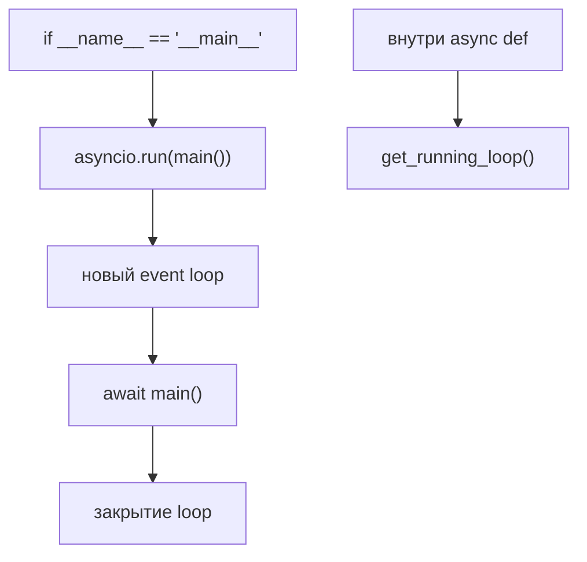
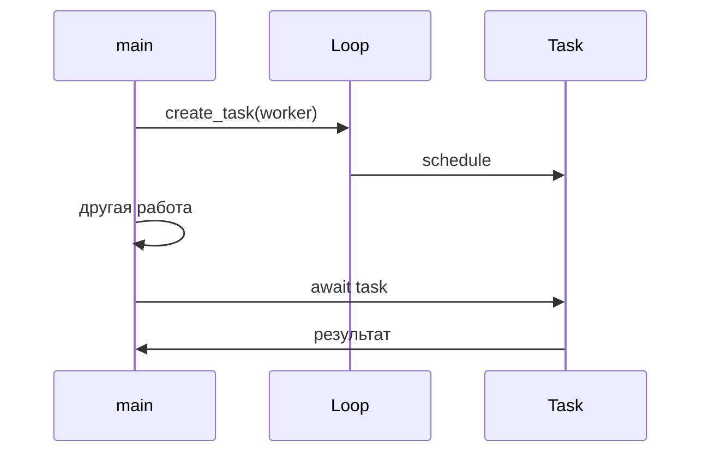
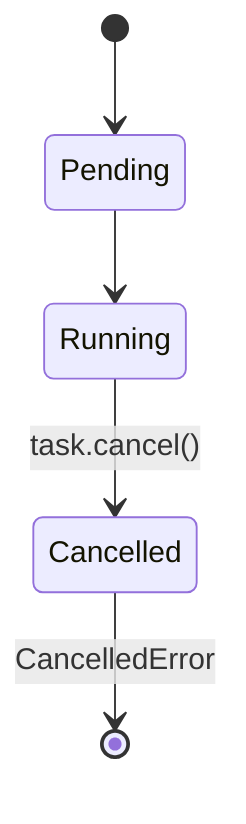
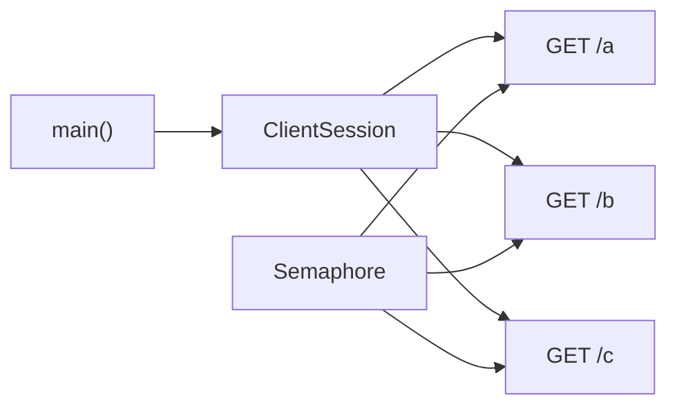

# Модуль 17: Библиотека asyncio (углублённо) — практика

## Метаданные

| Параметр | Значение |
|----------|----------|
| Предварительные знания | [Модуль 2: Асинхронные концепции](02-async.md) — корутины, await, event loop; [Модуль 1: GIL](01-gil.md) — когда нужны потоки/процессы |
| Следующий модуль | [Модуль 4: ООП в Python](04-oop.md) — структурирование async-кода в классах |
| Ориентировочное время | 4 часа |

## Цели обучения

1. **Запускать** async-приложения через `asyncio.run()` и **объяснить**, почему не следует вызывать устаревший `get_event_loop()` в новом коде.
2. **Планировать** работу через `asyncio.create_task()` и **собирать** результаты с `asyncio.gather()` с обработкой исключений.
3. **Ограничивать** время выполнения (`asyncio.timeout`) и **корректно отменять** задачи (`task.cancel()`, `CancelledError`).
4. **Реализовать** HTTP-клиент на паттерне `aiohttp` с сессией, таймаутами и семафором.
5. **Интегрировать** блокирующий код через `asyncio.to_thread()` без блокировки event loop.

## Теория

### 3.1 Точка входа: asyncio.run()

`asyncio.run(coro)` (Python 3.7+) — рекомендуемый способ запуска async-кода с верхнего уровня:

1. Создаёт новый event loop.
2. Выполняет переданную корутину как `main`.
3. Закрывает loop и освобождает ресурсы.

```python
async def main():
    ...

if __name__ == "__main__":
    asyncio.run(main())
```

**Почему не `asyncio.get_event_loop()`?**  
В старом коде `get_event_loop()` вне async-контекста создавал или возвращал loop неявно — источник багов при миграции на 3.10+. В новом коде:

- верхний уровень → `asyncio.run()`;
- внутри running loop → `asyncio.get_running_loop()` (выбросит `RuntimeError`, если loop не запущен).



### 3.2 Task vs корутина

| Объект | Создание | Особенности |
|--------|----------|-------------|
| Coroutine | `async def` + вызов | Не планируется, пока не await/create_task |
| Task | `asyncio.create_task(coro)` | Планируется немедленно; можно отменить |

`create_task` «запускает» корутину в фоне, не блокируя текущую до `await task`.



### 3.3 asyncio.gather()

`await asyncio.gather(coro1, coro2, ...)` — ждёт **все** awaitables:

- `return_exceptions=False` (по умолчанию) — первое исключение пробрасывается, остальные задачи отменяются.
- `return_exceptions=True` — исключения в списке результатов на соответствующих позициях.

Для независимого I/O `gather` — идиоматичный выбор ([Модуль 2](02-async.md)).

### 3.4 Таймауты: asyncio.timeout

Python 3.11+ — контекстный менеджер `asyncio.timeout(seconds)`:

```python
async with asyncio.timeout(5):
    await slow_operation()
```

При превышении — `TimeoutError`, вложенные задачи нужно отменять явно при необходимости.

Устаревший `asyncio.wait_for(coro, timeout)` всё ещё встречается; для нового кода предпочтителен `timeout`.

### 3.5 Отмена задач

Отмена кооперативная:

1. `task.cancel()` помечает Task.
2. В точке `await` в корутине возникает `asyncio.CancelledError`.
3. Корутина должна пробросить `CancelledError` или завершить cleanup в `try/finally`.



**Не глотайте** `CancelledError` без `raise` — иначе отмена «застрянет».

### 3.6 Семафор и ограничение concurrency

`asyncio.Semaphore(n)` — не более `n` одновременных владельцев:

```python
sem = asyncio.Semaphore(10)
async with sem:
    await fetch(url)
```

Аналог пула из [Модуля 1](01-gil.md), но для корутин без лишних потоков.

### 3.7 asyncio.to_thread()

Обёртка над `loop.run_in_executor` для вызова **блокирующей** функции в потоке из ThreadPoolExecutor по умолчанию:

```python
result = await asyncio.to_thread(blocking_func, arg1, arg2)
```

Event loop продолжает обслуживать другие корутины.

### 3.8 Паттерн aiohttp

Типичная структура HTTP-клиента:

1. Один `aiohttp.ClientSession` на приложение (connection pooling).
2. `async with session` — корректное закрытие соединений.
3. `session.get(url, timeout=aiohttp.ClientTimeout(...))` — запросы.
4. `Semaphore` для лимита параллельных запросов.
5. `gather` для пакетной загрузки.



**Установка:** `pip install aiohttp`

### 3.9 Обработка ошибок в gather

Стратегии:

- **fail-fast:** `gather` без флагов — первый Exception роняет всё.
- **собрать всё:** `return_exceptions=True` + фильтрация.
- **retry:** обёртка корутины с `tenacity` или ручным циклом.

### 3.10 Структурирование приложения

Рекомендации:

- `main()` — сборка ресурсов, `gather`, shutdown.
- Сервисные функции — чистые `async def`.
- Конфигурация таймаутов и concurrency — константы или dataclass ([Модуль 4](04-oop.md)).
- Логирование — `logging` + `asyncio` не требует особого handler для базовых случаев.

### 3.11 Отладка

```python
asyncio.run(main(), debug=True)
```

или `PYTHONASYNCIODEBUG=1` — предупреждения о медленных callback'ах и незакрытых ресурсах.

## Примеры кода

### Пример 1: asyncio.run и create_task

```python
"""
Планирование фоновой задачи через create_task.
"""
import asyncio


async def background(name: str, n: int) -> None:
    for i in range(n):
        print(f"{name}: step {i}")
        await asyncio.sleep(0.2)


async def main() -> None:
    # Task начинает выполняться сразу после create_task
    task = asyncio.create_task(background("worker", 3))
    print("main: задача запущена в фоне")
    await asyncio.sleep(0.35)  # main делает своё
    print("main: ждём завершения worker")
    await task  # дожидаемся результата (None)
    print("main: готово")


if __name__ == "__main__":
    asyncio.run(main())
```

### Пример 2: gather и return_exceptions

```python
"""
gather: успешные и упавшие задачи.
"""
import asyncio


async def ok(x: int) -> int:
    await asyncio.sleep(0.1)
    return x * 2


async def fail() -> int:
    await asyncio.sleep(0.05)
    raise ValueError("boom")


async def main() -> None:
    # fail-fast
    try:
        await asyncio.gather(ok(1), fail(), ok(2))
    except ValueError as e:
        print(f"gather fail-fast: {e}")

    # собрать всё
    results = await asyncio.gather(ok(1), fail(), ok(2), return_exceptions=True)
    for r in results:
        print("result:", r)


if __name__ == "__main__":
    asyncio.run(main())
```

### Пример 3: Таймаут с asyncio.timeout

```python
"""
Python 3.11+: asyncio.timeout
"""
import asyncio


async def slow() -> str:
    await asyncio.sleep(2)
    return "done"


async def main() -> None:
    try:
        async with asyncio.timeout(0.5):
            await slow()
    except TimeoutError:
        print("операция превысила 0.5 с")


if __name__ == "__main__":
    asyncio.run(main())
```

### Пример 4: Отмена задачи

```python
"""
Корректная отмена и cleanup в finally.
"""
import asyncio


async def long_job() -> None:
    try:
        while True:
            print("working...")
            await asyncio.sleep(0.3)
    except asyncio.CancelledError:
        print("получен сигнал отмены, cleanup")
        raise  # обязательно пробросить CancelledError


async def main() -> None:
    task = asyncio.create_task(long_job())
    await asyncio.sleep(0.7)
    task.cancel()
    try:
        await task
    except asyncio.CancelledError:
        print("задача отменена")


if __name__ == "__main__":
    asyncio.run(main())
```

### Пример 5: Semaphore + gather

```python
"""
Ограничение параллельных «запросов».
"""
import asyncio
import random


async def fetch(url: str, sem: asyncio.Semaphore) -> tuple[str, float]:
    async with sem:
        delay = random.uniform(0.1, 0.4)
        await asyncio.sleep(delay)
        return url, delay


async def main() -> None:
    urls = [f"/api/item/{i}" for i in range(12)]
    sem = asyncio.Semaphore(4)
    results = await asyncio.gather(*(fetch(u, sem) for u in urls))
    for url, d in results:
        print(f"{url} — {d:.2f}s")


if __name__ == "__main__":
    asyncio.run(main())
```

### Пример 6: asyncio.to_thread

```python
"""
Блокирующая функция не блокирует loop.
"""
import asyncio
import time


def blocking_io() -> str:
    time.sleep(1)
    return "file content"


async def main() -> None:
    async def heartbeat():
        for i in range(5):
            print(f"heartbeat {i}")
            await asyncio.sleep(0.2)

    hb = asyncio.create_task(heartbeat())
    data = await asyncio.to_thread(blocking_io)
    print("data:", data)
    await hb


if __name__ == "__main__":
    asyncio.run(main())
```

### Пример 7: Паттерн aiohttp (рабочий пример)

```python
"""
HTTP-клиент: сессия, таймаут, семафор, gather.
Требует: pip install aiohttp
Использует публичный httpbin.org для демо.
"""
import asyncio

import aiohttp


async def fetch_one(
    session: aiohttp.ClientSession,
    sem: asyncio.Semaphore,
    url: str,
) -> dict:
    async with sem:
        async with session.get(url) as resp:
            text = await resp.text()
            return {"url": url, "status": resp.status, "len": len(text)}


async def fetch_all(urls: list[str], concurrency: int = 5) -> list[dict]:
    sem = asyncio.Semaphore(concurrency)
    timeout = aiohttp.ClientTimeout(total=10)
    async with aiohttp.ClientSession(timeout=timeout) as session:
        tasks = [fetch_one(session, sem, u) for u in urls]
        return await asyncio.gather(*tasks)


async def main() -> None:
    urls = [f"https://httpbin.org/delay/1?id={i}" for i in range(6)]
    results = await fetch_all(urls, concurrency=3)
    for r in results:
        print(r)


if __name__ == "__main__":
    asyncio.run(main())
```

### Пример 8: get_running_loop — только внутри async

```python
"""
Правильное получение текущего loop.
"""
import asyncio


async def show_loop() -> None:
    loop = asyncio.get_running_loop()  # OK внутри async
    print("loop running:", loop.is_running())


def sync_caller() -> None:
    try:
        asyncio.get_running_loop()
    except RuntimeError as e:
        print("в sync нет running loop:", e)


async def main() -> None:
    await show_loop()
    sync_caller()


if __name__ == "__main__":
    asyncio.run(main())
```

## Trade-off: компромиссы

| Решение | Плюсы | Минусы | Когда выбирать |
|---------|-------|--------|----------------|
| `asyncio.run()` | Чистый lifecycle loop | Один entry point на процесс | Скрипты, CLI, `__main__` |
| `create_task` | Фон, параллельность | Нужен явный await/cancel | Producer-consumer, heartbeat |
| `gather` | Простой параллельный I/O | Связанная судьба задач | Независимые запросы |
| `asyncio.timeout` | Читаемые лимиты | Только 3.11+ нативно | SLA на внешние вызовы |
| `task.cancel()` | Graceful shutdown | Нужен корректный cleanup | Отмена по сигналу/user |
| `Semaphore` | Контроль нагрузки | Может скрыть перегрузку API | Rate limit к бэкенду |
| `to_thread` | Sync библиотеки в async | Потоки + GIL ([Модуль 1](01-gil.md)) | Редкий blocking I/O |
| `aiohttp` | Быстрый pooled HTTP | Async-only API | Микросервисы, краулеры |
| `httpx` async | Современный API | Ещё одна зависимость | Альтернатива aiohttp |

## Практические задания

### Задание 1 (базовое): Параллельные таймеры

**Условие:** Напишите `async def tick(name, n, interval)`, печатающую `name: i` каждые `interval` секунд, `n` раз. В `main` запустите три тика через `create_task` с разными параметрами и `gather`.

**Критерии:** Вывод перемешан; общее время ≈ max(времён тиков), не сумма.

**Подсказка:** `create_task` до `gather`.

### Задание 2 (среднее): Fetch с таймаутом и retry

**Условие:** `async def unreliable()` с `sleep(random)` и 30% `raise RuntimeError`. Обёртка `async def with_retry(coro_factory, attempts=3)` с `asyncio.timeout(1)` на попытку.

**Критерии:** При успехе возвращает результат; после 3 неудач пробрасывает последнее исключение.

**Подсказка:** `for attempt in range(attempts): try: ... except TimeoutError, RuntimeError`.

### Задание 3 (продвинутое): Мини-клиент httpbin

**Условие:** На `aiohttp` загрузите `/uuid` и `/json` с httpbin.org параллельно; добавьте Semaphore(2); общий ClientTimeout 5s; при ошибке сети логируйте и возвращайте `None` для URL (`return_exceptions` или try/except в worker).

**Критерии:** Один ClientSession; корректное закрытие; не более 2 одновременных запросов при списке из 8 URL.

**Подсказка:** Скопируйте структуру примера 7.

## Эталонные решения

<details>
<summary>Задание 1 — tick</summary>

```python
import asyncio


async def tick(name: str, n: int, interval: float) -> None:
    for i in range(n):
        print(f"{name}: {i}")
        await asyncio.sleep(interval)


async def main() -> None:
    await asyncio.gather(
        tick("A", 3, 0.2),
        tick("B", 2, 0.3),
        tick("C", 4, 0.1),
    )


if __name__ == "__main__":
    asyncio.run(main())
```

</details>

<details>
<summary>Задание 2 — with_retry</summary>

```python
import asyncio
import random


async def unreliable() -> int:
    await asyncio.sleep(random.uniform(0.1, 0.6))
    if random.random() < 0.3:
        raise RuntimeError("fail")
    return 42


async def with_retry(coro_factory, attempts: int = 3):
    last_exc = None
    for _ in range(attempts):
        try:
            async with asyncio.timeout(1):
                return await coro_factory()
        except (TimeoutError, RuntimeError) as e:
            last_exc = e
    raise last_exc


async def main() -> None:
    for _ in range(5):
        try:
            print(await with_retry(unreliable))
        except RuntimeError:
            print("all attempts failed")


if __name__ == "__main__":
    asyncio.run(main())
```

</details>

<details>
<summary>Задание 3 — httpbin client</summary>

```python
import asyncio
import logging

import aiohttp

logging.basicConfig(level=logging.INFO)
log = logging.getLogger(__name__)

BASE = "https://httpbin.org"
PATHS = ["/uuid", "/json"] * 4


async def fetch_path(
    session: aiohttp.ClientSession,
    sem: asyncio.Semaphore,
    path: str,
) -> dict | None:
    url = f"{BASE}{path}"
    async with sem:
        try:
            async with session.get(url) as resp:
                data = await resp.json()
                return {"path": path, "status": resp.status, "keys": list(data)[:3]}
        except (aiohttp.ClientError, asyncio.TimeoutError) as e:
            log.error("fetch failed %s: %s", url, e)
            return None


async def main() -> None:
    sem = asyncio.Semaphore(2)
    timeout = aiohttp.ClientTimeout(total=5)
    async with aiohttp.ClientSession(timeout=timeout) as session:
        results = await asyncio.gather(*(fetch_path(session, sem, p) for p in PATHS))
    print([r for r in results if r])


if __name__ == "__main__":
    asyncio.run(main())
```

</details>

## Вопросы для самопроверки

1. **Чем `asyncio.run()` лучше ручного создания loop?**  
   *Ответ:* Стандартизирует создание, выполнение и закрытие loop; меньше утечек ресурсов.

2. **Когда использовать `create_task` вместо просто `await coro()`?**  
   *Ответ:* Когда нужно параллельное выполнение нескольких корутин до точки синхронизации.

3. **Что делает `return_exceptions=True` в gather?**  
   *Ответ:* Исключения возвращаются как элементы списка, остальные задачи не прерываются из-за одной ошибки.

4. **Как корректно отменить долгую задачу?**  
   *Ответ:* `task.cancel()`, await task, в корутине не глотать `CancelledError`, cleanup в `finally`.

5. **Зачем Semaphore в aiohttp-клиенте?**  
   *Ответ:* Ограничить число одновременных соединений, не перегружая сервер и локальные ресурсы.

6. **Когда `asyncio.to_thread` предпочтительнее переписывания на async?**  
   *Ответ:* Редкие вызовы блокирующих legacy-функций без async-аналога.

7. **Почему одна ClientSession на приложение?**  
   *Ответ:* Connection pooling и переиспользование TCP-соединений.

## Методические указания

### Тайминг

| Блок | Время |
|------|-------|
| asyncio.run, Task, gather | 50 мин |
| timeout, cancel | 40 мин |
| Semaphore, to_thread | 30 мин |
| aiohttp pattern | 45 мин |
| Практика задание 3 | 75 мин |

### Типичные ошибки

1. `asyncio.run()` внутри running loop (FastAPI handler вызывает run — нельзя).
2. Игнорирование `CancelledError` без re-raise.
3. Новый `ClientSession` на каждый запрос — нет пула соединений.
4. Отсутствие таймаутов на внешний I/O — зависшие корутины.
5. `gather` без лимита + тысячи URL — исчерпание дескрипторов; нужен Semaphore.

### FAQ

**Jupyter и asyncio?**  
Уже running loop — используйте `await main()` в ячейке или `nest_asyncio` (осторожно в продакшене).

**aiohttp vs httpx?**  
Оба подходят; aiohttp зрелее в async-экосистеме.

**Связь с ООП?**  
Сервис-классы с `async def` методами — [Модуль 4](04-oop.md).

## Дополнительные материалы

- [Документация asyncio](https://docs.python.org/3/library/asyncio.html)
- [aiohttp Client Quickstart](https://docs.aiohttp.org/en/stable/client_quickstart.html)
- [Python 3.11: asyncio.timeout](https://docs.python.org/3/library/asyncio-task.html#asyncio.timeout)
- [Модуль 2: концепции async](02-async.md)
- [Модуль 1: потоки и процессы](01-gil.md)
