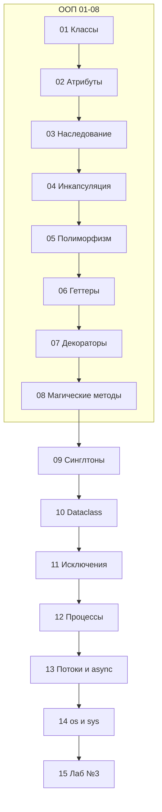

# Курс «Продвинутый Python» — учебно-методический комплект (УМК)

> Версия 2.0 · Python 3.11+ · Формат: markdown-модули  
> Порядок тем согласован с учебным планом: ООП → паттерны → конкурентность → файловая система → лабораторная → дополнительные темы.

## О курсе

Курс для начинающих разработчиков с базовым Python. Материал изложен **подробно**: от классов и объектов до процессов, async и продвинутых тем (GIL, протоколы, Big O).

Каждый модуль содержит:

- Метаданные и цели обучения
- Теорию с примерами
- Таблицу trade-offs
- 3 практических задания с эталонными решениями
- Вопросы для самопроверки
- Методические указания

## Основной учебный план (модули 01–15)

Проходите **строго по порядку** — каждый модуль опирается на предыдущие.

| № | Модуль | Тема |
|---|--------|------|
| 01 | [01-oop-classes-objects.md](01-oop-classes-objects.md) | Введение в ООП. Классы и объекты |
| 02 | [02-oop-attributes-methods.md](02-oop-attributes-methods.md) | Введение в ООП. Атрибуты и методы |
| 03 | [03-oop-inheritance.md](03-oop-inheritance.md) | Введение в ООП. Принцип наследование |
| 04 | [04-oop-encapsulation.md](04-oop-encapsulation.md) | Введение в ООП. Принцип инкапсуляция |
| 05 | [05-oop-polymorphism.md](05-oop-polymorphism.md) | Введение в ООП. Принцип полиморфизм |
| 06 | [06-oop-getters-setters.md](06-oop-getters-setters.md) | Введение в ООП. Сеттеры и геттеры в классах |
| 07 | [07-oop-decorators.md](07-oop-decorators.md) | Введение в ООП. Декораторы |
| 08 | [08-oop-magic-methods.md](08-oop-magic-methods.md) | Введение в ООП. Магические методы |
| 09 | [09-singletons.md](09-singletons.md) | Синглтоны |
| 10 | [10-dataclasses.md](10-dataclasses.md) | Дата классы |
| 11 | [11-exceptions.md](11-exceptions.md) | Обработка исключений |
| 12 | [12-concurrent-processes.md](12-concurrent-processes.md) | Конкурентное программирование. Процессы |
| 13 | [13-threads-async-coroutines.md](13-threads-async-coroutines.md) | Потоки. Асинхрон. Корутины |
| 14 | [14-filesystem-os-sys.md](14-filesystem-os-sys.md) | Работа с файловой системой в Python (os, sys) |
| 15 | [15-lab-3.md](15-lab-3.md) | **Лабораторная работа №3** |

## Дополнительные темы (модули 16–29)

Темы, не вошедшие в основной план, — **после лабораторной**, по желанию или для углубления.

| № | Модуль | Тема |
|---|--------|------|
| 16 | [16-gil.md](16-gil.md) | GIL и параллелизм (углублённо) |
| 17 | [17-asyncio-library.md](17-asyncio-library.md) | Библиотека asyncio (углублённо) |
| 18 | [18-object-vulnerabilities.md](18-object-vulnerabilities.md) | Уязвимости объектов |
| 19 | [19-mutations-typevar.md](19-mutations-typevar.md) | Мутации и TypeVar |
| 20 | [20-protocols.md](20-protocols.md) | Протоколы |
| 21 | [21-design-patterns.md](21-design-patterns.md) | Паттерны проектирования (Singleton — см. модуль 09) |
| 22 | [22-big-o.md](22-big-o.md) | Big O |
| 23 | [23-system-libraries.md](23-system-libraries.md) | Системные библиотеки (pathlib, subprocess, logging) |
| 24 | [24-data-structures.md](24-data-structures.md) | Структуры данных (dataclass — см. модуль 10) |
| 25 | [25-engineering-thinking.md](25-engineering-thinking.md) | Инженерное мышление |
| 26 | [26-inheritance-mro.md](26-inheritance-mro.md) | MRO и super() (углублённо) |
| 27 | [27-mixins.md](27-mixins.md) | Миксины |
| 28 | [28-slots.md](28-slots.md) | `__slots__` |
| 29 | [29-capstone-tasks.md](29-capstone-tasks.md) | Итоговый проект (FastAPI) |

## Цели курса

После модулей 01–15 студент сможет:

1. Проектировать классы с наследованием, инкапсуляцией и полиморфизмом
2. Использовать `@property`, декораторы и магические методы
3. Применять синглтоны и `@dataclass` осознанно, с учётом trade-off
4. Обрабатывать исключения по best practices
5. Запускать процессы и писать async-код с корутинами
6. Работать с файловой системой через `os` и `sys`
7. Выполнить лабораторную работу №3 с интеграцией изученных тем

## Требования

- Python 3.11+
- `pytest`, `ruff` (рекомендуется)
- Для модулей 13, 17, 29: `asyncio`, `httpx`, `fastapi`, `uvicorn`

## Как работать с модулями

1. Читайте метаданные и цели обучения
2. Прогоняйте примеры кода в REPL
3. Обсуждайте trade-offs перед выбором решения
4. Решайте 3 задания без подглядывания в эталон
5. Проверяйте себя по вопросам в конце модуля

## Для преподавателей

- Шаблон нового модуля: [_TEMPLATE.md](_TEMPLATE.md)
- Модули 01–08: блок «ООП» (~3–4 недели)
- Модули 12–13: конкурентность (~2 недели)
- Модуль 15: лабораторная с рубрикой на 100 баллов
- Архив предыдущей версии УМК: [_archive/](_archive/)

---

**Начните с [01-oop-classes-objects.md](01-oop-classes-objects.md)**
