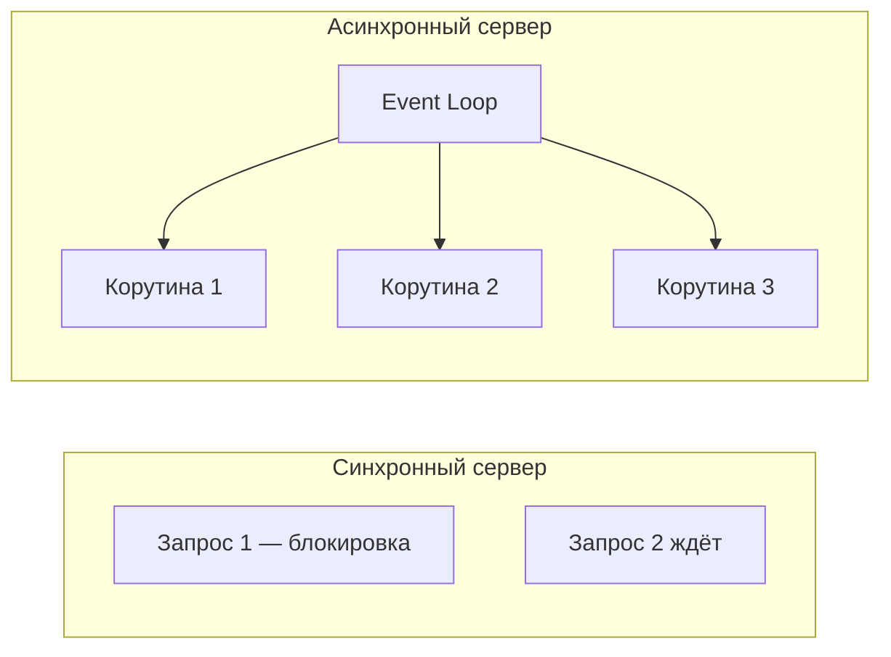
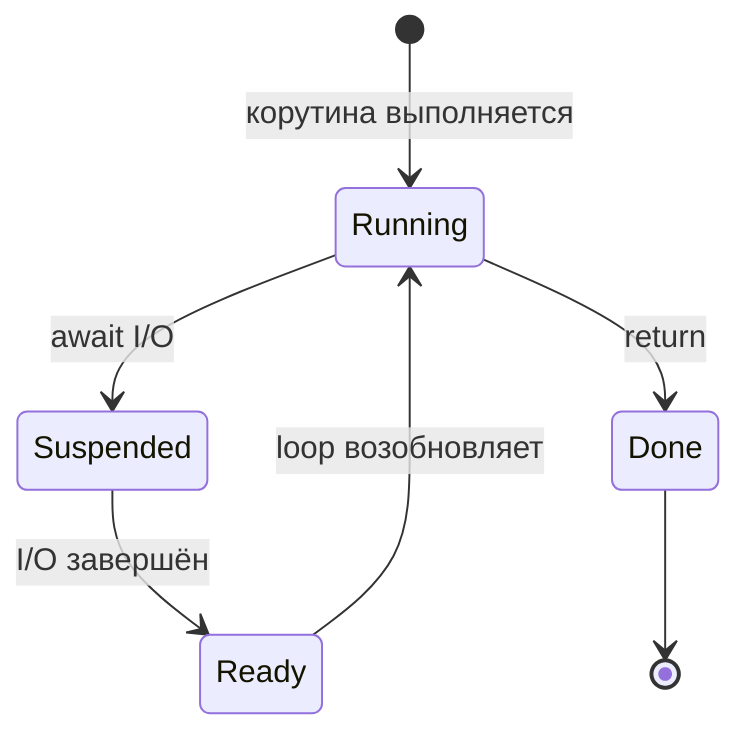
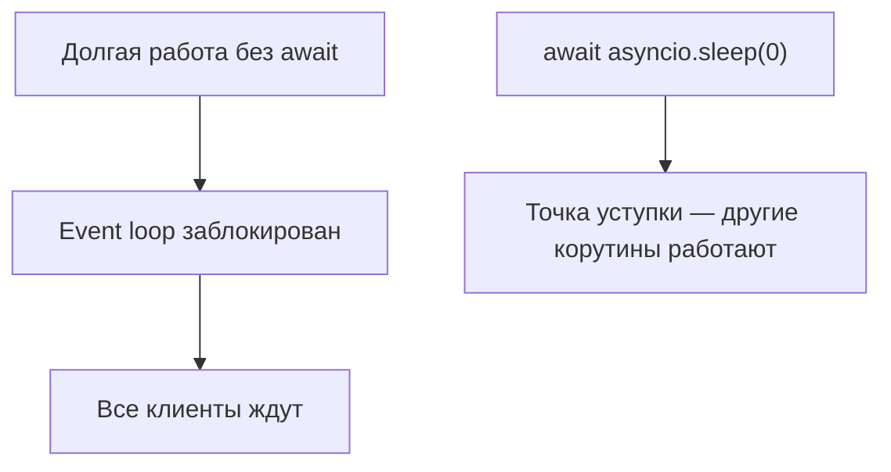

# Модуль 2: Асинхронное программирование — концепции

## Метаданные

| Параметр | Значение |
|----------|----------|
| Предварительные знания | [Модуль 1: GIL](01-gil.md) — I/O-bound vs CPU-bound; базовый Python; понимание функций и итераторов |
| Следующий модуль | [Модуль 3: Библиотека asyncio](03-asyncio.md) — практический API и паттерны |
| Ориентировочное время | 3–4 часа |

## Цели обучения

1. **Объяснить** модель event loop и отличие кооперативной многозадачности от вытесняющей (`threading`).
2. **Написать** корутины с `async def` / `await` и **определить**, где нужен `await`, а где его нельзя забыть.
3. **Сравнить** синхронный и асинхронный код для I/O-сценария и **оценить** читаемость и масштабируемость.
4. **Реализовать** async generator и **использовать** его в `async for`.
5. **Выбрать** между потоками ([Модуль 1](01-gil.md)), async и последовательным кодом для заданной задачи.

## Теория

### 2.1 Зачем нужна асинхронность

В [Модуле 1](01-gil.md) мы увидели: для I/O-bound задач потоки работают, но каждый поток — ресурс ОС (память, переключение контекста). При 10 000 одновременных WebSocket-соединений потоковая модель становится тяжёлой.

**Асинхронность** — стиль, при котором одна **нить управления** (обычно один поток) обслуживает много задач, **явно отдавая управление** в точках ожидания I/O.



Async **не ускоряет CPU-bound** вычисления и **не обходит GIL** для параллельных вычислений. Он оптимизирует **ожидание**.

### 2.2 Event Loop (цикл событий)

**Event loop** — диспетчер, который:

1. Держит очередь готовых к выполнению корутин и callback'ов.
2. При `await` на I/O регистрирует интерес у ОС (epoll, kqueue, IOCP).
3. Когда I/O готов — возобновляет соответствующую корутину.



В Python 3.11+ точка входа — `asyncio.run(main())` ([Модуль 3](03-asyncio.md)). **Не используйте** устаревший паттерн `asyncio.get_event_loop()` без контекста в новом коде.

### 2.3 Корутины: async def

Функция, объявленная как `async def`, при вызове **не выполняется сразу** — она возвращает **coroutine object**:

```python
async def fetch():
    return 42

coro = fetch()  # корутина, ещё не запущена
```

Чтобы корутина выполнилась, её нужно:

- `await fetch()` внутри другой `async def`;
- или передать в event loop (`asyncio.run`, `create_task` — см. [Модуль 3](03-asyncio.md)).

**Корутина** — генератороподобный объект с методами `send`/`throw` на низком уровне; на практике работаем через `await`.

### 2.4 await: точка приостановки

`await expr` означает:

1. Если `expr` — awaitable (корутина, Task, Future), приостановить текущую корутину.
2. Передать управление event loop.
3. Возобновиться, когда awaitable завершится, и получить результат.

```mermaid
sequenceDiagram
    participant Main as main()
    participant Loop as Event Loop
    participant Sub as fetch_data()
    Main->>Sub: await fetch_data()
    Sub->>Loop: I/O ожидание
    Loop->>Loop: другие корутины
    Loop->>Sub: данные готовы
    Sub->>Main: результат
```

**Частая ошибка:** вызвать `async def` без `await` — получите предупреждение `RuntimeWarning: coroutine was never awaited`.

### 2.5 Синхронный vs асинхронный код

| Аспект | Синхронный | Асинхронный |
|--------|------------|-------------|
| Блокировка | Каждый вызов блокирует поток | Ожидание не блокирует loop (при правильном await) |
| Масштаб I/O | Поток на соединение | Тысячи корутин на поток |
| Читаемость | Линейный поток | «Цветной» синтаксис, цепочки await |
| Библиотеки | Любые | Нужны async-версии (`aiohttp`, `asyncpg`) |
| CPU-bound | Обычный код / процессы | Тот же — процессы ([Модуль 1](01-gil.md)) |
| Отладка | Привычный стек | Сложнее; см. asyncio debug mode |

Синхронный I/O внутри `async def` **блокирует весь event loop** — антипаттерн. Решения: `asyncio.to_thread()` ([Модуль 3](03-asyncio.md)) или executor из [Модуля 1](01-gil.md).

### 2.6 Awaitables и протокол

Объект awaitable реализует `__await__()` и возвращает итератор. Типичные awaitables:

- coroutine (результат `async def`);
- `asyncio.Task`;
- `asyncio.Future`;
- некоторые объекты сторонних библиотек.

Проверка: `inspect.isawaitable(obj)`.

### 2.7 Async generators

Обычный генератор: `def` + `yield`. **Async generator:** `async def` + `yield`, потребление через `async for`:

```python
async def stream():
    for i in range(3):
        await asyncio.sleep(0.1)
        yield i
```

Async generators полезны для потоковой обработки (чанки из БД, SSE, websocket-фреймы). Закрытие: `async for` + `aclose()` при необходимости.

### 2.8 Async context managers

`async with` для ресурсов с асинхронным открытием/закрытием:

```python
async with aiohttp.ClientSession() as session:
    ...
```

Реализуется через `__aenter__` / `__aexit__` (подробнее в [Модуле 3](03-asyncio.md) с `aiohttp`).

### 2.9 Ментальная модель: кооперативность

Потоки **вытесняют** друг друга (ОС решает). Корутины **кооперируют**: уступают управление только в `await`. Долгий CPU-цикл без `await` **замораживает** все корутины в loop.



### 2.10 Связь с threading и GIL

Async работает в **одном потоке** (по умолчанию) — нет конкуренции за GIL между корутинами, но и нет параллельного CPU. Для гибрида: async для сети + `ProcessPoolExecutor` для тяжёлых вычислений ([Модуль 1](01-gil.md)).

## Примеры кода

### Пример 1: Первая корутина

```python
"""
Минимальный async: asyncio.run запускает event loop.
Python 3.11+
"""
import asyncio


async def greet(name: str, delay: float) -> str:
    """Корутина: приветствие после асинхронной паузы."""
    await asyncio.sleep(delay)  # отдаём управление loop на delay секунд
    return f"Привет, {name}!"


async def main() -> None:
    """Точка входа async-приложения."""
    msg = await greet("Анна", 0.5)  # ждём завершения greet
    print(msg)


if __name__ == "__main__":
    asyncio.run(main())  # создаёт loop, выполняет main(), закрывает loop
```

### Пример 2: Параллельное ожидание (концепт gather)

```python
"""
Несколько корутин «одновременно» — пока одна ждёт I/O, другие работают.
Детали API — в Модуле 3 (asyncio.gather).
"""
import asyncio


async def fetch_user(user_id: int) -> dict:
    """Имитация запроса к API."""
    await asyncio.sleep(0.2)  # сеть
    return {"id": user_id, "name": f"user_{user_id}"}


async def main() -> None:
    ids = [1, 2, 3, 4]
    # gather запускает все корутины и ждёт все результаты
    users = await asyncio.gather(*(fetch_user(i) for i in ids))
    for u in users:
        print(u)


if __name__ == "__main__":
    asyncio.run(main())
```

### Пример 3: Синхронный vs асинхронный I/O

```python
"""
Сравнение времени: последовательный sleep vs параллельный gather.
"""
import asyncio
import time

N = 10
DELAY = 0.1


def sync_fetch_all() -> None:
    """Синхронно: каждый sleep блокирует поток."""
    for _ in range(N):
        time.sleep(DELAY)


async def async_fetch_one() -> None:
    await asyncio.sleep(DELAY)


async def async_fetch_all() -> None:
    await asyncio.gather(*(async_fetch_one() for _ in range(N)))


if __name__ == "__main__":
    t0 = time.perf_counter()
    sync_fetch_all()
    print(f"Sync:  {time.perf_counter() - t0:.2f}s (ожидаем ~{N * DELAY}s)")

    t0 = time.perf_counter()
    asyncio.run(async_fetch_all())
    print(f"Async: {time.perf_counter() - t0:.2f}s (ожидаем ~{DELAY}s)")
```

### Пример 4: Забытый await — антипаттерн

```python
"""
Демонстрация ошибки: coroutine was never awaited.
"""
import asyncio


async def load() -> str:
    await asyncio.sleep(0.1)
    return "data"


async def broken() -> None:
    result = load()  # ОШИБКА: забыли await — result это coroutine object
    print(type(result))  # <class 'coroutine'>


async def fixed() -> None:
    result = await load()  # правильно
    print(result)


if __name__ == "__main__":
    asyncio.run(fixed())
    # asyncio.run(broken())  # раскомментируйте — увидите предупреждение
```

### Пример 5: Async generator

```python
"""
Потоковая выдача данных через async generator.
"""
import asyncio


async def ticker(interval: float, count: int):
    """Каждые interval секунд отдаём номер тика."""
    for i in range(count):
        await asyncio.sleep(interval)
        yield i  # приостановка генератора до следующего async for


async def main() -> None:
    async for tick in ticker(0.1, 5):
        print(f"tick: {tick}")


if __name__ == "__main__":
    asyncio.run(main())
```

### Пример 6: Блокирующий вызов в async — плохо и лучше

```python
"""
time.sleep внутри async def блокирует весь loop.
Решение: asyncio.to_thread (Модуль 3) или executor из Модуля 1.
"""
import asyncio
import time


async def bad() -> None:
    time.sleep(1)  # блокирует event loop на 1 секунду!


async def good() -> None:
    await asyncio.to_thread(time.sleep, 1)  # sleep в отдельном потоке


async def demo() -> None:
    start = asyncio.get_running_loop().time()

    async def background():
        await asyncio.sleep(0.1)
        print("фоновая задача завершена")

    task = asyncio.create_task(background())
    await good()  # loop свободен для background
    await task
    print("done")


if __name__ == "__main__":
    asyncio.run(demo())
```

### Пример 7: async with (упрощённый менеджер)

```python
"""
Собственный async context manager без сторонних библиотек.
"""
import asyncio
from types import TracebackType


class AsyncDatabase:
    """Учебный async context manager."""

    async def __aenter__(self) -> "AsyncDatabase":
        await asyncio.sleep(0.05)  # имитация connect
        print("connected")
        return self

    async def __aexit__(
        self,
        exc_type: type[BaseException] | None,
        exc: BaseException | None,
        tb: TracebackType | None,
    ) -> None:
        await asyncio.sleep(0.05)  # имитация close
        print("disconnected")

    async def query(self, sql: str) -> list:
        await asyncio.sleep(0.1)
        return [{"sql": sql}]


async def main() -> None:
    async with AsyncDatabase() as db:
        rows = await db.query("SELECT 1")
        print(rows)


if __name__ == "__main__":
    asyncio.run(main())
```

## Trade-off: компромиссы

| Решение | Плюсы | Минусы | Когда выбирать |
|---------|-------|--------|----------------|
| Синхронный код | Простота, все библиотеки | Плохо масштабируется на тысячи I/O | CLI, скрипты, мало соединений |
| `threading` / ThreadPool ([Модуль 1](01-gil.md)) | Блокирующие библиотеки без переписывания | Память, GIL не для CPU | Legacy SDK, немного параллельного I/O |
| Async / корутины | Много соединений, низкие накладные расходы | Async-стек, кооперативность | Web-серверы, прокси, боты, стриминг |
| `asyncio.gather` | Параллельное ожидание | Ошибка одной — поведение настраивается | Независимые I/O-запросы |
| Async generators | Потоковая обработка без буфера всего в памяти | Сложнее backpressure | SSE, чанки БД, лог-стримы |
| Процессы + async | CPU + I/O разделены | Архитектурная сложность | ML inference + API gateway |

## Практические задания

### Задание 1 (базовое): async echo

**Условие:** Напишите `async def echo(phrase: str, delay: float) -> str`, которая ждёт `delay` секунд (`asyncio.sleep`) и возвращает `phrase.upper()`. В `main` вызовите для трёх фраз с разными задержками **последовательно** и **через gather**, замерьте время.

**Критерии:** `asyncio.run(main())`; вывод времени; gather быстрее последовательного режима.

**Подсказка:** `time.perf_counter()` до и после блока await.

### Задание 2 (среднее): Async generator — окна

**Условие:** Реализуйте `async def windowed(iterable, size: int)`, async generator, отдающий списки по `size` элементов из синхронного `iterable`, с `await asyncio.sleep(0)` между чанками (точка уступки).

**Критерии:** `async for chunk in windowed(range(10), 3)` → `[0,1,2], [3,4,5], [6,7,8], [9]`.

**Подсказка:** Буфер накопления + `yield` при `len(buf) == size`.

### Задание 3 (продвинутое): Мини-очередь загрузок

**Условие:** Симулируйте загрузчик URL:

- `async def download(url: str) -> bytes` — `sleep(random 0.1–0.5)`, возвращает `url.encode()`.
- `async def run_pool(urls: list[str], concurrency: int)` — не более `concurrency` одновременных `download` (семафор `asyncio.Semaphore` — см. [Модуль 3](03-asyncio.md)).
- Выведите URL и длину результата.

**Критерии:** 20 URL, concurrency=5; порядок вывода может отличаться; нет более 5 одновременных sleep (проверка: суммарное время < последовательного).

**Подсказка:** `async with sem:` вокруг `download`.

## Эталонные решения

<details>
<summary>Задание 1 — echo</summary>

```python
import asyncio
import time


async def echo(phrase: str, delay: float) -> str:
    await asyncio.sleep(delay)
    return phrase.upper()


async def sequential(phrases: list[tuple[str, float]]) -> None:
    t0 = time.perf_counter()
    for p, d in phrases:
        print(await echo(p, d))
    print(f"seq: {time.perf_counter() - t0:.2f}s")


async def parallel(phrases: list[tuple[str, float]]) -> None:
    t0 = time.perf_counter()
    results = await asyncio.gather(*(echo(p, d) for p, d in phrases))
    print(results)
    print(f"par: {time.perf_counter() - t0:.2f}s")


async def main() -> None:
    data = [("hello", 0.3), ("async", 0.3), ("world", 0.3)]
    await sequential(data)
    await parallel(data)


if __name__ == "__main__":
    asyncio.run(main())
```

</details>

<details>
<summary>Задание 2 — windowed</summary>

```python
import asyncio
from collections.abc import Iterable


async def windowed(iterable: Iterable, size: int):
    buf = []
    for item in iterable:
        buf.append(item)
        if len(buf) == size:
            yield buf
            buf = []
            await asyncio.sleep(0)
    if buf:
        yield buf


async def main() -> None:
    async for chunk in windowed(range(10), 3):
        print(chunk)


if __name__ == "__main__":
    asyncio.run(main())
```

</details>

<details>
<summary>Задание 3 — download pool</summary>

```python
import asyncio
import random
import time


async def download(url: str) -> bytes:
    await asyncio.sleep(random.uniform(0.1, 0.5))
    return url.encode()


async def run_pool(urls: list[str], concurrency: int) -> None:
    sem = asyncio.Semaphore(concurrency)

    async def worker(url: str) -> None:
        async with sem:
            data = await download(url)
            print(url, len(data))

    await asyncio.gather(*(worker(u) for u in urls))


async def main() -> None:
    urls = [f"https://example.com/{i}" for i in range(20)]
    t0 = time.perf_counter()
    await run_pool(urls, 5)
    print(f"elapsed: {time.perf_counter() - t0:.2f}s")


if __name__ == "__main__":
    asyncio.run(main())
```

</details>

## Вопросы для самопроверки

1. **Что возвращает вызов `async def` функции без await?**  
   *Ответ:* Объект корутины; он не выполняется до await или передачи в loop.

2. **Чем event loop отличается от ОС-планировщика потоков?**  
   *Ответ:* Loop кооперативный — переключение только в await; планировщик ОС вытесняет потоки принудительно.

3. **Почему `time.sleep` внутри корутины опасен?**  
   *Ответ:* Блокирует поток с event loop; все корутины замирают.

4. **Когда async не лучше потоков?**  
   *Ответ:* Мало I/O, только синхронные библиотеки, команда не готова к async-стеку — см. [Модуль 1](01-gil.md).

5. **Для чего async generator?**  
   *Ответ:* Потоковая асинхронная выдача данных без загрузки всего в память.

6. **Можно ли await обычную функцию?**  
   *Ответ:* Нет, только awaitable; обычную функцию оборачивают в `asyncio.to_thread` или executor.

7. **Связь async с GIL?**  
   *Ответ:* Корутины в одном потоке не конкурируют за GIL; CPU-bound всё равно нужны процессы.

## Методические указания

### Тайминг

| Блок | Время |
|------|-------|
| Мотивация, сравнение с Модулем 1 | 30 мин |
| Event loop, async/await | 45 мин |
| Live coding примеры 1–3 | 40 мин |
| Async generators, context managers | 35 мин |
| Практика | 60 мин |
| Переход к Модулю 3 | 10 мин |

### Типичные ошибки

1. Забытый `await` — покажите пример 4.
2. Смешение sync I/O в async — пример 6.
3. Ожидание ускорения CPU через async — отсылка к [Модулю 1](01-gil.md).
4. `asyncio.run()` внутри уже running loop (например, в Jupyter без nest_asyncio).
5. Создание корутин без ограничения concurrency — задание 3 + Semaphore в Модуле 3.

### FAQ

**Нужно ли изучать генераторы перед async generators?**  
Да, `yield` и `async for` логически связаны.

**Чем корутина отличается от Task?**  
Task — обёртка loop для планирования корутины; подробнее в [03-asyncio.md](03-asyncio.md).

## Дополнительные материалы

- [Async IO in Python: A Complete Walkthrough — Real Python](https://realpython.com/async-io-python/)
- [Документация `async def`](https://docs.python.org/3/reference/compound_stmts.html#async-def)
- [PEP 492 — Coroutines with async and await syntax](https://peps.python.org/pep-0492/)
- Предыдущий модуль: [01-gil.md](01-gil.md)
- Следующий модуль: [03-asyncio.md](03-asyncio.md)
