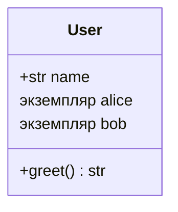
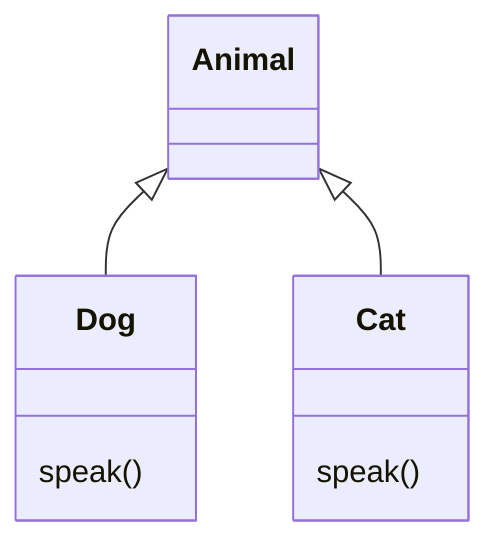
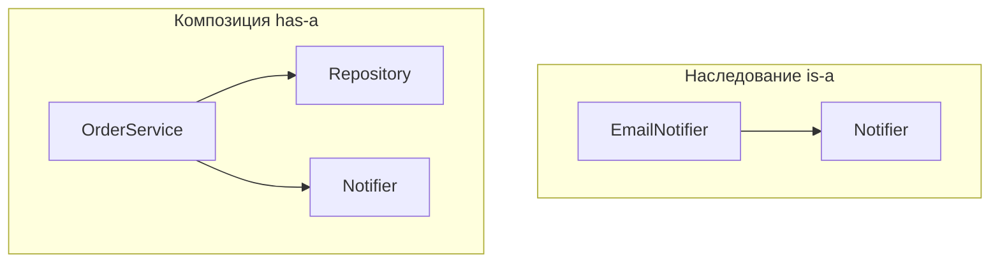

# Модуль 4: Объектно-ориентированное программирование в Python

## Метаданные

| Параметр | Значение |
|----------|----------|
| Предварительные знания | Базовый Python: типы, функции, модули; желательно знакомство с [Модулем 3: asyncio](03-asyncio.md) для примеров async-классов |
| Следующий модуль | Специализированные темы курса (протоколы, типизация, уязвимости объектов) |
| Ориентировочное время | 3–4 часа |

## Цели обучения

1. **Проектировать** классы с явной ответственностью, используя `__init__`, методы экземпляра/класса и свойства (`@property`).
2. **Применять** инкапсуляцию: соглашения `_protected`, `__private` (name mangling), публичный API класса.
3. **Реализовать** иерархию наследования с корректным вызовом `super()` и **объяснить** порядок MRO.
4. **Использовать** полиморфизм и абстрактные базовые классы (`abc.ABC`, `@abstractmethod`) для контрактов.
5. **Выбирать** между наследованием и композицией при проектировании и **обосновать** выбор для сервисного слоя ([Модуль 3](03-asyncio.md)).

## Теория

### 4.1 Классы и объекты

**Класс** — шаблон (тип), **объект (экземпляр)** — конкретная сущность в памяти.

```python
class User:
    def __init__(self, name: str):
        self.name = name

    def greet(self) -> str:
        return f"Hello, {self.name}"
```

- `self` — ссылка на экземпляр (первый параметр методов).
- `__init__` — инициализатор, не «конструктор» в строгом смысле C++ (`__new__` создаёт объект).



### 4.2 Атрибуты экземпляра и класса

| Вид | Где объявлен | Разделяется между экземплярами |
|-----|--------------|--------------------------------|
| Атрибут экземпляра | `self.x = ...` в `__init__` | Нет |
| Атрибут класса | `class Foo: count = 0` | Да |

Изменение `self.count` создаёт атрибут экземпляра, **скрывающий** атрибут класса — частый источник путаницы.

### 4.3 Инкапсуляция

**Инкапуляция** — сокрытие внутреннего состояния и предоставление контролируемого API.

В Python нет жёсткого `private` как в Java:

| Соглашение | Синтаксис | Смысл |
|------------|-----------|-------|
| Публичный | `name` | Часть API |
| Protected | `_name` | «Внутренний, не трогай снаружи» (конвенция) |
| Private (mangling) | `__name` | Имя преобразуется в `_ClassName__name` |

```python
class Account:
    def __init__(self, balance: float):
        self._balance = balance  # защищённый атрибут

    @property
    def balance(self) -> float:
        return self._balance

    def deposit(self, amount: float) -> None:
        if amount <= 0:
            raise ValueError("amount must be positive")
        self._balance += amount
```

**Property** даёт доступ как к полю, с валидацией в setter — идиоматичная инкапсуляция в Python.

Связь с [Модулем 1](01-gil.md): общее изменяемое состояние объекта из нескольких потоков требует Lock — инкапсуляция не делает код потокобезопасным автоматически.

### 4.4 Методы: instance, class, static

```python
class Stats:
    total = 0

    def __init__(self, value: int):
        self.value = value
        Stats.total += 1

    def instance_method(self) -> int:
        return self.value

    @classmethod
    def from_string(cls, s: str) -> "Stats":
        return cls(int(s))

    @staticmethod
    def is_valid(n: int) -> bool:
        return n >= 0
```

- `@classmethod` — первый аргумент `cls`; фабрики, альтернативные конструкторы.
- `@staticmethod` — нет `self`/`cls`; утилита логически связанная с классом.

### 4.5 Наследование

```python
class Animal:
    def speak(self) -> str:
        raise NotImplementedError

class Dog(Animal):
    def speak(self) -> str:
        return "woof"
```

**MRO (Method Resolution Order)** — порядок поиска методов в иерархии. Смотреть: `ClassName.__mro__` или `help(Class)`.



### 4.6 super() и cooperative inheritance

`super()` возвращает прокси для вызова метода **следующего** класса в MRO:

```python
class A:
    def __init__(self):
        print("A")

class B(A):
    def __init__(self):
        super().__init__()
        print("B")
```

В множественном наследовании без `super()` легко пропустить инициализацию ветки — **всегда** вызывайте `super().__init__()` в кооперативной иерархии.

### 4.7 Полиморфизм

**Полиморфизм** — единый интерфейс, разное поведение:

```python
def announce(animal: Animal) -> None:
    print(animal.speak())

announce(Dog())  # woof
announce(Cat())  # meow
```

Утиная типизация: важны методы, а не явное наследование — но ABC фиксируют контракт явно.

### 4.8 Абстрактные базовые классы (ABC)

Модуль `abc`:

```python
from abc import ABC, abstractmethod

class Repository(ABC):
    @abstractmethod
    def get(self, id: int) -> dict:
        ...

class MemoryRepo(Repository):
    def get(self, id: int) -> dict:
        return {"id": id}
```

Нельзя инстанцировать `Repository` до реализации всех `@abstractmethod`. `isinstance(obj, Repository)` работает для зарегистрированных виртуальных подклассов (`register`).

Применение: плагины, стратегии, тестовые дублёры (mock repo).

### 4.9 Композиция vs наследование

| Подход | Суть | Когда |
|--------|------|-------|
| **Наследование** | «is-a» — Dog is Animal | Расширение поведения базового типа |
| **Композиция** | «has-a» — Car has Engine | Сборка из частей, смена реализаций |



**Правило:** предпочитайте композицию, если нет чёткого отношения «подтип»; наследование связывает API жёстко.

Пример из async ([Модуль 3](03-asyncio.md)):

```python
class HttpClient:
    def __init__(self, session: aiohttp.ClientSession):
        self._session = session  # композиция: клиент *имеет* сессию
```

### 4.10 Dataclasses и современный стиль

`@dataclass` для контейнеров данных с меньшим boilerplate:

```python
from dataclasses import dataclass

@dataclass(frozen=True)
class Point:
    x: float
    y: float
```

Не заменяют богатые доменные модели с инвариантами — дополняют.

### 4.11 Магические методы (dunder)

| Метод | Назначение |
|-------|------------|
| `__repr__` | Отладочное представление |
| `__str__` | Пользовательская строка |
| `__eq__` | Сравнение |
| `__lt__` и др. | Сортировка |
| `__enter__`/`__exit__` | `with` |
| `__aenter__`/`__aexit__` | `async with` ([Модуль 2](02-async.md)) |

### 4.12 ООП и архитектура async-сервисов

Типичный слой:

- **Domain** — dataclass, чистая логика.
- **Ports (ABC)** — `UserRepository`, `Mailer`.
- **Adapters** — `PostgresUserRepository`, `SmtpMailer`.
- **Service** — композиция портов, `async def` методы.

Это перекликается с hexagonal architecture без излишней сложности на старте.

## Примеры кода

### Пример 1: Класс с инкапсуляцией через property

```python
"""
Банковский счёт: баланс только через методы и read-only property.
"""


class BankAccount:
    def __init__(self, owner: str, initial: float = 0.0):
        self.owner = owner
        self._balance = float(initial)

    @property
    def balance(self) -> float:
        """Только чтение снаружи."""
        return self._balance

    def deposit(self, amount: float) -> None:
        if amount <= 0:
            raise ValueError("deposit must be positive")
        self._balance += amount

    def withdraw(self, amount: float) -> None:
        if amount <= 0:
            raise ValueError("withdraw must be positive")
        if amount > self._balance:
            raise ValueError("insufficient funds")
        self._balance -= amount

    def __repr__(self) -> str:
        return f"BankAccount(owner={self.owner!r}, balance={self._balance})"


if __name__ == "__main__":
    acc = BankAccount("Иван", 100)
    acc.deposit(50)
    acc.withdraw(30)
    print(acc, acc.balance)
```

### Пример 2: Name mangling

```python
"""
Двойное подчёркивание — не настоящая безопасность, а защита от случайного доступа.
"""


class SecretHolder:
    def __init__(self, token: str):
        self.__token = token  # станет _SecretHolder__token

    def reveal(self) -> str:
        return self.__token


if __name__ == "__main__":
    h = SecretHolder("abc123")
    print(h.reveal())
    # print(h.__token)  # AttributeError
    print(h._SecretHolder__token)  # доступ возможен — не криптозащита
```

### Пример 3: Наследование и super()

```python
"""
Иерархия сотрудников: базовый класс и специализации.
"""


class Employee:
    def __init__(self, name: str, base_salary: float):
        self.name = name
        self.base_salary = base_salary

    def total_pay(self) -> float:
        return self.base_salary

    def __repr__(self) -> str:
        return f"{self.__class__.__name__}({self.name!r})"


class Manager(Employee):
    def __init__(self, name: str, base_salary: float, bonus: float):
        super().__init__(name, base_salary)
        self.bonus = bonus

    def total_pay(self) -> float:
        return super().total_pay() + self.bonus


class Contractor(Employee):
    def __init__(self, name: str, hourly: float, hours: int):
        super().__init__(name, 0)
        self.hourly = hourly
        self.hours = hours

    def total_pay(self) -> float:
        return self.hourly * self.hours


if __name__ == "__main__":
    staff: list[Employee] = [
        Employee("Анна", 80_000),
        Manager("Борис", 100_000, 20_000),
        Contractor("Саша", 1500, 160),
    ]
    for emp in staff:
        print(emp, "→", emp.total_pay())
```

### Пример 4: ABC — контракт репозитория

```python
"""
Абстрактный репозиторий и in-memory реализация для тестов.
"""
from abc import ABC, abstractmethod


class UserRepository(ABC):
    @abstractmethod
    def get_by_id(self, user_id: int) -> dict | None:
        ...

    @abstractmethod
    def save(self, user: dict) -> None:
        ...


class InMemoryUserRepository(UserRepository):
    def __init__(self):
        self._store: dict[int, dict] = {}

    def get_by_id(self, user_id: int) -> dict | None:
        return self._store.get(user_id)

    def save(self, user: dict) -> None:
        self._store[user["id"]] = user


class UserService:
    def __init__(self, repo: UserRepository):
        self._repo = repo  # композиция: зависимость от абстракции

    def register(self, user_id: int, name: str) -> dict:
        user = {"id": user_id, "name": name}
        self._repo.save(user)
        return user


if __name__ == "__main__":
    service = UserService(InMemoryUserRepository())
    print(service.register(1, "Мария"))
    print(service._repo.get_by_id(1))
```

### Пример 5: Композиция vs наследование — уведомления

```python
"""
Плохо: наследование от конкретного SMTP-клиента.
Хорошо: композиция Notifier с инъекцией sender.
"""
from abc import ABC, abstractmethod


class MessageSender(ABC):
    @abstractmethod
    def send(self, to: str, body: str) -> None:
        ...


class ConsoleSender(MessageSender):
    def send(self, to: str, body: str) -> None:
        print(f"TO {to}: {body}")


class EmailNotifier:
    """has-a MessageSender, не is-a"""

    def __init__(self, sender: MessageSender):
        self._sender = sender

    def notify_order_shipped(self, email: str, order_id: str) -> None:
        self._sender.send(email, f"Заказ {order_id} отправлен")


# Антипаттерн (для сравнения — не используйте):
# class EmailNotifier(ConsoleSender): ...


if __name__ == "__main__":
    notifier = EmailNotifier(ConsoleSender())
    notifier.notify_order_shipped("user@example.com", "ORD-42")
```

### Пример 6: classmethod как фабрика

```python
"""
Альтернативные конструкторы через classmethod.
"""
from datetime import date


class Report:
    def __init__(self, title: str, created: date):
        self.title = title
        self.created = created

    @classmethod
    def from_iso(cls, title: str, iso: str) -> "Report":
        y, m, d = map(int, iso.split("-"))
        return cls(title, date(y, m, d))

    def __repr__(self) -> str:
        return f"Report({self.title!r}, {self.created})"


if __name__ == "__main__":
    r1 = Report("Q1", date(2026, 3, 31))
    r2 = Report.from_iso("Q2", "2026-06-30")
    print(r1, r2)
```

### Пример 7: Async-класс сервиса (связь с Модулем 3)

```python
"""
ООП + asyncio: сервис с композицией HTTP-клиента.
Требует: pip install aiohttp
"""
import asyncio
from abc import ABC, abstractmethod

import aiohttp


class DataSource(ABC):
    @abstractmethod
    async def fetch_json(self, path: str) -> dict:
        ...


class HttpBinSource(DataSource):
    def __init__(self, session: aiohttp.ClientSession):
        self._session = session

    async def fetch_json(self, path: str) -> dict:
        url = f"https://httpbin.org{path}"
        async with self._session.get(url) as resp:
            resp.raise_for_status()
            return await resp.json()


class CatalogService:
    def __init__(self, source: DataSource):
        self._source = source

    async def get_sample(self) -> dict:
        return await self._source.fetch_json("/json")


async def main() -> None:
    timeout = aiohttp.ClientTimeout(total=10)
    async with aiohttp.ClientSession(timeout=timeout) as session:
        service = CatalogService(HttpBinSource(session))
        print(await service.get_sample())


if __name__ == "__main__":
    asyncio.run(main())
```

### Пример 8: __eq__ и хешируемость

```python
"""
Равенство и frozen dataclass для использования в set/dict keys.
"""
from dataclasses import dataclass


@dataclass(frozen=True, order=True)
class Version:
    major: int
    minor: int

    def __str__(self) -> str:
        return f"{self.major}.{self.minor}"


if __name__ == "__main__":
    versions = {Version(3, 11), Version(3, 12), Version(3, 11)}
    print(sorted(versions))
```

## Trade-off: компромиссы

| Решение | Плюсы | Минусы | Когда выбирать |
|---------|-------|--------|----------------|
| Публичные атрибуты | Простота | Нет инвариантов | DTO, временные скрипты |
| `@property` + методы | Валидация, стабильный API | Больше кода | Доменные сущности |
| Наследование | Переиспользование, полиморфизм | Хрупкая иерархия, глубокие деревья | Чёткое is-a |
| Композиция | Гибкая замена частей | Больше объектов | Сервисы, DI |
| ABC | Явный контракт | Накладные расходы, жёсткость | Плагины, порты |
| dataclass | Меньше boilerplate | Не для сложной логики | Конфиги, value objects |
| Утиная типизация | Гибкость | Нет проверки до runtime | Прототипы, малые проекты |
| Множественное наследование | Mixins (JSONMixin) | Сложный MRO | Осторожно, с mixins |

## Практические задания

### Задание 1 (базовое): Класс Rectangle

**Условие:** Класс `Rectangle(width, height)` с property `area`, `perimeter` (только чтение), метод `scale(factor)` изменяющий размеры. Валидация: стороны > 0.

**Критерии:** `repr`, исключения при невалидных размерах, property без setter.

**Подсказка:** Приватные `_width`, `_height` или property с setter-валидацией.

### Задание 2 (среднее): Иерархия фигур + ABC

**Условие:** ABC `Shape` с `@abstractmethod area()`. Классы `Circle`, `Rectangle`. Функция `total_area(shapes: list[Shape]) -> float`.

**Критерии:** Нельзя создать `Shape()`; полиморфный вызов `area()`; `isinstance` с `Shape`.

**Подсказка:** `from abc import ABC, abstractmethod`, `import math`.

### Задание 3 (продвинутое): OrderService с композицией

**Условие:** ABC `PaymentGateway` с `charge(amount) -> str` (id транзакции). Реализации `FakeGateway` (всегда успех) и `FailingGateway`. `OrderService(gateway, notifier: EmailNotifier из примера 5)` — метод `checkout(order_id, amount, email)`.

**Критерии:** Композиция, не наследование от gateway; при ошибке `charge` — исключение, уведомление не отправляется; при успехе — notify.

**Подсказка:** Связать с паттерном из примера 5; тесты с подменой gateway.

## Эталонные решения

<details>
<summary>Задание 1 — Rectangle</summary>

```python
class Rectangle:
    def __init__(self, width: float, height: float):
        self.width = width
        self.height = height

    @property
    def width(self) -> float:
        return self._width

    @width.setter
    def width(self, value: float) -> None:
        if value <= 0:
            raise ValueError("width must be positive")
        self._width = value

    @property
    def height(self) -> float:
        return self._height

    @height.setter
    def height(self, value: float) -> None:
        if value <= 0:
            raise ValueError("height must be positive")
        self._height = value

    @property
    def area(self) -> float:
        return self.width * self.height

    @property
    def perimeter(self) -> float:
        return 2 * (self.width + self.height)

    def scale(self, factor: float) -> None:
        if factor <= 0:
            raise ValueError("factor must be positive")
        self.width *= factor
        self.height *= factor

    def __repr__(self) -> str:
        return f"Rectangle({self.width}x{self.height})"
```

</details>

<details>
<summary>Задание 2 — Shape hierarchy</summary>

```python
import math
from abc import ABC, abstractmethod


class Shape(ABC):
    @abstractmethod
    def area(self) -> float:
        ...


class Circle(Shape):
    def __init__(self, radius: float):
        if radius <= 0:
            raise ValueError("radius must be positive")
        self.radius = radius

    def area(self) -> float:
        return math.pi * self.radius ** 2


class Rectangle(Shape):
    def __init__(self, w: float, h: float):
        self.w, self.h = w, h

    def area(self) -> float:
        return self.w * self.h


def total_area(shapes: list[Shape]) -> float:
    return sum(s.area() for s in shapes)


if __name__ == "__main__":
    shapes: list[Shape] = [Circle(2), Rectangle(3, 4)]
    print(total_area(shapes))
```

</details>

<details>
<summary>Задание 3 — OrderService</summary>

```python
from abc import ABC, abstractmethod


class PaymentGateway(ABC):
    @abstractmethod
    def charge(self, amount: float) -> str:
        ...


class FakeGateway(PaymentGateway):
    def charge(self, amount: float) -> str:
        return f"tx-{amount:.2f}"


class FailingGateway(PaymentGateway):
    def charge(self, amount: float) -> str:
        raise RuntimeError("payment declined")


class MessageSender(ABC):
    @abstractmethod
    def send(self, to: str, body: str) -> None:
        ...


class ConsoleSender(MessageSender):
    def send(self, to: str, body: str) -> None:
        print(f"TO {to}: {body}")


class EmailNotifier:
    def __init__(self, sender: MessageSender):
        self._sender = sender

    def notify_paid(self, email: str, order_id: str, tx: str) -> None:
        self._sender.send(email, f"Order {order_id} paid, tx={tx}")


class OrderService:
    def __init__(self, gateway: PaymentGateway, notifier: EmailNotifier):
        self._gateway = gateway
        self._notifier = notifier

    def checkout(self, order_id: str, amount: float, email: str) -> str:
        tx = self._gateway.charge(amount)
        self._notifier.notify_paid(email, order_id, tx)
        return tx


if __name__ == "__main__":
    ok = OrderService(FakeGateway(), EmailNotifier(ConsoleSender()))
    print(ok.checkout("ORD-1", 99.0, "a@b.c"))
    bad = OrderService(FailingGateway(), EmailNotifier(ConsoleSender()))
    try:
        bad.checkout("ORD-2", 1.0, "a@b.c")
    except RuntimeError as e:
        print("expected fail:", e)
```

</details>

## Вопросы для самопроверки

1. **Чем `__init__` отличается от `__new__`?**  
   *Ответ:* `__new__` создаёт объект, `__init__` инициализирует уже созданный экземпляр.

2. **Что даёт `@property`?**  
   *Ответ:* Доступ к вычисляемому или контролируемому атрибуту через синтаксис поля.

3. **Почему `__private` не скрывает данные полностью?**  
   *Ответ:* Name mangling лишь усложняет случайный доступ; `_ClassName__private` доступен снаружи.

4. **Зачем `super()` в множественном наследовании?**  
   *Ответ:* Кооперативный вызов следующего класса в MRO без пропуска веток.

5. **Когда ABC предпочтительнее утиной типизации?**  
   *Ответ:* Когда нужен явный контракт для реализаций и раннее обнаружение пропущенных методов при создании класса.

6. **Композиция vs наследование — пример has-a?**  
   *Ответ:* `OrderService` содержит `PaymentGateway`, а не наследует его.

7. **Как ООП связано с async из Модуля 3?**  
   *Ответ:* Сервисные классы инкапсулируют `async def` методы и зависимости (session, repo) через композицию.

## Методические указания

### Тайминг

| Блок | Время |
|------|-------|
| Классы, инкапсуляция, property | 45 мин |
| Наследование, super, MRO | 40 мин |
| Полиморфизм, ABC | 35 мин |
| Композиция vs наследование | 30 мин |
| Async-классы (пример 7) | 25 мин |
| Практика | 75 мин |

### Типичные ошибки

1. Изменяемый атрибут класса как «общее хранилище» для всех экземпляров без понимания.
2. Забытый `super().__init__()` в дочернем классе.
3. Глубокие иерархии вместо композиции — God subclasses.
4. ABC без реализации всех abstract methods — `TypeError` при инстанцировании.
5. Путаница `@staticmethod` и `@classmethod` в фабриках.

### FAQ

**Нужны ли dataclass вместо классов?**  
Для value objects — да; для сущностей с поведением — обычные классы.

**Множественное наследование?**  
Используйте для mixins (`JsonSerializableMixin`), избегайте алмаза без понимания MRO.

**Связь с GIL?**  
Общее состояние объекта + потоки ([Модуль 1](01-gil.md)) — нужны примитивы синхронизации.

## Дополнительные материалы

- [Документация `abc`](https://docs.python.org/3/library/abc.html)
- [Документация `dataclasses`](https://docs.python.org/3/library/dataclasses.html)
- [Python Classes — Real Python](https://realpython.com/python3-object-oriented-programming/)
- [PEP 3119 — Abstract Base Classes](https://peps.python.org/pep-3119/)
- [Модуль 3: asyncio и сервисы](03-asyncio.md)
- [Модуль 1: потоки и общее состояние](01-gil.md)
